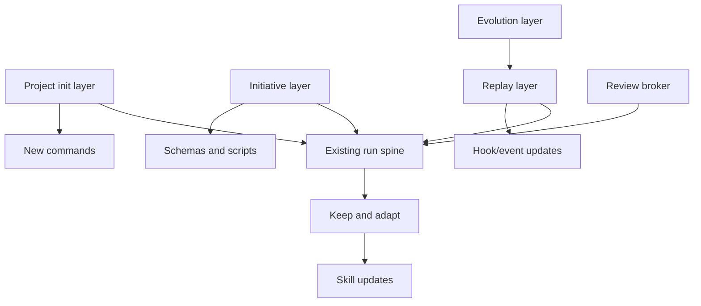

<!-- followup: architect to author ADRs from this provenance stub -->

# Current Project Implementation Plan

> **v2 note (2026-05-17):** This is a frozen v1 architecture-draft record. Any
> `/guild:`-colon command spellings below (e.g. `/guild:init`) are dead v1
> history — the v2 clean-slate grammar uses space-separated phase verbs (e.g.
> `/guild init`). See [command-clean-slate.md](command-clean-slate.md) for the
> canonical v2 command surface. The colon refs here are kept verbatim as
> historical provenance and are NOT normative.

Status: architecture design draft

## Intent

This document translates the workflow design into concrete changes for the current Guild repo. It is not an implementation patch. It is the proposed work breakdown to apply later through normal branch and PR discipline.

## Current State Summary

Observed anchors:

- Top-level command: `commands/guild.md`.
- Current run lifecycle: brainstorm, team-compose, plan, context-assemble, execute-plan, review, verify-done.
- Config/run scripts: `scripts/read-guild-config.ts`, `scripts/new-run-id.ts`.
- Telemetry hook: `hooks/capture-telemetry.ts`.
- Agent-team launcher: `scripts/agent-team-launcher.ts`.
- Knowledge layer: `skills/knowledge/wiki-ingest`, `wiki-query`, `wiki-lint`.
- Evolution layer: `skills/meta/reflect`, `evolve-skill`, `create-specialist`, `rollback-skill`, `scripts/shadow-mode.ts`.

Main gap:

Guild has strong run artifacts but no first-class project initialization contract, initiative registry, initiative-aware context assembly, or replay command.

## Architecture Change Set



## New Commands

| Command | Purpose | Notes |
|---|---|---|
| `commands/guild-init.md` | Project setup for new/existing/resume. | Adds project bootstrap before initiatives. |
| `commands/guild-initiative.md` | Initiative CRUD/status/resume/archive. | Could expose subcommands in one command file. |
| `commands/guild-run.md` | Run replay and diagnostics. | Avoid overloading top-level `/guild`. |
| Update `commands/guild.md` | Add session intake and initiative attachment. | Preserve existing run spine and approval gates. |

Plugin manifest change:

- Add new command files to `.claude-plugin/plugin.json`.
- Update marketplace copy once command behavior is stable.

## New Or Updated Skills

New meta skills:

| Skill | Responsibility |
|---|---|
| `guild:init-project` | Orchestrate project classification and bootstrap. |
| `guild:project-interview` | Founding interview for new projects. |
| `guild:project-reverse-engineer` | Existing project inventory and wiki seeding. |
| `guild:initiative-intake` | Classify new/resume/one-off at session start. |
| `guild:initiative-status` | Render definition, progress, release, docs, next action. |
| `guild:initiative-update` | Apply run outcomes to initiative ledgers. |
| `guild:run-replay` | Evidence, context, diagnostic, shadow, execution replay. |
| `guild:adversarial-review-broker` | Cross-host packet/result review workflow. |
| `guild:doc-impact` | Determine documentation changes after release/work item completion. |
| `guild:release-closeout` | Validate release, rollback, and documentation closure. |
| `guild:research-router` | Experimental research-mode router from ideation research. |

Existing skills to update:

| Skill | Required Update |
|---|---|
| `guild-brainstorm` | Can create/update initiative definition ledger before spec creation. |
| `guild-team-compose` | Reads initiative context and records gap decisions under initiative. |
| `guild-plan` | Writes work-item DAG and initiative phase updates. |
| `guild-context-assemble` | Adds initiative slice to every context bundle. |
| `guild-execute-plan` | Attaches lane outcomes to initiative work items. |
| `guild-review` | Classifies findings as run-blocking vs initiative-followup. |
| `guild-verify-done` | Marks work items done/blocked; does not close initiative. |
| `guild-reflect` | Separates initiative followups from skill/tool evolution proposals. |
| `guild-evolve-skill` | Uses shadow replay selection from run history. |
| `guild-codex-review` | Adapts to review broker packet/result schemas. |

## Scripts

New scripts:

| Script | Purpose |
|---|---|
| `scripts/detect-project-state.ts` | Classify new/existing/resume project state. |
| `scripts/init-project-scaffold.ts` | Create `.guild/` base scaffold safely. |
| `scripts/reverse-inventory.ts` | Produce code/docs/tests/config inventory for existing projects. |
| `scripts/new-initiative.ts` | Create initiative directory and manifest. |
| `scripts/list-initiatives.ts` | Render active/archived registry. |
| `scripts/update-initiative.ts` | Apply status/work-item/evidence updates. |
| `scripts/archive-initiative.ts` | Move active initiative to archive with reason. |
| `scripts/attach-run-to-initiative.ts` | Link run/session/work item to initiative. |
| `scripts/trace-replay.ts` | Evidence and timeline replay. |
| `scripts/context-replay.ts` | Reconstruct and compare context bundles. |
| `scripts/select-shadow-runs.ts` | Choose historical runs for skill/tool replay. |
| `scripts/review-packet.ts` | Freeze artifact packet with checksum. |
| `scripts/verify-review-result.ts` | Validate structured review result. |

Updates:

| Script | Update |
|---|---|
| `scripts/new-run-id.ts` | Accept `--initiative`, `--work-item`, `--phase`; write `run.yaml` while preserving `metadata.json` through a compatibility period. |
| `scripts/read-guild-config.ts` | Add `share_mode`, default backend policy, replay retention, initiative matching thresholds. |
| `scripts/trace-summarize.ts` | Include initiative, work item, phase, artifacts, replay hints. |
| `scripts/shadow-mode.ts` | Accept run-selection manifests from replay layer. |
| `scripts/agent-team-launcher.ts` | Document Claude-specific status and avoid treating it as provider-neutral. |

## Config Keys

Extend `.guild/settings.json` conservatively *(superseded: this stub originally
named `.guild/config.yml` YAML; v2 ships `.guild/settings.json` JSON per the
config-surface ADR — keys below are illustrative of the original plan)*:

```yaml
share_mode: hybrid
initiative_matching:
  ask_below_confidence: high
  allow_one_off_runs: true
team_backend:
  product_default: subagent
  prefer_tmux_when_available: false
  refuse_nested_tmux: true
review:
  codex_review: false
  cross_host_broker: false
  review_required: false
replay:
  raw_trace_share: false
  execution_replay_requires_approval: true
retention:
  keep_raw_events_days: 30
```

CLI flags should override config for a single invocation. Unknown keys should be ignored for forward compatibility.

## Schemas And Templates

Add:

```text
schemas/
  project.schema.json
  initiative.schema.json
  definition-item.schema.json
  work-item.schema.json
  session.schema.json
  run.schema.json
  trace-event.schema.json
  replay-report.schema.json
  review-packet.schema.json
  review-result.schema.json
  release.schema.json
  docs-impact.schema.json

templates/
  project/
    project-overview.md
    goals.md
    non-goals.md
  initiatives/
    initiative.yaml
    definition-ledger.md
    work-item.yaml
    status-report.md
    release-record.md
    docs-impact.md
```

## Hook And Trace Changes

Update `hooks/capture-telemetry.ts`:

- Add `schema_version`.
- Include `project_id`, `initiative_id`, `work_item_id`, `phase` when available.
- Migrate prompt capture to redact/hash by default; raw prompt capture requires explicit config.
- Keep failure non-blocking.

Update hook fixtures and tests for:

- run without initiative
- run attached to initiative
- phase transition event
- replay-safe event shape
- malformed payload still exits 0

## Specialist Count Reconciliation

Current sources disagree:

- `guild-plan.md` older text says 13 specialists.
- `AGENTS.md` and `.claude-plugin/plugin.json` describe or list 14 specialists, including `frontend`.

Implementation should reconcile this before adding new routing behavior:

1. Treat plugin manifest as current shipping source for installed agents.
2. Update committed docs in a later production PR to say 14 consistently.
3. Add a specialist roster test that checks `agents/*.md`, manifest entries, and docs roster.
4. Make team-compose read the roster from manifest/agent files, not a hardcoded count.

## New Specialist Same-Session Constraint

Claude loads plugin agents at session start. A newly created specialist may not be dispatchable in the same session through normal plugin agent discovery.

Design options:

1. Create specialist proposal and defer use until next session.
2. Use a generic specialist runner with an explicit generated prompt path for same-session execution.
3. Use tmux/manual teammate prompt that names the generated specialist file.

Default: defer production use until the evolve gate passes and a new session can load the specialist. Same-session workaround should be explicit and logged as degraded.

## Compatibility Strategy

Old state:

```text
.guild/spec/
.guild/plan/
.guild/team/
.guild/runs/
.guild/context/
```

New state adds:

```text
.guild/project.yaml
.guild/initiatives/
.guild/indexes/
```

Migration behavior:

1. If old run artifacts exist with no project manifest, `/guild:init --resume` creates project manifest and leaves old artifacts untouched.
2. Old specs/plans remain valid.
3. User can import old spec/plan into a new initiative.
4. Unattached runs remain replayable.
5. No automatic archival or deletion.

## Implementation Phases

### Phase A: Schemas And Safe Scaffold

- Add project and initiative schemas.
- Add scaffold script.
- Add `/guild:init` command.
- Add tests for new/existing/resume detection.

Exit criteria:

- Empty project gets base `.guild/` safely.
- Existing project gets inventory report without modifying production files.
- Existing `.guild/` is not overwritten.

### Phase B: Initiative Registry

- Add `guild:initiative-intake`, `status`, `update`.
- Add `new/list/archive/restore`.
- Add context-free initiative status rendering.

Exit criteria:

- User can create, list, archive, restore initiatives.
- Status answers defined, undefined, done, active, blocked, next.

### Phase C: Attach Runs To Initiatives

- Update `/guild` session intake.
- Update `new-run-id.ts`.
- Write run attachment records.
- Update verify/review/reflect to feed initiative ledgers.

Exit criteria:

- A run can attach to an initiative.
- Completion updates work item evidence.
- One-off runs still work.

### Phase D: Phase Drilldowns And Closeout

- Implement docs impact and release closeout skills.
- Add initiative close command.
- Update context assembly with initiative slice.

Exit criteria:

- Initiative cannot close with release/docs unresolved.
- Context bundles include current initiative state.

### Phase E: Cross-Host Review Broker

- Add review packet/result schemas.
- Wrap current Codex review in broker-compatible files.
- Add checksum validation and malformed result handling.
- Add Claude reviewer path later.

Exit criteria:

- Review gates no longer depend on prose sentinel alone.
- Codex unavailable remains graceful unless policy says mandatory.

### Phase F: Replay And Evolution

- Add evidence/context replay.
- Add diagnostic replay.
- Integrate shadow replay selection with evolve.

Exit criteria:

- Historical run can be inspected without mutation.
- Skill change can be shadow-tested against selected historical runs.

### Phase G: Research Router Experiment

- Add experimental `guild:research-router`.
- Build fixtures from research-heavy runs.
- Gate promotion through evals.

Exit criteria:

- Research tasks route to mode-specific artifacts.
- Unsupported claims and source issues are detected in evals.

## Test Matrix

| Area | Fixture |
|---|---|
| Init new | Empty repo with no docs. |
| Init existing | Repo with package manifest, docs, tests, CI. |
| Init ambiguous | Sparse repo with generic README and one manifest. |
| Init resume | Partial `.guild/` missing indexes. |
| Initiative list | Multiple active and archived initiatives. |
| Initiative resume | Ambiguous prompt matches two initiatives. |
| Paused initiative | Status preserves blocker and next action. |
| Archive/restore | Stable ID, move directory, activity log updated. |
| One-off run | No initiative attachment. |
| Attached run | Work item evidence updates after verify. |
| Context assembly | Initiative slice appears in specialist bundle. |
| Release outside Guild | Manual release evidence can close release axis. |
| Docs no-op | No-update rationale allows closure. |
| Tmux missing before plan approval | Team-compose selects subagents and records fallback reason. |
| Tmux missing after `backend: agent-team` approval | Execute blocks and asks for re-approval before switching backend. |
| Inside tmux | Refuses nested team and explains rerun path. |
| Codex unavailable | Skip only when review is optional; otherwise same-host fallback or human force-pass. |
| Malformed review | Schema repair or cap path. |
| Checksum mismatch | Review result rejected. |
| Replay evidence | Read-only timeline generated from run files. |
| Replay context | Missing context bundle reports degraded replay. |
| Shadow replay | Candidate skill evaluated against historical runs. |
| Privacy | Raw logs local; summary shareable. |
| Backwards compatibility | Old spec/plan/run remains usable. |

## Risk Controls

- Do not make initiatives mandatory for micro tasks.
- Ask before attaching when confidence is not high.
- Do not store secrets or raw payloads in shared artifacts.
- Do not silently update wiki from reverse-engineered assumptions.
- Do not close initiatives without release/docs status.
- Do not let replay mutate live worktree.
- Keep filesystem as compatibility layer; database can index later.

## Changelog

- 2026-05-17 — v2 — adv-r2 textual fixes. Added this `## Changelog` block to
  satisfy G7 for an evolved frozen-v1 record (the inline "v2 note" banner
  added under F8 documents the substantive annotation; `supersedes:`
  frontmatter preserved). Body content is frozen v1 history, unchanged.
