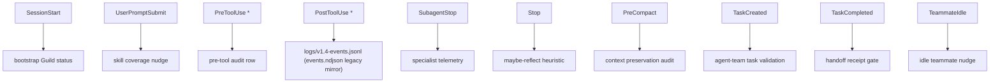
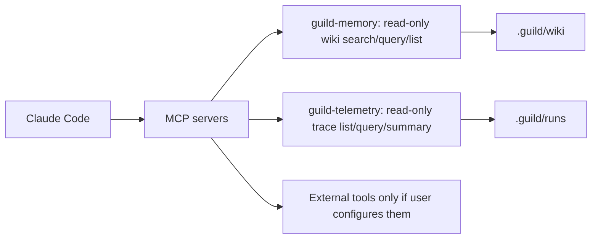
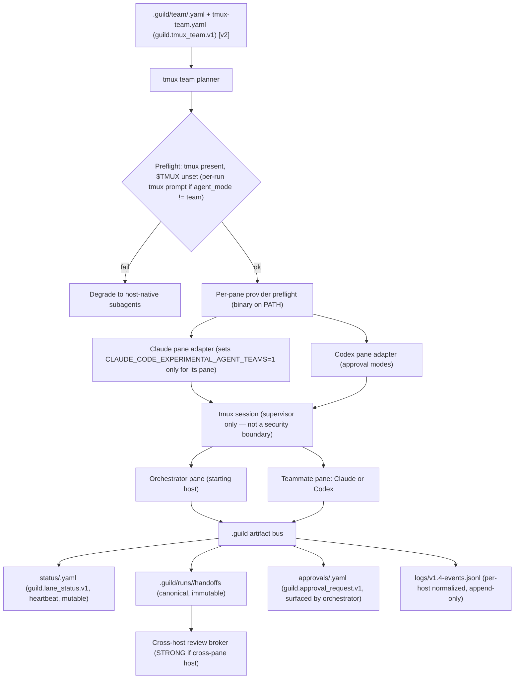

# Claude Code Adapter

## Intent

Claude Code is one of Guild's two co-equal hosts. The adapter is a concrete
implementation of the single frozen `host_adapter` interface (see
[Host Adapter Interface](#host-adapter-interface) — frozen `[v2]`): it maps
Guild's neutral `task_run` contract onto Claude Code plugin components (slash
commands, skills, agents, hooks, MCP servers, and the optional tmux agent-team
backend) and returns a canonical host-agnostic `handoff_receipt` plus a
normalized trace.

> **v2-EPP-1 (G6-amended):** Codex (`openai-codex`) is the **sole permitted
> external runtime plugin**. It serves as a **co-equal host adapter**
> (originate / execute / review runs via the neutral `task_run` contract)
> *plus* the rescue, stop-time-review, and CLI-runtime carve-out surfaces.
> There is **no fixed surface-count ceiling** on Codex. The external-plugin
> **exclusivity** rule is unchanged: understand-anything, superpowers, and all
> other third-party capabilities are forked/internalized under MIT attribution
> and are **never runtime dependencies**.

Claude Code and the Codex adapter implement the *same* interface; neither is
privileged in the contract. Status: Claude adapter `[v2]`.

## Adapter Is Thin

The adapter owns translation and telemetry only. It carries **zero** Guild
planning, memory, eval, or evolution semantics. Those live in the orchestrator
and meta-skills, host-side. The adapter never decides which host runs a task
(the deterministic capability router does that) and never re-spells the
`task_run` or `handoff_receipt` schema.

## `host_adapter` Interface (FROZEN, `[v2]`)

Both adapters implement this interface verbatim. Pure translator: `task_run`
in → canonical `handoff_receipt` + normalized trace out. Zero
planning/memory/eval semantics.

```yaml
host_adapter:
  id: claude-code | codex-local | codex-cloud
  probe() -> { available: bool, version, auth_ok, workspace_ok }
  capabilities() -> capability_set
  dispatch(task_run) -> dispatch_handle
  collect(dispatch_handle) -> handoff_receipt          # canonical, host-agnostic
  normalize_trace(host_native_events) -> guild_trace_event[]
  policy_enforced_by: [host_permissions, hooks|approval_modes, worktree, user_approval]

capability_set:
  execute: true
  review: true
  parallel_tasks: true | false
  produces_pr: true | false
  network_controllable: true | false
  isolation: [worktree, sandbox, cloud_container]
  sentinel_or_envelope: envelope
```

Router (deterministic, no LLM): intersect `host.capability_requirements` with
each available adapter's `capability_set`; pick `host.requested` if it
satisfies, else first satisfying adapter, else **degrade** (record degradation
+ weak-independence in the receipt).

## Claude Code Capability Mapping

Concrete realization of the interface for `id: claude-code`:

| `host_adapter` element | Claude Code realization |
|---|---|
| `probe()` | Claude Code session present; plugin loaded; workspace writable. |
| `capabilities()` | `execute: true`, `review: true`, `parallel_tasks: true` (subagents / agent-team), `produces_pr: false` (patches in worktree), `network_controllable: true` (hooks/permissions), `isolation: [worktree]`, `sentinel_or_envelope: envelope`. |
| `dispatch(task_run)` | Materialize context bundle path; invoke `/guild` phase verb + meta-skill or Agent-tool subagent / agent-team teammate. |
| `collect(handle)` | Read `.guild/runs/<run-id>/handoffs/<task-id>.md` → canonical `handoff_receipt`. |
| `normalize_trace()` | Hook events → `guild.trace_event.v1` with `host: claude-code`. |
| `policy_enforced_by` | host permissions + hooks + worktree isolation + user approval. |

## Adapter Flow

```mermaid
sequenceDiagram
  participant Router as Capability router
  participant Adapter as Claude Code adapter
  participant Skill as Guild meta-skills
  participant Hook as Claude Code hooks
  participant Agent as Specialist subagent
  participant State as .guild state

  Router->>Adapter: task_run (host.selected=claude-code)
  Adapter->>Skill: dispatch via phase verb + context bundle path
  Skill->>State: read spec/plan/context; write artifacts
  Adapter->>Agent: dispatch task with context bundle path
  Hook->>State: normalize events -> logs/v1.4-events.jsonl (host=claude-code)
  Agent->>State: write handoff receipt
  Adapter->>Router: canonical handoff_receipt + normalized trace
```

## Subagent Mapping

Claude Code subagents provide separate context windows, scoped tool access,
model selection, permissions, memory, hooks, skills, and worktree isolation.

Important adapter facts:

- Project and user subagents have higher priority than plugin subagents.
- Plugin subagents are lower priority and ignore some advanced frontmatter
  fields such as plugin-agent `hooks`, `mcpServers`, and `permissionMode`.
- Subagent files are loaded at session start when edited directly on disk.
- `isolation: worktree` is the right default for coding specialists.

Adapter implication: Guild may materialize project-local `.claude/agents/`
definitions when it needs controls that plugin agents cannot carry. This is a
translation concern; it does not change the `task_run` contract.

## Hook Mapping



Hooks are the Claude Code realization of `normalize_trace()`. The canonical
trace sink is `.guild/runs/<run-id>/logs/v1.4-events.jsonl`; `events.ndjson`
is a legacy compatibility mirror only.

## MCP Mapping



Bundled MCPs are stdio-only, local-first, and **read-only** (`guild-memory`,
`guild-telemetry`). No new MCP ships in v2. External MCPs are host
capabilities requiring explicit per-lane permissions. The brownfield graph
engine uses scripts, not an MCP.

## Agent-Team Backend

Guild selects the tmux backend via the D5 ladder resolved at run-start intake — it is not an opt-in:

- `runStartPreflight` resolves `agent_mode` from the 7-source settings chain and freezes it in `.guild/runs/<id>/resolved-settings.json` (`snapshot.effective.agent_mode`).
- `scripts/agent-team-launcher.ts` checks tmux availability as part of the D5 ladder; tmux is selected when available, in-process agent next, subagent last resort.
- It refuses nested tmux execution (`$TMUX` set → refuse).
- When `agent_mode != "team"` and tmux is available, run-start preflight prompts to persist `agent_mode: "team"`; on YES it is persisted so future runs stop prompting; on NO nothing is persisted.
- It writes under `.guild/runs/<run-id>/agent-team/`.
- It prompts teammates to read context bundles and write handoff receipts.
- `team.yaml` records the backend as a mirror for audit only — it is NOT the authority for backend selection.

### Provider-Neutral Pane Model — Mixed-Host tmux Teams (`[v2]`)

Mixed-host tmux co-execution is **`[v2]`**. The Claude-only launcher is
split into **tmux-as-supervisor + per-provider pane adapters**. tmux owns
panes, names, liveness, and layout only — **not** provider prompts,
permissions, review parsing, or trace normalization (tmux is a supervisor, not
a security boundary; the security boundary stays host permissions + worktree +
the always-ask hard set, unchanged).

Two **symmetric** configurations, both `[v2]`:

- **Claude orchestrator + Codex teammate** — the Claude pane owns the
  interactive lifecycle + approval UX; the Codex pane runs an assigned lane.
- **Codex orchestrator + Claude teammate** — the Codex pane owns the
  lifecycle; the Claude pane runs an assigned lane.

The **starting host stays orchestrator by default**: whichever host the user
launched in owns the interactive lifecycle; orchestration is never transferred
implicitly. Mixed-host panes **coordinate via `.guild/` artifacts (the
artifact bus), never a shared chat** — the bus reuses the already-`[v2]`
persistence discipline (atomic temp-then-rename writes, artifact-validity,
single-writer `.guild/.lock`). The team is described by a **new sibling
artifact** `guild.tmux_team.v1` at `.guild/runs/<run-id>/tmux-team.yaml`
(carries its own `schema_version`, references frozen `task_run` lane ids by
ref, never re-spells them); the bus also introduces siblings
`guild.lane_status.v1` (`status/<lane>.yaml`, heartbeat-carrying, mutable) and
`guild.approval_request.v1` (`approvals/<id>.yaml`, surfaced by the
orchestrator). The six-sibling registry of record is the Artifact Model in
[`target-architecture.md`](../architecture/target-architecture.md) (Cluster
A); this doc references it. Mixed-host gated lanes reuse the already-`[v2]`
cross-host review broker unchanged (cross-pane host = STRONG independence; see
[Cross-Host Review](../adversarial-review/cross-host-review-and-loop-control.md)).

**Preflight / env-var scoping.** The existing tmux preflight is reused
**verbatim, team-level, host-neutral, with no relaxation**: tmux present;
`$TMUX` unset (refuse nested). The tmux-enablement decision is the per-run
preflight prompt (`needsTmuxPrompt = tmux available && effective agent_mode !=
"team"`) — not a dispatch-time approval on every team launch; on YES it persists
`agent_mode: "team"` so future runs stop prompting, on NO it may re-prompt next
run. The single change is env-var scoping:
`CLAUDE_CODE_EXPERIMENTAL_AGENT_TEAMS=1` moves from a *team-level* precondition
to a **per-Claude-pane precondition**, asserted by the Claude pane adapter
**only when a Claude pane participates**. A pure Codex+Codex team never sets
it; a mixed team sets it only for the Claude pane's spawn. Added as *new
applications* of the existing gate (no new gate): a **per-pane provider
preflight** (the pane's provider binary must be on PATH before spawn) and
**minimal allow-listed env per pane** (no blanket env inheritance across
panes). The always-ask hard set + autonomy policy apply per pane, enforced by
that pane's host adapter; an approval surfacing in an inactive pane is written
to `approvals/` and surfaced by the orchestrator.

**Degrade-to-subagents.** Any tmux failure degrades gracefully: `tmux` missing
or `$TMUX` already set → fall back to host-native subagents (record the
capability gap), never hard-block. A pane provider binary missing on PATH →
pane-adapter preflight fails before spawn; the lane is not started and the
gap is surfaced.



*(The provider-neutral mixed-host tmux diagram has a `.mmd` companion and an
exported SVG at `diagrams/18-mixed-host-tmux-team.{mmd,svg}`; this doc embeds
the prose mermaid and cites the companion by id.)*

## Plugin Constraints

| Constraint | Design Response |
|---|---|
| Plugin subagents have lower priority than project/user subagents. | Detect and report overrides; optionally materialize project agents. |
| Some frontmatter fields are ignored for plugin subagents. | Keep hard policy in hooks/runtime, not only agent frontmatter. |
| Ambient `CLAUDE.md` and memory may influence agents. | Context bundle is authoritative; report contradictions. |
| Agent teams differ from subagents. | Prompt teammate skill/context requirements explicitly. |
| Hooks may not fire on older hosts. | Handlers must degrade gracefully and record capability gaps. |

## Implementation Recommendation

Keep the Claude Code adapter thin. It translates the frozen `task_run`
contract into Claude-specific invocations and collects Claude-specific
telemetry normalized to `guild.trace_event.v1`. It does not own core planning,
memory, eval, or evolution semantics. Any divergence from the codex adapter
must live in the capability mapping table, never in the interface.

---

<!-- SC-4 claude-code-reconcile: sections below added 2026-05-28 per
     docs/knowledge/decisions/host-adapter-contract.md (Lane A).
     Existing content above is preserved unchanged. -->

## Target host capabilities

Claude Code CLI is the **reference implementation** for the host-adapter
contract. The advertisement below is the canonical `host_capabilities.v1`
for this host. Schema and field semantics are defined in
[`decisions/host-adapter-contract.md`](../decisions/host-adapter-contract.md)
Decision 2.

```yaml
# guild.host_capabilities.v1 — Claude Code CLI reference advertisement
schema_version: guild.host_capabilities.v1
host_id: "claude-code-cli"
family: "claude"
surface: "claude-code-cli"
surface_kind: "cli-package"

packaging:
  format: "claude-plugin"
  installable: true
  manifest_path: ".claude-plugin/plugin.json"

commands:
  slash_commands: true
  toml_commands: false
  mcp_tool_commands: false
  command_path_pattern: "commands/*.md"

hooks:
  session_start: true
  pre_tool_use: true
  post_tool_use: true
  permission_request: false         # Codex-only event; Claude uses PreToolUse ask instead
  ask_from_pre_tool_use: true       # Claude-exclusive: permissionDecision: ask
  subagent_stop: true
  stop: true

dispatch:
  in_process_agent: true            # Agent() tool / subagent dispatch
  subagent_dispatch: true
  independent_agents: false         # Claude Code CLI is not an app with parallel independent threads
  serial_only: false

permissions:
  ask_ui: "pre_tool_use_ask"
  deny_at_pre_tool_use: true
  bypass_permissions_mode: true     # operator bypassPermissions opt-out available

model_tiers:
  cheap: { model: "haiku" }
  mid: { model: "sonnet" }
  powerful: { model: "opus" }

mcp:
  stdio: true
  http: false
  plugin_bundled: true
  core_provides_mcp: true

team_visibility:
  has_tmux: true                    # when tmux is installed in the local environment
  has_independent_agents: false
  has_subagent_dispatch: true
  can_lead_team: true
  can_join_team: true
  app_threads: false
  app_projects: false
  scheduled_tasks: false

filesystem: "local"

cost_path:
  prefer_native_subscription_path: true
  allow_external_cli_spawn: false   # external `claude -c` is opt-in via settings.json
  trace_external_cli: true

detected_at: "runtime"
advertised_at: "session-start"
ttl_seconds: 3600
```

## Contract surfaces — implements vs degrades

Claude Code CLI is the **reference implementation** for all 8 contract
surfaces defined in
[`decisions/host-adapter-contract.md`](../decisions/host-adapter-contract.md)
Decision 1. It implements every surface at full capability; no degradation
paths are taken by default.

| Surface | Status | Notes |
|---|---|---|
| **S1 Packaging** | ✓ implements | Emits `.claude-plugin/plugin.json` via the Claude manifest renderer. |
| **S2 Commands** | ✓ implements | Command bodies are owned by `plugin/src/modules/*/resources`; `commands/*.md` is the generated Claude-compatible mirror that other host renderers can consume. |
| **S3 Hooks** | ✓ implements | Full event set: `SessionStart`, `PreToolUse`, `PostToolUse`, `SubagentStop`, `Stop`, `PreCompact`, `TaskCreated`, `TaskCompleted`, `TeammateIdle`. `ask_from_pre_tool_use: true` (Claude-exclusive). |
| **S4 Dispatch** | ✓ implements | Backend resolved once at run-start by `runStartPreflight` (D5 ladder) and frozen in the resolved-settings snapshot; phases read it via `readResolvedSettingsSnapshot`. For Claude Code CLI the reachable rungs are tmux team (Rung 1) + subagent (Rung 3) — in-process `Agent()` Rung 2 is N/A here (`independent_agents: false`). |
| **S5 Permissions** | ✓ implements | `ScopePolicy.resolve()` → `PreToolUse permissionDecision: ask` (the reference ask path). |
| **S6 Model tiers** | ✓ implements | Tier → model mapping is the canonical definition (`haiku / sonnet / opus`). |
| **S7 MCP** | ✓ implements | stdio MCP (`guild-memory`, `guild-telemetry`) bundled in plugin; plugin-bundled registration via `.claude-plugin/plugin.json`. |
| **S8 Team visibility** | ✓ implements | `TmuxTeamBackend` (Rung 1 when tmux present) → subagent fallback (Rung 3 when tmux absent). Claude `SendMessage` available as optional UI decoration; canonical channel is the file bus. |

**Backend ladder rung selection for Claude Code CLI.** The rung is resolved
once at run-start intake by `runStartPreflight` (the D5 ladder) and frozen in
the resolved-settings snapshot (`snapshot.effective.agent_mode`); it is not
re-selected per dispatch. `team.yaml` mirrors the resolved backend for audit
only — it is not the authority.

| tmux present | Rung | Backend |
|---|---|---|
| yes | 1 | `TmuxTeamBackend` (one pane per lane) |
| no | 3 | `SubagentFallbackBackend` (Agent tool dispatch) |

Rung 4 (serial) is never the default for Claude Code CLI; it only applies if
both tmux and Agent tool dispatch are explicitly disabled via settings.

## Per-feature degradation matrix

Claude Code CLI is the **reference baseline** for all 16 FDC rows defined in
[`decisions/feature-degradation-contracts.md`](../decisions/feature-degradation-contracts.md).
For each row the baseline behavior is the full behavior; Claude Code CLI does
not introduce degradation for any FDC row by default.

| # | Feature | Claude Code CLI status | Degradation case |
|---|---|---|---|
| FDC-1 | Memory | implements baseline | MCP stdio available; BM25 fallback if MCP server fails to start. |
| FDC-2 | Knowledge-graph + recall | implements baseline | Index re-scan if `.guild/indexes/` absent. |
| FDC-3 | Context assembly | implements baseline (critical) | Bundle always produced; `degraded_retrieval: true` if FDC-1/2 degrade. |
| FDC-4 | Agent communication | implements baseline (critical) | File bus is primary; `SendMessage` is optional decoration — not a blocker if absent. |
| FDC-5 | Agent coordination | implements baseline (critical) | Rung 1 (tmux) or Rung 3 (subagent); both produce identical receipts. |
| FDC-6 | All lifecycle phases | implements baseline (critical) | All 6 phases run; `ask_from_pre_tool_use: true` satisfies interactive ask. |
| FDC-7 | Quality gates | implements baseline (critical) | Cross-provider review available when Codex plugin installed; skipped-with-warn when absent. |
| FDC-8 | Operations | implements baseline | Full R/O + W + destructive ops; `PreToolUse ask` handles approval UI. |
| FDC-9 | Settings | implements baseline (critical) | `.guild/settings.json` is the authority; Claude plugin config is the renderer only. |
| FDC-10 | Visuals / UI | implements baseline | Full CLI visual surface (startup card, dashboard panes). |
| FDC-11 | Security / permissions | implements baseline (critical) | `ScopePolicy` + `PreToolUse ask` is the reference ask renderer. |
| FDC-12 | Cost + subscription path | implements baseline (critical) | Native `Agent()` / plugin integration preferred; external `claude -c` gated by `allow_external_cli_spawn`. |
| FDC-13 | MCP | implements baseline | stdio MCP bundled; no degradation unless MCP server process fails. |
| FDC-14 | Host-native subagents | implements baseline | `Agent()` tool dispatch (Rung 3 when tmux absent). |
| FDC-15 | Work isolation | implements baseline | `isolation: worktree` is the default; serialization only if worktree allocation explicitly disabled. |
| FDC-16 | Telemetry + replay | implements baseline (critical) | `guild.trace_event.v1` produced via hooks; normalized in `capture-telemetry.ts`. |

**Note on the 16 vs 14 row count.** The original audit listed 14 rows. The
FDC ADR expanded to 16 by promoting work isolation (FDC-15) and
telemetry/replay (FDC-16) to first-class rows. Claude Code CLI implements the
baseline for both additions.

## Packaging format

**Manifest path:** `.claude-plugin/plugin.json`

The Claude manifest renderer emits this file from the host-neutral Guild
inventory (skills, agents, commands, hooks, MCP servers). The inventory
source-of-truth is the disk: `skills/**/SKILL.md`, `agents/*.md`,
`commands/<verb>.md`, `hooks/<event>.<script>`, `mcp-servers/<name>.json`.

Per the contract (Surface 1), the renderer derives the manifest from the
inventory; it does NOT define the inventory.

Reference: [`decisions/host-adapter-contract.md`](../decisions/host-adapter-contract.md)
Surface 1; audit §"Package and surface" (manifest inventory drift — 14 agents
declared vs 17 on disk; 100 skills found).

## Unresolved questions

The following questions derive from the reference-implementation audit
(`.guild/initiatives/active/cross-platform-compatibility/artifacts/claude-code-adapter-audit.md`,
LEAKS Group D — items that leak Claude-specific APIs into shared core and must
be hoisted behind the adapter seam):

1. **`GuildDispatchDescriptor` hoist (LEAKS D-1).** `team-backend.ts`
   (`GuildDispatchDescriptor`, renamed from `AgentDispatchDescriptor` in v2.0)
   returns Claude `Agent()` descriptors directly from the in-process
   backend rather than host-neutral `DispatchAdapter` output. The hoist — rename
   to `HostIndependentAgentBackend` and make it return a neutral descriptor — is
   scoped to a follow-on implementation initiative, not this documentation run.

2. **`HookPayload` normalization (LEAKS D-2).** `capture-telemetry.ts` lines
   99-119 read Claude field names directly from the hook payload. The
   `GuildHookEvent` normalization layer (audit §"P1: Telemetry event schemas")
   must be inserted between the raw hook and the telemetry sink. Until then,
   the adapter is the only host that can run `capture-telemetry.ts` as-is.

3. **`write-host-capability.ts` `HostKind` union width (LEAKS D-3).** The
   current script supports `claude | codex` only. Widening to the 9 targets
   and emitting the full `host_capabilities.v1` schema (Decision 2 of
   `host-adapter-contract.md`) is the first mechanical step when implementing
   any new adapter.

4. **`SendMessage` portability (LEAKS D-4).** Several core-side paths treat
   Claude `SendMessage` as the inter-lane channel rather than an optional
   decoration over the file bus. This couples the DAG scheduler to
   Claude-specific event delivery. Resolution: make `SendMessage` fire
   only inside the Claude adapter's `TeamBackend` and ensure core reads
   only file-bus artifacts for lane coordination.

5. **`PreToolUse ask` portability (LEAKS D-5).** The permission flow hard-
   codes `permissionDecision: ask` as the only ask renderer. The
   `PermissionEmitter` surface (Surface 5) must abstract this so non-Claude
   hosts route to their own ask primitive or file-bus pause.

6. **`host-router.ts` model-tier defaults (LEAKS D-6).** Lines 144-150 of
   `host-router.ts` bake in the Claude model names (`haiku / sonnet / opus`)
   as global defaults rather than Claude-adapter-specific defaults. The fix
   is to move these into the Claude adapter's `ModelResolver` and keep the
   core tier ladder model-name-free.
