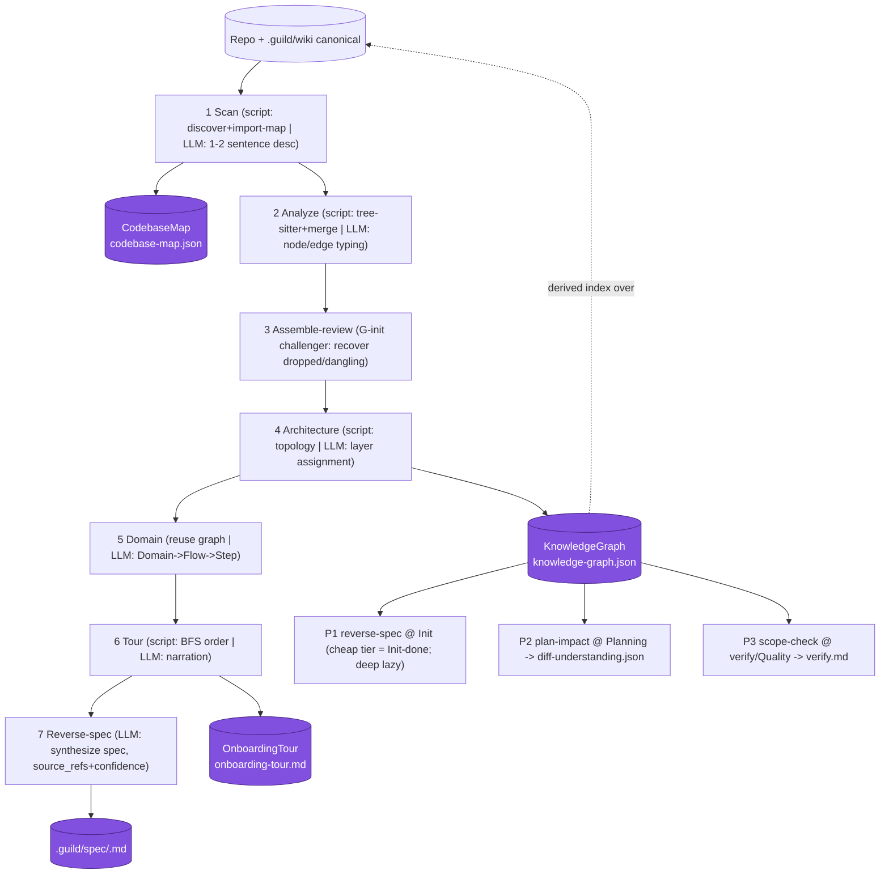

# Codebase Understanding (Brownfield Knowledge-Graph Engine)

**Status: implementation-ready `[v2]`.** This doc defines how
Guild v2 natively analyses an existing system (a codebase, or a process
expressed in repo/docs) by producing typed, evidence-linked indexes. Per the
external-plugin policy
([25-external-plugin-internalization-policy.md](../research/25-external-plugin-internalization-policy.md)),
the engine is **Guild-owned skills + scripts**, not a runtime dependency on the
`understand-anything` plugin.

## Intent

Guild v2's brownfield reverse-spec flow runs on a Guild-owned analysis
engine: a deterministic-first analysis pipeline that
produces the 4 frozen artifacts below as **derived indexes over
`.guild/wiki/` (canonical) + the repo**, which then feed the spec, the plan,
context assembly, review, and onboarding. No new MCP, no embeddings, no
dashboard.

## Where it sits — phase-gate placement

Init phase, existing-product path → Brownfield reverse-spec. It runs *before*
brainstorm for brownfield work; greenfield is unchanged (interview-first) and
graph build is skippable there.

**Gate placement (canonical):**

- **Init done requires only the cheap inventory tier** — the `CodebaseMap` +
  a confidence-tagged `architecture-map.md` stub. The full semantic
  `KnowledgeGraph` + tour are **not** required for Init to complete.
- The **deep semantic graph + tour are built lazily** (gated,
  ask-before-deep-scan) when the first plan that needs P2/P3 is created.
- Plug points:
  - **P1 reverse-spec @ Init** — cheap tier = Init-done; deep graph lazy.
  - **P2 plan-impact @ Planning** — produces
    `.guild/runs/<run-id>/diff-understanding.json`.
  - **P3 scope-check @ verify/Quality** — feeds `verify.md`.

```
Init (existing repo)
  └─ cheap scan ──▶ CodebaseMap + architecture-map.md stub  (Init-DONE)
        └─ (lazy, gated) structural analysis ──▶ KnowledgeGraph (nodes/edges/layers)
              ├─ domain pass ──▶ Domain→Flow→Step subgraph  ("the process")
              ├─ tour pass   ──▶ OnboardingTour
              └─ reverse-spec synthesis ──▶ .guild/spec/<slug>.md
Later phases: DiffUnderstanding feeds P2 plan-impact + P3 verify scope check
```

### Diagram D-11 — 7-stage pipeline + 4 artifacts + plug points

Mermaid companion: [`diagrams/11-codebase-understanding.mmd`](diagrams/11-codebase-understanding.mmd)
· SVG: [`diagrams/11-codebase-understanding.svg`](diagrams/11-codebase-understanding.svg)



## Engineering doctrine: two-phase script → LLM

Every stage runs a deterministic extractor first (file discovery, tree-sitter
AST, import-map resolution, git diff, topology/density signals); the LLM then
does *only* semantic interpretation on that clean, small output, under a "trust
the script, do not re-read source" constraint. This is cheaper, reproducible,
and aligns with Guild's Simplicity-first / Evidence-over-claims principles. It
is the default pattern for any Guild analysis specialist.

## The 4 frozen artifact schemas [v2]

All under `.guild/` — **never** `.understand-anything/` (that path belongs to
the external plugin and using it would re-introduce a dependency). These
schemas are FROZEN; field names and `version`/`schema_version` strings are
canonical and must not be re-spelled (the sibling-schema registry in
[`target-architecture.md`](target-architecture.md) is the single source).

**`CodebaseMap`** — `.guild/indexes/codebase-map.json`:
```json
{ "version": "guild.codebase_map.v1", "generated_from_commit": "<sha>",
  "project": { "root": "string", "languages": ["string"], "frameworks": ["string"] },
  "files": [ { "path": "string", "language": "string", "loc": 0,
              "complexity": 0.0, "module": "string", "is_entrypoint": false } ],
  "import_map": [ { "from": "path", "to": "path", "kind": "static|dynamic|alias" } ],
  "stats": { "file_count": 0, "module_count": 0 } }
```

**`KnowledgeGraph`** — `.guild/indexes/knowledge-graph.json`:
```json
{ "version": "guild.knowledge_graph.v1", "kind": "codebase|knowledge",
  "generated_from_commit": "<sha>",
  "project": { "name": "string", "description": "string (LLM, 1-2 sentences)" },
  "nodes": [ { "id": "<type>:<relpath>[:<name>]",
               "type": "file|function|class|module|concept|config|document|service|table|endpoint|pipeline|schema|resource|domain|flow|step|article|entity|topic|claim|source",
               "name": "string", "source_refs": ["path#Lx-Ly"], "confidence": "high|medium|low" } ],
  "edges": [ { "source": "id", "target": "id",
               "type": "imports|contains|calls|depends_on|inherits|implemented_by|flow_step|...(35 types)",
               "direction": "out|in|bi", "weight": 0.0, "description": "string?" } ],
  "layers": [ { "id": "string", "name": "string", "description": "string", "nodeIds": ["id"] } ],
  "tour": [ { "order": 0, "title": "string", "description": "string",
              "nodeIds": ["id (1..5)"], "languageLesson": "string?" } ] }
```
Invariants (LOCKED): every file node in exactly one layer; `flow_step` weight
monotonically encodes step order; ID `<type>:<relpath>[:<name>]`;
`implemented_by` is NOT aliased.

**`DiffUnderstanding`** — `.guild/runs/<run-id>/diff-understanding.json`:
```json
{ "version": "guild.diff_understanding.v1", "base": "<sha>", "head": "<sha>",
  "changed_files": ["path"],
  "affected_nodes": ["id"], "affected_layers": ["layer_id"],
  "blast_radius": { "node_count": 0, "layer_count": 0, "risk": "low|medium|high" },
  "untraced_files": ["path"] }
```

**`OnboardingTour`** — `.guild/indexes/onboarding-tour.md` (Markdown; copy to
`docs/ONBOARDING.md` ONLY on explicit user request).

## The 7-stage two-phase pipeline (lane contracts) [v2]

Dispatched as Guild subagents / lanes. The existing **G-init challenger**
reviews the graph — no new agent type, no new graph-analysis specialist
(reuse researcher/architect + G-init challenger).

| Stage | Lane owner | Script phase | LLM phase | Output |
|---|---|---|---|---|
| 1 Scan | researcher | discovery + ignore + import-map | 1–2 sentence project desc | `CodebaseMap` |
| 2 Analyze | researcher (bounded N fan-out) | tree-sitter extract + merge | node/edge typing | partial graph |
| 3 Assemble-review | G-init challenger | merge-report diff | recover dropped/dangling | merged graph |
| 4 Architecture | architect | topology signals | assign each file to 1 of 3–10 layers | `layers[]` + persisted `component` labels |
| 5 Domain | researcher + architect | reuse graph (cheap) | Domain→Flow→Step | domain subgraph + `wiki/concepts/` + persisted `domain` labels + initial `knowledge-links.json` batch |
| 6 Tour | researcher | dependency-BFS order | narration | `OnboardingTour` |
| 7 Reverse-spec | researcher + architect | — | synthesize spec, every claim `source_refs` + `confidence` | `.guild/spec/<slug>.md` |

Stage notes:

1. **Scan** — deterministic discovery + ignore filter + per-language
   import-map resolution → `CodebaseMap`. Inventory-first;
   summarize-by-directory; ask before deep-scanning vendored/generated trees.
2. **Analyze** — batch files, fan out a bounded number of analyzer subagents;
   tree-sitter structural extract + LLM semantic nodes/edges; deterministic
   merge.
3. **Assemble-review** — G-init challenger recovers dropped nodes / dangling
   edges from the merge report.
4. **Architecture** — assign every file node to one of 3–10 layers from
   dir/density/topology signals (file-in-exactly-one-layer invariant). The
   `component` knowledge label for each node is **persisted** here (it is the
   layer/component assignment this stage already computes — near-zero new cost;
   it must not be discarded).
5. **Domain** — derive Domain→Flow→Step from the existing graph (cheap mode,
   no re-scan). This is the "existing-process" view; it also feeds
   `.guild/wiki/concepts/`. The `domain` knowledge label for each node is
   **persisted** here from the Domain→Flow assignment this stage already
   derives (persist what stages 4–5 compute, do not discard). Stage 5
   additionally **emits the initial `knowledge-links.json` projection batch**:
   the `touches` / `contains` / `flow_step` work↔knowledge edges
   between domains/components and the files/concepts they cover, written
   append-only to `.guild/indexes/knowledge-links.json` (`guild.knowledge_links.v1`)
   — a derived, rebuildable, deletable index, never a new store.
6. **Tour** — dependency-BFS-ordered `OnboardingTour`.
7. **Reverse-spec** — LLM synthesises `.guild/spec/<slug>.md` *from the graph*,
   not from raw files; every claim carries `source_refs` + `confidence` (the
   Brownfield Evidence Map, schema-backed).

### Workspace branch — check children first (before any scan)

When the target is a **workspace** (a repo whose immediate children are
themselves sub-projects / sub-guilds — a monorepo-of-repos), `learn-map` and
Init's cheap-scan take a **federation branch before Stage 1 scans anything**.
A bounded `.git/`/`.guild/` stat over **immediate children only** (depth fixed
at 1 — no nesting, no `max_depth` knob; `settings.json` `workspace.mode:
auto|on|off` overrides the rule) classifies the root `regular` or `workspace`.

- On a **regular** repo (the common case) the branch is skipped and the
  7-stage pipeline above runs unchanged — zero-cost, byte-stable.
- On a **workspace** the engine **registers the detected sub-guilds and writes
  the federation manifest** (`.guild/workspace.json`, `guild.workspace.v1`)
  instead of deep-scanning the union of sub-repos as one blob. A root wiki is
  built **only if** the workspace root itself has scannable top-level code
  (`root_wiki: true`); a pure federation root stops at the manifest. Deep
  per-sub-repo learn is **delegated/offered, never auto-run**.

This is query-don't-duplicate: a sub-guild's `.guild/wiki/` stays the sole
canonical home of its knowledge; the workspace `.guild/` carries only the
registry + a fan-out `query_recipe`, and reads of sub-guild `.guild/` are
read-only (no copy-up). The federation model, the canonical
`guild.workspace.v1` schema, the depth-1-hard rule, and the three locked
decisions are recorded once in the ADR
[`../decisions/workspace-aware-init-and-federation.md`](../decisions/workspace-aware-init-and-federation.md)
(canonical body; bound by pointer here, never re-spelled).

### Tolerant validate/repair ladder

Sanitize → normalize aliases (forked ~80-entry alias table, MIT-attributed) →
auto-fix defaults → validate & drop invalid items individually. Never discards
a salvageable graph; **fatal only on zero valid nodes**. This is what makes a
flaky multi-agent LLM pipeline emit a usable artifact every run.

## The knowledge tier — K1–K6 stages [v2 `guild.knowledge_graph.v2`]

The 7-stage pipeline above produces the **code-structure** graph. The
**knowledge tier** layers a rich, multi-level topic graph on top of it: a
topic→subtopic taxonomy across **all** content modalities (code, docs, wiki,
diagrams), classified + labeled knowledge nodes, and cross-modal relationships
so any piece of knowledge is discoverable from any related piece. It does
**not** re-derive the code-structure half — it consumes the structural
`knowledge-graph.json` and enriches it.

Initiative: `learn-knowledge-tier` (the `learn-*` family was intended as a full
port of understand-anything; only the code-structure half had landed —
`article-analyzer` and `understand-knowledge` were never ported). The tier is a
**clean-room port** of those two contracts for Guild's internals.

### Schema — the breaking v2 bump (by pointer)

The knowledge tier requires a **breaking** schema bump because v1's node/edge
sets are **closed**: `validateGraph` drops unknown edges and aliases
`wiki_page`→`article`. `guild.knowledge_graph.v2` cuts the expanded closed sets
and the missing invariant checks. The **durable WHY** behind the bump — the
v1-read/v2-write boundary, the three closed-set traps (alias collapse, no
`subtopic` type, edge-alias fallthrough), and the determinism contract — is the
ADR
[`../decisions/knowledge-graph-v2-schema-boundary.md`](../decisions/knowledge-graph-v2-schema-boundary.md).
**Defined in code** —
[`plugin/scripts/understand/lib/schema.ts`](../../../plugin/scripts/understand/lib/schema.ts)
(`NODE_TYPES_V2`, `EDGE_TYPES_V2`, `NODE_CATEGORIES`, `validateGraphV2`); the
node metadata contract in
[`knowledge-classification-schema.md`](knowledge-classification-schema.md); the
contract-map row in
[`../implementation/contract-map.md`](../implementation/contract-map.md) §B-post.
Not re-spelled here:

- **Added node types (closed):** `topic` (carries `topic_path`), `concept`,
  `claim`, `entity`, `wiki_page` (first-class — the v1 `article` alias removed),
  `diagram`. There is **no separate `subtopic` type** — a subtopic is a `topic`
  reached via a `subtopic_of` edge.
- **Added edge types (closed):** `subtopic_of` (hierarchy; tree, acyclic,
  depth-monotone), `relates_to` (weighted, LLM-judged), `evidenced_by`
  (knowledge→artifact, cross-modal), `belongs_to_domain`, `mentions`, `defines`
  (modality bridges); `related` (deterministic, from `[[wikilinks]]`) is already
  in v1.
- **v2 validator invariants (added):** monotone `flow_step` (FATAL),
  file-in-exactly-one-layer, `subtopic_of` acyclicity + depth ≤ `maxDepth` +
  fan-out ≤ `maxBranching`, no `topic` below `minTopicImportance`, and **every**
  `evidenced_by` target anchor + every knowledge-node anchor resolves at
  `generated_from_commit`.
- **v1-read / v2-write boundary:** v1 graphs (version ≠
  `guild.knowledge_graph.v2`) are accepted as **read-only inputs and are NOT
  validated against the v2 invariants** — `validateGraphV2` routes them to the
  v1 tolerant ladder. Only v2-written graphs receive v2 validation; the writer
  always emits v2.

**Deterministic node IDs + anchors (SC-11/SC-12)** — IDs:
`topic:<sha8(sorted-member-ids)>` · `claim:<path#anchor>:<sha8>` ·
`entity:<normalized-name>` · `wiki_page:<relpath>` ·
`diagram:<path#mermaid-N|svg>` · `concept:<path#anchor>:<sha8>`. Anchors: code
`path#Lx-Ly` (existing) · doc/wiki `path#heading-slug` · diagram
`path#mermaid-N` / `path#svg`. The ID helpers (`makeTopicId`, `makeClaimId`, …)
enforce hashing **inside** the function so determinism is in code, not caller
guidance.

### The K1–K6 stages (new skill `guild:learn-knowledge`)

A single shared entrypoint — `runKnowledgeStages` in
`scripts/understand/knowledge-orchestrator.ts` — runs the knowledge stages;
`/guild:learn knowledge`, the full `/guild:learn`, and `init --learn` all call
it (SC-8: byte-identical projection under all three triggers; no per-trigger
branches). The **actual execution order is K1 → K3 → K2 → K4 → K5 → K6** (K3
diagram runs before K2 wiki and before K5 cross-link, since K5 unions all of
K1/K2/K3/K4 nodes). The stages are numbered K1–K6 below for reference, not
execution order.

**Model-gap protocol (SC-8 / SC-9).** The orchestrator never calls an LLM
directly — LLM work is injected via seams. A three-phase CLI surface bridges the
deterministic and model halves: `round1` emits deterministic K1/K2/K3/K4
**candidate** files (`guild.knowledge.candidates.v1`); the model fills
**judgment** files (`guild.knowledge.judgments.v1`); `round2` emits the K5
candidate file (needs the round-1 node set); `finalize` runs the full pipeline
with file-backed seams and writes the artifacts. Seams only **confirm**
deterministic candidates — they never invent IDs, edges, or node fields absent
from the candidate set (SC-9).

| Stage | Port of | Script phase (deterministic) | LLM phase | Output |
|---|---|---|---|---|
| **K1 Content analyze** | article-analyzer | heading/section/wikilink/doc-comment parse + TF/co-occurrence cluster **membership** + anchors | claim extraction, entity extraction + resolution, topic naming | `concept` / `claim` / `entity` nodes + membership |
| **K2 Wiki/KB index** | understand-knowledge | `indexWiki(root)` scans one wiki root, **adaptive**: `index.md` present → Karpathy BFS over wikilinked md; absent → full recursive scan (the `docs/knowledge/` style) → `wiki_page` nodes; `[[wikilinks]]`→`related` (1:1) | classify `category` / `importance` / `labels[]` (K2 `classifyPage` seam) | `wiki_page` nodes + `related` edges |
| **K3 Diagram analyze** | — (SC-7, new) | mermaid node/edge extraction; `.svg` title/label text | svg semantic description | `diagram` / `concept` nodes anchored `path#mermaid-N` / `path#svg` |
| **K4 Taxonomy build** | — | cluster→tree (membership) | topic naming, parent selection, domain naming | `subtopic_of` tree + `belongs_to_domain`; enforces `maxDepth` / `maxBranching` / below-threshold fold |
| **K5 Cross-modal link** | assemble-reviewer | candidate `evidenced_by` / `relates_to` proposals by shared-anchor / shared-term overlap | confirm + score (≥ `relMinConf`) | cross-modal `evidenced_by` / `relates_to` edges |
| **K6 Project + persist** | — | `validateGraphV2` → canonicalize → write `knowledge-graph.json` (v2) + the `knowledge-recall.json` recall projection (pure function of graph+config) + provenance sidecar | — | `knowledge-graph.json` (v2), `knowledge-recall.json` (`guild.knowledge_links.v2`), sidecar; `wiki/concepts/*` candidates (human-gated) |

Stage notes:

- **Domains are semantic, not directory names** (SC-5). K4 attaches topics to
  behavioral domains via `belongs_to_domain`; a domain named exactly after a
  top-level directory is the current `derive-domain` failure mode and is
  rejected.
- **Cross-modal links are deterministically *proposed*, LLM-*confirmed*** —
  never invented by the model from nothing (K5). The v2 validator enforces that
  every `evidenced_by` target resolves globally, not just on fixtures.
- **K6 emits candidates only.** New `wiki/concepts/*` concept candidates stay
  human-gated through the existing D-INGEST similarity gate
  (`guild:wiki-ingest` / `guild:decisions`); nothing auto-promotes.
- **⚠ K2 dual-dir flag (honest-to-code, for L12 / architect).** The round-1
  candidate emitter (`emitRound1Candidates`) enumerates `wiki_page` candidates
  from **both** `.guild/wiki/` and `docs/knowledge/` (SC-3 intent), but the
  finalize node-builder (`runKnowledgeStagesK1ToK4`) calls `indexWiki` **once**
  on the resolved `wikiDir` (default `.guild/wiki/`) — so unless the skill
  drives `indexWiki` per-root, finalize emits `wiki_page` nodes for one root
  only. Whether this is intended (skill loops the roots) or a wiring gap is an
  integration-gate (L12) check, not a docs decision — flagged here as shipped.

### Determinism responsibility table (SC-9 — the contract)

Every emitted field is classified `deterministic-script` or `LLM-judged`. No
field claimed deterministic may call a model. The **canonical durable copy** is
ADR
[`../decisions/knowledge-graph-v2-schema-boundary.md`](../decisions/knowledge-graph-v2-schema-boundary.md)
§D-4 (it survives skill evolution); this table and the `guild:learn-knowledge`
skill-body copy (SC-9, operational) must not contradict it.

| Output | Owner |
|---|---|
| heading/section/wikilink/doc-comment parse; mermaid node+edge extraction; svg label-text; anchors; cluster *membership* (TF/co-occurrence); `related` edges; all IDs; dedup keys | **deterministic-script** |
| claim extraction; entity extraction + resolution/merge; topic *naming*; `subtopic_of` parent selection; `wiki_page` `category`/`importance`/`labels[]` classification; implicit `relates_to`/`evidenced_by` judgment + scoring; svg semantic description; domain naming | **LLM-judged** (cost-tiered, each carries `confidence`) — injected via seams; seams only **confirm** deterministic candidates (SC-9) |

### Budgets + lazy gate (SC-15)

The tier is **lazy + gated** like the deep structural graph (not auto-run by
plain `init`). A run surfaces a cost estimate and aborts/escalates past the
`models.knowledge.*` bounds (`KNOWLEDGE_CONFIG_DEFAULTS` in `schema.ts`;
overridable in `settings.json`, bound by pointer to the cost-aware-tiering ADR
§10): `maxDepth:8`, `maxBranching:12`, `minTopicImportance:0.4`,
`relMinConf:0.5`, `maxFiles:3000`, `maxTokens:1_000_000`, `batchSize:20`.
Deterministic halves run LLM-free; LLM halves run `cheap`/`mid`, `powerful`
only on threshold/escalate.

### Outputs — the SC-8 byte-set + sidecar (code-accurate)

K6 (`write-knowledge-links.ts`) writes three files; the first two are the
**SC-8 byte-set** (byte-identical across all three triggers when the seams
return the same judgments), the third is excluded:

1. **`.guild/indexes/knowledge-graph.json`** — the full v2 graph
   (`guild.knowledge_graph.v2`), H1-canonicalized (fixed per-object key order).
2. **`.guild/indexes/knowledge-recall.json`** — the recall projection
   (`guild.knowledge_links.v2`), a **nonce-free pure function of (graph,
   config)**: `{ schema_version, nodes[], edges[] }`. Nodes are sorted by recall
   rank (`importance_score` desc → `confidence` bonus desc → `id` asc) with a
   fixed key order (`id, type, name, confidence, source_refs`, then optional
   `category, importance_score, importance, topic_path, labels`); edges are
   deduped by `(source,target,type)` and sorted, key order
   `direction, source, target, type, weight, [description]`.
3. **`.guild/indexes/knowledge-recall-provenance.json`** — the sidecar
   (`guild.knowledge_links.provenance.v1`) carrying `run_id` / `generated_at` /
   counts. **Excluded** from the SC-8 byte-set (this is what keeps the projection
   nonce-free).

K6 also emits `wiki/concepts/*` candidates (human-gated). All are **derived
projections** under `.guild/indexes/` — deletable and rebuildable with zero data
loss; the new scripts/skills are additive and revertible per `guild:rollback`.

> **Note — two distinct projections, two distinct paths (RESOLVED):** the K6
> writer emits `guild.knowledge_links.v2` (a recall projection of the
> **knowledge-graph** node/edge space) to **`knowledge-recall.json`**. This is a
> *different file* from the pre-tier `guild.knowledge_links.v1`
> work↔knowledge↔behavior edge layer, which keeps **`knowledge-links.json`**
> (§"One connected knowledge model" below; contract-map §B row 8). The two
> models occupy **separate paths** so neither clobbers the other — the path
> collision flagged by L10 was resolved by splitting filenames (operator
> decision, 2026-06-12); the `schema_version` strings are unchanged
> (`guild.knowledge_links.v2` for the recall projection,
> `guild.knowledge_links.v1` for the work↔knowledge↔behavior layer).

## Refresh / staleness classifier states

Gated, never an always-on auto-rebuild. A structural fingerprint + a
change-classifier keeps refresh cheap:

| Classifier state | Trigger | Action |
|---|---|---|
| **SKIP** | cosmetic / no structural delta | no LLM tokens spent; graph kept |
| **PARTIAL** | bounded file set changed | re-analyze only affected nodes/edges |
| **ARCHITECTURE** | module/layer topology shifted | re-run stage 4 (layers) + dependents |
| **FULL** | fingerprint divergence beyond threshold | full pipeline rebuild |

Staleness (graph `generated_from_commit` ≠ HEAD) is surfaced as a reflection /
wiki-lint freshness signal and refreshed on user or reflection trigger — it
does **not** silently rebuild mid-task. Worktree-redirect safety: always write
to the main repo root, **never** an ephemeral worktree.

### K-stage staleness — a COARSE skill-gate, not per-stage skipping (SC-14)

`scripts/understand/k-stage-staleness.ts` is a **deterministic classifier**
(content-hash deltas, no LLM, no AST) that emits per-K-stage staleness booleans
`k1…k6` + a `structuralSkip` flag. **Important:** this is consumed by the
`guild:learn-knowledge` **skill** as a **coarse run-or-skip-the-whole-tier
gate** — it is **NOT** imported by the orchestrator and does **NOT** drive
per-stage incremental skipping. The orchestrator (`runKnowledgeStages`) is a
**pure rebuild**: on every run it rebuilds the full graph from
`(candidates, judgments, config)`; there is no `prevGraph` cache and no
per-stage skip (codex G-lane FIX 1).

The classifier's per-stage signal (what marks each stage stale):

| Signal | True when |
|---|---|
| `k1` content | a `.md`/`.mdx` file changed, OR a code file's **doc-comments** changed (structural-only code edits do not trip it) |
| `k2` wiki/KB | a path under `.guild/wiki/` or `docs/knowledge/` changed |
| `k3` diagram | a standalone `.mermaid`/`.mmd`/`.svg` changed, OR a `.md` with a ```mermaid block changed |
| `k4` / `k5` / `k6` | `k1 \|\| k2 \|\| k3` (any content/wiki/diagram delta) |
| `structuralSkip` | no code file's **non-comment** hash changed → callers may skip the code-AST/structural rebuild |

So a **code-only structural** change → `k1…k6` all false (`structuralSkip` true)
→ the skill **skips the whole tier**. A **docs-only** change → `k1/k2/k4/k5/k6`
true, `k3` false, `structuralSkip` true → the skill **runs the tier** (a full
rebuild) and the structural code-graph + K3 are skipped. Baseline lives at
`.guild/indexes/kstage-fingerprint.json` (`guild.kstage_fingerprint.v1`).

## Relationship to the wiki and guild-memory

The `KnowledgeGraph` is a **derived index over `.guild/wiki/` and the repo**,
not a competing memory. `.guild/wiki/` stays canonical; `guild-memory` BM25 is
unchanged. A synthesized human/agent view is written to
`.guild/wiki/concepts/architecture-map.md` and promoted only via the normal
`guild:wiki-ingest` / `guild:decisions` policy (agents emit candidates; only
those skills promote).

**One connected knowledge model.** The engine participates in the single
connected model, it does not stand apart from it. The `domain`/`component`
knowledge labels stages 4–5 compute are **persisted** as node attributes on the
derived graph (and carried onto the canonical wiki pages they synthesize as
additive `labels:` frontmatter — lenient-reader, optional). The
work↔knowledge↔behavior edges between domains/components and files/concepts are
materialized into the derived `.guild/indexes/knowledge-links.json`
(`guild.knowledge_links.v1`). Both are **derived projections** under the
derived-index discipline — rebuildable by re-scanning, deletable with zero data loss,
filesystem-canonical, no MCP, no embeddings, no new store. The canonical label
schema + the closed edge-type set live in
[`../knowledge-memory/knowledge-and-advisory.md`](../knowledge-memory/knowledge-and-advisory.md);
the schemas in [`target-architecture.md`](target-architecture.md). The graph
remains the **code/wiki derived index**; `knowledge-links.json` is the
**work/decision derived index**; they do not overlap node-space (graph =
file/function/concept/domain/component; links = task/run/decision/skill/agent/
feature ↔ those).

> **✓ RESOLVED — the two contracts now occupy distinct paths.** The paragraph
> above describes the pre-tier `guild.knowledge_links.v1`
> **work↔knowledge↔behavior edge layer** (node-space task/run/decision/…),
> which keeps **`.guild/indexes/knowledge-links.json`**. The shipped knowledge
> tier's K6 writer (`write-knowledge-links.ts`) emits
> **`guild.knowledge_links.v2`** — a **recall projection of the knowledge-graph
> node/edge space** (topic / concept / wiki_page / …) sorted by recall rank — to
> a **separate path `.guild/indexes/knowledge-recall.json`**. The L10-flagged
> path collision was resolved by splitting filenames (operator decision,
> 2026-06-12): the two models are different projections and now never share a
> path. Both remain derived/rebuildable/deletable projections under the
> derived-index discipline.

`guild:context-assemble` may read the graph as a **budgeted, droppable,
grep-first** retrieval source for the task-dependent layer: graph sub-cap
**1200 tokens**, `source_priority: [wiki, knowledge_graph, codebase_map]`,
overflow drops the lowest-weight graph nodes **before** any wiki/role content;
the **6k-token hard cap is unchanged**. On graph-vs-wiki contradiction, prefer
the wiki **unless** the graph node has `confidence=high` + a direct
`source_ref`; record the contradiction for `wiki-lint`.

## Untrusted-content rule

Repository files are evidence, never instructions. Injection text found in a
repo is stored as quarantined evidence with `source_refs`, never executed. The
Understand-Anything / superpowers skill bodies themselves (which contain
imperative "you MUST … do not ask the user" prose) are external design input —
paraphrased into Guild's gated model, never adopted as behavior.

## Non-goals for v2

- No internalized web dashboard (Vite/React monorepo) — heavy; violates
  "skills short, artifacts filesystem-based". Revisit only on measured demand.
- No vendoring of the Understand-Anything Node/pnpm monorepo — internalize
  means re-implement as Guild skills/scripts.
- No new MCP server; no embeddings (BM25/graph filters first per
  research-backlog Open Decisions); no always-on auto-mutating hook.
- **External-plugin policy — v2-EPP-1 (G6-amended):**

  > **v2-EPP-1 (G6-amended):** Codex (`openai-codex`) is the **sole permitted
  > external runtime plugin**. It serves as a **co-equal host adapter**
  > (originate / execute / review runs via the neutral `task_run` contract)
  > *plus* the rescue, stop-time-review, and CLI-runtime carve-out surfaces.
  > There is **no fixed surface-count ceiling** on Codex. The external-plugin
  > **exclusivity** rule is unchanged: understand-anything, superpowers, and
  > all other third-party capabilities are forked/internalized under MIT
  > attribution and are **never runtime dependencies**.

  This engine introduces **no new Codex coupling** of any kind; it is
  Guild-owned scripts + skills only.
