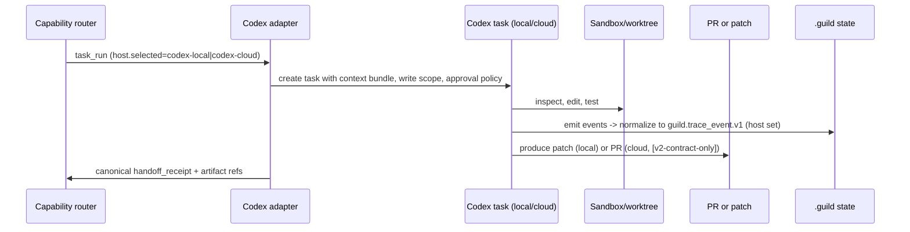
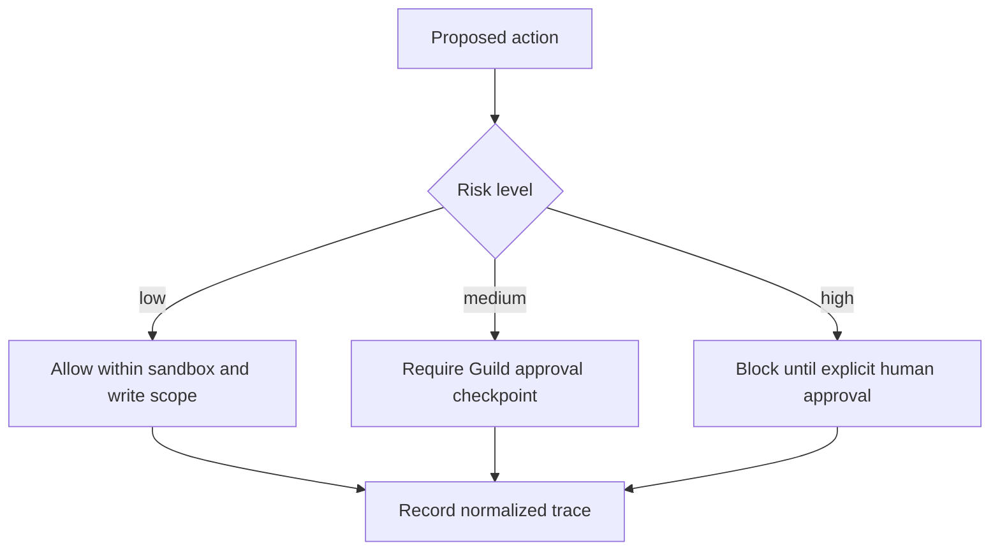

# Codex and OpenAI Adapter

## Intent

Codex is one of Guild's two co-equal hosts. The adapter is a concrete
implementation of the same single frozen `host_adapter` interface that the
Claude Code adapter implements (see
[Host Adapter Interface](#host-adapter-interface) — frozen `[v2]`). It lets
Guild dispatch the neutral `task_run` contract to Codex-local or Codex-cloud
and returns the canonical host-agnostic `handoff_receipt` plus a normalized
trace, preserving Guild's artifact, trace, approval, and governance model.

> **v2-EPP-1 (G6-amended):** Codex (`openai-codex`) is the **sole permitted
> external runtime plugin**. It serves as a **co-equal host adapter**
> (originate / execute / review runs via the neutral `task_run` contract)
> *plus* the rescue, stop-time-review, and CLI-runtime carve-out surfaces.
> There is **no fixed surface-count ceiling** on Codex. The external-plugin
> **exclusivity** rule is unchanged: understand-anything, superpowers, and all
> other third-party capabilities are forked/internalized under MIT attribution
> and are **never runtime dependencies**.

The prior "Codex = exactly three surfaces" ceiling is removed. Codex is a
co-equal host adapter; the *exclusivity* rule (Codex is the only external
runtime plugin) stands.

## Adapter Is Thin

The Codex adapter owns translation and trace normalization only. It carries
**zero** Guild planning, memory, eval, or evolution semantics. Codex is a host
adapter, not a separate Guild fork. It never re-spells the `task_run` or
`handoff_receipt` schema and never decides host selection (the deterministic
router does).

## `host_adapter` Interface (FROZEN, `[v2]`)

Both adapters implement this interface verbatim. Pure translator: `task_run`
in → canonical `handoff_receipt` + normalized trace out. Zero
planning/memory/eval semantics.

```yaml
host_adapter:
  id: claude-code | codex-local | codex-cloud
  probe() -> { available: bool, version, auth_ok, workspace_ok }
  capabilities() -> capability_set
  dispatch(task_run) -> dispatch_handle
  collect(dispatch_handle) -> handoff_receipt          # canonical, host-agnostic
  normalize_trace(host_native_events) -> guild_trace_event[]
  policy_enforced_by: [host_permissions, hooks|approval_modes, worktree, user_approval]

capability_set:
  execute: true
  review: true
  parallel_tasks: true | false
  produces_pr: true | false
  network_controllable: true | false
  isolation: [worktree, sandbox, cloud_container]
  sentinel_or_envelope: envelope
```

Router (deterministic, no LLM): intersect `host.capability_requirements` with
each available adapter's `capability_set`; pick `host.requested` if it
satisfies, else first satisfying adapter, else **degrade** (record degradation
+ weak-independence in the receipt).

## `task_run` Contract (FROZEN, `[v2]`)

The adapter consumes the frozen contract verbatim. Path:
`.guild/runs/<run-id>/task-runs/<task-id>.yaml`. Written by the orchestrator
before dispatch.

```yaml
task_run:
  schema_version: guild.task_run.v1
  ids:
    initiative_id: null | init-<slug>
    run_id: run-2026-05-17-001
    task_id: backend-api-001
    task_run_id: trun-001                       # unique per (re)dispatch attempt
  specialist: backend                           # one of the registered specialists
  objective: "Implement the API contract from the approved plan"
  context_bundle: ".guild/context/<run-id>/backend-api-001.md"
  inputs: [".guild/spec/<slug>.md", ".guild/plan/<slug>.md"]
  expected_outputs: [handoff_receipt, changed_files, evidence]
  depends_on: [architect-design-001]
  permissions:
    read: ["repo"]
    write: ["assigned_worktree"]
    network: "disabled_by_default"
    shell: "approval_required"
    destructive: "approval_required"
  budget: { max_turns: 20, max_tokens: 80000 }
  autonomy_policy: interactive | autonomous_after_plan_approval | auto_approve
  loops_applicable: none | l3-only | l4-only | both | full
  host:
    requested: claude-code | codex-local | codex-cloud | any
    selected: null
    capability_requirements:
      needs_pr: false
      needs_parallel: false
      needs_network: false
      isolation: worktree
  trace: { events_ref: ".guild/runs/<run-id>/logs/v1.4-events.jsonl" }
```

## Codex Capability Mapping

Concrete realization of the interface for `id: codex-local` and
`id: codex-cloud`:

| `host_adapter` element | `codex-local` realization | `codex-cloud` realization |
|---|---|---|
| `probe()` | `codex --version`, auth, workspace writable. | Codex cloud auth + provisioning available. |
| `capabilities()` | `execute: true`, `review: true`, `parallel_tasks: true`, `produces_pr: false`, `network_controllable: true` (approval modes), `isolation: [worktree]`. | `execute: true`, `review: true`, `parallel_tasks: true`, `produces_pr: true`, `network_controllable: true`, `isolation: [cloud_container]`. |
| `dispatch(task_run)` | Create local Codex task in workspace with context bundle, approval mode, write scope. | Provision cloud task; upload/provide artifacts; map cloud task id to `task_run_id`. |
| `collect(handle)` | Read patch + handoff → canonical `handoff_receipt`. | Map PR/patch + logs back to the task graph → canonical `handoff_receipt`. |
| `normalize_trace()` | Codex events → `guild.trace_event.v1` with `host: codex-local`. | Codex cloud events → `guild.trace_event.v1` with `host: codex-cloud`. |
| Status | execute **`[v2]`**. | execute / PR-handoff **`[v2-contract-only]`**. |

Mixed-tmux multi-host orchestration is **`[v2]`** (provider-neutral pane
model — see
[Mixed-Host tmux Teams](claude-code-adapter.md#agent-team-backend)).

## Codex-Local Realization (`[v2]`)

`codex-local` is a **co-equal host adapter** (v2-EPP-1 G6-amended): it realizes
the same frozen five-method `host_adapter` interface verbatim — no privileged
position, no surface ceiling. The interface is NOT re-spelled; the table below
is the *realization* of each frozen method for `id: codex-local`. **Zero frozen
field is added or changed**: `dispatch_handle` and the Codex session ref
are adapter-internal returns already implied by the frozen signatures, not
additions to `task_run`/`handoff_receipt`.

| Frozen `host_adapter` method | `codex-local` realization | Status |
|---|---|---|
| `probe() -> {available, version, auth_ok, workspace_ok}` | `codex --version` resolves on PATH; Codex auth/credential check passes; target worktree writable; `$TMUX` state recorded (not blocking for non-tmux dispatch). Returns `available:false` cleanly when `codex` absent. | `[v2]` |
| `capabilities() -> capability_set` | `execute:true`, `review:true`, `parallel_tasks:true`, `produces_pr:false` (emits a patch in the assigned worktree, not a PR), `network_controllable:true`, `isolation:[worktree]`, `sentinel_or_envelope:envelope`. | `[v2]` |
| `dispatch(task_run) -> dispatch_handle` | Translate the frozen `task_run.yaml` into a local Codex session: pass `objective`, `context_bundle` path, `inputs`, write scope = `permissions.write` (`assigned_worktree`), Codex approval mode derived from `autonomy_policy` + the immutable always-ask hard set, `budget` → Codex turn/token caps. `dispatch_handle = {codex_session_ref, task_run_id, worktree_path}` (adapter-internal). | `[v2]` |
| `collect(handle) -> handoff_receipt` | Read the Codex-produced patch + the canonical handoff at `.guild/runs/<run-id>/handoffs/<task-id>.md`; assemble the **canonical host-agnostic `handoff_receipt`** (same shape the Claude adapter returns). Codex session id stored as a *ref*, never substituting `task_run_id`. | `[v2]` |
| `normalize_trace(host_native_events) -> guild_trace_event[]` | Map Codex session/tool/approval events → `guild.trace_event.v1` with `host: codex-local`, `actor_type: adapter`, sink `.guild/runs/<run-id>/logs/v1.4-events.jsonl`. No new trace fields. | `[v2]` |
| `policy_enforced_by` | `[host_permissions, approval_modes, worktree, user_approval]` — the frozen enum value `hooks|approval_modes` resolves to `approval_modes` for Codex. | `[v2]` |

**Originate / execute / review (all `[v2]` for `codex-local`).** The frozen
`guild.task_run.v1` already carries `host.requested ∈ {claude-code,
codex-local, codex-cloud, any}`; all three flows use the frozen contract
unchanged. A Codex local session may **originate** a run (be the starting
host / orchestrator) — the originating host is recorded only via existing
frozen fields (`trace_event.host` on the first `state_transition`,
`review_packet.creator_host` on the first gate); **no `originator_host` field
is added**. **Execute** is the headline local-Codex deliverable. For
**review**, `codex-local` is a **STRONG-independence reviewer** when the
creator is `claude-code` (and vice-versa) via the already-`[v2]` cross-host
review broker — `review_packet.creator_host` / `review_result.reviewer_host`
carry attribution, frozen and unchanged (see
[Cross-Host Review](cross-host-review-and-loop-control.md)).

**Degrade-not-block when Codex absent (`[v2]`).** `probe()` returns
`available:false` → the deterministic router never selects `codex-local`. If
`host.requested == codex-local` and Codex is absent, the router degrades to
the first satisfying adapter (normally `claude-code`) and records
`degraded:true` + `independence:weak` (if cross-host was needed) in the
canonical receipt — **warn, never hard-block**. Guild builds and runs
end-to-end with Codex entirely absent. No router behavior change; no new
field.

### Sandbox / Approval Mapping (`[v2]`)

Codex approval modes are mapped *onto* the existing frozen
`task_run.permissions` + `autonomy_policy` + the immutable always-ask hard
set. The canonical 3-level `autonomy_policy` enum and the always-ask hard set
are stated once in
[`target-architecture.md` §autonomy_policy](../../../../.guild/wiki/entities/target-architecture.md)
and **referenced, never re-spelled** here. The hard set
(destructive / network / spend ALWAYS prompt) overrides every level and
`--auto-approve`.

| Frozen `task_run` field | `codex-local` enforcement realization |
|---|---|
| `permissions.network: disabled_by_default` | Codex launched with network OFF; enabling network = always-ask (hard set), regardless of level. |
| `permissions.write: ["assigned_worktree"]` | Codex write scope clamped to the lane's worktree path; writes outside = rejected by the adapter pre-dispatch + flagged (consistent with `autonomy_contract.write_scope` AND-mask — out-of-scope ⇒ always-ask, never a silent block). |
| `permissions.shell: approval_required` | Maps to Codex on-request/approval mode; non-trivial shell pauses unless `autonomous_after_plan_approval` permits non-destructive shell within plan scope. |
| `permissions.destructive: approval_required` | Always-ask hard set; never relaxed by `auto_approve`. |
| `autonomy_policy: interactive` | Codex runs in fully-gated approval mode; every non-trivial step pauses. |
| `autonomy_policy: autonomous_after_plan_approval` | After the plan-gate pass, Codex runs unattended within plan scope (read repo, write worktree, non-destructive shell); the hard set still prompts mid-lane. |
| `autonomy_policy: auto_approve` (opt-in `--auto-approve`) | Phase gates auto-passed + printed; the hard set is **NOT** relaxed. Guild self-build always-on per prior policy. |
| Self-evolution edit to permission/sandbox/runtime policy | Forbidden — human-gated. The Codex adapter must reject any self-evolution-originated change to its own sandbox/approval mapping. |

A per-lane `autonomy_contract` (additive optional key on `task_run`, the pure
AND-mask defined canonically in
[`target-architecture.md` §autonomy_policy](../../../../.guild/wiki/entities/target-architecture.md),
Invariant AC-1) can only **further-restrict** what this mapping permits; it
never relaxes the always-ask hard set. The Codex adapter consumes it by
pointer, never re-spelling its schema.

## Codex-Cloud Redacted Task Packet (`[v2-contract-only]`)

Codex-cloud is **fully specified but UNBUILT in v2**. The contract below is
`[v2-contract-only]`; the *build* (when it lands) is `[v2.x]`. The
`codex-cloud` `host_adapter` realization (`produces_pr:true`,
`isolation:[cloud_container]`, rest as `codex-local`) is the Codex twin of the
local realization — host-neutrality is preserved (every Claude realization has
a Codex twin; no surface ceiling reintroduced).

The **only** thing transmitted off-box is a **new sibling artifact**,
`guild.cloud_task_packet.v1` — it carries its own `schema_version`,
**references frozen ids by ref, and never re-spells them** (the six-sibling
registry of record is the Artifact Model in
[`target-architecture.md`](../../../../.guild/wiki/entities/target-architecture.md);
this doc references it). Built by the Codex adapter from a local
`task_run.yaml`. Path: `.guild/runs/<run-id>/cloud-packets/<task-run-id>.yaml`.
Per-run **opt-in**, **never default**, **never router-auto-selected**;
absent unless the user explicitly enabled cloud for that run.

```yaml
# schema_version: guild.cloud_task_packet.v1   [v2-contract-only]
cloud_task_packet:
  schema_version: guild.cloud_task_packet.v1
  packet_id: cpkt-<hash>
  source_task_run_ref: trun-001            # ref to local task_run, NOT a copy
  run_id: run-2026-05-17-001               # opaque id only
  task_id: backend-api-001
  origin_host: claude-code | codex-local   # provenance for the broker
  consent:
    cloud_opt_in: true                     # MUST be explicitly true per run
    approved_by: user                      # human approval recorded
    approved_at: "<iso8601>"
  objective: "<plain task objective, no secrets>"
  included_artifacts:                      # allow-listed, redacted copies only
    - path: ".guild/spec/<slug>.redacted.md"
      sha256: "<sha>"
    - path: ".guild/plan/<slug>.redacted.md"
      sha256: "<sha>"
    - path: ".guild/context/<run-id>/<task-id>.redacted.md"
      sha256: "<sha>"
  excluded_paths:                          # never transmitted
    - ".guild/runs/*/logs/"
    - ".guild/runs/*/events.ndjson"
    - ".guild/.lock"
    - ".guild/runs/*/cloud-packets/"       # the packet dir itself is never re-synced
    - ".env"
    - "**/*secret*"
    - "**/.git/**"
    - "<any path matching .gitignore / ignored .guild artifacts>"
  redaction_policy: "path-category-only for secrets; secret-looking content hashed; no raw provider prompts; no creator transcript"
  quarantined_inputs:                      # untrusted content never inlined
    - kind: web | issue | external_doc
      ref: ".guild/raw/sources/<slug>/original.<ext>"
      sha256: "<sha>"
      handling: "summary-only, marked untrusted, NOT executed as instructions"
  expected_outputs: [handoff_receipt, pr_or_patch, evidence]
  capability_requirements:                 # mirrors task_run.host.* (no respell)
    needs_pr: true
    isolation: cloud_container
  budget: { max_turns: 20, max_tokens: 80000 }
  return_contract:
    handoff_receipt: canonical             # same shape as local
    trace_host: codex-cloud
```

### Six data-minimization rules (`[v2-contract-only]`)

1. **Ignored `.guild/` excluded.** Any `.guild/` artifact matching
   `excluded_paths` or `.gitignore`/ignored-artifact rules is NEVER copied
   into the packet. The dedicated `cloud-packets/` dir is itself in every
   `excluded_paths` list — it is never re-synced or reviewed as a normal
   artifact.
2. **Secret-looking content hashed.** Content matching secret heuristics
   (key-like strings, `.env`, `**/*secret*`, credential patterns) is replaced
   by `path-category + sha256` — never the raw value (same posture as the
   frozen `review_packet.redaction_policy`).
3. **Untrusted content quarantined.** Web/issue/external-doc content is
   summary-only, marked untrusted, recorded under `quarantined_inputs`, and
   **never inlined as instructions**. The `objective` free-text field is
   sanitized through the same secret-hash + untrusted-quarantine rules as
   artifact bodies (exact secret-detection heuristic set deferred to the
   `[v2-contract-only]` build — recorded, not assumed-solved; cloud is
   UNBUILT so no v2 blocker).
4. **No creator transcript / raw provider prompts** are transmitted.
5. **Per-run opt-in, never default.** `consent.cloud_opt_in` MUST be
   explicitly `true` with a recorded human approval; absent → no packet, no
   cloud dispatch. Cloud is never auto-selected by the router: with no
   opt-in, `codex-cloud.probe()` returns `available:false`, so a
   `needs_pr:true` lane **degrades** (records degradation) rather than
   silently going to cloud.
6. **Redacted copies, not originals.** Included artifacts are `*.redacted.md`
   copies with their own sha256; the local originals never leave the box.
   Atomic-write discipline applies to the redacted copies.

### Packet-egress always-ask checkpoint (`[v2-contract-only]`)

Building a `cloud_task_packet` is a **destructive/network-class action — it
crosses the box boundary**, so the **immutable always-ask hard set fires
regardless of `--auto-approve`**. The human sees the `included_artifacts` list
+ sha256s before egress; deny → degrade (record), never silent cloud
dispatch. This is the same always-ask hard set canonically stated in
[`target-architecture.md` §autonomy_policy](../../../../.guild/wiki/entities/target-architecture.md)
— referenced here, not re-spelled.

The v2 cloud egress-safety boundary **IS** the human-gated always-ask
packet-egress checkpoint above plus the human-visible `sha256` hashes of
every `included_artifact` — that is the binding safety control. The
`objective` free-text secret-detection heuristic set (rule 3) is
defense-in-depth specified at cloud *build* time; because Codex-cloud is
`[v2-contract-only]` (UNBUILT in v2), it is recorded, not assumed-solved,
and is **not** a v2 blocker.

## Adapter Flow



## Codex Task Prompt Shape

The dispatch translation includes:

- Objective.
- Context bundle path/contents (depending on environment access).
- Files and artifacts to inspect.
- Write scope (`assigned_worktree`).
- Required canonical `handoff_receipt` format.
- Validation commands.
- Approval policy (`network: disabled_by_default`,
  `destructive: approval_required`).
- PR/patch expectations.

## Trace Mapping

Codex traces are normalized into `guild.trace_event.v1` with the `host` field
populated (`codex-local` or `codex-cloud`). The cloud task id is recorded as a
ref, never as a substitute for `task_run_id`:

```yaml
codex_trace_mapping:
  codex_task_id: external-task-123
  guild_run_id: run-2026-05-17-001
  guild_task_id: backend-api-001
  guild_task_run_id: trun-001
  host: codex-local | codex-cloud
  environment:
    network: disabled
    repo_ref: main@sha
  outputs:
    patch_ref: pr-456                # cloud PR is [v2-contract-only]
    log_ref: codex-task-log
    handoff_ref: ".guild/runs/<run-id>/handoffs/backend-api-001.md"
```

## Approval Model



Destructive and network actions ALWAYS ask regardless of `--auto-approve`.
High-risk examples: secrets access, network enablement, supply-chain-risky
dependency upgrade, destructive git operation, release/deploy action,
permission or sandbox policy change. Self-evolution may never edit
permission/sandbox/runtime policy (human-gated).

## PR Handoff (`[v2-contract-only]`)

When Codex-cloud produces a PR, the adapter maps it back to the task graph:
PR title, branch, commit list, task ids covered, validation commands and
results, canonical handoff receipt, open risks, review status. This keeps
`guild:review`, `guild:verify-done`, and `guild:reflect` host-agnostic. The
PR-handoff path is `[v2-contract-only]` for v2 — the contract is frozen,
automation lands in v2.x.

## Implementation Recommendation

Implement `codex-local` execute first (`[v2]`). Keep the cloud PR-handoff a
frozen contract (`[v2-contract-only]`) and add automation only after the
`task_run`, trace mapping, and approval policy are stable in production. Any
Codex-specific behavior lives in the capability mapping table, never in the
shared interface.
