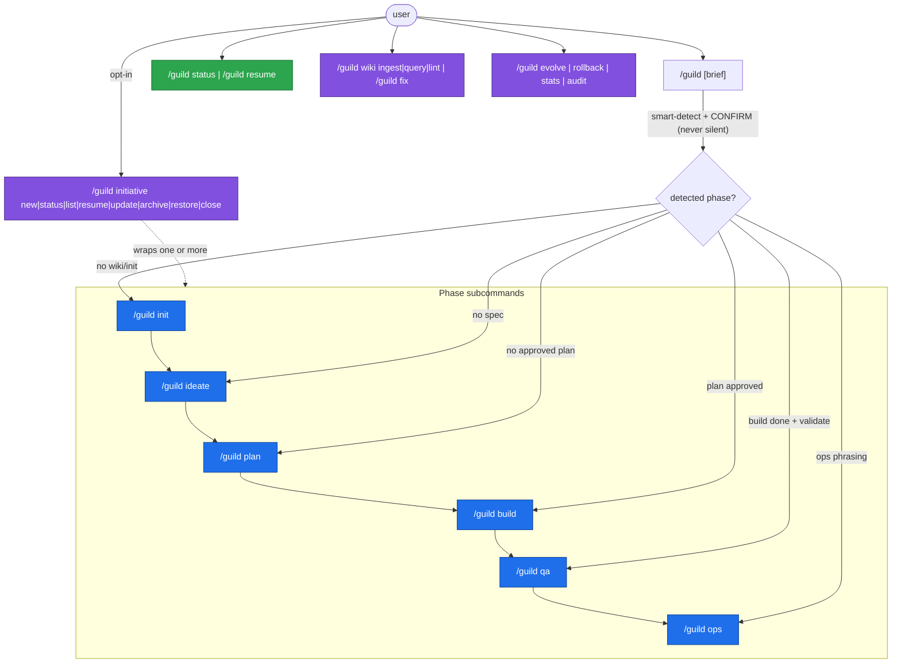

# Guild v2 Command Surface (clean-slate spec)

This is the authoritative, implementation-ready specification of the Guild v2
command surface. It is a **design spec doc** — it describes the target surface;
it does not implement it and does not edit any file under `plugin/`. The
shipped command markdown under `plugin/commands/` is authored separately from
this contract.

Binding rules this surface honors: full clean-slate command break,
initiatives opt-in, interactive-by-default, Claude+Codex co-equal
hosts, a dedicated `MIGRATION.md`, the canonical grammar, and the
command→phase map (D-14). The Operations-phase **command verb is `ops`**; the
*phase concept name* stays "Operations" in lifecycle prose. `--rigor=deep`
auto-implies `--review=cross` with the expanded profile printed before the
first gate.

## What this supersedes (recorded in prose only)

This document supersedes **`guild-plan.md §13.1`** — the v1 canonical
command table — and the entire **`/guild:` colon-namespace**.
`guild-plan.md` is the **frozen v1 record**; it carries a conceptual
`supersedes:` pointer to this doc set. **This pointer is recorded here in prose
only — this doc set does not
edit `guild-plan.md` or any other file under `plugin/`.** Where the
frozen v1 plan and this v2 spec disagree, this v2 spec plus the more-specific
checked-in artifacts win. The v1 `§13.1` table also omitted `/guild:diagnose`
(a shipped-but-undocumented drift); the clean-slate redesign here closes that
drift by mapping `/guild:diagnose` → `/guild fix` (see
[MIGRATION.md](../MIGRATION.md)).

## The one mental model

**One verb `guild`. Phases are subcommands. Everything else is a small noun
or a maintenance verb. No `:` colon namespace.** Five global flags + a
universal `--dry-run` + a handful of scoped per-command locals, all with sane
defaults, with the tuning knobs hidden behind a single `--rigor` profile for
the 95% case.

This is the command-layer expression of the v2 framing: *one state machine,
six phase entrypoints, three lenses (linear / phase / initiative)*.

---

## 1. Naming grammar (the contract)

> **SUPERSEDED (grammar) — see
> [`decisions/v2x-command-surface-dispatch-and-internalization.md`](../decisions/v2x-command-surface-dispatch-and-internalization.md)
> D1.** Commands are colon-form **`/guild:<verb>`** (the `:` plugin namespace is
> a Claude Code requirement), **not** `/guild <verb>` space — the bare-`/guild`
> spike confirmed Claude Code commands are always colon-namespaced and a bare
> `/guild` is not a command (the entry is `/guild:guild`). v2 drops only the
> **redundant `guild-` command prefix** (v1 `/guild:guild-wiki` → v2
> `/guild:wiki`), never the colon. Ruling #1 below ("No colon namespace … `/guild
> <subcommand>` (space)") is the corrected item; the tiered-palette, no-nested-
> namespace, sub-verbs-as-arguments intent of this section otherwise stands.

```
/guild <phase | noun | maintenance-verb> [positional] [--flags]
```

- **Phase subcommands** (verbs): `init ideate plan build qa ops`. These map
  1:1 to the six lifecycle phases (Init, Ideation, Planning, Development,
  Quality, Operations).
- **Lifecycle helpers**: `status resume` — no phase; act on the active run.
- **Nouns with sub-verbs**: `wiki <ingest|query|lint>`,
  `initiative <new|status|list|resume|update|archive|restore|close>`. Nouns
  are durable subsystems. For `initiative`, `new|status|resume|update|close`
  are the primary user-facing lifecycle sub-verbs and `list|archive|restore`
  are operational sub-verbs on the same noun (full set enumerated in
  [`../initiatives/initiative-and-phase-workflows.md`](../initiatives/initiative-and-phase-workflows.md)).
- **Maintenance verbs**: `evolve rollback stats audit fix` — Guild-on-Guild,
  rarely run by an end user mid-task.
- **Bare**: `/guild [brief]` → smart phase detection (always surfaced and
  gated, never silent; see §5.1).

**The single rule a user needs:** a token is a phase IFF it produces or
advances a phase artifact. Everything else is a noun or a maintenance verb.

**Canonical token set (these are the canonical verbs; `initiative`'s
`list|archive|restore` are operational sub-verbs on the same noun, enumerated
in [`../initiatives/initiative-and-phase-workflows.md`](../initiatives/initiative-and-phase-workflows.md)):**

| Class | Tokens | Maps to |
|---|---|---|
| Phase subcommands | `init` `ideate` `plan` `build` `qa` `ops` | the six lifecycle phases (Init, Ideation, Planning, Development, Quality, Operations) |
| Lifecycle helpers | `status` `resume` | orchestrator read / continue |
| Nouns (sub-verbed) | `wiki <ingest\|query\|lint>` `initiative <new\|status\|list\|resume\|update\|archive\|restore\|close>` | durable subsystems |
| Maintenance verbs | `evolve` `rollback` `stats` `audit` `fix` `migrate` | Guild-on-Guild |
| Bare | `/guild [brief]` | smart phase detection, always surfaced + gated |

Frozen grammar rulings (apply everywhere):

1. **No colon namespace.** Every command is `/guild <subcommand>` (space).
   The `/guild:*` form is removed in v2. One migration, done inside the
   clean-slate break.
2. **Operations verb = `ops`** (phase concept name "Operations").
3. **Development verb = `build`** (phase concept name "Development").
4. **Quality verb = `qa`** (phase concept name "Quality").
5. **Diagnose → `fix`.** The `guild:diagnose` skill is retained internally;
   the command is `/guild fix`. Closes the §13.1 drift.
6. **`/guild:team` is removed** (no direct replacement). Team-compose is a
   sub-step inside `/guild plan`; inspection via `/guild status`; edits via
   the `[edit]` response at the plan/team approval gate; `--allow-larger` →
   `/guild plan --team-size=N`.
7. **Linear-vs-phase disambiguation:** `/guild [brief]` with no recognized
   subcommand token = the linear smart-detect path. A leading token that
   exactly matches a phase/noun/maintenance token IS that subcommand. There
   is no separate `/guild run` form; the bare-brief form IS the linear lens,
   disambiguated because phase tokens are a closed reserved set and a brief
   is quoted/free text. Detection output is always surfaced and gated.
8. **Flags:** five recommended global flags + `--dry-run` + per-command locals
   (§4), plus three power-user flags. `--loops/--loop-cap/--codex-cap` remain
   **supported** (parsed by the CLI — the `read-guild-config.ts` arg-parse switch for `--loops`/`--loop-cap`/`--codex-cap`);
   `--rigor={quick|standard|deep}` + `.guild/settings.json` is the recommended
   path and expands to the same knobs. `--codex-review` →
   `--review={local|cross|off}`.
   Precedence: the **7-source chain** `built-in < workspace < workspace-local <
   project < project-local < rigor < CLI` (canonical in §4.4).

---

## 2. The surface at a glance (tiered)

The surface is **tiered** so discoverability is managed by tiering, not by
count. The SessionStart bootstrap shows only the 3-daily tier.

The SessionStart bootstrap note also states the new-repo entrypoint
explicitly: **first run on a fresh repo → `/guild` proposes `/guild init`**
(Init is the mandatory first phase; smart-detect surfaces it — §5.1 — so it
is discoverable without being a standing fourth daily-tier item).

```
DAILY (3 — shown in SessionStart bootstrap; plus the new-repo hint:
         "first run on a new repo → /guild proposes /guild init"):
  /guild [brief]                  run from the right phase, auto-detected
  /guild status                   where am I, what's next, resume hint
  /guild wiki <ingest|query|lint> project knowledge

PHASE (6 — the power path, one verb per lifecycle phase):
  /guild init                     phase: Init        (onboard repo / new product)
  /guild ideate [brief]           phase: Ideation    (spec)
  /guild plan                     phase: Planning    (PRD + lanes + team)
  /guild build [lane-id]          phase: Development (execute lanes)
  /guild qa [run-id]              phase: Quality     [v2] full guild:quality skill — auto-selects + executes E2E/smoke/a11y/perf/integration, release/blocker gate
  /guild ops [runbook]            phase: Operations  [v2] full guild:operations skill — executes release/monitoring/incident/rollback/maintenance runbooks under split autonomy + safety rails

LIFECYCLE HELPERS:
  /guild resume                   continue the active run from the next gate

MAINTENANCE (Guild-on-Guild):
  /guild fix [run-id|"symptom"]   (was /guild:diagnose)
  /guild evolve [<id>] [--auto] [--to-template=vN]
  /guild rollback <skill> [n]
  /guild stats
  /guild audit
  /guild migrate [--root=<path>] [--mode=migrate|dry-run|skip] [--workspace]

DURABLE WORK (opt-in):
  /guild initiative <new|status|list|resume|update|archive|restore|close> …

GLOBAL FLAGS (progressive disclosure — see §4):
  --auto-approve[=spec,plan,build,all]   opt-in; default interactive
  --review=local|cross|off               cross = Claude↔Codex broker
  --host=claude|codex|auto               host adapter selection
  --rigor=quick|standard|deep            profile → expands to loop/cap/review
  --initiative=<id|new>                  attach this run to an initiative
  --dry-run                              print the phase plan, change nothing
```

---

## 3. Full command spec

Legend — Interaction: **I** = interactive gate (the default), **A** =
autonomous within an approved contract, **R** = read-only. Defaults shown are
the out-of-the-box (no-flag, no-config) behavior.

### 3.1 Lifecycle — primary tier

| Command | What you type | Drives (phase / component) | Args | Local flags | Gates (default) | Output artifact |
|---|---|---|---|---|---|---|
| `/guild` | `/guild "add OAuth login"` | Smart-detect phase → run from there to a phase boundary | `[brief]` (optional) | all global (§4) | Detect-phase confirm **I**, then per-phase gates | depends on detected phase |
| `/guild init` | `/guild init` | **Init** — onboard existing repo or scaffold new-product knowledge; builds wiki + (brownfield) knowledge-graph index | — | `--deep-scan` (else ask-before-deep-scan gate), `--new` (force new-product path) | Ask-before-deep-scan **I**; new-product Q&A **I**; G-init review **A** | `.guild/init/<slug>.md`, `.guild/wiki/**`, `.guild/raw/**`, (brownfield) `.guild/indexes/codebase-map.json`, `knowledge-graph.json`, `wiki/concepts/architecture-map.md` |
| `/guild ideate` | `/guild ideate "realtime presence"` | **Ideation** — Socratic spec; opt-in `--rigor=deep` runs the clarify loop | `[brief]` | `--skip` (validate a supplied spec instead of asking) | Spec-approval **I**; G-ideation review **A** | `.guild/spec/<idea-slug>.md`, optional `.guild/research/<idea-slug>.md` |
| `/guild plan` | `/guild plan` | **Planning** — team-compose + PRD + per-specialist lane plan + autonomy contract | — | `--team-size=N` (cap-6 override; `>6` prints the §7.2 warning) | Team-approval **I**; plan/PRD-approval **I**; G-planning review **A** | `.guild/prd/<slug>.md`, `.guild/plan/<slug>.md`, `.guild/team/<slug>.yaml` |
| `/guild build` | `/guild build` | **Development** — context-assemble + dispatch lanes (backend resolved at run intake from the settings snapshot via the D5 ladder: tmux/team primary when available, else agent, else subagent) | `[lane-id]` (re-run one lane) | — | Autonomy contract (set at plan approval) **A**; destructive/network ops **I always** | `.guild/runs/<run-id>/handoffs/*.md`, `assumptions.md`, changed files |
| `/guild qa` `[v2]` | `/guild qa` | **Quality** — full `guild:quality` skill: auto-selects E2E/smoke/a11y/perf/integration from `CodebaseMap` + plan signals (the selection matrix is **surfaced before execution as `[proceed] / [edit-selection] / [explain-signals]` and is overridable, never silent** — there is no `--classes=` flag), executes the discovered harnesses under the run sandbox + budgets, `qa-test-strategy` producer vs `security+architect` G-quality challenger; opt-in phase, never auto-entered | `[run-id]` | — | release/blocker gate **I**; G-quality review **A** | `.guild/runs/<run-id>/quality/<run-id>.md` (frozen `guild.quality.v1`; evidence under `quality/evidence/`) |
| `/guild ops` `[v2]` | `/guild ops` | **Operations** — full `guild:operations` skill: five runbook classes (release / monitoring / incident / rollback / maintenance) selected by the positional `[runbook]` else by **surfaced detection (always confirmed, overridable)**, under a split autonomy posture + four non-negotiable safety rails (incident/rollback never autonomous; first run always interactive; always-ask hard set unconditional; mandatory pre-flight dry-run); `devops-*` producer vs `security+architect` G-operations challenger; consumes Quality, feeds the D8 release leg | `[runbook]` | — | risky/destructive **I always**; G-operations review **A** | `.guild/runs/<run-id>/ops/<run-id>.md` (frozen `guild.ops.v1`; + `guild.incident.v1` / `guild.release.v1` records by class) |

All phase commands also accept the five global flags (§4) and `--dry-run`.

**Workspace behavior (`init` / `learn`).** On a **workspace** root (a
monorepo-of-repos — ≥1 immediate child has a nested `.git/` or `.guild/`),
`/guild:init` and `/guild:learn` take a federation branch: they **detect** the
repo kind (depth fixed at 1 — no nesting, no `max_depth`), **check children
first**, register the detected sub-guilds, and write a federation manifest
(`.guild/workspace.json`, `guild.workspace.v1`) rather than scanning the union
of sub-repos as one repo. `/guild:init` additionally **offers** (never
auto-runs) a `/guild:init` on any detected sub-project that has no `.guild/`
yet, and builds a root wiki only when the workspace root itself has scannable
top-level code. A **regular** repo is unchanged (zero-cost cheap-scan). The
classification is **surfaced and overridable** via the `workspace.mode:
auto|on|off` setting (§4.4). Canonical model + schema:
[`../decisions/workspace-aware-init-and-federation.md`](../decisions/workspace-aware-init-and-federation.md)
(bound by pointer, never re-spelled).

### 3.2 Lifecycle helpers

| Command | What you type | Drives | Gates | Output |
|---|---|---|---|---|
| `/guild status` | `/guild status [--no-index]` | Orchestrator — read current run state, furthest phase, next gate, blockers (`--no-index` = per-invocation bypass of the optional read-through cache, forcing a one-shot filesystem scan) | none **R** | prints state (no file) |
| `/guild resume` | `/guild resume [--no-index]` | Orchestrator — continue active run from the next pending gate (`--no-index` = per-invocation filesystem-scan bypass of the optional cache) | resumes at next **I** gate | continues phase artifacts |

`/guild resume --restart` clears run state and re-runs from Init/Ideation
(confirm-before-clear **I**). This replaces the v1 `--restart` first-word
hack in `$ARGUMENTS`.

### 3.3 Knowledge & repair

| Command | What you type | Maps to skill | Gates | Output |
|---|---|---|---|---|
| `/guild wiki ingest` | `/guild wiki ingest docs/standards.md` | `guild:wiki-ingest` | none (ingest is data, not instructions) **A** | `.guild/wiki/**`, `.guild/raw/sources/**` |
| `/guild wiki query` | `/guild wiki query "auth flow" --confidence high` | `guild:wiki-query` | **R** | ranked results (no file) |
| `/guild wiki lint` | `/guild wiki lint` | `guild:wiki-lint` | **R** (never auto-edits) | `.guild/wiki/lint-<ts>.md` |
| `/guild fix` | `/guild fix run-2026-05-17-ab12 "hooks not firing"` | `guild:diagnose` | explicit edit-approval **I**; `--review` for cross-host | `.guild/` diagnosis + fix-plan |

**Federated `wiki query` (workspace).** On a workspace root carrying a
`.guild/workspace.json`, `/guild:wiki query` **fans out** across the registered
sub-guilds — iterating each `has_wiki` entry via the existing `guild-memory`
MCP `cwd` / `GUILD_MEMORY_WIKI_ROOT` per-call override, merging the hits, and
**tagging each result with its source sub-guild**. A query naming one sub-guild
scopes to it. Fan-out is read-only recall (no new MCP, no index copy-up); the
same fan-out is reused by `context-assemble`'s kg-query step. Recipe + schema:
[`../decisions/workspace-aware-init-and-federation.md`](../decisions/workspace-aware-init-and-federation.md).

### 3.4 Durable work — opt-in

| Command | What you type | Drives | Gates | Output |
|---|---|---|---|---|
| `/guild initiative new` | `/guild initiative new "billing-v2"` | Initiative layer — create a durable goal container | definition-ready gate **I** | `.guild/initiatives/active/<id>/initiative.yaml`, definition-ledger |
| `/guild initiative status` | `/guild initiative status billing-v2` | Read initiative progress, work-items, release/doc-sync state | **R** | prints state |
| `/guild initiative list` | `/guild initiative list` | List all initiatives (active + archived) with cross-cut rollup from the derived registry | **R** | prints state |
| `/guild initiative resume` | `/guild initiative resume billing-v2` | Re-enter the initiative at its next work-item | next gate **I** | continues initiative runs |
| `/guild initiative update` | `/guild initiative update billing-v2 --add-goal "…"` | Amend the definition-ledger | ledger-change confirm **I** | updated ledger |
| `/guild initiative archive` | `/guild initiative archive billing-v2` | Move an initiative to archived without the close-gate release path (operational) | archive confirm **I** | `.guild/initiatives/active/<id>/` → archived |
| `/guild initiative restore` | `/guild initiative restore billing-v2` | Restore an archived initiative to active (operational) | restore confirm **I** | archived → `.guild/initiatives/active/<id>/` |
| `/guild initiative close` | `/guild initiative close billing-v2` | Close — requires release evidence + doc-sync reconciliation (D8) | release-readiness + doc-sync gate **I** | `.guild/initiatives/active/<id>/release/**` → archived |

**Initiative-attachment binding:** a one-off `/guild` run does **not** create an initiative. An
initiative is attached only when (a) the user runs `/guild initiative …`
explicitly, (b) `--initiative=<id|new>` is passed, or (c) the brief contains a
durable-goal signal ("ongoing", "over the next quarter", "continue the prior
X work") — in which case `/guild` *asks* "attach to an initiative? [new /
existing / one-off]" rather than auto-attaching. One-off runs are first-class.

### 3.5 Self-maintenance (Guild-on-Guild)

| Command | What you type | Maps to skill | Gates | Output |
|---|---|---|---|---|
| `/guild evolve` | `/guild evolve guild-brainstorm` · `/guild evolve <id> --to-template=vN` | `guild:evolve-skill` | promotion gate **I** (manual) / **A** (`--auto`, gate-respected) | `.guild/evolve/<run-id>/**`, version bump on promote |
| `/guild rollback` | `/guild rollback guild-brainstorm 2` | `guild:rollback-skill` | confirm past v1 **I** | `.guild/skill-versions/<skill>/v<N+1>/` |
| `/guild stats` | `/guild stats [--rebuild-index] [--no-index]` | telemetry read | **R** (never writes; `--rebuild-index` drops + rebuilds the optional cache, `--no-index` forces a one-shot filesystem scan) | prints dashboard |
| `/guild audit` | `/guild audit` | `guild:audit` | **R** static analysis | `.guild/audit/<date>.md` (incl. the **boundary-check** section — see below) |
| `/guild migrate` | `/guild migrate [--root=<path>] [--mode=migrate\|dry-run\|skip] [--workspace]` | `scripts/dot-guild/migrate-guild.ts` CLI | **I** (migrate mode); **R** (dry-run / skip) | stdout summary + optional `.guild-snapshots/` snapshot; write report |

`/guild audit` gains a static **boundary-check** section in
`.guild/audit/<date>.md`: it scans for any Guild-owned-file signature
(frontmatter `type:`, a `schema_version: guild.*` marker, or a
`task_run`-declared artifact kind) written **outside** the consuming repo's
`.guild/` (including any runtime write into the plugin install dir) and flags
each as a boundary violation. This is the static belt to the PreToolUse guard's
runtime suspenders; both reuse existing surfaces and add no new gate.

**Canonical `/guild evolve` spec.** The grammar is:

```
/guild evolve [<id>] [--auto] [--to-template=vN]
```

- **`<id>` (positional, optional)** — the skill or evolvable instance to
  evolve (e.g. `guild-brainstorm`, or a project-authored skill/agent
  instance id). This is the **same single positional** the legacy
  `[skill]` form named; it is **widened, not duplicated** — `<id>` covers
  both a base skill name and an instance id. Omitted ⇒ evolve-skill picks
  the next eligible target from the reflection backlog (unchanged
  behavior).
- **`--auto`** — run the promotion pipeline unattended; the promotion gate
  is still respected (gate criteria must pass with no regression),
  unchanged.
- **`--to-template=vN`** — the **lazy template-migration trigger**
  (`[v2]`). Migrating an instance to template version `vN` is performed
  *lazily* — either when the instance is next evolved, or **explicitly via
  `/guild evolve <id> --to-template=vN`**. With `--to-template=vN` set,
  `<id>` is **required** (the instance to migrate) and the run is a
  template-migration evolve to the named template version rather than a
  reflection-driven tune. `vN` is the integer template version
  (`v1`, `v2`, …). Clean-slate grammar: space-separated, no colon
  namespace, value-form `--to-template=vN`.

This makes the template-migration trigger named elsewhere a real,
documented command surface.

`/guild team` is **not a command**. Team composition is strictly a step
*inside* `/guild plan` with its own approval gate, plus inspection via
`/guild status` and edits via the plan-approval `[edit]` response. Migration
in [MIGRATION.md](../MIGRATION.md).

---

## 4. Flags (progressive disclosure)

### 4.1 Flag changes from v1

| v1 flag | v2 fate |
|---|---|
| `--loops=<none\|spec\|plan\|implementation\|all\|csv>` | **Supported (power-user flag).** Parsed by the CLI (the `--loops` case in `read-guild-config.ts`'s arg-parse switch); `--rigor` profiles are the recommended path and set the same knob. Also configurable in `.guild/settings.json` (`loops:` key). |
| `--loop-cap=N` | **Supported (power-user flag).** Parsed by the CLI (the `--loop-cap` case in `read-guild-config.ts`'s arg-parse switch, clamped 1–256); also the `loop_cap:` config key. `--rigor` is the recommended path. |
| `--codex-review` | **Replaced** by `--review=local\|cross\|off`. `cross` = Codex / cross-host broker. |
| `--codex-cap=N` | **Supported (power-user flag).** Parsed by the CLI (the `--codex-cap` case in `read-guild-config.ts`'s arg-parse switch, clamped 1–10); also the `codex_cap:` config key. `--rigor` is the recommended path. |
| `--auto-approve=<none\|spec-and-plan\|implementation\|all>` | **Kept, simplified** → `--auto-approve[=spec,plan,build,all]` (comma-list of phases; bare = `all`). |
| `--restart` (first word of `$ARGUMENTS`) | **Replaced** by `/guild resume --restart`. |
| `--allow-larger` (on `/guild:team`) | **Replaced** by `--team-size=N` on `/guild plan`. |

### 4.2 The five surviving global flags

| Flag | Values | Default | Purpose |
|---|---|---|---|
| `--auto-approve` | `[spec,plan,build,all]` (csv; bare=`all`) | off (interactive) | Opt-in autonomy. Destructive/network ops STILL ask even with `all`. |
| `--review` | `local \| cross \| off` | `local` | `cross` engages the Claude↔Codex reciprocal review broker (policy-gated per D7). `off` for trusted fast loops. |
| `--host` | `claude \| codex \| auto` | `auto` | Host-adapter selection (co-equal hosts). `auto` = originating host executes; cross-host only when `--review=cross` or policy. |
| `--rigor` | `quick \| standard \| deep` | `standard` | **The profile knob (recommended path).** Expands to loops/caps/review depth (§4.3). Supersedes the v1 flag-soup default; the `--loops`/`--loop-cap`/`--codex-cap` knobs remain supported for power users (§4.1). |
| `--initiative` | `<id> \| new` | unset (one-off) | Attach this run to a durable initiative. |

Plus `--dry-run` (universal: print the phase plan + gates that *would* run,
write nothing) and the per-command locals in §3 (`--deep-scan`, `--new`,
`--skip`, `--team-size`, `--restart`).

### 4.3 `--rigor` profile expansion (the anti-soup mechanism)

| `--rigor` | loops | loop_cap | review | Use when |
|---|---|---|---|---|
| `quick` | none | — | `off` | Trusted small change; fastest path. |
| `standard` (default) | spec+plan adversarial only | 16 | `local` | Normal work. Matches today's safe default. |
| `deep` | all (spec+plan+implementation L3/L4/security) | 16 | `cross` (if host available, else `local` + weak-independence note per D7) | High-risk, security-sensitive, or "be paranoid" runs. |

Most users never type `--loops` or `--codex-cap` — they type one of three
words. The flags remain **supported** for power users who need exact knobs
(parsed by the CLI — the `read-guild-config.ts` arg-parse switch for `--loops`/`--loop-cap`/`--codex-cap`), and the same knobs can be
set in `.guild/settings.json`; both override the profile. Full precedence is the **7-source chain**
(least → most authoritative): **built-in < workspace `settings.json` <
workspace `settings.local.json` < project `settings.json` < project
`settings.local.json` < `--rigor` profile < CLI flags** (canonical in §4.4).

For `loops`, `loop_cap`, and `review` specifically: an explicit value set in any
settings layer beats a rigor-derived value for that key. The per-key source map
from `resolveSettings()` (see §4.4) records which layer won for each key.

**`deep` auto-implies `cross`, profile printed before the first gate.**
`--rigor=deep` automatically implies `--review=cross`; no separate explicit
flag is required. To keep this from being a hidden mode, the expanded profile
is **always printed before the first gate**:

```
rigor=deep → loops=all (spec+plan+L3/L4/security), review=cross via Codex, cap=16
proceed? [y / edit]
```

With `--auto-approve` containing that phase, the line is printed but does not
block. The expansion is always visible. If Codex / the cross-host is
unavailable, `deep` falls back to `local` review and prints a
weak-independence note (per D7) — it never hard-blocks on a host outage.

### 4.4 `.guild/settings.json` v2 schema

> **SUPERSEDED (file/format only) — see
> [`decisions/config-surface-settings-json.md`](../decisions/config-surface-settings-json.md).**
> The single config file is **`.guild/settings.json` (JSON)**, replacing the
> original `.guild/config.yml` (YAML). The **key set, defaults, precedence
> ladder, and reject rules below are unchanged** — only the file name and
> serialization changed. JSON has no comments, so the scaffolder embeds a
> top-level `"_help"` block (keys prefixed `_` are reader-ignored
> annotations). **The `.guild/config.yml` runtime reader was removed in v2.0** —
> `config.yml` is never read at runtime; a v1 `config.yml` is converted to
> `settings.json` by the on-open converter (`/guild:migrate`). Scaffold /
> inspect / check with `/guild config <init|show|validate>`. The YAML example
> below is retained as the readable key-set reference; the shipped file is the
> JSON equivalent.

#### Settings inheritance chain (settings-control-and-tmux — shipped 2026-06-01)

In a workspace layout, settings resolve through a **7-source chain** (5 settings
files/profile layers between `built-in` and `CLI`) implemented by
`plugin/scripts/lib/settings-resolver.ts`. All runtime consumers use
`resolveSettings()` — direct slice reads of `.guild/settings.json` are removed.

```
built-in defaults
  < workspace .guild/settings.json
  < workspace .guild/settings.local.json   (local-only, gitignored)
  < project .guild/settings.json
  < project .guild/settings.local.json     (local-only, gitignored)
  < rigor-profile expansion
  < CLI flags
```

A **per-key source map** tags every resolved key with its layer:
`builtin | workspace | workspace-local | project | project-local | rigor | cli`.

`config show --sources` renders this map. `config set <key> <val> --scope
workspace|project|local` writes to the correct layer.

**Non-inheritable keys:** `workspace.mode` (root-detection-only, never
propagated to children — unconditional). `initiative_default` is
**conditionally** non-inheriting: it inherits workspace→child **only when the
workspace's `initiative_default` names an initiative that is `scope:workspace`**
(resolved by `initiativeIsWorkspaceScoped` — registry lookup, then fallback to
the initiative's `initiative.yaml`); otherwise a child resolves its own
`initiative_default` or the built-in `null`, so child runs are never silently
attached to a project-scoped parent initiative. All other keys inherit from
workspace to child. *(This is the OD-1 "inherit only when workspace-scoped"
exception — shipped in FU-3; the id is path-traversal-validated and the lookup
fails closed to non-inheriting on any invalid/missing/malformed input.)*

**Deep-merge, not replace.** Nested blocks (`defaults.*`, `models.*`) are deep-merged
across layers. A child project that sets only `defaults.team.size` does not
discard the workspace-level `defaults.quality.budget`.

For a workspace root command (cwd == workspace root), the workspace and project
layers point to the same file and the chain collapses to
`built-in < settings < local < rigor < CLI`.

#### `config` subcommands (U2 — shipped 2026-06-01)

```bash
# Set a key at the given scope (HARD-SET write — always-asks under auto-approve)
/guild config set <key> <value> --scope workspace|project|local

# Show all resolved keys annotated with their source layer
/guild config show --sources

# Validate the effective resolved config
/guild config validate --effective
```

The shipped `config-cmd.ts` subcommand set is exactly `set | show | validate`.
`set` uses read-modify-write with dotted key-path resolution (never clobbers
unrelated keys, never destroys `_help` annotations, throws on malformed JSON).
`show --sources` renders the normalized clean view (briefing §5 display shape)
mapped onto the current schema — no schema migration, display only.

> **`config providers detect` is a planned followup — NOT in this rollout.** The
> provider-detection library (`plugin/scripts/lib/provider-detect.ts`) ships, but
> it is invoked only by the run-start preflight (U3), not as a `config`
> subcommand. A standalone `config providers detect` CLI was deferred and is not
> wired.

#### Provider detection summary (U4 — shipped 2026-06-01)

At run-start preflight, the author host and available review providers are
detected via `plugin/scripts/lib/provider-detect.ts` (called by the preflight,
not by a `config` subcommand). See
`docs/knowledge/adversarial-review/cross-host-review-and-loop-control.md`
§"Provider Detection and Selection" for the full selection policy and
same-family degradation rules. The communication contract (`review_result.v1`,
packet/result/trail paths) is **unchanged** regardless of which provider is
selected.

---

There is **ONE config file**, `.guild/settings.json`. The Tier-1 keys below are
unchanged from v2. An **optional, closed-key-set** top-level `defaults:` block
(Tier-2) covers the 8 project-config default-behavior dimensions; **an absent
`defaults:` block is byte-identically the current v2 behavior** (zero-config DX
preserved — no new required state).

```yaml
# Guild v2 project config. 7-source chain: built-in < workspace < workspace-local < project < project-local < rigor < CLI (canonical in §4.4).
rigor: standard            # quick | standard | deep
auto_approve: []           # csv: [] | [spec,plan,build] | [all]
review: local              # local | cross | off
host: auto                 # claude | codex | auto
initiative_default: null   # null | <initiative-id>  (initiatives stay opt-in)
index: auto                # auto | off  (optional SQLite read-through cache;
                           #   auto = lazy-build only past measured slowness (≥250 ms),
                           #   off = always filesystem-scan, never creates the file)
workspace:                 # workspace federation (init/learn) — see the federation ADR
  mode: auto               #   auto | on | off  (auto = classify by the depth-1 child rule;
                           #   on = force workspace; off = force regular). NO max_depth — depth is hard-fixed at 1.

# Power-user overrides (escape hatch — usually leave unset, let rigor decide)
loops: null                # null = derive from rigor; or none|spec|plan|implementation|all|csv
loop_cap: 16
codex_cap: 5

# Tier-2 — OPTIONAL closed-key default-behavior block. Absent ⇒ current v2.
# Closed key set: unknown keys are REJECTED at Session Intake (not lenient here —
# config is human-authored, a typo must surface, never silently ignored).
defaults:
  adversarial: on              # on | off           (off REJECTED for Guild self-build)
  team:                        #                    (default team-composition shape)
    size: null                 # null = 3–4 rule  | <int> (cap-6 unless overridden)
    always_include: []         # [] | subset of the registered specialists
  review_workflow: standard    # standard | cross | minimal  (default review depth)
  skill_policy: standard       # standard | conservative     (default skill-usage)
  gates:                       #                    (default approval-gate posture)
    auto_approve: []           # csv: [] | [spec,plan,build] | [all]  (never qa/ops)
  wiki:
    share_mode: team           # team | private  (MOVED here from project.yaml — see split rule)
    autopromote: false         # false ALWAYS (true REJECTED always — agents emit candidates only)
  quality:                     #                    (Quality-phase wall-clock budgets — the [v2] guild:quality skill)
    budget:
      per_class_minutes: 10    # int > 0 — per-check-class wall-clock cap; on exhaustion the class is recorded `inconclusive: budget exhausted`, never silently passed
      total_minutes: 30        # int > 0 — whole-phase wall-clock cap across all selected classes
  reporting: standard          # standard | quiet | verbose  (default task/progress reporting)
```

**`workspace.mode`** is a top-level Tier-1 key (`auto|on|off`, default `auto`)
that overrides workspace classification for `init`/`learn` (§3.1): `on` forces
the federation branch, `off` forces regular cheap-scan, `auto` applies the
depth-1 child rule. There is **no `workspace.max_depth` key** — depth is
hard-fixed at 1; an unknown `workspace.*` key is rejected by the closed-key
`config validate` check. Canonical body:
[`../decisions/workspace-aware-init-and-federation.md`](../decisions/workspace-aware-init-and-federation.md).

**`quality.budget` is the single canonical source for the Quality-phase
wall-clock caps** (`[v2]`). It lives in the closed-key Tier-2 `defaults:`
block at `defaults.quality.budget` (it is *behavior*, not identity, so it is
here and never in `project.yaml`). **Canonical defaults: `per_class_minutes: 10`,
`total_minutes: 30`.** An **absent `defaults:` (or absent `defaults.quality`)
block ⇒ those exact built-in defaults apply, unchanged** — zero-config DX
preserved, the budget is documented-default behavior with no required config.
Because `defaults:` is a closed key set, the validator now *accepts*
`defaults.quality.budget.per_class_minutes` / `.total_minutes` (they are
in-set) and still rejects any other unknown `quality.*` key at Session Intake.
The lifecycle Quality phase consumes these values **by pointer** and does not
re-state the numbers.

**`settings.json` vs `project.yaml` split rule (normative).** `project.yaml` is
**identity-only** (project name, slug, label_taxonomy closed sets, initiative
identity). `settings.json` holds **all behavior**. `share_mode` is a *behavior*,
not identity, so it lives at `settings.json → defaults.wiki.share_mode` and **no
longer lives in `project.yaml`**.

**Precedence ladder (extended, normative):** the **7-source chain**
`built-in < workspace < workspace-local < project < project-local < rigor < CLI`
(canonical in §4.4). Each set Tier-2 key is folded at Session
Intake and printed in the existing pre-first-gate profile line; an invalid /
unknown `defaults:` key is rejected at intake; `defaults.adversarial: off` is
rejected for Guild self-build; `defaults.wiki.autopromote: true` is rejected
always.

Migration of an existing v1 `config.yml` is mechanical and documented in
[MIGRATION.md](../MIGRATION.md) §3 (old
`loops/loop_cap/auto_approve/codex_review/codex_cap` → new keys; the on-open
converter / `/guild:migrate` rewrites a v1 `config.yml` to `settings.json` —
the runtime `config.yml` reader was removed in v2.0; the new `defaults:` block
is fully optional — an existing config with no `defaults:` is unchanged).

**`models:` block (cost-aware tiering — additive, zero-config stable).** An
optional top-level closed-key `models:` block enables cost-aware model
tiering (host-agnostic `cheap|mid|powerful` ladder, auto-score, advisor
escalation, recall-before-read, and the `guild.handoff.v2` envelope).
Absent block ⇒ current v2 behavior except cheaper `learn-*` (the built-in
tier-map already biases cheap). The CLI escape hatch
`--model-tier=cheap|mid|powerful` pins the tier for a run (top of the
precedence ladder: `--model-tier` > per-lane override > `models:` block >
built-in default). **Canonical specification: `decisions/cost-aware-tiering-and-lean-context.md §10`
(config keys) and §1–§6 (tier ladder, auto-score, advisor, recall, handoff
schema, §task§agent lifecycle) — not re-spelled here.**

| Key | Allowed values | Default | Meaning |
|---|---|---|---|
| `models.enabled` | bool | `true` | Master toggle for cost-tiering. |
| `models.tiers` | `{cheap,mid,powerful}: {claude,codex,gemini}` | §1 map (haiku/sonnet/opus) | Host-agnostic tier→model map. |
| `models.scoreWeights` | object (signal→int) | §2 rubric | Auto-score signal weights (tunable; ship fixed). |
| `models.thresholds` | `{mid:int, powerful:int}` | `{mid:1, powerful:3}` | Score-band cutoffs. |
| `models.advisorRounds` | int > 0 | `2` | Advisor consults per lane. |
| `models.escalationMarkers` | string[] | research defaults | Uncertainty phrases that trigger advisor escalation. |
| `models.recallBeforeRead` | bool | `true` | Enforce recall-before-read discipline. |
| `models.recallScoreThreshold` | float 0–1 | `0.4` | Min recall score to skip a full file read. |
| `models.structuredOutputRequired` | bool | `true` | Reject non-`guild.handoff.v2` returns (lint). |
| `models.cacheTTL.coordinator` | `"1h"\|"5m"\|off` | `"1h"` | Coordinator cache TTL hint. |
| `models.cacheTTL.leaf` | `"1h"\|"5m"\|off` | `"5m"` | Leaf-agent cache TTL hint. |
| `models.importanceGate` | int 1–5 | `3` | Min wiki importance for routine recall. |

The `models:` block follows the same closed-key, validated,
`_help`-scaffolded regime as the rest of `settings.json`; unknown keys are
rejected at Session Intake. `/guild config init` scaffolds the block.
Tiering is **orthogonal** to the D5 `agent_mode` backend ladder — it
composes with it, never replaces it.

**Security, secrets-policy, MCP, and index keys (v2.0 foundational ADRs — additive, closed-key, zero-config stable).**
Four new top-level blocks and six `defaults.index.*` sub-keys introduced by the
v2.0 security and persistence ADRs. Absent block ⇒ built-in defaults (zero-config
preserved). Unknown sub-keys are rejected at `--validate` time (closed-key regime).
Canonical specifications: `decisions/v2-security-and-untrusted-content.md` (D-BYPASS,
D-SECRETS, D-MCP, D-INGEST-GATE) and `decisions/v2-persistence-and-sqlite-index.md`
(D-PS-1).

**`security:` block (D-BYPASS — `bypassPermissions` governance).**

| Key | Allowed values | Default | Meaning |
|---|---|---|---|
| `security.bypass_permissions_policy` | `"deny"` \| `"audit"` \| `"allow"` | `"audit"` | Governs `bypassPermissions` during Guild-managed runs. `deny` = hard-block + security event (forced under `auto_approve` / `autonomous_after_plan_approval`). `audit` = surfaces always-ask channel + security event (default for interactive). `allow` = opt-in for interactive mode only. Guild cannot govern bypass outside its own run lifecycle. |

**`secrets_policy:` block (D-SECRETS — secrets redaction).**

| Key | Allowed values | Default | Meaning |
|---|---|---|---|
| `secrets_policy.env_allowlist` | `string[]` | `[]` | Env vars explicitly allowed in agent-context injection. All others are redacted before context assembly. |
| `secrets_policy.redaction_patterns` | `string[]` | `[]` | Regex patterns for the first stage of the 3-stage scrubber (prefix regexes → Shannon-entropy → file-path context). Applied over all `.guild/` artifact writes. |
| `secrets_policy.fail_mode_durable` | `"closed"` \| `"open"` | `"closed"` | On scrub failure for durable shared-git artifacts (handoff, provenance, wiki, review): `closed` = block the write + surface always-ask; `open` = warn + proceed. |
| `secrets_policy.fail_mode_telemetry` | `"open"` \| `"closed"` | `"open"` | On scrub failure for local gitignored telemetry writes (`runs/<id>/logs/*.jsonl`): `open` = warn + security event + proceed; `closed` = block. |

**`mcp:` block (D-MCP — description pinning).**

| Key | Allowed values | Default | Meaning |
|---|---|---|---|
| `mcp.tool_description_hashes` | `object` (tool-name → SHA-256) | `{}` | Pinned SHA-256 hashes of MCP tool descriptions (the **description string only** — not `inputSchema`; `hashDescription` in `hooks/lib/security/mcp-hash-pin.ts`), set at `/guild config init` time. PreToolUse compares the live hash per call. Drift triggers warn+gate-on-approval. Re-pin via `/guild config update-mcp-hashes`. |

**`models.ingestSimilarityGate` (D-INGEST-GATE — BM25 anomaly gate at ingest).**
Added to the existing `models:` block closed-key set.

| Key | Allowed values | Default | Meaning |
|---|---|---|---|
| `models.ingestSimilarityGate` | float 0–1 | `0.80` | BM25 top-1 similarity threshold for the wiki ingest anomaly gate. If a candidate page scores ≥ this against existing pages, `guild:wiki-ingest` pauses: supersede / skip / proceed — never silently overwrites. Applies equally to `learn-graph` wiki-concept candidates before promotion. |

**`defaults.index.*` sub-block (D-PS-1 — lazy `index.sqlite` cache thresholds).**
Six new closed keys under the `defaults:` block that configure the measured-slowness
trigger for the optional rebuildable `index.sqlite` cache. All absent ⇒ built-in
defaults; below every threshold the direct filesystem scan is used (zero overhead).
Canonical specification: `decisions/v2-persistence-and-sqlite-index.md §D-PS-1`.

| Key | Default | Meaning |
|---|---|---|
| `defaults.index.enabled` | `true` | Master switch. `false` = always direct-parse, `index.sqlite` never written. Persistent equivalent of `--no-index`. |
| `defaults.index.kg_node_threshold` | `2000` | Populate `kg_nodes`/`kg_edges` when `knowledge-graph.json` has > N nodes. |
| `defaults.index.kg_size_threshold_mb` | `1` | Populate `kg_nodes`/`kg_edges` when `knowledge-graph.json` exceeds N MB. |
| `defaults.index.links_edge_threshold` | `2000` | Populate `kl_edges` when `knowledge-links.json` has > N edges. |
| `defaults.index.runs_threshold` | `20` | Populate `run_provenance` when `runs/*/provenance.json` count exceeds N. |
| `defaults.index.wiki_file_threshold` | `500` | Populate `wiki_fts` when `wiki/**` file count exceeds N. Below threshold the `guild-memory` BM25 path is unchanged. |

All six keys are closed (unknown `defaults.index.*` sub-keys rejected at `--validate`).
The `index.sqlite` cache is always rebuildable — deleting it causes zero data loss.
`/guild stats --rebuild-index` and `--no-index` are the one-shot manual overrides.

**`codex_skip_enforcement` (FU-E — codex-skip blocking sentinel enforcement).**
Top-level `settings.json` key (sibling of `rigor`, `review`, `codex_cap` — NOT under `defaults:`).
Controls how `guild:codex-review` and `guild:review-broker` behave when the codex-skip
blocking sentinel `.guild/codex-skip-streak.json` is set. Validated by `read-guild-config.ts`.

| Key | Allowed values | Default | Meaning |
|---|---|---|---|
| `codex_skip_enforcement` | `"warn"` \| `"block"` | `"warn"` | FU-E codex-skip enforcement. `warn` (default) surfaces the block at G-gates without stopping dispatch. `block` hard-refuses dispatch at the gate until the streak clears. |

---

## 5. Interaction & approval model (interactive-by-default)

### 5.1 Smart phase detection (bare `/guild`)

`/guild` with no subcommand runs **phase detection** (an orchestrator
behavior, not a skill) by inspecting `.guild/` state for the active slug:

| Detected state | Proposed phase |
|---|---|
| no `.guild/wiki/` or no `.guild/init/<slug>.md` | `init` |
| init exists, no `.guild/spec/<slug>.md` | `ideate` |
| spec exists, no approved `.guild/plan/<slug>.md` | `plan` |
| plan approved, run not complete | `build` |
| build complete, no `.guild/runs/<run-id>/quality/<run-id>.md` (Quality is not auto-entered — see note) | `qa` (surfaced as an option, never silently skipped) |
| explicit ops phrasing ("incident", "rollback", "monitor") | `ops` |

> **Auto-detect determinism caveat.** The deterministic CI/script contract is
> the **explicit phase verb** (`/guild qa`, `/guild ops`, …) — those resolve
> from artifact presence alone with no NL inference. The natural-language
> cues in the last two rows ("validate/release" intent, ops phrasing like
> "incident/rollback/monitor") are a **convenience layer only**: they
> **always surface and confirm the proposed phase (never act silently)** and
> never override an explicit verb. Scripts and CI must name the phase
> explicitly (the doc's "deterministic for scripts/CI" claim, §8, applies to
> the explicit-verb path, not to NL auto-detect).
>
> **Quality is never silently skipped.** A finished build followed by a bare
> `/guild` does **not** print "run complete" and skip Quality — when
> `build` receipts exist and `.guild/runs/<run-id>/quality/<run-id>.md` is
> absent, bare `/guild` **surfaces `/guild qa` as the proposed next phase**
> (confirm / pick-phase / explain). Quality stays opt-in (you confirm or run
> `/guild qa`), but it is always offered, not bypassed.

Detection is **always surfaced, never silent**:

```
Detected: spec exists and is approved; no approved plan.
Proposed phase → /guild plan  (PRD + team + lanes)
Brief carried forward: "add OAuth login"
Proceed? [proceed / pick-phase / explain]
```

`explain` dumps the detection table + which files were found. `pick-phase`
lists the six phases. With `--auto-approve` containing the detected phase,
the line is printed and the run proceeds without blocking. A user can always
bypass detection by naming the phase explicitly (`/guild build`).

A phase entrypoint **refuses rather than guesses** when its required upstream
artifact is absent, and prints the exact command to produce it:

```
/guild build needs an approved plan. None found for slug <x>.
Run:  /guild plan        (produces .guild/plan/<x>.md, then approve it)
Then: /guild build
```

### 5.2 Approvals

Every gate uses the same three-choice shape (consistency = learnability):

```
<ARTIFACT> saved to <path>.
<one-screen summary or full content if ≤50 lines>

[approve]  proceed to <next phase>
[edit]     revise this artifact (re-enters the producing skill with it as context)
[abort]    stop; all artifacts remain for /guild resume
```

- **Mandatory user gates:** **spec**, **team**, **plan/PRD** (= v1 Gates
  1–3) plus a **release/blocker** gate in `qa` and a **risky-change** gate in
  `ops`. The PRD is folded into the plan gate (no separate PRD gate).
- **Quality release/blocker gate (`/guild qa`).** After the `qa-test-strategy`
  producer and the `security+architect` G-quality challenger converge,
  `/guild qa` surfaces the standard three-choice gate. The recommendation is
  **computed, not asked**, and is **complete over the full
  `guild.quality.v1` per-class status enum**
  (`pass | fail | inconclusive | not_applicable | gap`): **BLOCK** iff any
  selected class is `fail`, OR `inconclusive` with no owner-accepted risk,
  OR a **security/privacy/reliability-relevant `gap`** (applicable class, no
  harness, carrying a `security`/`privacy`/`reliability` `concern`) with no
  owner-accepted risk; otherwise **RELEASE-READY**. `not_applicable` **never
  blocks**, and a `gap` on any non-safety class is **release-ready** (still
  surfaced, never silent). `[release]` on a BLOCK is a **human-only
  force-pass** (name + rationale recorded in the artifact). G-quality is
  **advisory (A)**, never itself blocking; the single interactive (I) gate
  is this release/blocker decision.
- **Operations risky-change gate (`/guild ops`).** Every ops class runs a
  mandatory pre-flight dry-run first (prints the exact steps + blast-radius +
  rollback path); interactive classes gate on it. Autonomy is *split*: a
  proven `approved:true`, unchanged, low-blast-radius runbook of the
  `monitoring`/`maintenance` class may run autonomously; `release` is
  interactive for first/unproven runbooks; **`incident` and `rollback` are
  NEVER autonomous regardless of approval**, and the first run of ANY runbook
  is ALWAYS interactive. Runbook approval lowers only the **soft** gate — it
  never touches the hard set. G-operations is **advisory (A)**.
- **`--auto-approve` BLOCK-override asymmetry (printed, never a hidden mode).**
  `--auto-approve` collapses *soft* gates only. The frozen `--auto-approve`
  token set is `[spec,plan,build,all]` (§4.1/§4.2) — there is **no `qa` or
  `ops` token**: the Quality release/blocker and Operations risky-change
  phases are full phases but are **not** independently auto-approvable phase
  tokens. A Quality RELEASE-READY recommendation is auto-passed **only under
  `--auto-approve=all`** (never via a `qa`/`ops` token — those flag values do
  not exist). A Quality **BLOCK→release override is NOT a soft gate** — it
  overrides failing evidence, the same family as the always-ask
  destructive/network/spend hard set — so it **stays human-gated even under
  `--auto-approve=all`**. Symmetrically for Operations: a `release`,
  destructive, `incident`, or `rollback` action **ALWAYS prompts even under
  `--auto-approve=all`** and even inside an `approved:true` autonomous runbook.
  The asymmetry is one printed line on the recommendation, not a hidden mode.
- After plan approval, `build` runs under the **`task_run.autonomy_policy`**
  level recorded in the plan. The enum ships in v2 with **fixed built-in
  meaning per level** (stated once here; cross-referenced by the lifecycle
  docs):

  | `autonomy_policy` | Fixed meaning | Always prompts |
  |---|---|---|
  | `interactive` | The default. Spec / team / plan each gated; no lane runs without an explicit gate pass. | always-ask hard set |
  | `autonomous_after_plan_approval` | After plan approval, lanes run unattended within plan scope (read repo, write assigned worktree, non-destructive shell), no per-step prompts. | always-ask hard set, even mid-lane |
  | `auto_approve` | Opt-in via `--auto-approve`. Soft phase gates auto-passed and printed, not blocked. | always-ask hard set |

  **Destructive ops (rm, force-push, schema drop), network ops, and any spend
  ALWAYS prompt inline regardless of level or `--auto-approve`** (the
  immutable always-ask hard set).
- **Per-lane `autonomy_contract` — `[v2]`, shipped.** The richer
  per-lane `autonomy_contract` (closed op-class allowlist + per-lane
  `write_scope` + `spend_ceiling` + `network_policy` + `escalation`) is
  **`[v2]`, shipped** — it is an additive, optional **AND-mask** over the
  fixed 3-level enum (Invariant AC-1: it can only ever *narrow*, never relax
  the always-ask hard set; absent contract ⇒ pure enum behavior). It is
  **authored in `/guild plan` and approved at the existing plan gate — NO new
  gate**. Canonical schema + composition rules (the closed enum, AC-1, the
  hard-set-∉-allowlist plan-validate reject, the lenient-reader rule) live
  once in [`target-architecture.md`](target-architecture.md)
  (§`autonomy_policy` → `autonomy_contract` subsection); this section states
  only the gate behavior. **Collapsed-by-default rendering:** the plan-gate
  one-screen summary prints **one line per lane only when that lane's contract
  narrows something** (`lane backend-api-001 → policy=… · write=src/api/** ·
  spend≤60k · net=deny · escalation≤2`); if no lane narrows, the gate prints a
  single collapsed line `autonomy: all lanes = policy default (no per-lane
  narrowing)`. **Mid-run escalation reuses the existing always-ask channel —
  there is NO new gate:** a lane hitting a contract boundary surfaces the
  existing inline always-ask prompt (`[approve-once] / [widen-lane] / [deny]`,
  grants capped by `escalation.max_grants`, default `2`; `0` = no mid-run
  widening, hard-fail to a `/guild status` pause). Hard-set ops always take
  the immutable always-ask path regardless of remaining grants — escalation
  can never purchase a hard-set bypass.
- **Frozen-contract reader rule (F-5 / shared invariant #12).** Adding the
  additive optional `autonomy_contract` key does **NOT** bump
  `schema_version: guild.task_run.v1`. All `guild.*.v1` frozen contracts are
  **lenient-ignore-unknown**: a v1 reader ignores keys it does not recognize
  and never rejects an artifact for carrying an additive optional key. A
  `schema_version` bump is reserved for a breaking change. This is the same
  forward-compat posture already ratified for `guild.trace_event.v1`,
  generalized to all `guild.*.v1`; `autonomy_contract` carries its own
  independent `contract_version: guild.autonomy_contract.v1`. Canonical text:
  [`target-architecture.md`](target-architecture.md) (§`autonomy_policy`).
- Mid-execution medium/high-significance questions surface inline via
  `guild:decisions`, unchanged from v1.
- `--auto-approve=spec,plan` collapses those two gates to a printed line;
  `--auto-approve=all` collapses all soft gates but never the hard
  destructive/network gate.

### 5.3 Resume / status ladder

`/guild resume` reads `.guild/runs/current-run-id` + the slug, then walks the
artifact-presence ladder (re-keyed to phases):

| Missing / unapproved | Resume at |
|---|---|
| `.guild/init/<slug>.md` | `init` |
| `.guild/spec/<slug>.md` | `ideate` |
| `.guild/plan/<slug>.md` not `approved:true` | `plan` |
| context bundles absent | `build` (pre-dispatch) |
| handoffs/`assumptions.md` absent | `build` |
| `.guild/runs/<run-id>/quality/<run-id>.md` absent | `qa` (surfaced as the proposed next phase — Quality is opt-in but never silently skipped) |
| all present (incl. quality gap report) | print "run complete" + summary |

It announces detected state before acting. `/guild status` is the read-only
sibling — same ladder, prints, never advances. The ladder is keyed to
**artifact validity**, not mere presence and not NL phrasing (consistent with
the §5.1 caveat): an artifact counts as present only if **valid** =
(schema/frontmatter parses) AND (required frontmatter fields present) AND
(where applicable, the `approved:` flag check passes). A present-but-invalid
artifact (unparseable, truncated, or missing a required field) is treated as
**missing** and the ladder rebuilds from that step — resume never builds on a
corrupt upstream. All `.guild/` writes are atomic (temp file then
`rename()`), so this check never races a half-written artifact. The
explicit-verb path is the deterministic contract; a missing quality report
surfaces `/guild qa` as the next step rather than printing "run complete".

**Another run is active.** A single-writer advisory lock `.guild/.lock`
(one per repo `.guild/`, holds `run-id` + `pid` + `started-at` +
`heartbeat-at`) is acquired at session intake. A second concurrent `/guild`
invocation surfaces this (surfaced, never silent):

```
Another Guild run is active in this repo.
  run-id: <id>   pid: <pid>   started: <ts>

[resume]          attach to / continue that run
[abort]           cancel this invocation; leave the active run untouched
[force-takeover]  take the lock for this run (offered automatically when the
                  holder pid is not live OR now - heartbeat-at exceeds
                  lock.stale_after_minutes, default 30 min)
```

The lock filename, the `heartbeat-at`/`stale_after_minutes` stale predicate,
the validity definition, and the atomic-write rule are specified once in
[`target-architecture.md`](target-architecture.md)
(Persistence discipline); this section states the command behavior.

**Optional read-through index (`[v2]`).** `/guild status`, `/guild
resume`, `/guild initiative status`, and `/guild stats` rollups *may* be
served by the optional `.guild/index.sqlite` read-through cache. The index is
**never authoritative**: on any staleness doubt the filesystem scan answers
and the index re-builds, and **absence of the index is a full filesystem scan
with an identical result** (Invariant FS-CANONICAL — the filesystem is canonical;
the index is a query convenience, deletable anytime, never required, never on
the write path). It is gitignored, lazy-built only past measured slowness
(≥250 ms, the measured-slowness trigger), `index: off` fully disables it project-wide, and
it is explicitly outside the plugin↔benchmark telemetry-split boundary
(Invariant NO-CONTRACT-DRIFT). A suspected-stale index can be bypassed for a single
invocation with `--no-index` on `/guild status`, `/guild resume`, and
`/guild stats` (one-shot filesystem scan, the cache untouched);
`index: off` or `rm .guild/index.sqlite` are the persistent escapes (always
safe — the index is never authoritative). Canonical text:
[`target-architecture.md`](target-architecture.md) (Persistence discipline) +
[`../observability/data-model.md`](../observability/data-model.md).

### 5.4 Error shapes (all actionable)

1. **Missing upstream artifact** → refusal + exact reproduction command
   (§5.1 example). Never a stack trace.
2. **Removed v1 command** → the migration redirect message (see §7 and
   [MIGRATION.md](../MIGRATION.md)) — names the v2 replacement, exits
   non-zero, runs nothing.
3. **Phase produced a gap** (e.g. a plan lane with no validation criteria) →
   the phase **does not advance**; it surfaces the specific gap and routes
   back: `Lane qa-3 has no done-criteria → returning to /guild plan; fix the
   lane or mark it not_applicable with rationale`.

Cross-host / Codex unavailability is a **soft failure everywhere**: print
`warn: --review=cross requested but Codex unavailable — falling back to local
review (weak independence, D7)` and proceed. Never hard-block on a host
outage.

---

## 6. Command → phase map (D-14)

This is the D-14 command→phase map. The embedded mermaid below is
**byte-identical** to its canonical companion
`architecture/diagrams/14-command-surface.mmd` (single source of truth; node
id `OPS`, quoted smart-detect pipe label). The Operations verb is `ops`. The
paired `.mmd` / `.svg` companions (`diagrams/14-command-surface.{mmd,svg}`)
exist on disk.



> **Edge-label caveat (Quality is never silently skipped).** The
> `build done + validate → /guild qa` edge above is **not** an auto-advance:
> when build receipts exist and the quality artifact is absent, bare `/guild`
> **surfaces `/guild qa` as the proposed next phase and confirms it with the
> user** (confirm / pick-phase / explain) — Quality stays opt-in and is never
> silently skipped and never silently entered (consistent with §5.1). The
> deterministic contract is the explicit `/guild qa` verb; the edge is the
> convenience-layer offer only.

---

## 7. Migration & removed-command behavior (clean-slate break)

A full clean slate has no shims that *execute*. Removed command names
**printed a redirect and exited non-zero** during the v2.0 transition
period — this was documentation, not a functional shim (ran nothing,
advanced nothing). **Redirect stubs were deleted in v2.0 (this release).**
A bare unknown subcommand now prints usage help only. The complete
command-by-command mapping and flag cheat-sheets live in
[MIGRATION.md](../MIGRATION.md).

The complete command-by-command mapping, every printed redirect message, the
config and flag cheat-sheets, the deprecation timeline, and the
self-build/CI caller fix list live in **[MIGRATION.md](../MIGRATION.md)**
(repo-root, the most discoverable location). This design-spec doc does not
duplicate that table; it is the single migration reference.

---

## 8. Efficiency vs ease-of-use — explicit balance

| Tension | Ease-of-use lever | Efficiency lever | Where the line is drawn |
|---|---|---|---|
| One verb vs phases | bare `/guild` for newcomers | phase subcommands skip irrelevant phases for experts | both ship; detection is the bridge, always surfaced |
| Flag soup vs control | `--rigor` 3-word profile (newcomer) | exact knobs via power-user CLI flags (`--loops`/`--loop-cap`/`--codex-cap`) or `.guild/settings.json` (power user) | `--rigor` is the recommended path; the exact knobs stay available on both the CLI and config |
| Auto-detect vs explicit | detection = zero-think entry (convenience; always surfaces + confirms) | explicit phase verb = the deterministic contract for scripts/CI | NL auto-detect never silent and never overrides an explicit verb; explicit verb always available; CI **must** name phases (the "deterministic" guarantee is the explicit-verb path, not NL detect) |
| Interactive vs fast | interactive gates by default (safe) | `--auto-approve` + `--rigor=quick` (fast) | destructive/network ALWAYS gated regardless |
| No shims vs migration pain | clean-slate break — removed v1 names print a one-time redirect/usage message | removed names run nothing | hard-removed in v2.0 (no sunset window), documented in MIGRATION.md §5 |
| Status/stats latency vs simplicity | filesystem scan = zero hidden state, always correct | optional `.guild/index.sqlite` read-through cache accelerates `status`/`resume`/`stats`/initiative status | filesystem stays canonical (Invariant FS-CANONICAL); index is lazy-built only past measured slowness (≥250 ms), deletable, `index: off` opt-out, never authoritative, never required |

Net: the **default path optimizes ease-of-use** (one verb, interactive,
standard rigor); **every efficiency lever is opt-in and discoverable** via
`--dry-run`, `/guild status`, and the printed `--rigor` profile expansion.

---

## Cross-references

- [phase-entrypoints.md](../lifecycle/phase-entrypoints.md) — binds each
  phase concept to its C1 command verb; owns the per-phase upstream-resolution
  contract and the auto-detect contract surface.
- [v2-index.md](v2-index.md) — v2 architecture index and reading order; links
  this doc and `MIGRATION.md` from the command-surface reading-order entry.
- [MIGRATION.md](../MIGRATION.md) — the v1 → v2 migration reference.
- [lifecycle-overview.md](../lifecycle/lifecycle-overview.md) — the six-phase
  state machine these verbs drive.

---

## Cross-reference — config & boundary canonical text

The Tier-2 `defaults:` closed-key block, the `settings.json`/`project.yaml` split
rule, the extended precedence ladder, and the PreToolUse / `/guild audit`
boundary enforcement are summarized here for the command surface; the **single
normative `.guild/` ownership map** lives in the ADR
[`decisions/guild-boundary-config-and-tracking.md`](../decisions/guild-boundary-config-and-tracking.md)
and is pointed at from
[architecture-overview.md](architecture-overview.md) State Boundaries.
