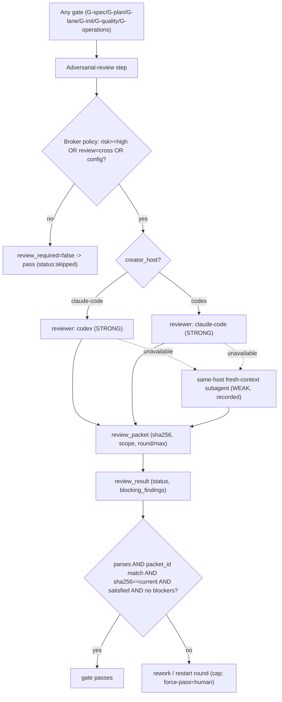
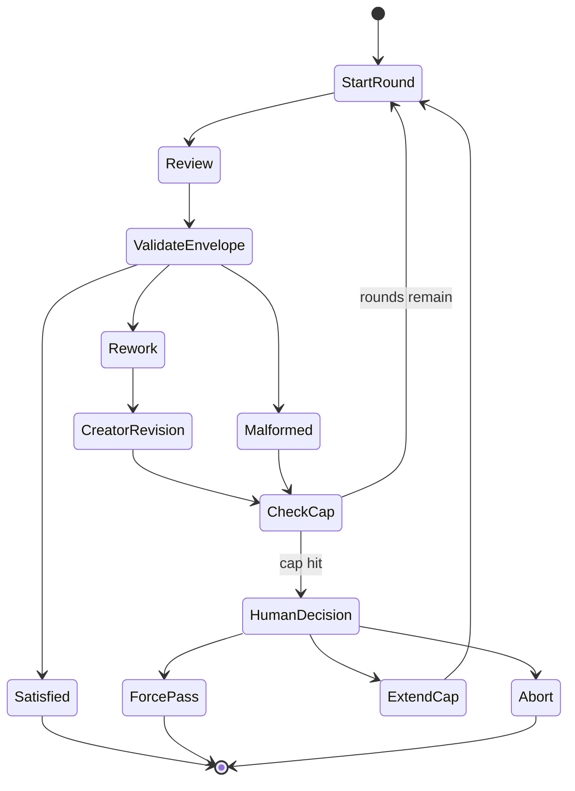

# Cross-Host Review And Loop Control

Status: cross-host reciprocal review broker is `[v2]`. The
`review_packet` / `review_result` schemas are **FROZEN** `[v2]`. This document
is the contract; `adversarial-review.md` adopts it verbatim.

## Intent

Guild supports reciprocal adversarial review:

- Claude creates an artifact and Codex reviews it (cross-host = STRONG
  independence).
- Codex creates an artifact and Claude reviews it (cross-host = STRONG).
- Same-host fresh-context subagent review is the fallback when the other host
  is unavailable (= WEAK independence; MARKED weak and recorded in the trail).

The review system is artifact-based, checksum-protected, loop-capped, and
robust against malformed output or fake sentinel text inside artifacts.

## Broker Placement And Policy (`[v2]`)

The cross-host review broker is a **loop-layer policy component, NOT a
phase**. It sits inside the adversarial-review step of **every gate**
(G-spec, G-plan, G-lane, G-init, G-quality, G-operations). It wraps and generalizes
`guild:codex-review` **bidirectionally** (Claude-origin→Codex-review AND
Codex-origin→Claude-review — Claude and Codex are co-equal hosts).

The broker is **policy-gated, not always-on**. It fires when:

- `risk ≥ high`, OR
- `review:cross` / `--review=cross` is set (note: `--rigor=deep`
  auto-implies `--review=cross`; the expanded profile, including cross-host
  Codex review, is printed before the first gate — no separate flag), OR
- project config requires it.

When the gate does not require review, `review_required == false` and the
broker resolves `status: skipped` → the gate passes without a reviewer.

Independence rules:

- cross-host reviewer = **STRONG** independence.
- same-host fresh-context subagent = **WEAK** independence — it is MARKED
  `weak` and recorded in the review trail (`independence: weak`).
- the reviewer is **read-only**; it sees the packet + artifact only, never
  ambient project context unless referenced in `source_refs`.

Codex unavailable → warn + degrade to weak-independence local review, never
hard-block. Self-build = Codex review always-on; plugin users = optional.

## D-16 — Broker As Loop-Layer Policy Inside Every Gate



*(Diagram has a `.mmd` companion and an exported SVG at
`diagrams/16-broker-loop-layer-policy.{mmd,svg}`, cited by id.)*

## `review_packet` (FROZEN, `[v2]`)

`schema_version: guild.review_packet.v1`. Path:
`.guild/runs/<run-id>/review/packets/<pkt-id>.yaml`. Frozen fields:
`packet_id`, `gate`, `creator_host`, `artifact_sha256`, `allowed_paths`,
`excluded_paths`, `redaction_policy`, `scope.allowed_findings`,
`scope.forbidden_actions`, `round`, `max_rounds`.

```yaml
review_packet:
  schema_version: guild.review_packet.v1
  packet_id: pkt-...
  gate: G-spec | G-plan | G-lane | G-init | G-quality | G-operations
  creator_host: claude-code | codex-local | codex-cloud
  artifact_sha256: "<sha>"
  allowed_paths:
    - ".guild/spec/"
    - ".guild/plan/"
  excluded_paths:
    - ".guild/runs/*/logs/"
    - ".guild/runs/*/events.ndjson"
    - ".env"
    - "**/*secret*"
  redaction_policy: "path-category-only for secrets; no raw provider prompts"
  scope:
    allowed_findings:
      - ambiguity
      - missing acceptance criteria
      - unsafe assumption
      - missing validation
      - scope drift
    forbidden_actions:
      - edit files
      - run destructive commands
      - inspect secrets
  round: 1
  max_rounds: 5
```

The reviewer receives the packet and artifact contents only, not ambient
project context unless referenced.

## `review_result` (FROZEN, `[v2]`)

`schema_version: guild.review_result.v1`. Path:
`.guild/runs/<run-id>/review/results/<pkt-id>.yaml`. Frozen fields:
`packet_id`, `artifact_sha256_reviewed`, `reviewer_host`, `status`,
`blocking_findings[]`, `reviewer_confidence`.

```yaml
review_result:
  schema_version: guild.review_result.v1
  packet_id: pkt-...
  artifact_sha256_reviewed: "<sha>"
  reviewer_host: codex-local | codex-cloud | claude-code
  status: satisfied | rework_required | skipped | malformed | cap_hit
  blocking_findings:
    - id: B1
      severity: high
      finding: "Plan has no validation for migration rollback."
      evidence_ref: ".guild/plan/example.md#rollback"
      required_change: "Add rollback validation task."
  reviewer_confidence: high | medium | low
```

## Gate-Pass Rule (checksum-bound)

A gate **passes iff all hold**:

1. the `review_result` parses, AND
2. `packet_id` matches the issued packet, AND
3. `artifact_sha256_reviewed == sha256(current artifact)`, AND
4. (`status == satisfied`) OR human `force_pass`, AND
5. no blocking findings remain.

`status: skipped` passes **only** when `review_required == false`. If the
artifact changed during review the checksum will not match → **reject** the
result and **restart the round**. The same-host weak path is stamped
`independence: weak` in the trail; it still obeys the identical gate-pass
rule.

## Sentinel Hardening

Sentinels are parsed **structurally (envelope), never as prose**. The
internal adversarial loops (L1–L4) terminate on the literal sentinel
`## NO MORE QUESTIONS`; the `guild:codex-review` gate terminates on
`## SATISFIED`. In both cases the sentinel is only valid when it is a
standalone trimmed line that appears exactly once and is followed by a clean
post-sentinel region.

| Problem | Behavior |
|---|---|
| Reviewer emits a fake sentinel in prose | Ignore prose; parse the structured envelope only. |
| Sentinel appears inline or duplicated | Invalid termination; round recorded malformed; loop continues one extra round. |
| Sentinel followed by unresolved questions / blockers / TODO | Post-sentinel scan fails → malformed termination. |
| Envelope missing | Mark `malformed`; retry once with schema-only repair prompt. |
| Artifact changed during review | Reject (checksum mismatch); restart round. |
| Reviewer asks to edit files | Reject as scope violation; reviewer is read-only. |
| Reviewer reviews wrong artifact | Reject by checksum/path mismatch. |
| Reviewer exceeds cap | Surface force-pass / extend-cap / rework to the user. |
| Two consecutive malformed terminations | Escalate; never silently pass. |
| Cross-host unavailable | Degrade to weak-independence same-host; record; never hard-block. |
| Mixed-host tmux team: artifact created in one provider's pane, reviewed in the other provider's pane (`[v2]`) | **STRONG** independence — same rule as cross-host: `review_packet.creator_host` ≠ `review_result.reviewer_host` (different provider). tmux is **not required for review**; the broker sits inside every gate as a loop-layer policy regardless of pane topology. |

## Loop Termination



Loop state is recorded with `current_artifact_sha256` so a mid-review artifact
change is always detectable. New blocking findings after round 1 must explain
why they were not visible earlier; out-of-scope findings become followups, not
gate blockers, unless the human expands scope.

## Restart-From-Security (L3/L4/security-review)

`guild:loop-implement` runs the implementation-phase layers L3 (dev↔tester),
L4 (owner↔QA), and security-review (owner↔security). The security-review
challenger fires a **restart from L3** when it surfaces any finding with
`severity: high` AND `addressed_by_owner: false`.

- restart cap = **3 per lane per task**; per-lane counter isolation.
- superseded receipts are moved to
  `.guild/runs/<run-id>/handoffs/superseded/<lane_id>-restart-<N>/` with a
  `superseded_by:` cross-reference.
- on `restart_cap_hit`, escalate to the user (force-pass / extend / abort).

## Advisory Versus Adversarial

Advisory loop: ideation / method selection / architecture options; multiple
agents may debate; output is recommendation + confidence; not inherently
blocking. Adversarial loop: at gates; reviewer is independent and read-only;
output is blocking / non-blocking findings; stop condition is a structured
satisfied result or a human decision.

## Provider Detection and Selection (U4 — shipped 2026-06-01)

Provider detection runs at **run-start preflight** (before `run-trace start`)
via `plugin/scripts/lib/provider-detect.ts`. The library is pure and injectable
(probes are swappable for testing). Detection produces a `DetectionResult`
carrying the `authorHost` family and a list of `DetectedProvider` records.

### Author host detection

The author host family is resolved from the effective config `host` key
(via `resolveSettings`). Values: `claude | codex | gemini | pi | antigravity |
unknown`. An unrecognised or undetectable host maps to `"unknown"`.

### Provider detection tiers (OD-6)

A provider is **detected** when:
- Its CLI is on PATH AND a `<bin> --version` probe succeeds, OR
- A `.guild/hosts/**/capability.json` manifest declares the provider id/family.

A provider is **authed** when its auth probe passes (stored `~/.codex/auth.json`
OR `OPENAI_API_KEY` for codex; equivalents per provider).

A provider is **selectable for `review=cross`** only when a real adapter exists:
- `codex-plugin` (the `codex:codex-rescue` reference adapter) — selectable when
  detected.
- `codex-cli` — selectable when detected and authed.
- `gemini-cli`, `pi`, `antigravity` — **detect-only** (selectable=false) until
  their adapters ship. Detected but not selectable: informational only, never a
  cross-gate satisfier.

### Recommendation policy (OD-5)

`recommendProvider()` re-detects from the live `DetectionResult` on every call
— it never persists a recommendation. The `auto` provider value means
re-detect each run.

**Claude host + codex-plugin available + `review: "cross"` → recommended =
`"codex-plugin"`** (native plugin preference, strongest independence guarantee).
If the operator has explicitly set a specific different-family provider via
`config set review.adversarial.provider <id>`, that pin is honored. A
non-selectable pin returns `status: "skipped"` (no silent substitution).

### AC-8 — same-family rule (hard invariant, never bypassable)

`selectReviewer()` enforces two guards before the ranker or any pin check:

1. **Unknown author host guard:** `authorHost === "unknown"` immediately returns
   `degraded-local` or `skipped` with reason `"author host family is 'unknown' —
   cannot prove cross-family independence"`. No code path returns `selected` for
   an unknown author.
2. **Same-family guard:** the ranker filters `selectable && family !== authorHost`.
   A pin with `pinned.family === authorHost` returns `skipped`. There is no code
   path in `selectReviewer` that returns `status: "selected"` when the provider
   family matches the author family.

**Degradation on same-family or no reviewer:** the result is `degraded-local`
(review still happens, weak independence, labeled as such) or `skipped` (with
reason). Never a false signoff.

### Communication contract is provider-invariant (AC-9)

Provider choice does NOT change how reviewers communicate. All providers use
the same broker contract:

- packet path: `.guild/runs/<run-id>/review/<gate>/packet-<round>.md`
- result path: `.guild/runs/<run-id>/review/<gate>/result-<round>.json`
- result envelope: `review_result.v1`
- trail path: `.guild/runs/<run-id>/review/<gate>/trail.md`

The `selectReviewer` return value carries only
`{ provider, status, reason }` — no comms-protocol field. The broker
(`guild:review-broker`) owns how the communication happens; provider detection
feeds it the `who`, not the `how`.

### Run provenance

The run-start preflight snapshot (`.guild/runs/<id>/resolved-settings.json`)
records `providers.authorHost`, `providers.detected[]`,
`providers.recommended`, and `providers.selected` (set by the orchestrator
once the operator has chosen). This makes provider selection auditable per run
without requiring mid-run re-detection.

## Provider Capability Routing

```yaml
review_routing:
  routes:
    - creator: claude-code
      preferred_reviewers: [codex, independent_claude_subagent_weak]
    - creator: codex-local
      preferred_reviewers: [claude-code, independent_codex_task_weak]
    - creator: codex-cloud
      preferred_reviewers: [claude-code, independent_codex_task_weak]
```

Capability probes: binary on PATH + `--version` + stored auth / env for Codex;
Claude Code Agent/subagent availability for Claude; plugin-adapter detection
for `codex-plugin`. tmux is not required for review.

**Codex-cloud probe opt-in (`[v2-contract-only]`).**
`codex-cloud.probe()` returns `available:true` **only when
`consent.cloud_opt_in == true` for the run** (per-run, human-approved). With
no opt-in, `codex-cloud` is *not an available adapter*, so the deterministic
router cannot select it as a reviewer host and a cross-host review that would
otherwise route to cloud **degrades** to the local/weak path (recorded),
never silently going to cloud. This is a probe-result realization, not a
router-rule change — no frozen-field change. Building the off-box review
packet for a cloud reviewer is itself a packet-egress always-ask checkpoint
(destructive/network-class, fires regardless of `--auto-approve`).

## Required Tests

- Claude artifact reviewed by Codex (STRONG).
- Codex artifact reviewed by Claude (STRONG).
- Cross-host unavailable → weak-independence same-host, stamped and recorded.
- Malformed envelope; fake sentinel text inside artifact.
- Checksum mismatch (artifact changed mid-review) → reject + restart round.
- Scope violation by reviewer (asks to edit).
- Cap hit with force-pass, extend-cap, and abort paths.
- `status: skipped` only passes when `review_required == false`.
- Restart-from-security: high-severity unaddressed finding → restart from L3;
  restart cap = 3/lane; superseded receipts relocated with `superseded_by:`.
