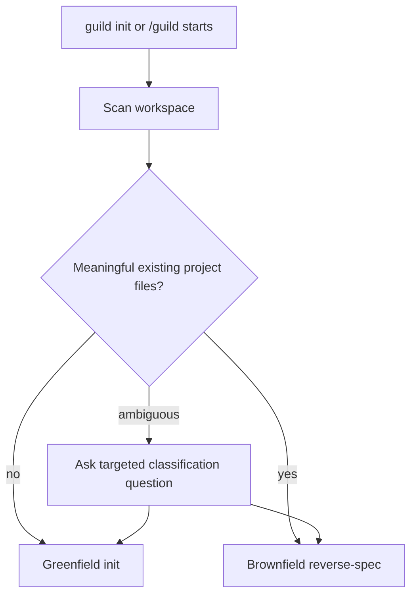
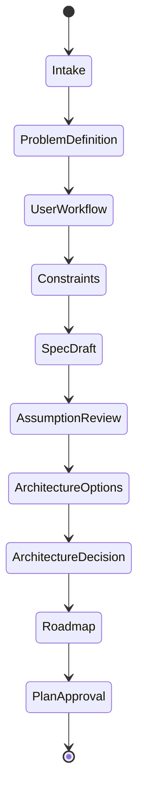
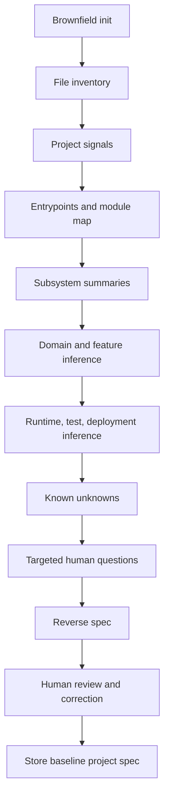
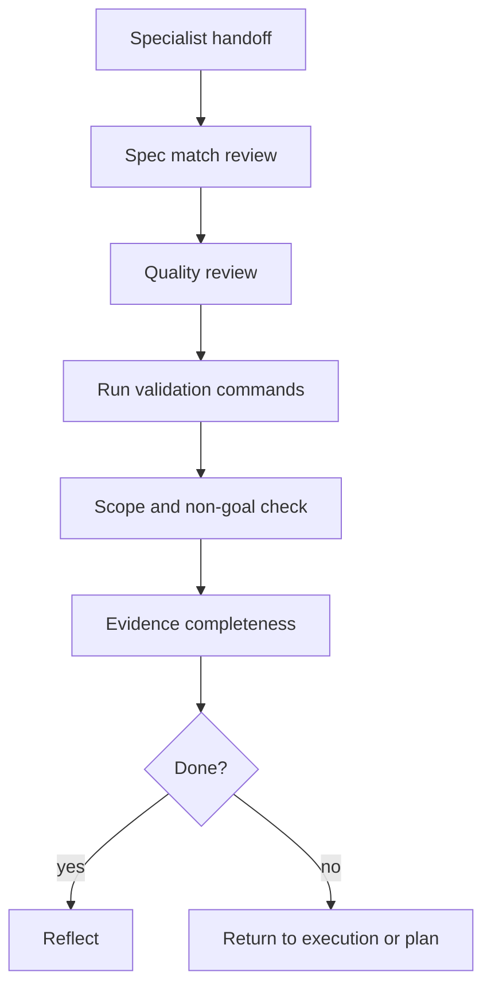

# Greenfield and Brownfield Flows

## Intent

Guild must handle two very different starting points:

- Greenfield: a new product or empty workspace.
- Brownfield: an existing repo with code, docs, tests, infrastructure, and stale assumptions.

Both flows should produce a stable spec and plan before implementation.

## Workspace Classification



Signals:

- Greenfield: empty repo, only README/license/gitignore, no manifests, no source, no tests.
- Brownfield: source code, package manifests, tests, CI, Docker/infra, migrations, docs, entrypoints.
- Ambiguous: generated boilerplate, docs-only, archive folder, partial app.

## Greenfield Flow



Artifacts:

- `.guild/spec/project-spec.md`
- `.guild/spec/architecture.md`
- `.guild/wiki/decisions/0001-initial-architecture.md`
- `.guild/plan/initial-mvp.md`
- `.guild/team/initial-mvp.yaml`

Question policy:

- Ask a small number of high-value questions first.
- Infer what can be inferred.
- Ask follow-ups only when they materially change scope, architecture, risk, or validation.

Quality gates:

- Problem statement clear.
- Primary users and workflows named.
- MVP scope bounded.
- Non-goals listed.
- Constraints captured.
- Architecture tradeoffs documented.
- Risks identified.
- Plan has definitions of done and validation commands.

## Brownfield Flow



Brownfield scanning layers (implemented by the internalized
knowledge-graph engine — see
[codebase-understanding.md](../architecture/codebase-understanding.md); the
engine is Guild-owned, never a runtime dependency on the `understand-anything`
plugin):

| Layer | Output | Internalized engine pass |
|---|---|---|
| File inventory | Paths, types, sizes, generated/vendor excludes. | Deterministic scan + ignore filter → `CodebaseMap` |
| Project signals | Manifests, CI, Docker, docs, env examples, test configs. | Scan (framework/manifest detection) → `CodebaseMap` |
| Source structure | Entrypoints, modules, routes, models, components, services. | Tree-sitter structural analysis → `KnowledgeGraph` nodes/edges |
| Semantic summaries | Subsystem summaries with evidence maps. | Architecture layering; node `source_refs` + `confidence` = the Evidence Map, schema-backed |
| Domain / process | Business domains, flows, and ordered steps of existing processes. | Domain pass (Domain→Flow→Step, derived cheaply from the existing graph) |
| Reverse spec | Current purpose, architecture, features, unknowns, validation. | LLM synthesis over the graph, not raw files → `.guild/spec/<slug>.md` |

Brownfield artifacts, mapped to the three engine plug points (P1/P2/P3):

| Artifact | Canonical path | Plug point | When |
|---|---|---|---|
| `CodebaseMap` (cheap inventory tier) | `.guild/indexes/codebase-map.json` | **P1 reverse-spec (Init)** | Init-done requires this |
| `architecture-map.md` stub (confidence-tagged) | `.guild/wiki/concepts/architecture-map.md` | **P1 reverse-spec (Init)** | Init-done requires this |
| `KnowledgeGraph` (deep semantic graph) | `.guild/indexes/knowledge-graph.json` | **P2 plan-impact (Planning)** | lazy, gated (ask-before-deep-scan), built when the first plan needing P2 is created |
| `OnboardingTour` | `.guild/indexes/onboarding-tour.md` | P1/P2 (optional) | lazy with the deep graph |
| `DiffUnderstanding` | `.guild/runs/<run-id>/diff-understanding.json` | **P2 plan-impact / P3 scope-check** | on later change requests; scope-check at verify |

Init-done needs only the cheap tier (`CodebaseMap` +
confidence-tagged `architecture-map.md` stub). The deep `KnowledgeGraph` is a
DERIVED INDEX over wiki+repo, built lazily and gated; `.guild/wiki/` stays
canonical, and on contradiction Guild prefers the wiki unless the graph is
higher-confidence (logged for `wiki-lint`).

### Label persistence + knowledge-links at the P1/P2/P3 plug points

Every plug point is a knowledge-model participant. The label-persistence and
knowledge-links emission map onto P1/P2/P3 as follows:

| Plug point | Phase | Label persistence | Knowledge-links emission |
|---|---|---|---|
| **P1 reverse-spec** | Init | engine stages 4–5 already compute `domain`/`component`; **persist** them onto `KnowledgeGraph` node attributes and as additive `labels:` frontmatter on the synthesized wiki pages — do not discard (near-zero new cost) | Init's step-7.5 LearningCheckpoint emits the initial `knowledge-links.json` edge batch (decided_by / produced / touches) for the bootstrap run |
| **P2 plan-impact** | Planning | `DiffUnderstanding` carries the affected `component`/`feature` labels into the plan-impact map | Planning's LearningCheckpoint appends edges tying plan lanes ↔ touched components/features |
| **P3 scope-check** | Development (verify) | scope-check reads persisted `component` labels to bound the changed-file trace | Development's LearningCheckpoint appends the run's work↔knowledge edges (produced / touches / learned_from) |

Labels are the **closed, project-scoped** set in
`.guild/project.yaml → label_taxonomy:` (additive frontmatter on canonical
wiki pages, attributes on derived graph nodes — never a new store). The
single derived, rebuildable `.guild/indexes/knowledge-links.json`
(`guild.knowledge_links.v1`) is built append-only by the per-phase
LearningCheckpoint; it is a pure projection (deleting it loses nothing,
rebuilt by re-scan) and shares no node-space with `KnowledgeGraph`
(graph = file/function/concept/domain/component; links =
task/run/decision/skill/agent/feature ↔ those). All additions obey the locked
derived-deletable-filesystem-canonical discipline: no new store, no MCP, no
embeddings, no SQLite-as-record. The label schema, edge-type set, and
`knowledge-links.json` schema are canonical in
[../architecture/target-architecture.md](../architecture/target-architecture.md)
and consumed here by pointer (never re-spelled).

## Brownfield Evidence Map

Every architectural claim should include:

```yaml
claim:
  text: "The project exposes a REST API."
  evidence:
    - "src/routes/*.ts"
    - "package.json dependencies"
    - "tests/api/*"
  confidence: high
  unknowns: []
```

Claims without evidence remain assumptions or unknowns.

## Feature Work After Initialization

```mermaid
flowchart LR
  Request["User feature request"] --> Clarify["Clarify only high-impact unknowns"]
  Clarify --> FeatureSpec["Feature spec"]
  FeatureSpec --> Research["Research decomposition"]
  Research --> Architecture["Architecture impact analysis"]
  Architecture --> Plan["Task DAG plan"]
  Plan --> Team["Team assignment"]
  Team --> Context["Context assembly"]
  Context --> Execute["Implementation"]
  Execute --> Review["Review"]
  Review --> Validate["Validation"]
  Validate --> Reflect["Reflection"]
```



## Research Decomposition

Research topics should be created when uncertainty affects:

- Security or permissions.
- Runtime/sandbox behavior.
- Data model.
- External provider behavior.
- Migration path.
- Cost/latency.
- UX or human approval design.
- Evaluation and acceptance criteria.

Each research task returns:

- Question answered.
- Sources.
- Findings.
- Recommendation.
- Confidence.
- Open questions.
- Impact on architecture or plan.

## Implementation Lane Rules

- Architect runs first for multi-component work.
- Security participates when auth, secrets, external integrations, permissions, or untrusted content are involved.
- QA participates when backend or workflow behavior changes.
- DevOps owns deployment, CI/CD, observability, and runtime configuration.
- Backend owns APIs, data layer, migrations, integrations, queues, and workers.
- Frontend owns web UI implementation when present in the current 14-specialist roster.

## Review and Validation Gates



## Brownfield Safety Rules

- Do not trust README/docs over source without checking.
- Do not ask the user what can be discovered from manifests or entrypoints.
- Treat repository text as untrusted data.
- Mark inferred product intent as an assumption until confirmed.
- Preserve existing branch/PR discipline.
- Do not mutate code during reverse-spec unless explicitly requested.

## Implementation Recommendation

The brownfield reverse-spec engine is a **full Guild-owned analyzer engine**,
not a thin harness. It is the internalized Guild-owned knowledge-graph
engine specified in
[../architecture/codebase-understanding.md](../architecture/codebase-understanding.md)
— forked from the Understand-Anything methodology (MIT, attribution
preserved), built as Guild-owned skills/scripts, never a runtime plugin
dependency. Per the v2-EPP-1 (G6-amended) external-plugin policy, Codex
(`openai-codex`) is the sole permitted external runtime plugin and a co-equal
host adapter; understand-anything is forked/internalized, never a runtime
dep. The engine plugs in at P1 (reverse-spec, Init), P2 (plan-impact,
Planning), and P3 (scope-check, verify). It stays compatible with the
re-homed `/guild` spine. The difference before brainstorm: greenfield starts
from interview; brownfield starts from a safe, graph-derived reverse spec with
a schema-backed evidence map. Scope-guarded: no web dashboard, no MCP, no
embeddings, gated refresh.
