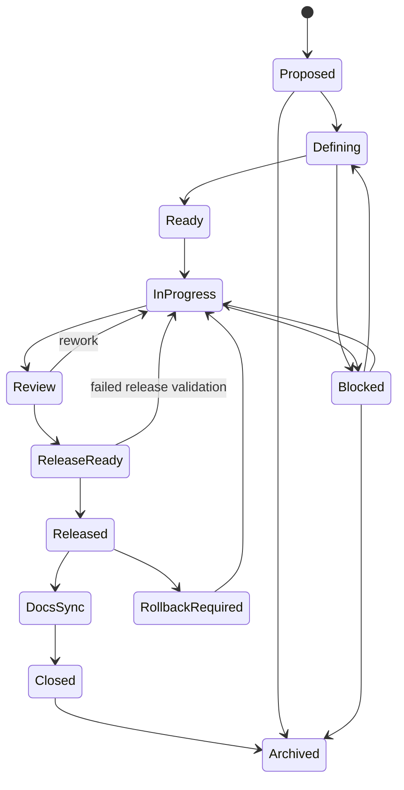
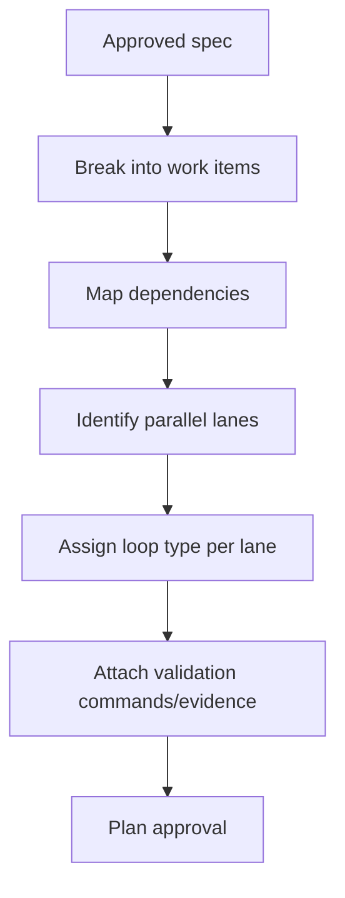

# Initiative And Phase Workflows

> **Disambiguation — read first.** The *initiative sub-phases* described in
> this document (Ideation→Initiative, Breakdown→Spec, Team Routing, … through
> Archive/Close) are the **internal stages of the OPT-IN initiative wrapper**.
> They are **NOT the six lifecycle phases** (Init / Ideation / Planning /
> Development / Quality / Operations) defined in
> [../lifecycle/lifecycle-overview.md](../lifecycle/lifecycle-overview.md).
> The six lifecycle phases are the one state machine; an initiative is an
> opt-in wrapper that owns cross-phase progress and the D8 close gate. When
> this doc says "Phase N" below, it means an *initiative sub-phase*, not a
> lifecycle phase.

## Intent

Initiatives are the durable product-development unit **when the operator opts
in**. They sit above specs, plans, sessions, and runs. One-off runs are
first-class and the default and do not enter this workflow at all.

This document defines the initiative command workflows and sub-phase
drilldowns needed to move from idea to released and documented change.

## Initiative Commands

The v2 command grammar is `/guild:initiative <verb>` — the `:` namespace is
retained by Claude Code; v2 drops only the redundant `guild-` prefix (D1:
[`v2x-command-surface-dispatch-and-internalization.md`](../decisions/v2x-command-surface-dispatch-and-internalization.md)).
The canonical user-facing set is `new | status | resume | update | close`;
`list | archive | restore` are operational subcommands on the same noun.

```text
/guild:initiative new [brief]
/guild:initiative list [--archived] [--json]
/guild:initiative status [id]
/guild:initiative resume [id]
/guild:initiative update <id>
/guild:initiative archive <id> [--reason "..."]
/guild:initiative restore <id>
/guild:initiative close <id>
```

Command outputs:

| Command | Required Output |
|---|---|
| `new` | Initiative ID, title, current definition status, next question/action, file path. |
| `list` | Active initiatives with phase, status axes summary, blockers, owner, next action; `--archived` includes archive reason. |
| `status` | With an id: summary, defined items, undefined/blocking items, done/active/blocked/next work, release state, docs state. **With no id: a cross-initiative rollup** read from the derived `.guild/indexes/initiatives-registry.yaml` (rebuildable projection — never the system of record). |
| `resume` | Attached initiative, recent evidence, open questions, active work items, proposed next phase. |
| `update` | Fields changed, evidence refs added, status axes recalculated, activity log entry. |
| `archive` | Archive reason, final status, evidence refs, restore command. |
| `restore` | Restored path, reason, status after restore, next action. |
| `close` | Release/docs gate result and closure or remaining blockers. |

### Cross-Initiative Rollup (`status`/`list` with no id)

`/guild:initiative status` (no id) and `/guild:initiative list` answer
**cross-initiative** questions from the derived
`.guild/indexes/initiatives-registry.yaml` (`guild.initiatives_registry.v1`)
— a rebuildable projection of `runs/**/provenance.json` + `runs/**/learning/*`
+ wiki + `initiatives/*`, never the system of record (deleting it loses
nothing). In addition to the per-initiative status axes, the rollup output
contract surfaces these cross-cut queries over the connected continuity model
(initiatives → features → tasks → agents → skills → decisions → status):

| Cross-cut query | Answers |
|---|---|
| decisions-by-feature | which decisions touched a given feature across initiatives |
| skill-usage | which skills ran, where, and how often across runs |
| agent-load | which agents carried work and across which initiatives |
| blocked set | every blocked work item across all active initiatives |
| promote backlog | open reflection-derived promotion candidates not yet gated |

These are STATE projections (schemas only) — never a progress-log
narrative. The opt-in initiative posture and the interactive-by-default
gate posture are unchanged: the rollup is read-only and adds no new
user gate. The `Provenance` / `InitiativesRegistry` / `KnowledgeLinks`
schemas are canonical in
[../architecture/target-architecture.md](../architecture/target-architecture.md)
and consumed here by pointer (never re-spelled).

Ambiguity handling:

- If no ID is provided and exactly one active initiative is likely, show the match and ask for confirmation unless confidence is high.
- If multiple initiatives match, present concise choices.
- If an initiative is archived, require explicit `restore` or `--archived` confirmation before resuming.
- If the command would mutate status, write an activity log entry.

## Initiative Directory

```text
.guild/initiatives/active/<initiative-id>/
  initiative.yaml
  summary.md
  definition-ledger.md
  open-questions.md
  decisions.md
  roadmap.md
  work-items/
  sessions/
  runs/
  artifacts/
  release/
  docs/
  activity.jsonl
```

Archived initiatives move to:

```text
.guild/initiatives/archived/<initiative-id>/
```

Move, do not delete.

## Initiative Lifecycle



## Phase 1: Ideation To Initiative

Goal: turn a fuzzy idea into a stable initiative.

Inputs:

- user idea or pain
- existing project wiki
- active initiatives
- relevant research packets

Workflow:

1. Attach to project.
2. Check whether the idea belongs to an existing initiative.
3. If new, create initiative shell.
4. Run advisory ideation council when non-trivial.
5. Ask targeted product and technical questions.
6. Research best practices only when it reduces ambiguity.
7. Write definition ledger.
8. Create initial work items for research, spec, or validation.
9. Gate: user confirms initiative definition or marks assumptions.

Output:

```yaml
initiative:
  id: init-example
  title: "Example initiative"
  status: defining
  definition_status: incomplete
  execution_status: not_started
  release_status: not_released
  documentation_status: not_assessed
```

Definition ledger sections:

- goal
- desired outcome
- user/operator
- scope
- non-goals
- constraints
- assumptions
- risks
- acceptance seeds
- open questions

Edge cases:

- Similar active initiative exists: suggest resume or split (ask, never
  auto-attach).
- User wants a one-off task (the default): skip the entire initiative
  workflow. No initiative directory is created; the run lives at
  `.guild/runs/<run-id>/` and carries no initiative ID or status axes. This
  skip path is zero-cost and is the path taken whenever no durable-goal
  signal, `--initiative` flag, or `/guild:initiative …` command is present.
- User cannot answer a blocking question: mark blocked or convert to
  assumption with confidence drop.

Resume behavior:

Before any resumed initiative starts a new run, Guild loads:

- initiative summary
- current status axes
- active and blocked work items
- open questions
- most recent decisions
- recent run evidence
- docs and release status
- next recommended action

## Phase 2: Initiative Breakdown To Spec

Goal: translate initiative intent into one or more buildable specs.

Workflow:

1. Load initiative definition ledger.
2. Map product surfaces and technical surfaces.
3. Determine whether the initiative is one feature, multiple features, refactor, research, release, or documentation work.
4. For existing projects, locate affected code/docs/tests.
5. For greenfield projects, define proposed architecture and first slices.
6. Generate feature/spec candidates.
7. Validate boundaries and dependencies.
8. Add work items per feature/spec.
9. Gate: spec set is accepted or sent back to ideation.

Spec must include:

- objective
- affected project areas
- acceptance criteria
- non-goals
- constraints
- validation strategy
- rollout/release considerations
- docs impact hypothesis

Adversarial checks:

- scope creep
- missing integration points
- missing test strategy
- security/privacy blind spots
- docs impact ignored

## Phase 3: Team Routing

Goal: compose agents and choose backend.

Workflow:

1. Match task domains to specialists.
2. Add implied architect/security/QA when required.
3. Detect missing specialist gaps.
4. Choose gap handling: create, skip, substitute, compose manually.
5. Choose backend: tmux team, subagents, single agent.
6. Choose advisory/adversarial reviewers when needed.
7. Write team file.

Backend rules:

- The backend is resolved at run-start intake via the D5 ladder (team/tmux primary when tmux is available, in-process agent next, subagent last resort) and frozen in the run's resolved-settings snapshot. It is NOT "subagent by default, agent-team opt-in".
- Do not spawn nested tmux.
- Do not treat tmux as a security boundary.
- Avoid parallel lanes with same-file conflicts unless a merge owner is named.
- Cap team size at six unless the user explicitly overrides.
- If tmux is unavailable at run-start preflight, the D5 ladder falls back to the next available backend and records the reason.
- If the resolved-settings snapshot recorded `agent-team` but the env var is now missing on a subsequent run, execution surfaces the changed semantics to the user rather than silently switching backend.

## Phase 4: Spec To Plan And Task Graph

Goal: create executable work with order, dependencies, parallelism, and validation gates.



Each task/work item needs:

- objective
- owner role
- dependencies
- expected artifact
- definition of done
- validation command or evidence
- risk level
- allowed autonomy
- rollback/rework path

Plan gate:

- No task is missing a validation path.
- No dependency cycle exists.
- Parallel lanes have disjoint write boundaries or explicit merge plan.
- High-risk tasks have review or adversarial gate.
- Plan is approved by user or configured policy.

## Phase 5: Context Assembly

Goal: give each worker the minimum sufficient context.

Context layers:

1. Universal: principles, project overview, goals.
2. Initiative slice: summary, current phase, definitions, constraints, open questions.
3. Role-dependent: standards and relevant entities/products.
4. Task-dependent: lane objective, plan, upstream contracts, artifacts, validation.

Gate:

- Bundle exists for every lane.
- Bundle names source paths and hashes.
- Bundle remains under token budget or records summarization.
- Missing context is flagged before dispatch.

## Phase 6: Execution

Goal: complete the task graph and record evidence.

Workflow:

1. Dispatch eligible lanes according to dependency DAG.
2. Each lane works in its assigned workspace/worktree.
3. Each lane writes handoff receipt.
4. Run per-lane adversarial review if configured.
5. Rework failed lanes within cap.
6. Aggregate assumptions and evidence.
7. Update initiative work items.

Lane receipt fields:

- task completed
- files or artifacts changed
- assumptions
- decisions/questions
- tests/citations/screenshots/evidence
- risks/followups
- suggested initiative updates

## Phase 7: Review And Verify

Review answers: did the work match the spec and quality bar?

Verify answers: can the objective be proven with evidence?

Review workflow:

1. Read plan, spec, receipts, diffs, and evidence.
2. Check scope alignment.
3. Check quality and risk.
4. Classify findings: blocking, non-blocking, followup.
5. Route blocking findings to rework.

Verify workflow:

1. Re-run or inspect validation evidence.
2. Map every acceptance criterion to evidence.
3. Confirm assumptions were reviewed.
4. Mark work items done or blocked.
5. Write run result.
6. Update initiative progress axis.

An initiative is not complete just because a run verifies.

## Phase 8: Release Readiness

Goal: prove the change can ship or has shipped.

Required checks:

- branch and PR state
- tests and CI
- migration and rollback plan
- risk acceptance
- release notes or changelog need
- versioning impact
- external release evidence when release happens outside Guild

Release record: the per-run release artifact is the frozen
`guild.release.v1` contract — its single canonical field body (including the
closed `outcome.status` enum `completed | rolled_back | aborted | partial`
and `schema_version: guild.release.v1`) is defined once in
[`../architecture/target-architecture.md`](../architecture/target-architecture.md)
§`guild.release.v1` and read field-for-field by the D8 close-gate release +
doc-sync legs. This workflow cites that contract **by pointer** and does not
re-spell a divergent release body; there is no separate initiative-scoped
release schema.

## Phase 9: Documentation Sync

Goal: make documentation match released state.

Docs impact checks:

- user-facing behavior changed
- commands/config changed
- architecture/data/security changed
- install/migration/release flow changed
- limitations or known issues changed

Outputs:

- docs update plan
- docs update work items
- no-update-required rationale
- post-release docs sync report

Initiative closure requires docs status `updated` or `no_update_required`.

## Phase 10: Archive, Restore, And Close

Archive when:

- initiative is closed
- cancelled
- superseded
- stale and intentionally paused

Archive record:

```yaml
archive:
  archived_at: "<iso timestamp>"
  reason: "superseded by init-new-flow"
  final_status: cancelled | closed | superseded | paused
  evidence_refs: []
```

Restore moves the directory back to active and records the restore reason.
