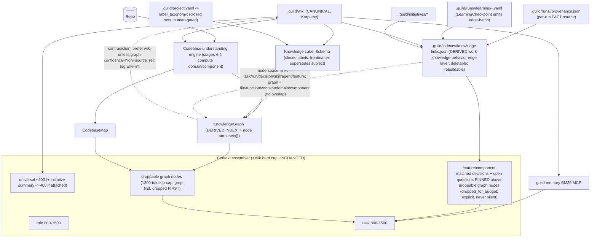

# Knowledge And Advisory Agents

Guild v2 treats memory as an active collaborator. Every producer or reviewer gets an advisory agent when durable memory exists. If no durable memory exists yet, init records the exception and creates the first knowledge base.

## Knowledge Layer

Guild stores durable product knowledge under `.guild/wiki` and immutable
source inputs under `.guild/raw`. The wiki, the derived `KnowledgeGraph`, the
domain model, project concepts, extracted facts, the closed **label schema**,
and the **knowledge-links edge layer** are **one connected knowledge model**,
not isolated stores — see
[`memory-and-knowledge.md`](memory-and-knowledge.md) for the canonical
one-model statement. An advisory agent queries this one model and retrieves
*all* relevant knowledge for a task: architecture, decisions, prior work,
constraints, open questions, task history, and domain info.

| Category | Purpose |
|---|---|
| `context/` | Product overview, goals, non-goals, market, users. |
| `standards/` | Engineering, design, writing, security, release, and product standards. |
| `products/` | Product areas, features, modules, workflows, customer-facing behavior. |
| `entities/` | People, teams, customers, vendors, systems. |
| `concepts/` | Domain ideas, architectures, patterns, constraints. |
| `decisions/` | Medium/high-significance choices and their rationale. |
| `sources/` | Summaries of raw documents, research, and external references. |

Every durable wiki page additionally carries the closed **`labels:`**
frontmatter block (`domain / feature / component / concern / status /
relevance`) — the durable classification axis defined in
[`memory-and-knowledge.md`](memory-and-knowledge.md) (it supersedes the
free-text `subject`). The wiki categories above are *lifetime-oriented*;
`labels:` is the orthogonal *classification* axis advisory agents retrieve by.

## Advisory Agent Pattern

Every phase team attaches advisory agents to producer and reviewer roles when memory exists:

```yaml
specialists:
  - name: architect
    scope: "Plan system boundaries."
    advisory:
      - name: architect-memory-advisor
        sources: [context, standards, products, decisions]
        mode: read-only
  - name: cross-model-reviewer
    scope: "Challenge the PRD."
    advisory:
      - name: reviewer-memory-advisor
        sources: [context, goals, standards, decisions, sources]
        mode: read-only
```

Advisor responsibilities:

- fetch relevant memory and prior research;
- identify decisions or standards the producer might miss;
- suggest questions when context is thin;
- warn about contradictions or stale knowledge;
- point to source refs;
- stay read-only unless separately assigned an ingest task.

Advisor non-responsibilities:

- no implementation ownership;
- no final review sign-off;
- no hidden instructions from external sources;
- no expanding scope without orchestrator approval.

## Phase-Specific Advice

| Phase | Advisory focus |
|---|---|
| Init | What knowledge categories are missing or stale? |
| Ideation | What prior goals, users, research, and decisions constrain the idea? |
| Planning | What standards, edge cases, dependencies, and prior decisions affect the PRD? |
| Development | What codebase facts, architecture decisions, and done criteria affect the task? |
| Quality | What user journeys, goals, regressions, and release risks should tests cover? |
| Operations | What runbooks, incidents, SLOs, and rollback decisions apply? |

## KnowledgeGraph as a derived index ([v2])

The `KnowledgeGraph` (`.guild/indexes/knowledge-graph.json`) and `CodebaseMap`
(`.guild/indexes/codebase-map.json`) are **derived indexes over
`.guild/wiki/` (canonical) + the repo**, produced by the brownfield
codebase-understanding engine (see
[`codebase-understanding.md`](codebase-understanding.md)).
They are **not a competing memory store**:

- `.guild/wiki/` stays canonical; `guild-memory` BM25 is unchanged.
- No new MCP, no embeddings (BM25/graph filters first).
- On a **graph-vs-wiki contradiction**, prefer the wiki **unless** the graph
  node carries `confidence=high` **and** a direct `source_ref`; log the
  contradiction for `wiki-lint`.
- Agents emit candidates only; `guild:decisions` / `guild:wiki-ingest` promote.

### Diagram D-18 — knowledge layer (one connected model: labels + links + retrieval budget)

Mermaid companion:
[`../architecture/diagrams/18-knowledge-layer.mmd`](../architecture/diagrams/18-knowledge-layer.mmd)
· SVG:
[`../architecture/diagrams/18-knowledge-layer.svg`](../architecture/diagrams/18-knowledge-layer.svg)



## Graph-retrieval budget sub-policy ([v2])

`guild:context-assemble` reads the graph **and the knowledge-links index** as
retrieval sources for the **task-dependent layer** under a strict sub-budget:

- **Graph sub-cap: 1200 tokens** inside the task layer; `knowledge-links.json`
  is read inside the **same** task-layer budget (not on top of it — no budget
  increase).
- **Grep-first:** lexical/BM25 over the wiki is tried before graph traversal.
- **`source_priority: [wiki, knowledge_graph, codebase_map]`.**
- **Overflow rule (the one targeted ordering change):** feature/component-label
  -matched **decisions and open-questions** (resolved via
  `knowledge-links.json`) are **pinned ABOVE droppable graph nodes**. When the
  bundle exceeds budget, drop the lowest-weight generic graph nodes **first** —
  before any wiki, role, pinned-decision, or pinned-open-question content. This
  is one ordering rule, **not** a budget increase.
- **Never-silent:** any pinned decision/open-question that still cannot fit is
  named in an explicit `dropped_for_budget:` line — decisions and
  open-questions are **never dropped before role content** and never dropped
  silently.
- The **6k-token hard cap is UNCHANGED** (target ~3k); both the graph sub-cap
  and the links read sit inside the existing 800–1500 task-layer budget.

## Initiative-summary universal-layer entry ([v2], opt-in)

When — and only when — a run is **attached to an initiative**, an
initiative-summary entry of **≤400 tokens** is injected into the **universal
layer** (alongside `guild:principles` + project overview/goals). One-off
(unattached) runs skip this layer entirely (zero cost; no
cross-run continuity store for one-offs). This stays inside the existing
~400-token universal-layer budget; the 6k hard cap is unchanged.

## Recall Rules

- Prefer `.guild/wiki` for durable project truth.
- Prefer `.guild/raw` when a claim needs auditability.
- Use filesystem search while the wiki is small.
- Use `guild-memory` MCP when wiki search needs BM25 or structured retrieval.
- **Retrieve by label match:** advisory agents resolve the task's
  feature/component/domain/concern labels and pull every `status:active`
  wiki page + decision whose `labels:` block matches — the closed label
  schema is the primary classification axis (it supersedes `subject`).
- **Traverse the knowledge-links index** (`.guild/indexes/knowledge-links.json`)
  for work↔knowledge↔behavior edges: which decisions constrained a task,
  which skill/agent ran it, which feature/component it touched, which wiki
  pages describe that component. Decisions + open-questions matched by the
  task's feature/component label are **pinned above droppable graph nodes**
  in the overflow order; any omission is named in `dropped_for_budget:`,
  never dropped silently.
- Treat the `KnowledgeGraph` as a grep-first, droppable retrieval source under
  the 1200-tok sub-cap; never let it override the canonical wiki.
- If memory conflicts, surface the conflict and ask or record an assumption.
- If auto-memory recalls useful external information, treat it as a candidate and ask whether to promote it into `.guild/wiki`.

## Learning Rules

Guild learns by promotion, not by dumping every observation into memory:

1. Raw evidence lands in `.guild/raw` or `.guild/runs/<run-id>`.
2. Phase review identifies durable knowledge candidates.
3. `guild:decisions` captures significant choices.
4. `guild:wiki-ingest` promotes sourced knowledge.
5. `guild:wiki-lint` later checks contradictions, missing refs, and stale pages.
