# v2 Lifecycle

This document is the **single lifecycle truth** for Guild v2. It supersedes
`guild-plan.md §8` — the v1 7-step linear spine — which is frozen as the
historical v1 record and now carries a `supersedes:` pointer back to this page.
`guild-plan.md` is not deleted; its 8 spine skills are *re-homed* (not deleted)
as the implementation of the Planning and Development phases, and it is the
default forward path, not a peer model.

## Framing

> Guild v2 is **one state machine with six phase entrypoints and three lenses**
> (linear / phase / initiative) — linear (`/guild [brief]` walks
> Ideation → Planning → Development → Quality), phase (`/guild <phase>` jumps to
> any phase with a backward-then-forward prerequisite resolver), and initiative
> (an opt-in wrapper owning cross-phase progress + the close gate).

The shipped v1 7-step spine is re-homed, not deleted: its skills become the
implementation of Planning + Development; it is the default forward path, not a
peer model.

## Session Intake — Run-Start Preflight (settings-control-and-tmux — shipped 2026-06-01)

Before `run-trace start` — and before any phase work — every `/guild:*`
lifecycle command runs `runStartPreflight()` from
`plugin/scripts/lib/runstart-preflight.ts`. This is phase-wide (part of command
intake, not buried in `team-compose` or `execute-plan`):

1. **Resolve settings** through the full 7-source inheritance chain (U1):
   `built-in < workspace settings < workspace local < project settings <
   project local < rigor-expansion < CLI`. The full per-key source map is
   returned alongside the config.
2. **Validate** closed keys. Violations are surfaced with clear messages.
3. **Probe tmux.** If tmux is on PATH (`tmux --version` succeeds):
   - The prompt condition is evaluated **every run**:
     `needsTmuxPrompt = tmux.available && effective agent_mode != "team"`
     (including `auto` — OD-3, operator-confirmed). When true, the preflight
     returns the exact persist argv:
     `config set agent_mode team --scope workspace`.
   - The orchestrator shows the operator: "tmux is available. Update settings to
     use tmux agent teams?" On **yes** it runs the config-cmd argv (HARD-SET
     write) — this persists `agent_mode: "team"`, so subsequent runs see `team`
     and the condition is false (no further prompting). On **no** nothing is
     persisted, so the condition still holds next run and the prompt **may fire
     again**. The prompt is not a one-shot flag; it stops only because saying
     yes changes the effective setting.
   - In this workspace (root `agent_mode: "team"` + U1 inheritance fixed), the
     condition is already false, so the prompt never fires.
4. **Detect author host and review providers** (U4). Claude host + codex-plugin
   available + `review: "cross"` → recommended provider = `"codex-plugin"`
   (re-detected every run — OD-5, never stale-pinned). Same-family reviewers
   never satisfy `review=cross` (AC-8). Unknown author host → no reviewer
   synthesized.
5. **Build the resolved-settings snapshot** (`ResolvedSettingsSnapshot`,
   schema `guild.resolved_settings.v1`). Passed to `startRun()`, which writes
   it to `.guild/runs/<id>/resolved-settings.json` before any phase work.

**Resolved-settings snapshot (U6 — shipped 2026-06-01).** The file
`.guild/runs/<id>/resolved-settings.json` records:

```json
{
  "schema_version": "guild.resolved_settings.v1",
  "source_chain": { "<key>": "<source-layer>", "...": "..." },
  "effective": {
    "agent_mode": "team",
    "host": "auto",
    "review": "cross",
    "rigor": "deep",
    "loops": "all",
    "loop_cap": 16
  },
  "providers": {
    "authorHost": "claude",
    "detected": [ "..." ],
    "recommended": "codex-plugin",
    "selected": "codex-plugin"
  },
  "communication_contract": "review_result.v1",
  "resolved_at_ref": "<run-id>"
}
```

A compact `settings_ref` block in `run.yaml` points at this file
(`path: resolved-settings.json`, `schema_version`, `effective_backend`,
`review`, `recommended_provider`). Phase skills that need the locked-in
settings call `readResolvedSettingsSnapshot(runId, { cwd })` — mid-run config
edits do not change behavior for the current run (AC-10 invariant). The write
is security-hardened: `validateRunId()` rejects traversal patterns before any
I/O and a containment assertion verifies the path stays inside the runs base.

## Reconciled State Machine (D-12, embedded)

The single reconciled machine — six phases, spine stations, cross-phase loops,
opt-in initiative nesting, and the close gate — is below. The matching SVG
lives at `../architecture/diagrams/12-reconciled-lifecycle.svg` with a `.mmd`
companion; this embedded mermaid block is the reviewable truth.

```mermaid
stateDiagram-v2
  [*] --> SessionIntake
  state "Session Intake (initiative attach? opt-in; settings.json defaults: folded)" as SessionIntake
  SessionIntake --> Init: new/refresh knowledge
  SessionIntake --> Ideation: have an idea
  SessionIntake --> Planning: have a spec
  SessionIntake --> Development: have approved plan
  SessionIntake --> Quality: have dev output
  SessionIntake --> Operations: production work
  state Init {
    [*] --> Classify
    Classify --> Greenfield: new
    Classify --> Brownfield: existing
    Classify --> ResumeRepair: existing .guild
    Greenfield --> InterviewSynth
    Brownfield --> GraphBuild: scan->...->reverse-spec (reverse-spec pass, cheap tier=done)
    InterviewSynth --> GInitPromote
    GraphBuild --> GInitPromote
    ResumeRepair --> GInitPromote
    GInitPromote --> LearnInit: wiki promoted (USER GATE)
    state "step 7.5 LearningCheckpoint (auto + advisory; rides A review boundary; 12 targets + edge-batch)" as LearnInit
    LearnInit --> [*]
  }
  Init --> Ideation
  state Ideation {
    [*] --> Brainstorm
    Brainstorm --> L1Clarify: --rigor=deep (opt-in)
    L1Clarify --> Brainstorm
    Brainstorm --> GKnowledgeBinding: stamp grounded_in (auto-resolve)
    GKnowledgeBinding --> GSpec
    GSpec --> Brainstorm: edit
    GSpec --> LearnIdeation: spec approved (USER GATE)
    state "step 7.5 LearningCheckpoint (auto + advisory)" as LearnIdeation
    LearnIdeation --> [*]
  }
  Ideation --> Planning
  state Planning {
    [*] --> PRDSynthesis: architect+techwriter (right-sized)
    PRDSynthesis --> TeamCompose
    TeamCompose --> GTeam
    GTeam --> TeamCompose: edit
    GTeam --> PlanLanes: team approved (USER GATE)
    PlanLanes --> DiffUnderstanding: brownfield (plan-impact pass)
    DiffUnderstanding --> L2PlanReview
    PlanLanes --> L2PlanReview: --rigor=deep (opt-in)
    L2PlanReview --> PlanLanes
    L2PlanReview --> GPlan
    GPlan --> PlanLanes: edit
    GPlan --> LearnPlanning: plan approved=true (USER GATE, folds PRD)
    state "step 7.5 LearningCheckpoint (auto + advisory)" as LearnPlanning
    LearnPlanning --> [*]
  }
  Planning --> Development
  state Development {
    [*] --> ContextAssemble
    ContextAssemble --> Dispatch
    Dispatch --> LaneLoops: per-lane L3/L4/security (--rigor=deep)
    LaneLoops --> Dispatch: rework (cap)
    Dispatch --> ReviewStage: all lanes done
    ReviewStage --> VerifyDone
    VerifyDone --> ScopeCheck: graph scope check (scope-check pass)
    ScopeCheck --> LearnDev: verify PASS
    ScopeCheck --> Dispatch: validation failure (rework)
    state "step 7.5 LearningCheckpoint (auto + advisory; emits knowledge_graph refresh + task_tracking + edge-batch)" as LearnDev
    LearnDev --> [*]
  }
  Development --> Quality: optional (full guild:quality skill [v2])
  Development --> Reflection
  Quality --> Reflection
  Quality --> Operations: release/ops (full guild:operations skill [v2])
  Operations --> Reflection
  state "Reflection step 7.5 LearningCheckpoint (cross-phase; 12-target verdict; proposals only -> reflections/; no auto-promote)" as Reflection
  Reflection --> [*]: unattached run complete
  Reflection --> InitiativeCloseout: if initiative-attached
  state InitiativeCloseout {
    [*] --> ReleaseReadiness
    ReleaseReadiness --> Pending: not released
    ReleaseReadiness --> DocsImpact: released (evidence)
    DocsImpact --> DocsWorkItem: docs update required
    DocsImpact --> NoDocsRationale: no update required
    DocsWorkItem --> CloseInitiative
    NoDocsRationale --> CloseInitiative
    CloseInitiative --> [*]
  }
  InitiativeCloseout --> [*]: initiative CLOSED (D8: exec+release+docs)
  note right of Quality
    Quality and Operations phases each also run step 7.5
    LearningCheckpoint at their review boundary (auto + advisory,
    no new gate). Every non-none verdict appends to
    .guild/reflections/<run-id>.md (existing human-gated pipeline).
  end note
```



Every phase repeats the same control pattern:

1. Resolve phase input and run id.
2. Assemble phase memory from `.guild/wiki`, `.guild/raw`, prior phase
   artifacts, the connected knowledge model (the derived
   `.guild/indexes/knowledge-links.json` work↔knowledge edges), and current
   repository state.
3. Compose a phase-specific team plus advisory agents.
4. Run the producer work loop.
5. Run phase-level adversarial review with cross-model preference.
6. Resolve findings by revising the artifact or recording an explicit
   assumption.
7. Write a phase artifact and handoff receipt.
7.5. **LearningCheckpoint (automatic, advisory, no new gate).** Run the
   per-phase LearningCheckpoint at the phase's existing review boundary (the
   `A` slot). It is a classification verdict — not an analysis pass — over the
   artifacts the phase already produced (receipt, review, `provenance.json`)
   that emits a fixed enum across **12 learning targets** plus one
   knowledge-links edge batch, then writes
   `.guild/runs/<run-id>/learning/<phase>-<run-id>.yaml`. The all-`none`
   default is a near-zero-token no-op. Every non-`none` verdict appends to the
   existing `.guild/reflections/<run-id>.md` and rides the existing
   human-gated evolve / decisions / wiki-ingest promotion pipeline — **no new
   user gate, no new prompt, no new promotion path**. The artifact, the
   12-target enum, and the edge-batch shape are stated once in the canonical
   contract; see
   [`../decisions/continuous-knowledge-and-learning-loop.md`](../decisions/continuous-knowledge-and-learning-loop.md)
   (`learning_checkpoint.v1`, the 12-target enum, and `knowledge_links_batch`)
   — this step consumes them by pointer and never re-spells the schema.
8. Persist any continuity facts to `.guild/runs/<run-id>/provenance.json` at
   run-close (every run, including one-off); the schema is canonical in
   `target-architecture.md` (`Provenance`, `guild.provenance.v1`).

Step 7.5 fires after **every meaningful phase** — Init (discovery), Ideation,
Planning, Development (implementation + code-review + security-review), Quality
(QA), Operations (release/runbook), and the cross-phase Reflection (docs,
retro, skill/agent/workflow updates). No checkpoint verdict may touch
permission / sandbox / runtime policy (the D5 self-evolution carve-out is
intact); no verdict auto-promotes to the wiki (agents emit candidates; only
`guild:decisions` / `guild:wiki-ingest` promote). Every phase that creates
knowledge, consumes context, reviews work, or updates Guild behavior is a
participant in the one connected knowledge model + the LearningCheckpoint —
this participation is uniform and is not a per-phase opt-in.

## Phase → Station → Command → Gate (NORMATIVE)

Phase *concept* names are used in prose; command *verbs*
(`init ideate plan build qa ops`) are used in command context. The
verb↔phase map is fixed here once and is not re-invented elsewhere. Gate
markers: **I** = interactive user gate (interactive-by-default), **A** =
adversarial review (auto, advisory). Every row also runs the automatic **LearningCheckpoint
(step 7.5)** at its `A` boundary — it is advisory, default all-`none`, never a
new user gate; the LC column records the phase tag written to
`.guild/runs/<run-id>/learning/<phase>-<run-id>.yaml`.

| Phase (concept) | Stations (spine skills) | Command | Required upstream | Gate(s) (interactive-by-default) | LC (step 7.5) | Primary artifact |
|---|---|---|---|---|---|---|
| **Init** | Classify → Greenfield-Interview \| Brownfield-GraphBuild \| Resume-Repair → G-init-promote | `/guild:init` | none | G-init-classify (auto/1-Q); ask-before-deep-scan **I**; G-init-promote **I**; G-init review **A** | `init` (auto, all-`none` default) | `.guild/init/<slug>.md`, `.guild/project.yaml`, `.guild/wiki/**`, `.guild/raw/**`; brownfield: `.guild/indexes/codebase-map.json`, (lazy) `knowledge-graph.json`, `.guild/wiki/concepts/architecture-map.md` |
| **Ideation** | Brainstorm → (L1 clarify opt-in) → G-knowledge-binding → G-spec | `/guild:ideate [brief]` | init wiki (preferred; min-build if absent, non-blocking) | G-spec spec-approval **I (mandatory)**; G-ideation review **A** | `ideation` (auto) | `.guild/spec/<idea-slug>.md` (+ optional `.guild/research/<idea-slug>.md`) |
| **Planning** | PRD-synthesis (right-sized) → TeamCompose → G-team → PlanLanes → (DiffUnderstanding P2 brownfield) → (L2 opt-in) → G-plan | `/guild:plan` | idea spec | G-team **I (mandatory)**; G-plan **I (mandatory, folds PRD)**; G-planning review **A** | `planning` (auto) | `.guild/plan/<slug>.md` (+ inline `## PRD` or standalone `.guild/prd/<slug>.md`), `.guild/team/<slug>.yaml` |
| **Development** | ContextAssemble → Dispatch → (L3/L4/security per-lane opt-in) → Review → VerifyDone → ScopeCheck (P3) | `/guild:build [lane-id]` | `approved:true` plan + team | Autonomy-contract gate (set at G-plan) **A**; destructive/network ops **I always**; exit: `guild:review` then `guild:verify-done` | `development` (auto; covers impl + code-review + security-review) | `.guild/context/<run-id>/…`, `.guild/runs/<run-id>/handoffs/*`, `assumptions.md`, `review.md`, `verify.md`, changed files, (brownfield) `diff-understanding.json` |
| **Quality** *([v2])* | SignalScan → SelectMatrix → RunChecks → G-quality → ReleaseGate | `/guild:qa [run-id]` | development receipts (passing `verify.md`) | release/blocker gate **I**; G-quality review **A** | `quality` (auto) | `.guild/runs/<run-id>/quality/<run-id>.md` (`guild.quality.v1`) |
| **Operations** *([v2])* | ClassSelect → Preflight → ExecuteRunbook → G-operations | `/guild:ops [runbook]` | release candidate / runbook + (preferred) passing Quality | risky/destructive **I always**; G-operations review **A** | `operations` (auto) | `.guild/runs/<run-id>/ops/<run-id>.md` (`guild.ops.v1`) |
| *(cross-phase)* Reflection | Reflect | auto (Stop hook) + `/guild` flow | ≥1 specialist + ≥1 file edited + no error | heuristic gate; proposals only, never auto-promote | `reflection` (auto; covers docs/retro + skill/agent/workflow updates) | `.guild/reflections/<run-id>.md` |
| *(cross-phase)* Diagnose | Diagnose | `/guild:fix [run-id\|"symptom"]` | run-id / text | explicit edit-approval **I**; `--review=cross` optional | (none — diagnose is not a learning-bearing phase) | `.guild/` diagnosis + fix-plan |

Each LC cell is automatic and advisory; the default verdict across all 12
targets is `none` (a near-zero-token no-op) and introduces **zero net new
mandatory gates** on any path. The 12-target enum, the
`knowledge_links_batch` shape, and the `learning_checkpoint.v1` schema
are canonical in
[`../decisions/continuous-knowledge-and-learning-loop.md`](../decisions/continuous-knowledge-and-learning-loop.md);
this table consumes them by pointer.

See [phase-entrypoints.md](phase-entrypoints.md) for the executable entrypoint
contract, the `status`/`resume`/`initiative` rows, and the auto-detect
contract.

## Init Phase

Goal: create or refresh the product knowledge base.

Inputs:

- Existing repository, docs, tickets, customer notes, product artifacts, or an
  empty project.
- Optional user brief describing product, market, constraints, and goals.

Process:

1. Determine whether the product already exists.
2. If it exists, gather and classify repo/docs/product knowledge into
   `.guild/raw` and `.guild/wiki`, and build a `CodebaseMap` from a safe
   structural + domain scan using the internalized engine (inventory-first,
   summarize-by-directory, ask before deep-scanning vendored/generated trees;
   skippable for greenfield). Init *done* requires only the cheap `CodebaseMap`
   + a confidence-tagged `.guild/wiki/concepts/architecture-map.md` stub; the
   full semantic graph + onboarding tour are built lazily (gated,
   ask-before-deep-scan) when the first plan needing P2/P3 is created. See
   [codebase-understanding.md](codebase-understanding.md).
3. If it is new, ask high-level questions about product type, users, value
   proposition, constraints, non-goals, and success horizon.
4. Create foundational wiki pages: context, goals, non-goals, standards,
   products, entities, concepts, sources, and initial decisions.
5. Run G-init adversarial review to challenge missing context, stale facts, and
   unsupported assumptions.

Outputs:

- `.guild/init/<slug>.md`
- `.guild/project.yaml`
- `.guild/wiki/index.md` and foundational `.guild/wiki/**` pages
- `.guild/raw/sources/**` for copied source material
- for existing products: `.guild/indexes/codebase-map.json`, (lazy)
  `.guild/indexes/knowledge-graph.json`, a synthesized
  `.guild/wiki/concepts/architecture-map.md`, and an optional
  `.guild/indexes/onboarding-tour.md`

Done criteria:

- The wiki has enough context for an ideation or planning team to operate
  without relying on hidden chat history.
- Known unknowns are listed explicitly.
- External or repo-derived facts have source refs.
- The cheap `CodebaseMap` + confidence-tagged architecture-map stub exist; deep
  graph is *not* required for Init-done.

## Ideation Phase

Goal: turn a loose idea into an idea spec.

Inputs:

- User idea or question.
- Init-phase big picture from `.guild/wiki/context`, goals, non-goals, product
  pages, and decisions.

Process:

1. Run an interactive brainstorm with the user.
2. Ask clarifying questions, research relevant unknowns, debate alternatives,
   and compare tradeoffs.
3. Use advisory agents to retrieve relevant project memory and prior research
   for each producer agent.
4. **G-knowledge-binding (non-blocking, auto-resolving):** stamp the spec
   frontmatter `grounded_in: [<wiki refs>] | init_minimal`. The gate
   backward-resolves wiki grounding and never fabricates. If no init wiki
   exists, a minimal init context is built non-blockingly and the spec is
   stamped `grounded_in: init_minimal`; later verify/review may flag
   `init_minimal` as a known risk. This gate never blocks the phase.
5. Run G-ideation adversarial review on the idea, assumptions, target user,
   risks, and success criteria.
6. Iterate until the reviewer has no further findings or the user explicitly
   accepts assumptions.

Outputs:

- `.guild/spec/<idea-slug>.md` (with `grounded_in:` frontmatter)
- optional `.guild/research/<idea-slug>.md`
- decision captures for medium/high-significance choices

Done criteria:

- The idea spec states goal, audience, problem, proposed solution, alternatives
  rejected, constraints, risks, success criteria, and open assumptions.
- The spec is grounded in init knowledge (or stamped `init_minimal`) and cites
  any new research.

## Planning Phase

Goal: convert the idea spec into a right-sized PRD and executable task plan.

Inputs:

- `.guild/spec/<idea-slug>.md`
- relevant wiki pages and decisions

Process:

1. **PRD synthesis (right-sized):** the PRD is *always written*, but its
   location is right-sized. For single-lane / small work it is an inline
   `## PRD` section inside `.guild/plan/<slug>.md`. It is promoted to a
   standalone `.guild/prd/<slug>.md` when (the plan has >1 feature) OR
   (the run is initiative-attached) OR (success-criteria count >5). There is
   **no separate G-prd gate** — the PRD is folded into the G-plan gate.
   Status: PRD schema is `[v2-contract-only]`; the right-sizing behavior is
   `[v2]`.
2. Compose a planning team that may contain architect, product/technical
   writer, researcher, security, QA, and domain specialists; developers are
   included only when implementation detail is needed.
3. Break the PRD into features/actions, then into tasks.
4. Give every task validation criteria, done conditions, evidence
   requirements, dependencies, owner role, and autonomy policy.
5. For brownfield work, run the P2 DiffUnderstanding pass to map plan impact
   onto the knowledge graph.
6. Run G-planning adversarial review against edge cases, missing requirements,
   vague done criteria, security/privacy gaps, and untestable claims.

Outputs:

- `.guild/plan/<slug>.md` (with inline `## PRD` for small work, or a standalone
  `.guild/prd/<slug>.md` when a right-size trigger fires)
- `.guild/team/<slug>.yaml` with phase and lane entries

Done criteria:

- Every task can be picked up by a development team without asking what "done"
  means.
- Every feature maps back to idea-spec success criteria.
- Risks, edge cases, and approval gates are explicit.
- The PRD is present (inline or standalone) and folded into G-plan.

## Development Phase

Goal: autonomously implement approved tasks within the recorded autonomy
contract.

Inputs:

- approved `.guild/plan/<slug>.md` (`approved: true`)
- `.guild/team/<slug>.yaml`
- context bundles at `.guild/context/<run-id>/<specialist>-<task-id>.md`

Process:

1. Compose the development team from the task graph; include only needed
   implementers plus QA, security, architect, or devops reviewers as required.
2. Build context bundles per task from the plan, wiki, codebase, and advisory
   memory.
3. Dispatch tasks through subagents or tmux agent-team. Each dispatch attempt
   writes a frozen `task_run` contract at
   `.guild/runs/<run-id>/task-runs/<task-id>.yaml`.
4. Run implementation loops for each task (opt-in per `--rigor=deep`):
   - owner builds;
   - tester challenges logic and edge cases;
   - QA challenges evidence and regression coverage;
   - security reviews every development phase, either with findings or an
     explicit `not_applicable` signoff and rationale;
   - architect/tech lead reviews every development phase, either with findings
     or an explicit `not_applicable` signoff and rationale.
5. Write a handoff receipt for each task.
6. Run the P3 graph scope-check at verify time for brownfield work.

Outputs:

- changed files or product artifacts
- `.guild/runs/<run-id>/handoffs/<specialist>-<task-id>.md`
- `.guild/runs/<run-id>/assumptions.md`
- `.guild/runs/<run-id>/review.md`, `.guild/runs/<run-id>/verify.md`
- (brownfield) `.guild/runs/<run-id>/diff-understanding.json`
- test, review, and telemetry evidence in
  `.guild/runs/<run-id>/logs/v1.4-events.jsonl` (canonical;
  `events.ndjson` is a legacy compat mirror only)

Done criteria:

- Every task done condition is met or explicitly blocked.
- Evidence exists for every validation criterion.
- Security and architecture review findings are resolved or accepted by an
  explicit gate.
- Destructive/network operations were prompted inline regardless of
  `--auto-approve`.

## Quality Phase *([v2], full `guild:quality` skill)*

Goal: answer "is the *product* releasable against its goals and user
journeys?" `guild:quality` (`/guild:qa [run-id]`) auto-selects and *executes*
the applicable check classes (E2E, smoke, a11y, perf, integration) from
project signals, behind a producer/challenger pair and an interactive
release/blocker gate. It is a full `[v2]` skill; the command verb is `qa`.

### Verify-done boundary (four non-overlap invariants)

`guild:verify-done` and `guild:quality` answer different questions and never
overlap:

1. **Input scope.** verify-done reads `spec.success_criteria` + receipts.
   Quality reads receipts + product goals + user journeys + `CodebaseMap` —
   a strictly larger, product-level input set.
2. **Check origin.** verify-done runs *only* the acceptance command the spec
   named (no command named ⇒ verify-done fails). Quality *derives* its check
   set from project signals; it never depends on the spec enumerating
   E2E/perf.
3. **Authority.** verify-done is a hard gate on the *run* (blocks task
   close). Quality is a gate on the *release* (blocks ship, not task close).
   A run can pass verify-done and still be Quality-blocked — not a
   contradiction; they gate different things (verify-done scope is *static*
   file-traces-to-lane, Quality integration is *behavioral* runtime
   interop — orthogonal axes).
4. **Ordering.** Quality runs *after* a passing verify-done, never instead.
   `/guild:qa` with no passing `verify.md` for the run ⇒ `route-back`.

Inputs:

- development receipts (`handoffs/*`, a passing `verify.md`)
- plan + spec, product goals and user journeys, `CodebaseMap`

Process:

1. **SignalScan → SelectMatrix.** Deterministically derive the applicable
   check set from on-disk signals (no LLM guess for selection): E2E (UI/web
   entrypoint or `playwright`/`cypress`/`e2e` dir or user-facing lane),
   smoke (build/deploy artifact in `CodebaseMap`), a11y (E2E selected + DOM
   surface), perf (latency/throughput/SLO in plan/spec or perf-flagged diff),
   integration (change crosses ≥2 architecture layers or touches an external
   service). **No class is ever silently skipped** — every skipped class
   emits an explicit `not_applicable: <reason>`; an applicable class with no
   discoverable harness emits `gap: <class> applicable but no harness found`
   (the honest successor to the old gap-report behavior, now scoped to
   missing-harness only).
2. The selected matrix is **surfaced and overridable, never silent**: before
   execution `/guild:qa` prints the derived matrix + est. budget and a
   3-choice prompt `[proceed] [edit-selection] [explain-signals]`.
   `edit-selection` forces a class on/off (recorded `override: user`). This
   is one prompt *inside an already-opted-into phase* — not gate fatigue.
3. **RunChecks.** Execute only *discovered* harnesses (never authors or
   installs a framework — that lives in `qa-*` specialists at
   Planning/Development). Execution inherits the run's `task_run` permission
   envelope and the immutable always-ask hard set (any network egress or
   destructive setup prompts inline regardless of `--auto-approve`). A
   per-class wall-clock budget caps runaway suites; on exhaustion the class
   is recorded `inconclusive: budget exhausted`, never silently passed. The
   budget is the canonical `defaults.quality.budget` block in
   `.guild/settings.json` (`per_class_minutes` + `total_minutes`), defined once
   with its built-in defaults in
   [`../architecture/command-surface.md`](command-surface.md)
   (§4.4); an absent `defaults:` block applies those built-in defaults
   unchanged. This phase consumes those values by pointer and never
   re-states the numbers. Quality orchestrates discovered harnesses under
   the run sandbox; it does not become CI.
4. **G-quality review (advisory `A`).** Producer `qa-test-strategy` (lead);
   challenger `security` (release-risk lens) + `architect`
   (regression/blast-radius lens), cross-model-preferred. Challenger
   findings are resolved by re-running, adding a check, or recording an
   explicit owner-accepted risk; G-quality does not itself block.
5. **ReleaseGate (interactive `I`).** Default recommendation is *computed,
   not asked*, and is **complete over the full `guild.quality.v1` per-class
   status enum** (`pass | fail | inconclusive | not_applicable | gap`). For
   every selected class:

   - `pass` → does not block.
   - `fail` → **BLOCK** (always).
   - `inconclusive` → **BLOCK** unless an owner-accepted risk is recorded.
   - `gap` (class applicable, no harness found) → **BLOCK** when the class
     is **security-, privacy-, or reliability-relevant** (the class carries
     a `security`, `privacy`, or `reliability` `concern` label) **unless an
     owner-accepted risk is recorded with name + rationale**; a `gap` on any
     other class does **not** block (it is surfaced in the recommendation
     but is release-ready by default). A `gap` is never silently passed — it
     is always shown in the gate summary with its block/no-block
     disposition.
   - `not_applicable` (class genuinely does not apply) → **never blocks**;
     it is informational only.

   Net predicate: **BLOCK iff any selected class is `fail`, OR
   `inconclusive` with no owner-accepted risk, OR a security/privacy/
   reliability-relevant `gap` with no owner-accepted risk; otherwise
   RELEASE-READY** (`not_applicable` and non-safety `gap` never block). The
   3-choice gate is `[release] [block] [abort]`. `[release]` on a BLOCK is a
   **human-only force-pass** (name + rationale recorded). The `--auto-approve`
   token set is `[spec,plan,build,qa,all]` — there is **no `ops` token**;
   the `qa` token (added 2026-06-10, v2-gap-closure G-14) is **PASS-only**:
   a RELEASE-READY recommendation *is* auto-passed under `--auto-approve=qa`
   or `=all`, but a **BLOCK→release override is NOT auto-passed** under any
   token — a release override on failing evidence stays human-gated (same
   family as the always-ask hard set; printed asymmetry, not a hidden mode).

The artifact path is unchanged (`.guild/runs/<run-id>/quality/<run-id>.md`);
its contents are now the frozen `guild.quality.v1` schema (selection,
results, journeys, challenger trail, release decision). Per-class evidence
lives under `.guild/runs/<run-id>/quality/evidence/`. The autonomy hard set,
the 3-level `autonomy_policy` enum, and the additive-optional
`autonomy_contract` shape are stated once in
[`../architecture/target-architecture.md`](../../../../.guild/wiki/entities/target-architecture.md)
(`autonomy_policy` / `task_run`); this section consumes them by pointer and
never re-spells them.

Outputs:

- `.guild/runs/<run-id>/quality/<run-id>.md` (`guild.quality.v1`, frozen)
- per-class evidence under `.guild/runs/<run-id>/quality/evidence/`

Done criteria:

- Every selected class has a terminal `status`
  (`pass`/`fail`/`inconclusive`) OR an explicit `not_applicable`/`gap` with
  rationale — no class left unaddressed.
- Every in-scope product journey maps to ≥1 check with a status.
- G-quality has no unresolved finding (resolved or owner-accepted with
  rationale).
- The release/blocker gate has a recorded decision
  (`release_ready`/`block`/`force_pass`) with `decided_by`; any
  `force_pass` carries a human name + rationale.
- The artifact validates (schema + required fields + `done: true`).
- **Entry-policy invariant:** Quality was *entered* by an explicit
  `/guild:qa` or a confirmed bare-`/guild` offer — never auto-entered. Net
  new mandatory gates on the default (non-qa) path = **0**.

## Operations Phase *([v2], full `guild:operations` skill)*

Goal: carry the product into production and ongoing operations.
`guild:operations` (`/guild:ops [runbook]`, verb `ops`) executes approved
runbooks under a split autonomy posture. It is a full `[v2]` skill, on par
with Quality.

Inputs:

- release candidate / runbook + (preferred) a passing Quality artifact
- runbooks, SLOs, known risks, and prior production decisions

### Runbook taxonomy (the five operation classes)

`/guild:ops [runbook]` dispatches one of five classes (chosen by the
positional, else by surfaced detection — always confirmed):

| Class | What it does | Default autonomy posture |
|---|---|---|
| **release** | execute an approved release runbook (tag, publish, promote) | INTERACTIVE for first/unproven runbook; AUTONOMOUS if runbook `approved:true` + unchanged |
| **monitoring** | set up/verify SLOs, alerts, dashboards (read+config) | AUTONOMOUS for approved monitoring runbook (low blast radius) |
| **incident** | execute an incident runbook (triage, mitigate, comms) | INTERACTIVE always |
| **rollback** | revert to a known-good state | INTERACTIVE always (destructive by definition) |
| **maintenance** | routine ops (rotate creds, prune, migrate-forward) | AUTONOMOUS for approved maintenance runbook; INTERACTIVE if it touches data/secrets |

The split autonomy posture is wired under the interactive-by-default policy
and the additive-optional `autonomy_contract` (`[v2]`). The canonical
`autonomy_contract` shape
(closed op-class enum, Invariant AC-1 monotone-narrowing AND-mask, the
`runbook_approved`/`approved_ref` Operations-only extension keys), the fixed
3-level `autonomy_policy` enum, the immutable always-ask hard set, and the
hard-set-∉-allowlist plan-validate reject rule are all stated once in
[`../architecture/target-architecture.md`](../../../../.guild/wiki/entities/target-architecture.md)
(`autonomy_policy` / `task_run`). Operations is the first real consumer and
references that text by pointer; it never re-spells the schema. Runbook
approval lowers the **soft** gate only — it never touches the **hard** set;
this is the same two-tier model as Development, reused not reinvented.

### Four non-negotiable safety rails

> 1. **No class is autonomous by default for unproven runbooks.** Autonomy is
>    earned per-runbook: a runbook is only `approved:true` after it ran ≥1×
>    interactively with a clean ops record AND a human marked it approved
>    (recorded in `.guild/wiki/standards/runbooks/<name>.md` via
>    `guild:decisions`). First run of any runbook is ALWAYS interactive.
> 2. **incident + rollback are NEVER autonomous**, regardless of approval —
>    hard-coded in the taxonomy table. Their blast radius and uncertainty are
>    too high for any soft-gate relaxation.
> 3. **The always-ask hard set is unconditional** — destructive/network/spend
>    ops prompt inline even inside an `approved:true` autonomous runbook, even
>    with `--auto-approve=all`. Identical to Development's hard rule.
> 4. **Pre-flight dry-run mandatory.** Every ops class runs `--dry-run`-style
>    pre-flight first (print the exact steps + the blast-radius estimate +
>    rollback path) and, for interactive classes, gates on it. `--dry-run` on
>    `/guild:ops` prints the plan and writes nothing.

`op_class_allowlist` may **never** contain a hard-set class
(`destructive`/`network`/`spend`) — a runbook whose allowlist includes one is
**rejected at plan-validate** (contract error, exit 2; one deterministic
validator, two callers — shared with the per-lane autonomy-contract case).
This makes the safety rails machine-checkable.

**The wiki is the runbook-approval trust root.** Runbook approval lives at
`.guild/wiki/standards/runbooks/<name>.md` and is promoted via
`guild:decisions`. Wiki integrity is therefore **deliberately load-bearing**
for autonomous monitoring/maintenance — the wiki, not run-scoped state, is the
durable trust anchor for autonomous production operations. This is bounded:
safety rail #3 above (the always-ask hard set fires on **every**
destructive/network/spend step even inside an `approved:true` autonomous
runbook, even under `--auto-approve=all`) keeps the blast radius of a bad
approved runbook contained. Full decision record:
[`../decisions/di1-di6-contracts.md`](../decisions/di1-di6-contracts.md).

Process:

1. **ClassSelect.** Pick the operation class from `[runbook]` or surfaced
   detection (always confirmed).
2. **Preflight.** Mandatory `--dry-run`-style pre-flight: print exact steps,
   blast-radius estimate, rollback path; interactive classes gate on it
   (`preflight.gated: true`).
3. **ExecuteRunbook.** Producer is class-dependent
   (`devops-incident-runbook` for incident/rollback,
   `devops-observability-setup` for monitoring, `devops-ci-cd-pipeline` for
   release, `devops-infrastructure-as-code` for maintenance);
   `technical-writer-release-notes` is a release-class advisory. Each step
   records its `op_class`; every hard-set step shows
   `autonomy: prompted_inline`.
4. **G-operations review (advisory `A`).** Challenger `security`
   (blast-radius + secret-exposure lens) + `architect`
   (rollback-correctness + state-consistency lens), cross-model-preferred.
   Findings resolved or owner-accepted with name + rationale.
   Team-composition rule: ≤4 active specialists (producer + the
   security+architect challenger pair + the one release advisory);
   incident/rollback never exceed producer+challenger.

The artifact path is unchanged (`.guild/runs/<run-id>/ops/<run-id>.md`); its
contents are now the frozen `guild.ops.v1` schema, with class-specific frozen
`guild.incident.v1` (`.guild/runs/<run-id>/ops/incident.md`) and
`guild.release.v1` (`.guild/runs/<run-id>/ops/release.md`) records.

### Consumes Quality + feeds the D8 release leg

`/guild:ops` reads `quality/<run-id>.md`. If `release.recommendation == block`
and not `force_pass`, the `release`/`rollback` classes **refuse** with a
route-back message; `monitoring`/`maintenance`/`incident` may proceed (an
incident does not wait for a clean Quality report). If no Quality artifact
exists, the `release` class warns and offers `build-minimal ops context +
approval gates`. The `release` record's `doc_sync_status` +
`outcome.status == completed` are exactly the **release** leg of the D8
initiative close gate (exec + release + docs). Operations supplies the
release-readiness *evidence*; `InitiativeCloseout` still owns initiative
closure (state machine unchanged). The D8 close-gate contract is frozen
`[v2]`; its automation is `[v2.x]`. See
[../initiatives/initiative-lifecycle-and-release-doc-sync.md](../../../../.guild/wiki/entities/initiative-lifecycle-and-release-doc-sync.md).

Outputs:

- `.guild/runs/<run-id>/ops/<run-id>.md` (`guild.ops.v1`, frozen)
- class-applicable `guild.incident.v1` / `guild.release.v1` records
- per-step evidence under `.guild/runs/<run-id>/ops/evidence/`

Done criteria:

- The executed class has a terminal `outcome.status`
  (`completed`/`rolled_back`/`aborted`/`partial`).
- A pre-flight dry-run ran and is referenced; interactive classes have
  `preflight.gated: true`.
- Every step has a `status` + `evidence_ref`; every hard-set step shows
  `autonomy: prompted_inline` (machine-checkable proof the hard set was
  honored).
- G-operations has no unresolved finding (resolved or owner-accepted with
  name + rationale).
- A rollback path is recorded for any class that mutated state (even if not
  executed).
- **Safety-rail invariant:** no `incident`/`rollback` ran autonomously; no
  runbook ran autonomously on its first execution; no `op_class_allowlist`
  contained a hard-set class.
- The artifact (and class-applicable incident/release record) validates
  (schema + required fields + `done: true`).

## Review Loops (L1–L4 + cross-host broker)

Adversarial review runs as four nested loop layers plus an optional cross-host
broker. L1/L2 are opt-in via `--rigor=deep`; L3/L4 + per-lane security are
opt-in per lane. The broker is placed at the review boundary of any phase when
`--review=cross` (auto-implied by `--rigor=deep`) and is policy-gated.

| Loop | Where | Producer | Challenger | Trigger |
|---|---|---|---|---|
| **L1 clarify** | Ideation (before G-spec) | brainstorm/architect | researcher/clarifier | `--rigor=deep` (opt-in) |
| **L2 plan-review** | Planning (before G-plan) | plan-lanes/architect | security plan-defect reviewer | `--rigor=deep` (opt-in) |
| **L3 dev↔tester/QA** | Development (per lane) | task owner | tester then QA | `--rigor=deep` per lane (opt-in) |
| **L4 security/architecture** | Development (per lane, every phase) | task owner | security + architect (findings or explicit `not_applicable`) | always for security/architecture signoff |
| **G-quality** | Quality boundary (before ReleaseGate) | `qa-test-strategy` | security + architect (release-risk / regression lens) | every Quality phase (advisory `A`) |
| **G-operations** | Operations boundary (before outcome record) | class-dependent `devops-*` | security + architect (blast-radius / rollback-correctness lens) | every Operations phase (advisory `A`) |
| **Cross-host broker** | review boundary of any phase | host A reviewer | host B reviewer (Claude↔Codex) | `--review=cross` (auto with `--rigor=deep`); policy-gated |
| **LearningCheckpoint (step 7.5)** | the `A` review boundary of every phase | the phase's existing review producer | classification verdict (no challenger; advisory) | automatic every phase; all-`none` default; no new gate, no new prompt |

`G-quality` and `G-operations` are **not** new loop layers — each is the
existing phase-level adversarial slot (control-pattern step 5) at the
Quality / Operations boundary, the same slot every phase has. The
LearningCheckpoint is **not** a loop layer either — it is control-pattern
step 7.5, a single automatic classification verdict riding the same `A`
boundary, never an adversarial round and never user-gated. L1–L4 are
unchanged. The cross-host broker fires at the G-quality / G-operations
boundary under `--review=cross` exactly as it does at G-spec/G-plan/G-lane.
The canonical broker gate set is
`G-spec, G-plan, G-lane, G-init, G-quality, G-operations` (the Operations
gate token is `G-operations`, verb-consistent with the `ops` verb). The
state-machine edges are stable: `Development --> Quality`,
`Quality --> Operations`, and `Quality --> Reflection` carry no deferral
banner — Quality and Operations are full `[v2]` skills. This prose cites
D-12 by id and does not edit any diagram file.

The cross-host reciprocal review broker is in v2. It writes review
packets to `.guild/runs/<run-id>/review/packets/<pkt-id>.yaml` and results to
`.guild/runs/<run-id>/review/results/<pkt-id>.yaml`. When `--rigor=deep` is
set, the expanded profile — including the cross-host Codex review — is printed
before the first gate; no separate explicit flag is required.
Cross-model adversarial selection is defined in
[adversarial-review.md](../../../../.guild/wiki/entities/adversarial-review.md).

## Initiative Wrapper (opt-in)

One-off runs are first-class. An attachment probe runs at phase entry (before
team-compose). The default is `one_off` (no initiative dir; the run lives at
`.guild/runs/<run-id>/`). `attach_existing` / `propose_new` happen only on a
durable-goal signal OR explicit `--initiative` OR `/guild:initiative …`; when
signalled, `/guild` *asks* "[new / existing / one-off]" — it never silently
auto-attaches. When attached, the run nests under
`.guild/initiatives/active/<id>/runs/<run-id>/` and the D8 close gate (exec +
release + docs) applies — the close-gate *contract* is frozen `[v2]`, the
*automation* is `[v2.x]`. Status axes are never collapsed:
`definition_status`, `execution_status`, `release_status`,
`documentation_status`. See
[workflow-operating-model.md](workflow-operating-model.md) and
[../initiatives/initiative-lifecycle-and-release-doc-sync.md](../../../../.guild/wiki/entities/initiative-lifecycle-and-release-doc-sync.md).

## Resumption

`/guild:resume` walks the artifact-presence ladder
(init → spec → plan-approved → context → handoffs → quality) and restarts the
first missing or **invalid** step. An artifact is **invalid** unless
(schema/frontmatter parses) AND (required frontmatter fields present) AND
(where applicable, the `approved:` flag check passes); a missing, unparseable,
truncated, or required-field-absent artifact is invalid and the ladder rebuilds
from there — resume never builds on a corrupt upstream. To make this safe, all
`.guild/` artifact writes are **atomic**: writers write a temp file then
`rename()` it into place, so a reader never observes a half-written artifact
and an interrupted write leaves the prior valid file or nothing.

A **single-writer advisory lock** is acquired at **Session Intake**: one lock
per repo `.guild/` at `.guild/.lock` holding `run-id` + `pid` + `started-at`
+ `heartbeat-at`. A second concurrent `/guild` invocation surfaces "another
run is active" with the standard resume / abort / force-takeover prompt
(surfaced, never silent); a stale lock (holder `pid` not a live process
**OR** `now - heartbeat-at` exceeds `lock.stale_after_minutes` in
`.guild/settings.json`, default 30 min) offers force-takeover. The lock
filename, the `heartbeat-at`/`stale_after_minutes` stale predicate, the
validity definition, and the atomic-write rule are specified once in
[`target-architecture.md`](../../../../.guild/wiki/entities/target-architecture.md) (Persistence
discipline); this section states the lifecycle behavior.

Brownfield work adds a **graph-staleness probe**:
if the knowledge-graph commit ≠ `HEAD`, Guild surfaces a refresh signal — it
never silently rebuilds the graph mid-task.

`/guild:status` is the read-only sibling: same ladder, prints state, never
advances. `/guild:resume --restart` clears run state with a confirm-before-clear
prompt. Forced restart of a completed phase requires explicit user confirmation
because it can invalidate downstream artifacts.
