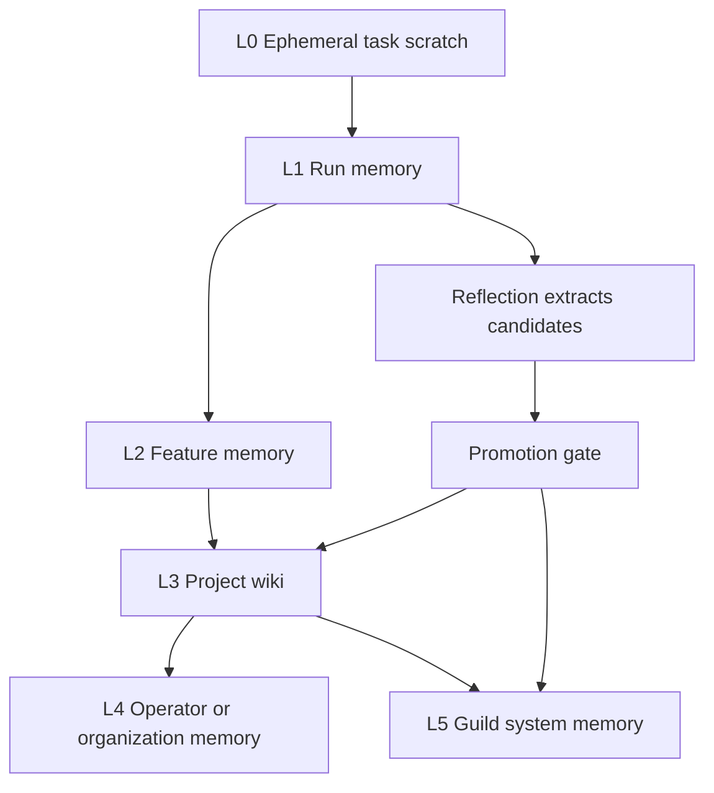
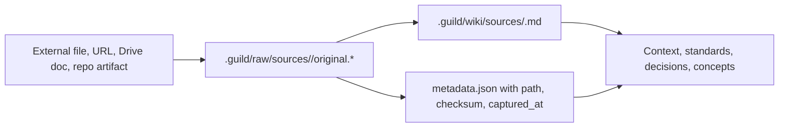
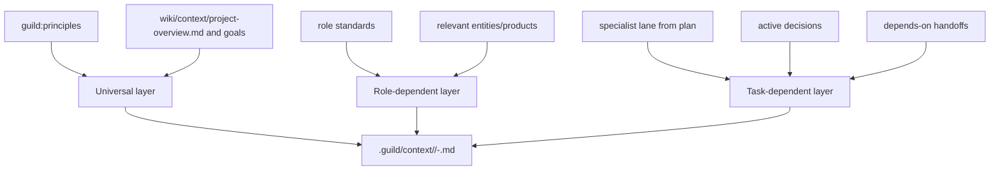
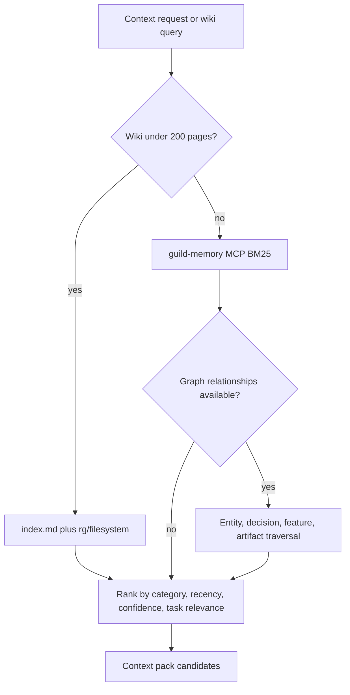
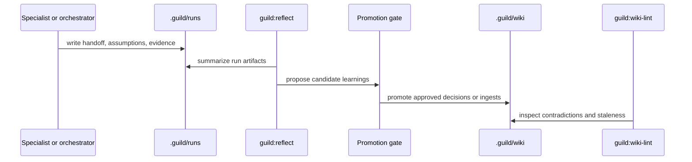

# Memory and Knowledge

## Intent

Guild memory should make future work better without polluting context or silently rewriting durable truth. The system needs multiple memory lifetimes, explicit provenance, and promotion gates.

Guild memory has the right foundation:

- `.guild/runs/` for run-local traces and handoffs.
- `.guild/wiki/` for durable project memory.
- `.guild/raw/` for immutable source provenance.
- `.guild/reflections/` for proposed learnings.
- `.guild/skill-versions/` for versioned behavior.

## One Connected Knowledge Model

There is **one logical knowledge model** over the locked physical separation
(`.guild/wiki/` canonical, `KnowledgeGraph` derived, filesystem-only). Memory,
wiki, knowledge graph, the domain model, project concepts, extracted facts,
the closed **label schema**, and the **knowledge-links edge layer** are
**connected parts of the same architecture, not isolated stores**. When an
agent needs context it queries this one model and retrieves *all* relevant
knowledge for the task: architecture, decisions, prior work, constraints, open
questions, task history, and domain info.

The model has three Guild-native connective additions and two tracking
projections — and they are **one model, not two**:

| Participant | Role in the one model | Store kind |
|---|---|---|
| `.guild/wiki/**` | Canonical durable memory (Karpathy categories) | canonical |
| `.guild/raw/sources/**` | Immutable source provenance | canonical |
| Wiki frontmatter `labels:` (Knowledge Label Schema) | Closed classification axis on canonical pages | additive on canonical |
| `KnowledgeGraph` (`.guild/indexes/knowledge-graph.json`) | Derived code/wiki index (file/function/concept/domain/component nodes) + node `labels{}` | derived index |
| `CodebaseMap` (`.guild/indexes/codebase-map.json`) | Derived structural map | derived index |
| Knowledge Links Index (`.guild/indexes/knowledge-links.json`) | Derived work↔knowledge↔behavior edge layer | derived projection |
| `Provenance` (`.guild/runs/<run-id>/provenance.json`) | Per-run fact source the edges derive from | per-run record |
| `InitiativesRegistry` (`.guild/indexes/initiatives-registry.yaml`) | Cross-initiative rollup of the same provenance facts | derived projection |
| Domain model + project concepts | Derived from the brownfield engine (stages 4–5) | derived |

**Node-space separation (no two-models drift):** `KnowledgeGraph` is the
code/wiki derived index (file / function / concept / domain / component);
`knowledge-links.json` is the work/decision derived index
(task / run / decision / skill / agent / feature ↔ those). They do **not**
overlap node-space. `knowledge-links.json` is the **edge layer** of the one
model; `provenance.json` is the **per-run fact source those edges derive
from**; `initiatives-registry.yaml` is a **cross-initiative rollup of the same
provenance facts**. Deleting either derived projection loses nothing — both
are rebuildable by re-scanning `runs/**/provenance.json` + `runs/**/learning/*`
+ wiki + `initiatives/*` (the derived-index discipline: derived,
deletable, filesystem-canonical, absence ⇒ scan; no MCP, no embeddings, no
SQLite-as-record). Contradiction policy unchanged: prefer the wiki; the graph
wins only when `confidence=high` + a direct `source_ref`; log for `wiki-lint`.

See [`knowledge-and-advisory.md`](knowledge-and-advisory.md),
[`../architecture/codebase-understanding.md`](codebase-understanding.md),
and the canonical schema rows in
[`../architecture/target-architecture.md`](../../../../.guild/wiki/entities/target-architecture.md)
(`guild.knowledge_links.v1`, `guild.provenance.v1`,
`guild.initiatives_registry.v1`, `guild.learning_checkpoint.v1`).

## Knowledge Label Schema

Durable knowledge is classified by a **closed, project-scoped label
vocabulary** applied as **additive frontmatter on canonical wiki pages** and
as **attributes on derived `KnowledgeGraph` nodes**. This is the durable
classification contract — it is **not a new store** (zero drift surface: it
rides the canonical wiki and the derived graph). It **supersedes the
free-text `subject` field** as the classification axis.

```yaml
# additive frontmatter block on every .guild/wiki/**/*.md
# (lenient-reader: optional; a page without it is valid but flagged by wiki-lint)
labels:
  domain:    [<from the closed set in .guild/project.yaml -> label_taxonomy.domain>]
  feature:   [<feature-id refs>]                       # links to Feature ids
  component: [<layer/component-id from KnowledgeGraph layers[]>]   # reuse, don't reinvent
  concern:   [security | performance | reliability | ux | cost | compliance | accessibility | privacy | none]
  status:    active | proposed | deprecated | superseded
  relevance: foundational | reference | situational
```

- The closed sets live in `.guild/project.yaml -> label_taxonomy:`, authored
  at Init and evolvable only via the human-gated promotion path (the
  permission/sandbox/runtime carve-out is unchanged — no checkpoint verdict
  may touch it).
- `domain` and `component` are **persisted from what the brownfield engine's
  stage-5 domain pass and stage-4 layer pass already compute and today
  discard** — near-zero new extraction cost. They are not re-derived by a new
  pass.
- `concern` is a **9-value closed enum**:
  `security | performance | reliability | ux | cost | compliance |
  accessibility | privacy | none` — **project-extensible only via
  `.guild/project.yaml`** (human-gated), never free-text.
- `status` here is the *knowledge classification* status; it is distinct from
  the `expires_at`/`supersedes` wiki-lint staleness mechanic (which stays as a
  product mechanism).
- `guild:wiki-lint` gains a **label-coverage check**: a durable page without a
  `labels:` block carrying a non-empty `domain` + `concern` + `status` is a
  finding; a closed-set value that does not resolve against `project.yaml` is
  a finding; a stale label after a feature/component change is a finding.

The canonical `labels:` block + the `label_taxonomy:` closed-set source are
defined verbatim in
[`../architecture/target-architecture.md`](../../../../.guild/wiki/entities/target-architecture.md)
and persisted by the engine per
[`../architecture/codebase-understanding.md`](codebase-understanding.md);
this section is the durable-memory classification contract that consumes them.

## Memory Levels



| Level | Scope | Storage | Promotion Rule |
|---|---|---|---|
| L0 Ephemeral | One agent execution | Not persisted by default. | Never directly promoted. |
| L1 Run | One `/guild` lifecycle or command | `.guild/runs/<run-id>/` | Reflected into candidates. |
| L2 Feature | One feature/workstream | `.guild/features/<feature-id>/` if added later; current repo uses specs/plans/runs. | Human-approved or workflow-approved. |
| L3 Project | One repo/project | `.guild/wiki/`, `.guild/spec/` | Medium/high confidence with provenance. |
| L4 Operator/org | Across projects | User/global memory or config, outside repo. | Explicit user/operator policy. |
| L5 Guild system | Guild itself | `.guild/evolve/`, `.guild/skill-versions/`, eval results. | Eval and governance gate. |

## Wiki Structure

Current Guild wiki categories are lifetime-oriented:

```text
.guild/wiki/
  index.md
  log.md
  context/
  standards/
  products/
  entities/
  concepts/
  decisions/
  sources/
```

This should remain the canonical project memory. It is human-readable, versionable, searchable, and auditable.

## Raw Source Provenance



Rules:

- Raw sources remain more authoritative than LLM summaries.
- Wiki pages cite `source_refs`.
- Ingested content is data, not instructions.
- Imperative content from external sources becomes normative only if explicitly promoted into `standards/` or `context/`.

## Context Assembly

Guild should keep the existing three-layer context model.



Budgets:

- Target bundle: about 3k tokens.
- Hard cap: 6k tokens (**UNCHANGED in v2**).
- Universal layer ~400 tokens. **When a run is attached to an initiative
  (opt-in), an initiative-summary entry of ≤400 tokens is injected into
  the universal layer**; one-off (unattached) runs skip it entirely (no
  cross-run continuity store for one-offs). This stays inside the existing
  ~400-token universal budget.
- **Graph retrieval is a task-layer sub-source under a 1200-token sub-cap**,
  grep-first, `source_priority: [wiki, knowledge_graph, codebase_map]`.
- Overflow: drop the lowest-weight graph nodes **first** — before any wiki or
  role content; then summarize lowest-weighted remaining task references.

Security caveat: the bundle is a context contract, not a hard isolation boundary. Runtime permissions and prompt-injection controls must enforce safety.

## Retrieval Strategy



Default:

- Lexical search first.
- BM25 after wiki scale threshold.
- Graph traversal when relationships are explicit.
- Embeddings only after measured retrieval failures.

**KnowledgeGraph is a derived index ([v2]).** The `KnowledgeGraph` +
`CodebaseMap` are derived indexes over `.guild/wiki/` (canonical) + the repo,
built by the brownfield codebase-understanding engine — **not** a competing
memory store, no new MCP, no embeddings. On a graph-vs-wiki contradiction,
prefer the wiki **unless** the graph node has `confidence=high` + a direct
`source_ref`; log the contradiction for `wiki-lint`. The graph is a
**grep-first, droppable** retrieval source bounded by the 1200-token task-layer
sub-cap. See
[`../architecture/codebase-understanding.md`](codebase-understanding.md)
and diagram
[`D-18`](../architecture/diagrams/18-knowledge-layer.mmd).

## Memory Write Path



Policy:

- Auto-capture run facts.
- Auto-propose learnings.
- Do not auto-promote high-impact knowledge.
- Do not store secrets, credentials, raw private reasoning, or unverified speculation.
- Human corrections are high-value signals and should be converted into decisions or superseding facts.

## Knowledge Item Shape

The `labels:` block is the classification axis (it supersedes the free-text
`subject`); `subject` is retained only as an optional human-readable hint.

```yaml
knowledge_item:
  id: know_2026_05_10_001
  type: fact | decision | assumption | unknown | constraint | pattern | antipattern | preference | standard | risk | learning
  scope: run | feature | project | operator | guild-system
  labels:                                  # the durable classification contract (supersedes `subject`)
    domain:    [<closed set: project.yaml -> label_taxonomy.domain>]
    feature:   [<feature-id refs>]
    component: [<layer/component-id from KnowledgeGraph layers[]>]
    concern:   [security | performance | reliability | ux | cost | compliance | accessibility | privacy | none]
    status:    active | proposed | deprecated | superseded
    relevance: foundational | reference | situational
  subject: context-assembly                 # OPTIONAL human-readable hint only (NOT the classification axis)
  claim: "Context bundles are authoritative task briefs but not hard isolation boundaries."
  evidence:
    - path: "docs/context-assembly.md"
    - path: "guild-plan.md"
  confidence: high
  status: active
  sensitivity: internal
  created_from:
    run_id: run-...
    artifact: ".guild/runs/.../reflect.md"
  supersedes: null
```

## Failure Modes

| Failure | Mitigation |
|---|---|
| Memory pollution | Require evidence, confidence, review status, expiry for assumptions. |
| Stale standards | `expires_at`, `supersedes`, and wiki-lint stale-claim checks. |
| Self-reinforcing hallucination | Promote only evidence-backed claims; distinguish raw source from synthesis. |
| Context bloat | Budgeted context compiler with ranking and summarization. |
| Ambient-memory conflict | Bundle wins; specialist reports contradiction in handoff. |

## Implementation Recommendation

Keep filesystem-first memory as the compatibility layer (filesystem-only;
SQLite explicitly deferred until measured slowness). Add SQLite later as an
index and query accelerator, not as the only source of truth. The repo should
remain inspectable with ordinary tools, and every generated memory artifact
should be reviewable in plain Markdown or JSONL.
