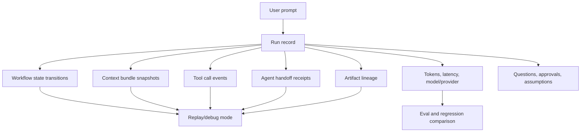
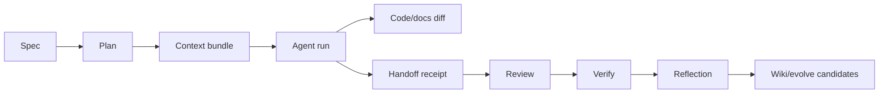
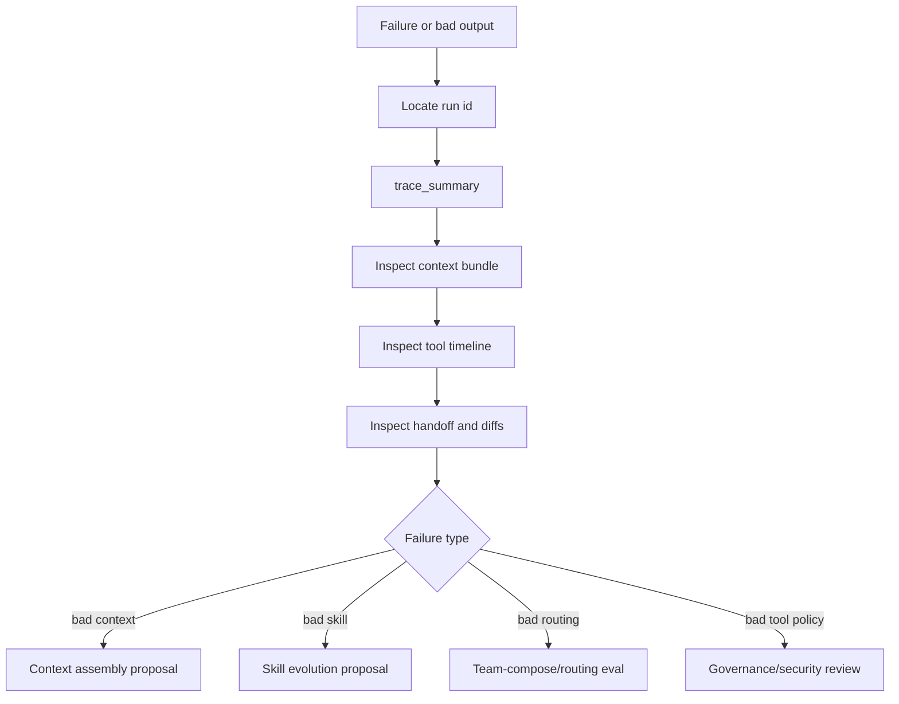

# Observability, Tracing, and Replay

## Intent

Guild should be explainable after the fact. A human should be able to answer:

- What did Guild do?
- Which agent did it?
- What context did the agent see?
- Which tools ran?
- Which artifacts changed?
- Why did the workflow choose this path?
- Can this run be replayed or compared?

The **canonical** trace sink is
`.guild/runs/<run-id>/logs/v1.4-events.jsonl` (one JSON object/line), frozen
as `guild.trace_event.v1`. `.guild/runs/<run-id>/events.ndjson` is a **legacy
compatibility mirror only**. The canonical JSONL is the plugin↔benchmark
contract boundary: the plugin records it; the benchmark repo imports and
analyzes it; the plugin must build and run with the benchmark absent.

## Observability Layers



## Event Streams

| Stream | Path | Purpose |
|---|---|---|
| Canonical trace (frozen) | `.guild/runs/<run-id>/logs/v1.4-events.jsonl` | `guild.trace_event.v1`; plugin↔benchmark contract boundary; source for summaries, reflection, queries, diagnostics, audit. |
| Legacy telemetry mirror | `.guild/runs/<run-id>/events.ndjson` | Legacy compatibility mirror only; never the primary. |
| Handoff receipts | `.guild/runs/<run-id>/handoffs/*.md` | Specialist-completed work, evidence, assumptions, open risks. |
| Context bundles | `.guild/context/<run-id>/*.md` | Exact task context sent to workers. |
| Codex review trail | `.guild/runs/<run-id>/codex-review/*.md` | Adversarial review artifacts when enabled. |
| Broker packets/results | `.guild/runs/<run-id>/review/packets/*.yaml`, `.../review/results/*.yaml` | Cross-host broker frozen packet/result records. |
| Reflections | `.guild/reflections/*.md` | Proposed learnings and improvement candidates; fed **per-phase** by the LearningCheckpoint, not only once at Stop. |
| Per-phase learning checkpoints (`[v2]`) | `.guild/runs/<run-id>/learning/<phase>-<run-id>.yaml` | `guild.learning_checkpoint.v1` — the single learning loop's 12-target verdict + edge-batch; advisory, no new gate (cited from [`target-architecture.md`](../architecture/target-architecture.md)). |
| Per-run provenance (`[v2]`) | `.guild/runs/<run-id>/provenance.json` | `guild.provenance.v1` — per-run continuity fact source written once at run-close, every run incl. one-off. |
| Derived knowledge/initiative indexes (`[v2]`) | `.guild/indexes/knowledge-links.json`, `.guild/indexes/initiatives-registry.yaml` | `guild.knowledge_links.v1` / `guild.initiatives_registry.v1` — derived, rebuildable, deletable projections of provenance + learning + wiki + initiatives; filesystem-canonical, no MCP/embeddings (derived-index discipline). |
| Optional read-through index (`[v2]`) | `.guild/index.sqlite` | Local query convenience for status / stats / initiative status; rebuildable from the canonical JSONL + run files; deletable; gitignored. **NOT the plugin↔benchmark contract** — that stays the canonical JSONL (Invariant NO-CONTRACT-DRIFT). Never authoritative; on any staleness doubt the filesystem scan answers (Invariant FS-CANONICAL). |

## Trace Event Shape (FROZEN, `[v2]` — `guild.trace_event.v1`)

Copy verbatim; do not re-spell field names or the `schema_version` string.

```yaml
trace_event:                                    # schema_version: guild.trace_event.v1
  id: evt_001
  run_id: run_001
  task_run_id: trun_001 | null
  timestamp: "<iso8601>"
  event_type: state_transition | tool_call | artifact_write | approval | validation | error | loop_event
  actor_type: orchestrator | specialist | hook | adapter
  actor_id: backend | claude-code | ...
  host: claude-code | codex-local | codex-cloud | null
  payload_ref: ".guild/runs/run_001/logs/v1.4-events.jsonl#L42" | null
  status: ok | failed | skipped | blocked
  redaction: "path-category-only for secrets; no raw provider prompts"
```

`loop_event` payload: `{gate, round, max_rounds, status, sentinel_seen}`.
`schema_version` allows a future `.v2` without breaking the importer. The
`host` field carries the originating adapter so cross-host runs remain
attributable.

### Optional SQLite read-through index — outside the telemetry-split (`[v2]`)

> **Invariant NO-CONTRACT-DRIFT.** The plugin↔benchmark contract is
> and remains the canonical `logs/v1.4-events.jsonl` (frozen
> `guild.trace_event.v1`); the benchmark imports the JSONL, never the SQLite;
> the index is a plugin-local query convenience explicitly outside the
> telemetry-split boundary; the plugin builds and runs with the index absent
> and with the benchmark absent, independently.

The optional `.guild/index.sqlite` read-through cache (`[v2]`) may
accelerate status / rollup queries but is **never authoritative and never the
contract** — on any staleness doubt the canonical JSONL + filesystem scan
answers and the index re-builds (Invariant FS-CANONICAL). It is gitignored,
deletable with zero data loss, built lazily only past a measured-slowness
threshold, and uses no MCP and no embeddings. The
query-fallback diagram has a `.mmd` companion and an exported SVG at
`diagrams/<n>-sqlite-read-through-index.{mmd,svg}`, cited by id. Full
data-model detail and Invariant FS-CANONICAL live in
[`data-model.md`](data-model.md).

## Artifact Lineage



Every produced artifact should store:

- Producer.
- Source inputs.
- Workflow phase.
- Run ID.
- Task ID.
- Confidence/evidence when it makes claims.

## Replay Modes (`[v2.x]`)

The full replay model is `[v2.x]`. v2 freezes the trace contract so replay
can be built later without a schema break; the modes below are the `[v2.x]`
target, not v2-shipped behavior.

| Mode | Purpose | Mutates Files? |
|---|---|---|
| Trace replay | Rebuild timeline and explain what happened. | No. |
| Context replay | Recreate a worker's input bundle and compare to prior bundle. | No. |
| Eval replay | Run old and new skill/harness against stored fixtures. | Writes only eval outputs. |
| Shadow replay | Test proposed routing/skill behavior against historical tasks. | No live routing changes. |
| Full execution replay | Rerun task in a fresh worktree/sandbox. | Only in isolated workspace. |

## Failure Diagnosis Flow



## Observability UI Requirements

The UI or CLI report should expose:

- Run timeline.
- Current phase and last transition.
- Task DAG with blocked/running/done nodes.
- Per-agent context bundle link.
- Tool-call list with status and duration.
- Artifact graph.
- Approval requests and decisions.
- Cost and token totals.
- Validation outcomes.
- Failure classification.

## Metrics

| Metric | Use |
|---|---|
| Time to approved spec | Brainstorm quality and human burden. |
| Time to approved plan | Planning effectiveness. |
| Agent retry count | Task clarity or runtime instability. |
| Handoff completeness | Review and verify readiness. |
| Context bundle size | Context pressure. |
| Tool failure count | Runtime or permission issues. |
| Validation pass rate | Delivery quality. |
| Reflection promotion rate | Learning signal quality. |

## Implementation Recommendation

Keep raw trace logs append-only and build summaries from them. Summaries can
be regenerated; the canonical `logs/v1.4-events.jsonl` is the audit base. An
optional `.guild/index.sqlite` read-through cache (`[v2]`) may
accelerate rollups but is never authoritative and never the contract; the
canonical JSONL remains the audit base and the sole plugin↔benchmark boundary
(Invariant NO-CONTRACT-DRIFT). The `guild-telemetry` MCP is **read-only** by contract;
recording is done by hook scripts under `plugin/scripts/telemetry/`. Any
write-side schema change bumps `schema_version` (e.g. `.v2`) so old traces
remain queryable and the benchmark importer keeps working.
