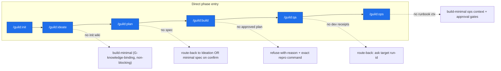
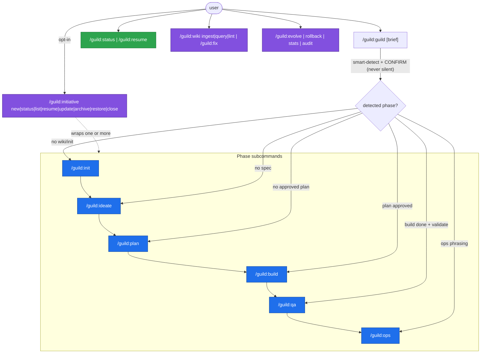

# Phase Entrypoints

Guild v2 exposes product-development phases as first-class entrypoints. The
user can start at any phase, and the orchestrator must build enough context
from local knowledge, repo state, and user input to make that phase safe.

This is **one state machine with six phase entrypoints and three lenses**
(linear / phase / initiative) — see
[lifecycle-overview.md](lifecycle-overview.md) for the canonical framing and
phase→station table. This page is the executable entrypoint contract.

## Command Binding (verb ↔ phase)

Phase *concept* names are used in prose; command *verbs* are used in command
context. v2 retains the `/guild:` colon namespace (required by Claude Code);
v2 drops only the redundant `guild-` prefix — e.g. `/guild:init`, not
`/guild:guild-init` (D1:
[`v2x-command-surface-dispatch-and-internalization.md`](../decisions/v2x-command-surface-dispatch-and-internalization.md)).

| Phase / role | Command | Notes |
|---|---|---|
| Init | `/guild:init` | none required upstream |
| Ideation | `/guild:ideate [brief]` | linear default `/guild:guild [brief]` enters here after detection |
| Planning | `/guild:plan` | requires idea spec |
| Development | `/guild:build [lane-id]` | requires `approved:true` plan + team |
| Quality | `/guild:qa [run-id]` | full `guild:quality` skill `[v2]`; auto-selects + executes E2E/smoke/a11y/perf/integration; frozen `guild.quality.v1` |
| Operations | `/guild:ops [runbook]` | full `guild:operations` skill `[v2]`; 5 runbook classes under 4 safety rails; frozen `guild.ops.v1`/`guild.incident.v1`/`guild.release.v1` |
| (read-only) | `/guild:status` | artifact-presence ladder, prints, never advances |
| (recovery) | `/guild:resume` | restarts first missing/invalid step; `--restart` clears state |
| (opt-in wrapper) | `/guild:initiative <new\|status\|list\|resume\|update\|archive\|restore\|close>` | durable-goal wrapper; asked, never auto-attached |

## Entrypoint Contract (`phase_entry`)

Every phase entrypoint resolves the same frozen contract before any producer
work begins. The contract records the resolved phase + invoking verb, the
owning run / optional initiative, the required-upstream set and how missing
upstream was resolved (`present | build-minimal | route-back |
refuse-with-reason`), the resolved input artifacts, the required memory
layers, the team path, the phase output artifacts (phase primary + handoff /
review trail + the mandatory step-7.5 LearningCheckpoint + run-close
provenance), the review posture (adversarial / advisory-agents /
always-true advisory `learning_checkpoint` / `cross_host`), and the autonomy
window (`interactive_until` / `autonomous_after`).

The single canonical `phase_entry` field body (frozen `guild.phase_entry.v1`,
lenient-reader) is defined **once** in
[`../architecture/target-architecture.md`](../architecture/target-architecture.md)
§`phase_entry` contract (Phase Output Contracts) and enumerated in its
Frozen-Contract Registry. This page consumes it **by pointer** and never
re-spells the field body — same pattern this doc already uses for
`autonomy_contract`. Path: `.guild/runs/<run-id>/phase-entry/<phase>.yaml`.

Primary artifacts are phase-specific (canonical `.guild/` paths only):

| Phase | Primary outputs |
|---|---|
| Init | `.guild/init/<slug>.md`, `.guild/project.yaml`, `.guild/wiki/**`, `.guild/raw/**`; brownfield: `.guild/indexes/codebase-map.json`, (lazy) `.guild/indexes/knowledge-graph.json`, `.guild/wiki/concepts/architecture-map.md` |
| Ideation | `.guild/spec/<idea-slug>.md`, optional `.guild/research/<idea-slug>.md` |
| Planning | `.guild/plan/<slug>.md` (+ inline `## PRD` or standalone `.guild/prd/<slug>.md`), `.guild/team/<slug>.yaml` |
| Development | `.guild/runs/<run-id>/handoffs/*.md`, `.guild/runs/<run-id>/task-runs/<task-id>.yaml`, changed files, `.guild/runs/<run-id>/assumptions.md`, `review.md`, `verify.md` |
| Quality | `.guild/runs/<run-id>/quality/<run-id>.md` (frozen `guild.quality.v1`) + per-class evidence under `quality/evidence/` |
| Operations | `.guild/runs/<run-id>/ops/<run-id>.md` (frozen `guild.ops.v1`); class-applicable `ops/incident.md` (`guild.incident.v1`) / `ops/release.md` (`guild.release.v1`) |

Every phase additionally writes the **mandatory** step-7.5 LearningCheckpoint
artifact `.guild/runs/<run-id>/learning/<phase>-<run-id>.yaml`
(`learning_checkpoint.v1` — canonical in
[`../decisions/continuous-knowledge-and-learning-loop.md`](../decisions/continuous-knowledge-and-learning-loop.md))
and, at run-close, the per-run continuity record
`.guild/runs/<run-id>/provenance.json` (`guild.provenance.v1`, every run incl.
one-off; retention = 90 days for one-off, until-archive when
initiative-attached). Both are STATE artifacts (schemas only — never
progress-log prose). The LearningCheckpoint is automatic, advisory, default
all-`none`, and adds **no new user gate**; its non-`none` verdicts append to
the existing `.guild/reflections/<run-id>.md`. The derived, rebuildable
`.guild/indexes/knowledge-links.json` (work↔knowledge edges) and
`.guild/indexes/initiatives-registry.yaml` (cross-initiative rollup) are pure
projections of `provenance.json` + `learning/*` + wiki + `initiatives/*`;
deleting either loses nothing (rebuilt by re-scan).

## Upstream Resolution (backward-then-forward, executable)

The orchestrator resolves missing upstream by a backward-then-forward
prerequisite resolver — O(stations), never fabricate:

| Direct entry | If required upstream missing | Strategy |
|---|---|---|
| `/guild:init` | n/a | — |
| `/guild:ideate` | no init wiki | `build-minimal` (G-knowledge-binding, non-blocking; stamp `grounded_in: init_minimal`) |
| `/guild:plan` | no idea spec | `route-back` to Ideation, or create minimal spec on user confirm |
| `/guild:build` | no `approved:true` plan | `refuse-with-reason` + exact reproduction command |
| `/guild:qa` | no passing `verify.md` for the run | `route-back`: ask for a target run-id with a passing verify-done (verify-done is the precondition; Quality never runs on an unverified run) |
| `/guild:ops` | Quality recommends BLOCK (not `force_pass`) | `release`/`rollback` classes `refuse-with-reason` (route-back to `/guild:qa` or human force-pass); `monitoring`/`maintenance`/`incident` proceed |
| `/guild:ops` | no Quality artifact / no runbook ctx | `release` class warns + offers `build-minimal` ops context + approval gates; non-release classes proceed |

### Validity + lock check at entry (`[v2]`)

`upstream_resolution` evaluates each required-upstream artifact for
**validity**, not mere presence. An artifact is **valid** iff
(schema/frontmatter parses) AND (required frontmatter fields present) AND
(where applicable, the `approved:` flag check passes). A present-but-invalid
upstream (unparseable, truncated, or missing a required field) is treated
exactly like a missing one — `route-back` / `build-minimal` /
`refuse-with-reason` per the table — so a phase never resolves on a corrupt
upstream. All `.guild/` writes are atomic (temp file then `rename()`), so
this check never races a half-written artifact.

Before any producer work, the entrypoint also acquires the **single-writer
advisory lock** `.guild/.lock` (one per repo `.guild/`, holds
`run-id` + `pid` + `started-at` + `heartbeat-at`). If another run holds it,
the entrypoint surfaces "another run is active" with the standard resume /
abort / force-takeover prompt (surfaced, never silent); a stale lock (holder
`pid` not a live process **OR** `now - heartbeat-at` exceeds
`lock.stale_after_minutes` in `.guild/settings.json`, default 30 minutes) offers
force-takeover. The lock filename, the `heartbeat-at`/`stale_after_minutes`
stale predicate, the validity definition, and the atomic-write rule are
specified once in
[`../architecture/target-architecture.md`](../architecture/target-architecture.md)
(Persistence discipline); this section consumes them by pointer and states
the entry-contract behavior.

At the same Session Intake point — alongside the `.lock` acquisition — the
orchestrator resolves the effective settings and runs the **run-start preflight**
(settings-control-and-tmux initiative, shipped 2026-06-01). This preflight is
**phase-wide**: it is part of command intake before `run-trace start` and
before any phase work, for every `/guild:*` lifecycle command including
`init`, `ideate`, `plan`, `build`, `qa`, `ops`, `status`, `resume`, and the
bare `/guild` smart-detect path.

**Run-start preflight steps** (implemented by
`plugin/scripts/lib/runstart-preflight.ts`):

1. **Resolve settings** through the full 7-source chain
   (`built-in < workspace settings < workspace local < project settings <
   project local < rigor-expansion < CLI`). Every key is tagged with its
   source layer in a per-key source map. See
   [`../architecture/command-surface.md §4.4`](../architecture/command-surface.md)
   for the full chain. All behavior lives in `settings.json`; `project.yaml`
   stays identity-only.
2. **Validate** closed keys (`defaults.*`, `models.*`, etc.). Unknown keys are
   **rejected** (config is human-authored, not lenient-read). An absent
   `defaults:` block applies built-in defaults unchanged (zero-config DX).
3. **Probe tmux.** The prompt condition is evaluated **every run**:
   `needsTmuxPrompt = tmux.available && effective agent_mode != "team"` (OD-3 —
   `auto` and `subagent` both trigger it). When it fires the orchestrator asks:
   "tmux is available. Update settings to use tmux agent teams?" On **yes**,
   `agent_mode: "team"` is persisted at workspace scope via `config set`
   (HARD-SET write) — so on subsequent runs the effective `agent_mode` is
   already `team` and the condition is false (no further prompting). On **no**,
   nothing is persisted, so the same condition holds next run and the prompt
   **may fire again**. The prompt stops only because saying yes changes the
   effective setting — it is not a one-shot flag.
4. **Detect author host and review providers.** Detects: current host family
   (`claude`, `codex`, `gemini`, `pi`, `antigravity`, `unknown`); native
   plugin adapters (`codex-plugin` via `codex:codex-rescue`); external CLIs
   with auth probes. For Claude host with `codex-plugin` available and
   `review: "cross"`, the recommended provider is `codex-plugin` (re-detected
   every run — OD-5). Same-family reviewers never satisfy `review=cross`; an
   unknown author host never synthesizes a reviewer (AC-8).
5. **Build the run-settings snapshot** (`guild.resolved_settings.v1`). Passed
   to `startRun()` which writes it to
   `.guild/runs/<run-id>/resolved-settings.json`. A compact `settings_ref`
   block is added to `run.yaml`. Later phases read back the snapshot via
   `readResolvedSettingsSnapshot()` — mid-run edits to `settings.json` do not
   change behavior for the current run (AC-10).

The resolved profile line (existing pre-first-gate profile print) is expanded
to include the source annotations when `config show --sources` is active. An
unknown `defaults:` key is rejected at this point — no new user gate.

For the canonical precedence ladder see
[`../architecture/command-surface.md §4.4`](../architecture/command-surface.md)
§4.4; for the provider selection rules see
[`../adversarial-review/cross-host-review-and-loop-control.md`](../adversarial-review/cross-host-review-and-loop-control.md).

## D-13 — Phase Entrypoint Resolution (embedded)

The matching SVG lives at
`../architecture/diagrams/13-phase-entrypoints.svg` with a `.mmd` companion;
this embedded mermaid block is the reviewable truth and is byte-identical to
the `13-phase-entrypoints.mmd` companion.



## D-14 — Command Surface (embedded)

The full tiered command surface, smart-detect, opt-in initiative wrapper, and
maintenance verbs. The matching SVG lives at
`../architecture/diagrams/14-command-surface.svg` with a `.mmd` companion;
this embedded mermaid block is the reviewable truth, is byte-identical to the
`14-command-surface.mmd` companion, and is referenced from
`../architecture/v2-index.md` Diagram Index.



### Per-phase LearningCheckpoint (step 7.5) — uniform across every entrypoint

Every entrypoint above runs the automatic step-7.5 LearningCheckpoint at its
existing `A` review boundary. It is a classification verdict over 12 learning
targets plus one knowledge-links edge batch — not an analysis pass and not a
user gate. Each phase that creates knowledge, consumes context, reviews work,
or updates Guild behavior therefore participates in the one connected
knowledge model: the checkpoint reads what the phase already produced
(receipt / review / `provenance.json`) and emits the
`guild.learning_checkpoint.v1` artifact; non-`none` verdicts feed the existing
`.guild/reflections/<run-id>.md` → existing human-gated promotion pipeline.
The contract is canonical in
[`../decisions/continuous-knowledge-and-learning-loop.md`](../decisions/continuous-knowledge-and-learning-loop.md);
this page consumes it by pointer. Net new mandatory
gates from the checkpoint on any path = **0**.

## §5.1 Auto-Detect Contract (always surfaced + gated, never silent)

Bare `/guild:guild [brief]` runs phase detection. Detection is **always surfaced and
gated, never silent**: Guild prints the detected phase, the evidence for it,
and a 3-choice prompt:

```text
Detected phase: <phase>
Why: <evidence — e.g. "no .guild/spec/* found; brief reads as a new idea">
[ proceed ]  [ pick-phase ]  [ explain ]
```

- `proceed` enters the detected phase via its entrypoint contract.
- `pick-phase` lets the user override with any of the six phase verbs.
- `explain` prints the full detection signal table, then re-prompts.

In non-interactive / CI contexts, bare `/guild:guild` with an interactive gate
**hard-fails** with an actionable message:
"interactive gate reached in non-interactive context; pass
`--auto-approve=…` or name a phase". This is safer than implicit autonomy
(consistent with the interactive-by-default policy). `--auto-approve` prints
the detection but does not block.

## Init Entrypoint

Use init when product knowledge is absent, stale, or incomplete.

Existing product path:

1. Inspect repo structure, docs, manifests, tests, and deployment hints.
2. Gather product, users, architecture, standards, and known decisions.
3. Classify knowledge into `.guild/wiki` (proposed pages staged under
   `.guild/init/staging/` first).
4. Preserve source material in `.guild/raw`.
5. Build only the cheap `CodebaseMap` + a confidence-tagged
   `.guild/wiki/concepts/architecture-map.md` stub for Init-done; the deep
   semantic graph is lazy and gated (ask-before-deep-scan).
6. Produce `.guild/init/<slug>.md` with coverage gaps.

New product path:

1. Ask high-level questions about target user, problem, value, constraints,
   differentiation, product type, risk, and success horizon.
2. Create foundational wiki pages from answers.
3. Mark unknowns explicitly rather than inventing them.

The G-init-promote staging gate is interactive: reverse-engineered pages become
durable wiki knowledge only after explicit human approval.

## Ideation Entrypoint

Use ideation when the user wants brainstorming, questioning, research, and
debate. The phase must be interactive: ask clarifying questions, propose
alternatives, research unknowns when allowed, debate tradeoffs, challenge
assumptions, and produce an idea spec. The non-blocking G-knowledge-binding
gate stamps `grounded_in: [<wiki refs>] | init_minimal` and never fabricates.

## Planning Entrypoint

Use planning when an idea spec exists. Planning output must include the
right-sized PRD (inline `## PRD` for small work, standalone
`.guild/prd/<slug>.md` on a right-size trigger), features/actions, task
breakdown, dependencies, edge cases, validation criteria, done conditions,
evidence required per task, and autonomy policy/approval gates. The PRD is
folded into the G-plan gate — there is no separate G-prd gate.

## Development Entrypoint

Use development when tasks are approved and have validation criteria. It runs
within the `task_run.autonomy_policy` level
(`interactive | autonomous_after_plan_approval | auto_approve`); the three
levels' fixed built-in meaning and the immutable always-ask hard set
(destructive / network / spend ALWAYS prompt regardless of level or
`--auto-approve`) are specified once in
[`../architecture/target-architecture.md`](../architecture/target-architecture.md)
(`autonomy_policy` — fixed 3-level semantics). The richer per-lane
`autonomy_contract` is an **additive optional key on `task_run`**, `[v2]`
(canonical shape — closed op-class enum, Invariant AC-1 AND-mask,
lenient-reader rule — stated once in `target-architecture.md` and
consumed here by pointer, never re-spelled). Run security review and
architecture review for every development phase (findings or an explicit
`not_applicable` signoff). If a task lacks done criteria, route back to
planning.

## Quality Entrypoint

Use quality after a *passing* development verify-done. `/guild:qa` runs the
full `guild:quality` skill `[v2]`: it auto-selects the applicable check set
(E2E/smoke/a11y/perf/integration) from on-disk signals, surfaces the matrix
for `[proceed] [edit-selection] [explain-signals]` (never silent), executes
*discovered* harnesses under the run sandbox + budgets, runs the G-quality
challenger (advisory), and ends at the interactive release/blocker gate. The
verify-done boundary is fixed by four non-overlap invariants (verify-done =
per-run gate; Quality = optional product-release phase) — see
[lifecycle-overview.md](lifecycle-overview.md). `/guild:qa` with no passing
`verify.md` ⇒ `route-back`. Output: `.guild/runs/<run-id>/quality/<run-id>.md`
(frozen `guild.quality.v1`) + per-class evidence. Net new mandatory gates on
the default (non-qa) path = 0 (opt-in entry, never auto-entered).

## Operations Entrypoint

Use operations to carry the product into production. `/guild:ops [runbook]`
runs the full `guild:operations` skill `[v2]` (verb `ops`). It dispatches
one of five runbook classes
(release/monitoring/incident/rollback/maintenance) under a split autonomy
posture bounded by **four non-negotiable safety rails**: no class autonomous
for an unproven runbook (first run of any runbook ALWAYS interactive);
`incident`+`rollback` NEVER autonomous regardless of approval; the always-ask
hard set (destructive/network/spend) is unconditional even inside an
`approved:true` runbook even under `--auto-approve=all`; a mandatory
pre-flight dry-run. Runbook approval lowers the soft gate only — never the
hard set; the canonical `autonomy_contract`/enum/hard-set text lives in
[`../architecture/target-architecture.md`](../architecture/target-architecture.md)
and is consumed by pointer. `/guild:ops` consumes Quality and feeds the D8
release leg. Output: `.guild/runs/<run-id>/ops/<run-id>.md` (frozen
`guild.ops.v1`) + class-applicable `guild.incident.v1`/`guild.release.v1`.
