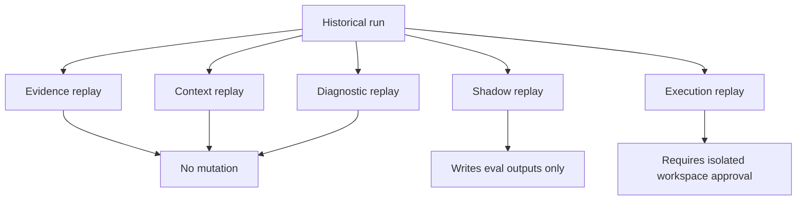
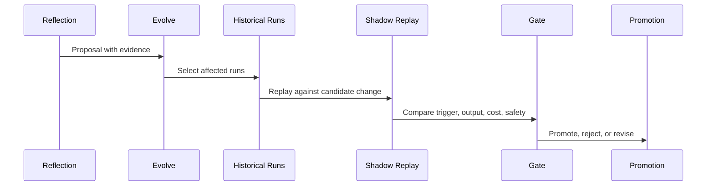

# Run Replay And Evolution Workflows

Status: replay model is `[v2.x]`; the reflection→evolve queue is `[v2]` and
unchanged. v2 freezes the run/trace contracts so replay can be built later
without a schema break.

## Intent

Guild is initiative-centric, but runs remain essential. Runs provide
evidence, replay, diagnostics, eval fixtures, and learning material for skills
and tools.

The design goal is not perfect deterministic replay. The goal is useful
replay modes with explicit mutation boundaries. **Replay itself ships in
`[v2.x]`**; v2 only freezes the contracts it will consume.

## Run Record Contract

Every run should produce:

```text
.guild/runs/<run-id>/
  run.yaml
  timeline.jsonl
  events.ndjson
  logs/
  context-refs.json
  handoffs/
  artifacts/
  evidence/
  assumptions.md
  decisions.md
  review.md
  verify.md
  summary.md
```

`run.yaml` is the target primary run manifest. During migration, `metadata.json` remains supported for current tools and `run.yaml` is written beside it.

```yaml
schema_version: guild.run.v1
run:
  id: run-2026-05-16-abcdef12
  project_id: guild
  initiative_id: init-example
  session_id: sess-2026-05-16-001
  command: "/guild"
  phase: execute
  status: running | blocked | failed | complete | verified
  host_provider: claude-code | codex-local | codex-cloud | other
  model_policy_ref: ".guild/settings.json"
  started_at: "<iso>"
  finished_at: null
  context_refs: ".guild/runs/<run-id>/context-refs.json"
```

`context-refs.json`:

```json
{
  "schema_version": "guild.context_refs.v1",
  "run_id": "run-2026-05-16-abcdef12",
  "bundles": [
    {
      "task_id": "backend-api-001",
      "specialist": "backend",
      "path": ".guild/context/run-2026-05-16-abcdef12/backend-api-001.md",
      "sha256": "<bundle-sha>",
      "source_refs": [
        {
          "path": ".guild/wiki/context/project-overview.md",
          "sha256": "<source-sha>"
        }
      ]
    }
  ]
}
```

## Event Model (frozen contract — do not re-spell)

The trace event is **frozen** as `guild.trace_event.v1` in
[`data-model.md`](data-model.md) and
[`observability-tracing-replay.md`](observability-tracing-replay.md): canonical
sink `.guild/runs/<run-id>/logs/v1.4-events.jsonl`, `events.ndjson` legacy
mirror, with `host` and `loop_event` (payload
`{gate, round, max_rounds, status, sentinel_seen}`). Replay consumes that
frozen schema; it does not define its own. Forward-compatibility is via
`schema_version` (future `.v2`) — replay must not require a schema break.

Privacy rule: raw tool payloads are not shared by default. Redaction is
path-category-only for secrets; never raw provider prompts. Any
prompt-text-storing legacy behavior must be redacted/hashed by default and
raw prompts kept only when config explicitly allows.

Redaction rule:

- Never write secret values to replayable artifacts.
- Prefer path/category evidence over raw content for secrets and credentials.
- Keep raw provider prompts local unless `share_mode: shared` explicitly opts in.
- Summaries should be regenerable from raw local traces, but safe to share in hybrid mode.

## Replay Modes



| Mode | Question | Default Mutability |
|---|---|---|
| Evidence replay | What happened and what evidence exists? | Read-only. |
| Context replay | What did each worker see? | Read-only. |
| Diagnostic replay | Why did this fail or drift? | Read-only by default. |
| Shadow replay | Would a changed skill/tool/model behave better? | Writes eval output only. |
| Execution replay | Can the work be rerun? | Requires sandbox/worktree and approval. |

## Replay command (`[v2.x]`)

The replay surface is `[v2.x]`. Under the clean-slate command grammar there
is no `/guild:` colon namespace; replay attaches to the run/initiative noun
surface when it ships. Target shape:

```text
guild <run-noun> replay <run-id> [--mode=evidence|context|diagnostic|shadow|execution]
```

Evidence replay steps:

1. Load `run.yaml`.
2. Render timeline.
3. Show initiative/work item attachment.
4. Show artifacts and evidence links.
5. Show review and verify outcome.
6. Show unresolved followups.

Context replay steps:

1. Load context bundle refs.
2. Verify hashes when present.
3. Show bundle source list and summarized bundle body.
4. Compare against current wiki if requested.
5. Classify drift: missing, changed, superseded, stale.

Diagnostic replay steps:

1. Select failure or suspicious output.
2. Reconstruct phase state.
3. Inspect context and evidence.
4. Classify failure: bad context, bad plan, bad routing, bad skill, bad tool policy, bad validation.
5. Write diagnostic report under the run or initiative.

Shadow replay steps:

1. Select candidate skill/tool/model change.
2. Select historical runs by affected skill, role, command, or failure mode.
3. Re-run prompt/program or routing decision against stored artifacts.
4. Compare old vs new outputs.
5. Produce promotion report.

Execution replay steps:

1. Require explicit approval.
2. Create isolated worktree or sandbox.
3. Check out target revision if known.
4. Rehydrate inputs.
5. Execute bounded task.
6. Never write into the live worktree.

## Evolution Workflow (`[v2]`, unchanged)

The reflection→evolve queue is **unchanged** from the shipped structure:
`guild:reflect` → improvement queue → `guild:evolve-skill` (snapshot → eval →
paired baseline/proposed → flip → shadow → promotion gate → description
optimizer → promote/archive) → `guild:rollback-skill` +
`guild:create-specialist`. Replay-driven shadow comparison feeds the same
queue; it does not replace it. Evolution may NEVER edit
permission/sandbox/runtime policy — proposal-only, human-gated.

The queue is fed **per-phase**, not only once at Stop: the single
per-phase LearningCheckpoint (`guild.learning_checkpoint.v1`, stated
canonically in
[`target-architecture.md`](../architecture/target-architecture.md), cited by
pointer) appends every non-`none` verdict to the **existing**
`.guild/reflections/<run-id>.md` at each phase's review boundary —
attributed per phase, no new gate, no new promotion path.

A **template-defect proposal** is a first-class evolution input alongside
reflections: when the one-vs-template classifier (also cited from
[`target-architecture.md`](../architecture/target-architecture.md)) buckets a
proposal as *systemic*, it enters as a human-gated template-change at the
interactive template-change gate.
For a **breaking** template change, a **conformance scan** runs as a
shadow-adjacent pre-migration step: it reports which `.guild/{skills,agents}/`
instances diverge from the new canonical skeleton, *without mutating any
instance*. Per-instance migration then runs lazily through the same
`guild:evolve-skill` paired-eval + shadow gate — never bulk find-replace,
never auto-applied. An **additive** template change is a lenient-reader
no-op (conformance note only, no migration).



Evolution inputs:

- reflections (per-phase via the LearningCheckpoint)
- template-defect proposals (systemic verdict; human-gated)
- failed reviews
- context drift reports
- repeated missing-specialist gaps
- user corrections
- replay diagnostics

Promotion gates:

- paired evals pass
- shadow replay shows improvement or no regression
- conformance scan run for a breaking template change (instances reported,
  none mutated; per-instance migration is lazy + gated)
- trigger boundaries tested
- safety and permissions unchanged or improved (never auto-edited)
- rollback snapshot exists
- human approval when behavior changes materially, and **always** for a
  canonical template change at the interactive template-change gate

## Research Skill Evolution

The K-Dense extraction suggests experimental research-methodology skills, but they should enter through replay and evals:

1. Add `guild:research-router` as experimental.
2. Build fixtures from historical research tasks.
3. Shadow route old prompts.
4. Measure wrong trigger, missing source, unsupported claim, overbroad research.
5. Promote only after evals and human review.

## Run-To-Initiative Updates

At run completion:

1. `verify.md` updates work item evidence.
2. `review.md` adds blocking or non-blocking followups.
3. `summary.md` attaches to initiative run index.
4. `reflect` writes skill/tool proposals.
5. `initiative-update` updates status axes.
6. `doc-impact` may create docs work items.

No single run can close an initiative unless release and docs gates pass.

## Failure And Privacy Edge Cases

| Case | Behavior |
|---|---|
| Run has no initiative | Replay still works; status reports as one-off. |
| Context bundle missing | Replay reports incomplete trace and suggests diagnostic. |
| Raw event log contains sensitive data | Keep local; summaries can be shared if sanitized. |
| Model/provider changed | Shadow replay compares behavior, not exact determinism. |
| Historical code revision unavailable | Execution replay blocked unless user supplies ref. |
| Skill was deleted or renamed | Use skill snapshot or mark replay degraded. |
| Multiple runs changed same work item | Initiative evidence list preserves all refs. |

## Required Implementation Units (`[v2.x]` for replay)

- Command: run/initiative-noun replay surface (no `/guild:` colon
  namespace) — `[v2.x]`.
- Skills: `guild:run-replay`, `guild:diagnose-run`, `guild:initiative-update`
  — `[v2.x]`.
- Scripts: `attach-run-to-initiative.ts`, `trace-replay.ts`,
  `context-replay.ts`, `select-shadow-runs.ts` — `[v2.x]`.
- Schemas: replay consumes the **frozen** `guild.trace_event.v1` and the
  frozen run contract; replay defines only `replay-report.schema.json`.
- Hook changes: include `host`, `task_run_id`, and `schema_version` per the
  frozen `guild.trace_event.v1` shape (recorded by
  `plugin/scripts/telemetry/`).
- Tests: evidence replay, missing context replay, shadow replay dry run,
  privacy redaction — `[v2.x]`.
