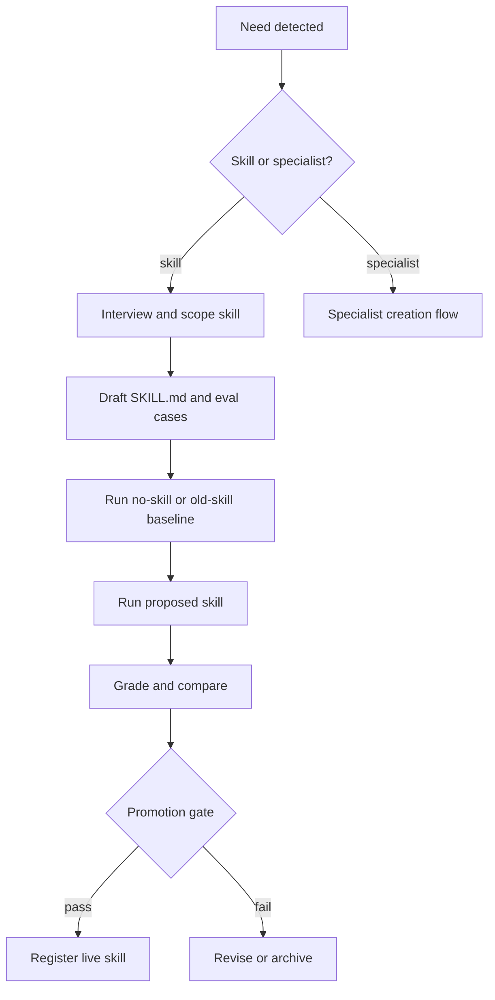
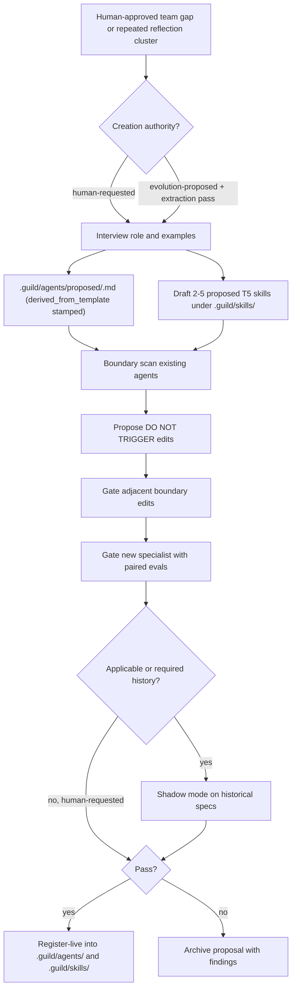
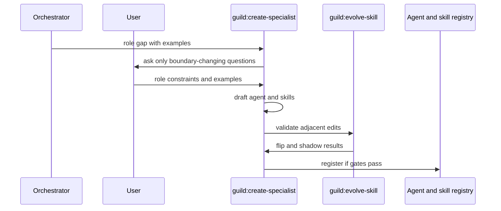

# Skill Creator

## Intent

The skill creator is Guild's controlled factory for new reusable capabilities. It should create skills and specialists only when there is a stable boundary, enough examples, and an eval path.

This doc separates two cases:

- New or improved skill inside an existing specialist/domain.
- New specialist, including adjacent boundary updates.

The `writing-skills` meta-tier fork (`skills/meta/writing-skills/`, §2.7,
MIT-attributed superpowers §13) is the **authoring discipline** for both
cases: every drafted or evolved `SKILL.md` follows its RED baseline → minimal
skill → rationalization-counter method before it reaches the promotion gate.
It pairs with `guild:evolve-skill` and `guild:create-specialist`.

## Skill Creation Flow



## Canonical Skill Template

There is exactly **one** canonical skill skeleton:
`plugin/templates/skills/SKILL.template.md` (`guild.skill_template.v1`),
shipped as **static, read-only plugin install state**. It pins the
frontmatter keys + the required section-heading set only — no body prose.
The version string, `derived_from_template` invariant, and the `.guild/`
instance boundary are stated once in
[`target-architecture.md` → Canonical template-version strings](../../../../.guild/wiki/entities/target-architecture.md)
and cited here by pointer, never re-spelled.

Creation-from-template is a fill, not a fork:

1. Copy the heading/key skeleton from the canonical `SKILL.template.md`.
2. `writing-skills` (the `skills/meta/writing-skills/` fork, §2.7,
   MIT-attributed superpowers §13) is the **authoring discipline that fills**
   the skeleton — RED baseline → minimal skill → rationalization-counter
   method. It is the method, not the skeleton.
3. The instance is written to the consuming repo's **`.guild/skills/`**
   (never plugin state, never outside `.guild/`) with mandatory
   `derived_from_template: guild.skill_template.vN` frontmatter.

The filled instance still satisfies the scope contract: id, owner, triggers,
non-triggers, inputs, outputs, validation, evidence, risks — and the body
requirements below (when/when-not, inputs, output format, workflow,
evidence, escalation, safety, eval cases). The template pins where these
live; `writing-skills` pins how they are written.

## Skill Body Requirements

A good Guild skill is a playbook, not a vague persona. It should include:

- When to use it.
- When not to use it.
- Required inputs.
- Output format.
- Workflow steps.
- Evidence requirements.
- Escalation rules.
- Safety constraints.
- Eval cases.

## Skill Template & Migration

A skill **instance** issue and a skill **template** defect are different
problems with one shared classifier (the one-vs-template classifier, stated canonically
in
[`target-architecture.md` → Canonical template-version strings](../../../../.guild/wiki/entities/target-architecture.md)
and cited here by pointer):

- A single classifier step in `guild:reflect` — and, per phase, the
  LearningCheckpoint's `skill_template` column — buckets every skill
  improvement proposal as **specific** (one skill's body is wrong → the
  existing per-instance evolve queue) or **systemic** (the canonical
  skeleton itself is wrong → `.guild/evolve/template/skill/<v>/`).
- A **systemic** verdict requires ALL of: ≥3 distinct skills exhibiting the
  defect (or ≥2 in a single run), the **same machine-checkable defect
  signature**, and explicit user approval at the **interactive
  template-change gate** — the only interactive template-change gate. It is
  proposal-only and human-gated by construction (agents emit candidates;
  only the human-gated promotion path acts).
- This generalizes the same ≥3-distinct extraction-signal mechanic the
  specialist factory already uses, from new-role to template-change. One
  classifier, two entry points (reflect + checkpoint), one threshold.

**Migration is lazy and staged, never big-bang.** An approved template
version bump records the new template + a conformance report only — it
mutates **zero** instances:

- **Additive change** (a new optional heading/key): lenient-reader no-op. A
  `vN` instance stays valid under a `vN+1` additive template; a
  non-conformance note is recorded, no migration runs.
- **Breaking change** (a renamed/removed required heading): each instance is
  migrated lazily through the **existing** `guild:evolve-skill` paired-eval
  + shadow gate — when the instance is next evolved or explicitly selected
  (`/guild evolve <id> --to-template=vN`). Never a bulk find-replace, never
  auto-applied. Self-evolution may never edit permission/sandbox/runtime
  policy through this path (see the permission carve-out below).

## Specialist Creation Flow



> **`.guild/` instance boundary (binding).** `create-specialist`,
> `evolve-skill`, and every factory write target the **consuming repo's
> `.guild/agents/` and `.guild/skills/`** — never the plugin install dir.
> The plugin ships only the canonical/base read-only library + the two
> templates; project-authored and evolved instances are project state. A
> runtime write into plugin state is a v2 defect. Every instance carries
> `derived_from_template: guild.{skill,agent}_template.vN`; project specialists
> dispatch immediately by definition path rather than host-native registration. The single enforceable
> boundary rule + the PreToolUse signature guard are stated once in
> [`target-architecture.md`](../../../../.guild/wiki/entities/target-architecture.md) and the
> ownership-map ADR — cited here by pointer.

## Boundary Scan

Boundary scan exists because new specialists can degrade existing routing.

Inputs:

- New specialist description.
- New specialist examples.
- Existing `agents/*.md` descriptions.
- Existing `should_trigger` and `should_not_trigger` evals.

Outputs:

- Overlap report.
- Proposed `DO NOT TRIGGER for: <new-domain>` text.
- New positive and negative eval cases.

## Graduation Criteria

| Candidate | Required Before Graduation |
|---|---|
| Skill | At least one passing positive eval, no severe regression, output contract clear. |
| Specialist | Trigger evals, adjacent boundary evals, shadow-mode results, handoff contract, 2-5 skills or explicit initial-skill set. |
| Boundary edit | Existing specialist still triggers on core domain and stops stealing new domain. |

## Example Skill Creator Sequence



## Prompt Program Shape

The skill creator itself should become a prompt program:

```yaml
prompt_program:
  id: guild_skill_creator
  version: 1
  inputs:
    - role_or_skill_gap
    - examples_positive
    - examples_negative
    - adjacent_agents
    - source_docs
  outputs:
    - proposed_skill_body
    - eval_cases
    - boundary_report
    - promotion_checklist
  validators:
    - no_missing_output_contract
    - no_boundary_overlap_without_negative_eval
    - no_permission_escalation_without_human_gate
```

## Failure Modes

| Failure | Prevention |
|---|---|
| Skill too broad | Require non-triggers and negative evals. |
| Specialist steals adjacent work | Boundary scan plus adjacent evals. |
| Prompt drift | Version every prompt and compare against baseline. |
| No evidence of value | Require flip report or explicit user approval. |
| Unsafe capability increase | Human approval for tool, permission, or sandbox changes. |

## Permission Carve-Out

The skill creator may **NEVER** mint or evolve a skill/specialist that edits
permission, sandbox, or runtime policy. Such changes are proposal-only and
human-gated. This applies identically to the new skills — `guild:init` and
the 4 superpowers forks are self-evolvable for body/clarity/examples, but the
permission/sandbox/runtime carve-out applies to them unchanged. The
`no_permission_escalation_without_human_gate` validator in the skill-creator
prompt program enforces this at draft time.

## The 4 Superpowers Forks (placement / trigger / attribution)

Net-new gap capabilities in v2 are the four superpowers forks. The skill
creator does **not** re-author these from scratch — they are forked,
MIT-attributed (each ships a `LICENSE-attribution.md`), and registered at
their tiered placement:

| Fork | Placement | Trigger | Pairs with | Attribution |
|---|---|---|---|---|
| `verify-claim` | `skills/fallback/verify-claim/` | before ANY completion/success language; independent VCS-diff before trusting a handoff receipt | `guild:verify-done`, `guild:review` | superpowers v5.0.7 §8, MIT © 2025 Jesse Vincent |
| `writing-skills` | `skills/meta/writing-skills/` | authoring/evolving a skill | `guild:evolve-skill`, `guild:create-specialist`, factory | superpowers §13, MIT |
| `dispatching-parallel-agents` | `skills/meta/dispatching-parallel-agents/` | `guild:execute-plan` fan-out | `guild:execute-plan` | superpowers §5, MIT |
| `receive-review` | `skills/fallback/receive-review/` | specialist responding to review findings | `guild:request-review` | superpowers §10, MIT |

## Implementation Recommendation

Use the existing `guild:create-specialist` and `guild:evolve-skill` semantics
as the production path, with `writing-skills` as the authoring discipline. Do
not add a shortcut that writes live agents or skills directly. Net-new
capabilities incubate under proposed `.guild/` paths, run evals, and graduate
through the same promotion gate and permission carve-out as skill edits.
