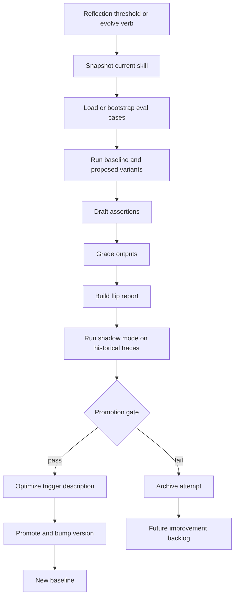
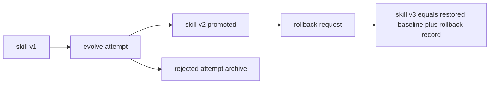
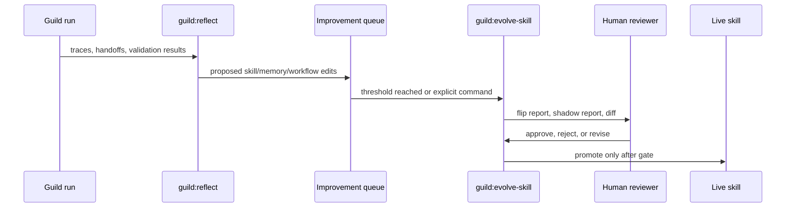

# Skills and Self-Evolution

## Intent

Guild should learn from real work, but it must not silently mutate its behavior. Self-evolution means measured, versioned, reversible improvement of skills, agent definitions, prompts, routing rules, context-packaging policies, and harnesses.

Guild implements the core shape (structure unchanged in v2):

- `guild:reflect` proposes improvements after meaningful runs → improvement
  queue.
- `guild:evolve-skill` runs the evolution pipeline; `guild:rollback-skill`
  is a forward-moving snapshot; `guild:create-specialist` incubates new
  specialists.
- `scripts/evolve-loop.ts`, `flip-report.ts`, `shadow-mode.ts`, and
  `description-optimizer.ts` support the eval pipeline.
- `.guild/skill-versions/` stores rollback snapshots.

The `writing-skills` meta-tier fork (§2.7) is bound to this pipeline: it is
the authoring/evolving discipline (RED baseline → minimal skill →
rationalization counters) used by `guild:evolve-skill`,
`guild:create-specialist`, and the factory whenever a skill body is authored
or revised.

## Evolution Pipeline

## Trigger Sources

| Trigger | Condition | Output |
|---|---|---|
| LearningCheckpoint verdict | The per-phase LearningCheckpoint (one loop, no new gate) emits a non-`none` verdict on `skill_def` / `agent_def` / `skill_template` / `agent_template`. | Appended to `.guild/reflections/<run-id>.md` → the existing evolve queue, attributed per phase. |
| Reflection threshold | Three or more proposed edits accumulate for a skill. | Evolve candidate. |
| Explicit command | User runs the `evolve` maintenance verb for a skill. | Evolve run. |
| Specialist extraction | Repeated co-activation, context pressure, or recurring team-compose gaps. | Proposed specialist candidate. |
| Failure diagnosis | The `fix` maintenance verb finds recurring workflow or skill failure. | Gated self-fix plan. |

The LearningCheckpoint is the **single learning loop**
(`guild.learning_checkpoint.v1`, stated canonically in
[`target-architecture.md`](../../../../.guild/wiki/entities/target-architecture.md), cited by
pointer — automatic, advisory, no new user gate). Its `skill_def` /
`agent_def` / `skill_template` / `agent_template` columns invoke the
**one-vs-template classifier** (also cited by pointer): each proposal
is bucketed **specific** (one instance → per-instance evolve queue) or
**systemic** (the canonical skeleton itself → `.guild/evolve/template/
{skill,agent}/<v>/`). A systemic verdict requires ALL of ≥3 distinct
skills/agents (or ≥2 in one run) + the same machine-checkable defect
signature + explicit user approval at the interactive template-change gate.
Every non-`none` verdict routes to the **existing**
`.guild/reflections/<run-id>.md` → the **existing** human-gated promotion
pipeline; no new promotion path is created.

## Promotion Gate

Promote if any condition is true:

1. Zero regressions and at least one fix.
2. No behavioral flip and token usage drops by at least 10 percent.
3. Regressions exist but the user approves after seeing the report.

Reject or defer otherwise. Rejection is not destructive; the attempt remains useful data.

## What Can Evolve

| Component | Allowed Autonomous Scope | Requires Human Approval |
|---|---|---|
| Skill body (instance) | Clarifying workflow steps, output schema, examples, anti-pattern checks. | High-impact behavior changes. |
| Agent definition (instance) | Trigger text, DO NOT TRIGGER boundaries, handoff expectations. | Tool permissions, isolation changes, model changes. |
| Skill/agent **template** (canonical skeleton) | Nothing autonomous. | **Always** human-gated at the interactive template-change gate; a systemic-defect verdict only proposes — the version bump + lazy/staged migration are approved by a human, never auto-applied. |
| Prompt programs | Variables, rubrics, validators, examples. | Safety or approval policy changes. |
| Retrieval policy | Ranking weights and context packaging heuristics. | Sources treated as normative. |
| Harness | Extra review or validation steps. | Removing gates or lowering safety constraints. |
| Runtime permissions | Proposals only. | Always human/policy controlled. |

## Evolution Cannot Edit Permissions

Self-evolution may **NEVER** edit permission, sandbox, or runtime policy. It
is proposal-only and human-gated. Any proposed edit that touches a gate, the
ask-before-deep-scan guard, or an evidence threshold is **safety-adjacent**
and requires human approval, enforced by the existing promotion-gate
classification. This rule applies **identically to the new skills** —
`guild:init` and the 4 superpowers forks are self-evolvable for
body/clarity/examples, but the permission/sandbox/runtime carve-out applies
to them unchanged.

## The 4 Superpowers Gap-Forks

All four superpowers gaps are forked/internalized (never runtime deps; MIT
attribution; each ships a `LICENSE-attribution.md`). They are
self-evolvable for body/clarity/examples under the same promotion gate and
the same permission carve-out:

> **Status: `[v2]` (to-be-created).** All four "Disk placement" paths below
> are **not yet on disk** — they are the v2 build targets for these gap-forks,
> not existing artifacts. Do not read the path column as "already shipped".

| Fork | Disk placement (`[v2]` — to be created) | Trigger | Pairs with | Attribution |
|---|---|---|---|---|
| `verify-claim` (verification-before-completion) | `skills/fallback/verify-claim/` | before ANY completion/success language; adds an independent VCS-diff before trusting a handoff receipt into `guild:review` | `guild:verify-done`, `guild:review` | superpowers v5.0.7 §8, MIT © 2025 Jesse Vincent |
| `writing-skills` | `skills/meta/writing-skills/` | authoring/evolving a skill (RED baseline → minimal skill → rationalization counters) | `guild:evolve-skill`, `guild:create-specialist`, factory | superpowers §13, MIT |
| `dispatching-parallel-agents` | `skills/meta/dispatching-parallel-agents/` | `guild:execute-plan` fan-out (concurrency-safe, context isolation, merge rules) | `guild:execute-plan` | superpowers §5, MIT |
| `receive-review` (receiving-code-review) | `skills/fallback/receive-review/` | specialist responding to review findings (push back only with technical reasoning) | `guild:request-review` | superpowers §10, MIT |

Tiering (at superpowers-internalization time): `writing-skills` +
`dispatching-parallel-agents` → **meta** tier; `verify-claim` +
`receive-review` were forked into the then-existing **fallback** tier. That
`fallback/` tier has since been **promoted into `meta/` / folded into
`guild:review`** — so the live meta-tier count is enumerated from
`skills/meta/` (currently **31**), not a fixed 18+3.

## Skill Version Model

Rollback is forward-moving. It restores content but records the rollback as a new version so history stays intact.

## Shadow Mode

Shadow mode runs proposed behavior against historical traces without changing live routing.

Inputs:

- Historical prompts or run traces.
- Current skill behavior.
- Proposed skill behavior.
- Boundary evals for adjacent specialists.

Outputs:

- Trigger precision/recall.
- Boundary collisions.
- Token deltas.
- Output-quality divergence.
- Regressions needing human review.

Shadow mode is diagnostic. It should never mutate live routing.

## Reflection to Evolution Flow

## Guardrails

- Never learn directly from an unverified model claim.
- Never promote secrets or private scratch reasoning.
- Never let a skill change bypass its own eval suite.
- Never let self-evolution weaken permission, sandbox, or approval policy without explicit human approval.
- A canonical-template change is **human-gated, never auto-applied**;
  migration is lazy and staged (additive = lenient-reader no-op; breaking =
  per-instance gated evolve), never a bulk find-replace.
- Every project-authored or evolved instance is written under the consuming
  repo's `.guild/{skills,agents}/`, never plugin state, never outside
  `.guild/` (the `.guild/` instance boundary; rule + guard cited from
  [`target-architecture.md`](../../../../.guild/wiki/entities/target-architecture.md)).
- Keep old versions addressable and inspectable.

## Metrics

| Metric | Meaning |
|---|---|
| Fix count | Previously failing evals that pass after the proposal. |
| Regression count | Previously passing evals that fail after the proposal. |
| Trigger precision | How often the skill fires only when appropriate. |
| Trigger recall | How often the skill fires when it should. |
| Boundary collision count | Overlap with adjacent specialists. |
| Token delta | Cost/latency change. |
| Rollback frequency | Long-term signal for over-aggressive promotion. |

## Implementation Recommendation

Treat skills like production code:

- Every skill has a version.
- Every evolution attempt has inputs, outputs, metrics, and a decision.
- Every accepted change has a rollback path.
- Every rejected change becomes training data for future proposals.
