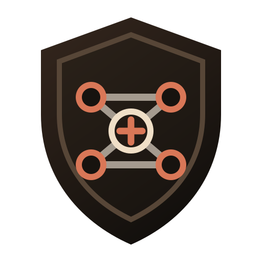
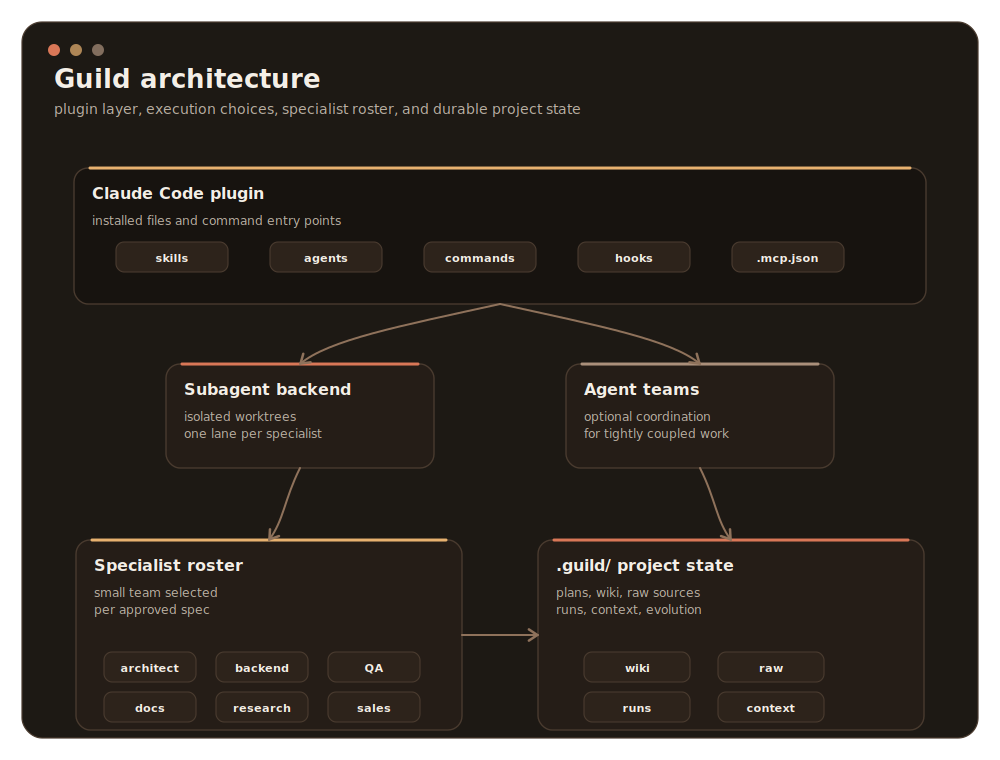
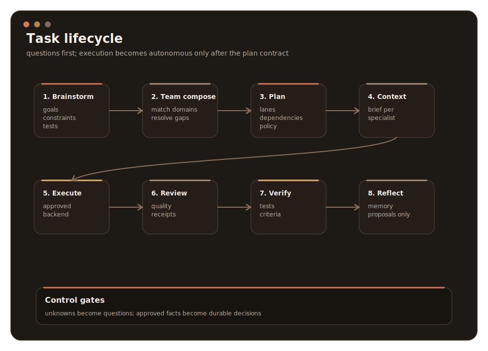
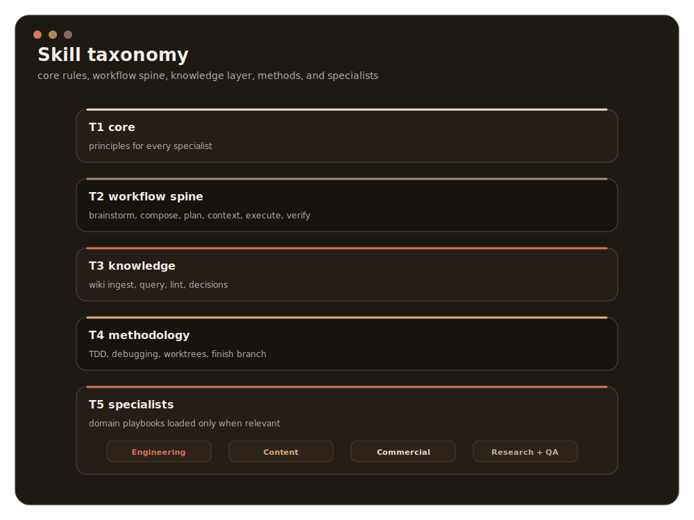
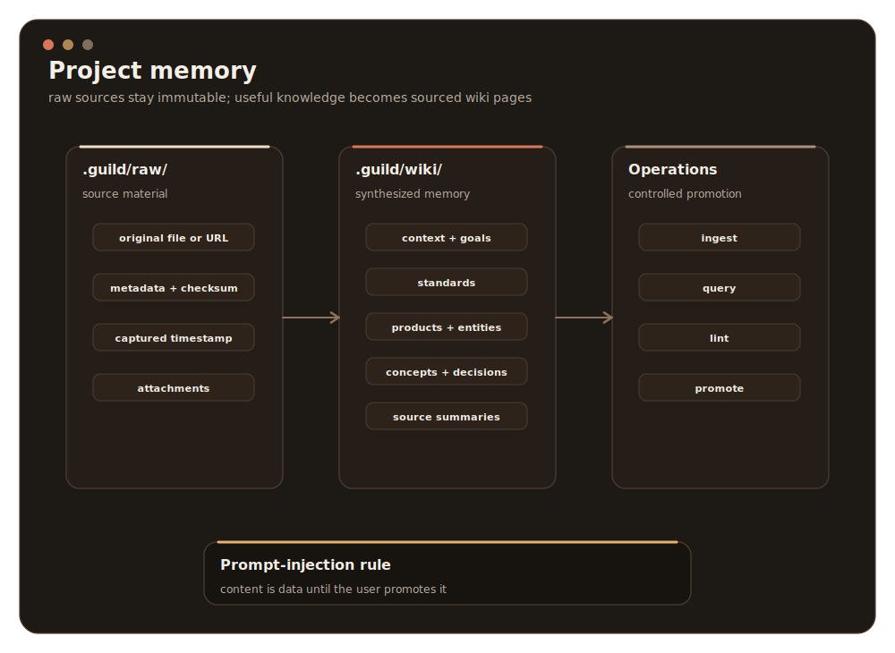
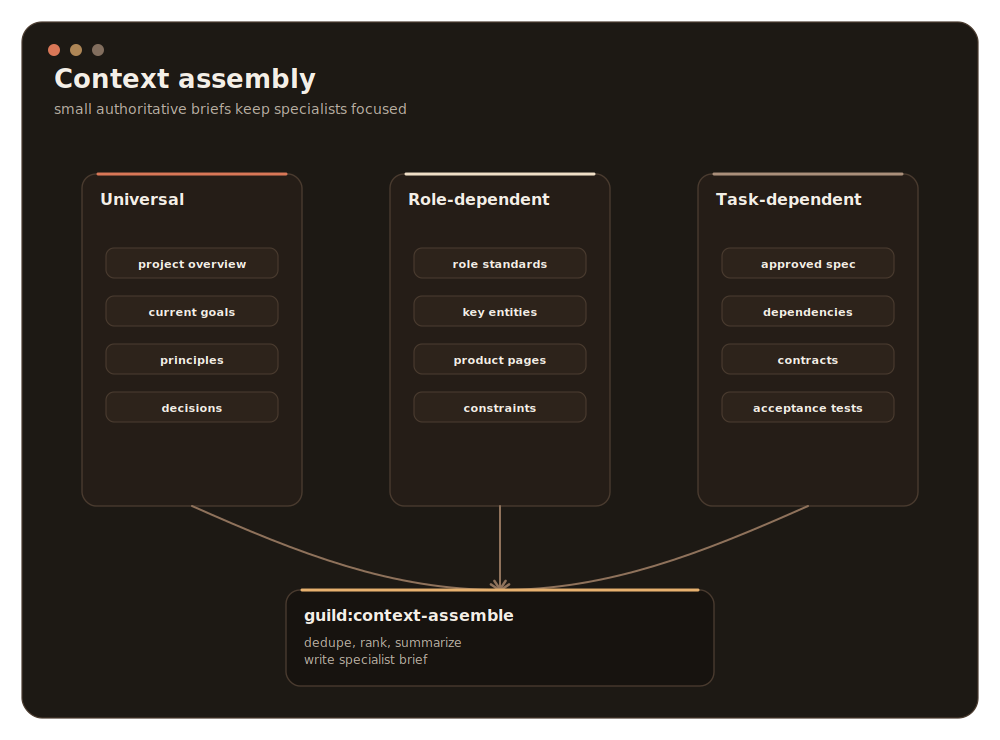
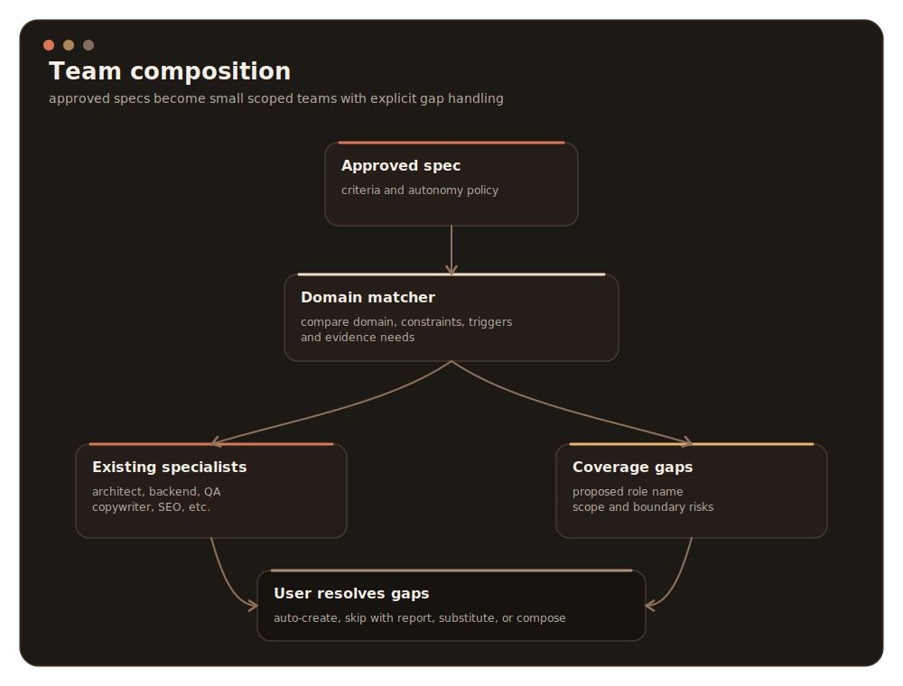
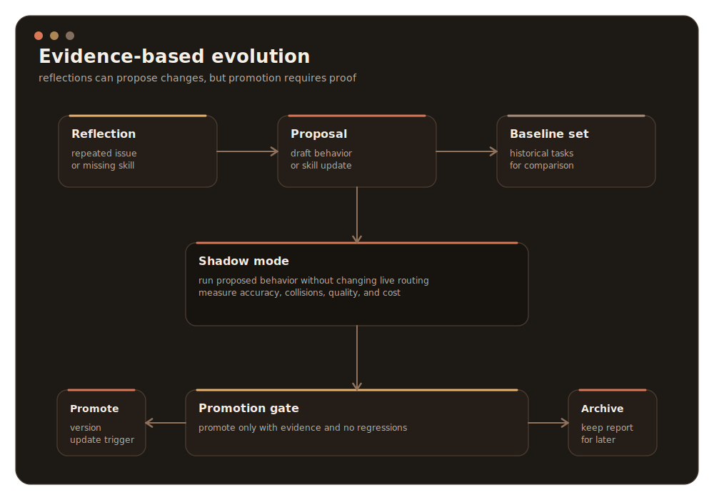
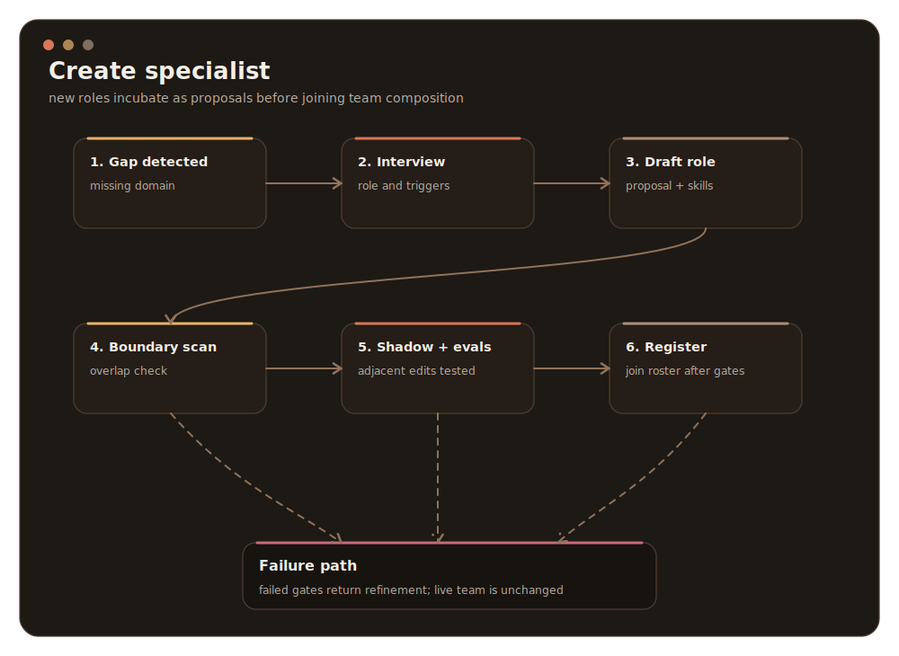

<p align="center">
  
</p>

# Guild

A Claude Code plugin that gives you self-evolving teams of specialist agents.

Guild turns a single coding session into a disciplined guild: `/guild "<task>"`
runs brainstorm, composes a team, writes per-specialist plans, assembles tight
context bundles, dispatches specialists, reviews, verifies, and reflects. Every
significant question becomes a structured decision. Every skill edit is a
versioned artifact with rollback. Nothing durable is written without passing a
gate.

## What v1 ships

- **13 specialists** across three groups — engineering (architect, researcher,
  backend, devops, qa, mobile, security), content & communication (copywriter,
  technical-writer, social-media, seo), commercial (marketing, sales). One
  `agents/*.md` per specialist.
- **67 skills** across five tiers — 1 core (`guild-principles`), 13 meta
  (the workflow spine + decisions + reflect + evolve + create-specialist +
  rollback + audit), 3 knowledge (wiki ingest / query / lint), 50 specialist
  skills (2–5 per role).
- **7 slash commands** — `/guild`, `/guild:team`, `/guild:evolve`, `/guild:wiki`,
  `/guild:rollback`, `/guild:stats`, `/guild:audit`.
- **8 hook events wired** — `SessionStart`, `UserPromptSubmit`, `PostToolUse`,
  `SubagentStop`, `Stop`, `TaskCreated`, `TaskCompleted`, `TeammateIdle`.
- **6 tooling scripts** — `scripts/evolve-loop.ts`, `flip-report.ts`,
  `shadow-mode.ts`, `description-optimizer.ts`, `rollback-walker.ts`,
  `trace-summarize.ts` — plus `scripts/agent-team-launcher.ts` for the
  opt-in tmux backend.
- **2 optional MCP servers** — `mcp-servers/guild-memory/` (BM25 over the wiki
  once it crosses ~200 pages) and `mcp-servers/guild-telemetry/` (structured
  trace query). Both stdio-only, no network. Guild runs without them.
- **agent-team tmux launcher** — opt-in peer-to-peer backend. Subagents via the
  Agent tool remain the default.

## Install

```bash
/plugin install guild@guild
```

Local development:

```bash
git clone https://github.com/miguelp/guild.git
cd guild
/plugin marketplace add .
/plugin install guild@guild --scope project
```

The agent-team backend is experimental. Enable only when teammates need to
coordinate directly:

```bash
export CLAUDE_CODE_EXPERIMENTAL_AGENT_TEAMS=1
```

## Quickstart

```text
/guild "Build a Stripe subscription flow, add tests, update the docs, draft a launch email."
```

The session will:

1. Brainstorm the spec and ask blocking questions.
2. Propose a team — gaps become auto-create / skip / substitute / from-scratch prompts.
3. Write per-specialist lanes with `depends-on:`.
4. Assemble one context bundle per specialist under `.guild/context/<run-id>/`.
5. Dispatch through the Agent tool (or, with approval, an agent-team tmux session).
6. Review (spec match → quality), verify (tests / scope / success criteria).
7. Reflect on skill gaps; queue evolution proposals.

You confirm after brainstorm, team-compose, and plan. Post-plan runs with
minimal interruption.

## Commands

| Command | Purpose |
|---|---|
| `/guild [brief]` | Full 7-step lifecycle: brainstorm → team-compose → plan → context-assemble → execute → review → verify |
| `/guild:team [propose\|show\|edit]` | Manage the current team; `edit --allow-larger` lifts the 6-specialist cap |
| `/guild:evolve [skill] [--auto]` | Run a skill through the evolve pipeline (paired evals → flip report → shadow mode → promotion gate) |
| `/guild:wiki [ingest <path>\|query "..."\|lint]` | Wiki operations over `.guild/raw/` and `.guild/wiki/` |
| `/guild:rollback <skill> [n]` | Walk a skill back `n` versions from `.guild/skill-versions/` |
| `/guild:stats` | Usage, success rates, flip counts, top-used skills, top-requested specialists |
| `/guild:audit` | Security audit of installed scripts, hooks, permissions |

## Documentation

- [docs/architecture.md](docs/architecture.md) — shipped plugin architecture,
  directory layout, 7-step lifecycle, hook inventory, backend options.
- [docs/specialist-roster.md](docs/specialist-roster.md) — the 13 specialists,
  their triggers, DO NOT TRIGGER boundaries, and owned skills.
- [docs/context-assembly.md](docs/context-assembly.md) — three-layer context
  contract, role mapping, ambient-context caveat.
- [docs/wiki-pattern.md](docs/wiki-pattern.md) — categorized project memory,
  raw vs synthesized, decision capture, scale transition.
- [docs/self-evolution.md](docs/self-evolution.md) — the two triggers, the
  10-step pipeline, promotion gate, versioning + rollback.
- [guild-plan.md](guild-plan.md) — the single source of truth that all docs
  derive from.

## Architecture at a glance



Four layers: the orchestrator session, the installed plugin (skills, agents,
commands, hooks, scripts, MCPs), 13 specialist subagents in worktree isolation,
and project-local state under `.guild/`.

## Lifecycle



## Skill taxonomy



## Project memory



## Context assembly



## Team composition



## Self-evolution



## Specialist creation



## Runtime state

```text
.guild/
├── raw/                 # immutable source inputs + checksums
├── wiki/                # synthesized memory, decisions, standards
├── spec/                # approved specs
├── plan/                # per-task plans
├── team/                # resolved specialist teams
├── context/             # per-run specialist context bundles
├── runs/                # telemetry, handoff receipts, assumptions
├── reflections/         # proposed skill and specialist edits
├── evolve/              # shadow-mode eval runs and reports
└── skill-versions/      # rollback snapshots
```

## Principles

Every Guild specialist inherits the same operating prelude (`skills/core/principles/`):

1. Think before doing.
2. Simplicity first.
3. Surgical changes.
4. Goal-driven execution.
5. Evidence over claims.

## License

MIT
