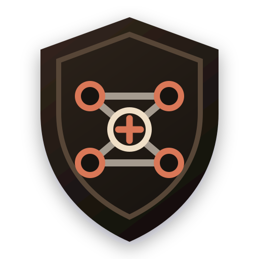

<p align="center">
  
</p>

# Guild

A Guild Stack plugin for AI coding hosts that gives you self-evolving teams of specialist agents.

Guild turns a single coding session into a disciplined guild: `/guild "<task>"`
runs brainstorm, composes a team, writes per-specialist plans, assembles tight
context bundles, dispatches specialists, reviews, verifies, and reflects. Every
significant question becomes a structured decision. Every skill edit is a
versioned artifact with rollback. Nothing durable is written without passing a
gate.

## What v2 ships

- **15 specialist templates + 2 machinery agents** — 15 domain type templates
  across three groups (engineering: architect, researcher, backend, frontend,
  devops, qa, mobile, security; content & communication: copywriter, doc-writer,
  technical-writer, social-media, seo; commercial: marketing, sales), one
  `templates/specialists/*.md` per role, minted on demand into your project's
  `.guild/agents/` by team composition — plus the 2 machinery agents the plugin
  registers directly (advisor, developer; one `agents/*.md` each).
- **111 skills** across six tiers — 1 core (`guild-principles`), 39 meta
  (the workflow spine + decisions + reflect + evolve + create-specialist +
  rollback + audit + diagnose + v1.4 loop/review helpers), 11 knowledge
  (wiki ingest / query / lint + the `learn-*` family), 58 specialist skills
  (2–5 per specialist), and the `guild-operations` + `guild-quality` gate skills.
- **The v2 command surface** — `/guild:guild [brief]` plus the phase verbs
  `/guild:init|ideate|plan|build|qa|ops`, helpers `/guild:status|resume`,
  nouns `/guild:wiki|initiative`, and maintenance
  `/guild:evolve|rollback|stats|audit|fix|migrate`. The `:` plugin namespace
  **stays** (Claude Code requires it) — v2 drops only the redundant `guild-`
  command prefix (v1 `/guild:guild-wiki` → v2 `/guild:wiki`); every command is
  `/guild:<verb>` (v1→v2: `https://guildstack.dev/docs/migration-v1-to-v2`).
- **16 supported hosts, one adapter contract** — Guild runs across 16 canonical
  hosts (Claude Code CLI/Desktop/Web, Codex CLI/app, Pi, Antigravity, Cursor,
  GitHub Copilot, opencode, Rovo Dev, Kiro/Qoder/Trae via AGENTS-file, and the
  Claude.ai connector) through a single host-adapter contract. Support is
  described with an **honest two-field model** — the presentation *Support* label
  (`Supported` / `Supported (beta)` / `Supported (app)` / `Supported (connector)`)
  is kept separate from the receipt-derived *Public State*; no host is ever
  claimed beyond its verified evidence. Missing capabilities **degrade** to a
  lesser substrate — the phase still runs and the degradation is written to disk.
  See the Guild docs site → `https://guildstack.dev/hosts`.
- **10 hook events wired** — `SessionStart`, `UserPromptSubmit`, `PreToolUse`,
  `PostToolUse`, `PreCompact`, `SubagentStop`, `Stop`, `TaskCreated`,
  `TaskCompleted`, `TeammateIdle`.
- **Tooling scripts** — evolution, rollback, telemetry summary, audit-log
  summary, Codex review-trail validation, and the opt-in tmux agent-team
  launcher live under `scripts/`.
- **2 optional MCP servers** — `mcp-servers/guild-memory/` (BM25 over the wiki
  once it crosses ~200 pages) and `mcp-servers/guild-telemetry/` (structured
  trace query). Both stdio-only, no network. Guild runs without them.
- **Three execution backends** (D5 `agent_mode` ladder) — tmux visible panes
  (in-session or detached); `InProcessTeamBackend` (implemented: orchestrator
  consumes a declarative `dispatchPlan`, each specialist runs as an independent
  Agent-tool call, no tmux required); remote cross-host SSH dispatch; `SUBAGENT`
  last resort for CI / fresh installs. See the Guild docs site → `https://guildstack.dev/docs/architecture`.
- **Cost-aware model tiering** — cheap / mid / powerful, auto-scored per lane
  from deterministic signals, with advisor escalation for uncertainty.
  Zero-config stable. See the Guild docs site → `https://guildstack.dev/docs/configuration` (`models.*`).
- **SQLite read-through wiki cache** — lazy-build, opt-in (`index: "auto"`,
  default). Direct-parse below threshold; disable with `index: "off"`.
  See the Guild docs site → `https://guildstack.dev/docs/configuration` (`defaults.index.*`).
- **O-3 short-output advisor** — fires when a lane's output token count falls
  below calibrated p10 floors (`models.shortOutputThreshold`). Calibrate with
  the `calibrate-o3-cli` tool in the separate `guild-benchmark` repo.
  See the Guild docs site → `https://guildstack.dev/docs/configuration`.
- **Security + observability** — `security.bypass_permissions_policy`
  (capability-scope enforcement), 3-stage secrets redaction
  (`secrets_policy.*`), and structured trace cost rollup via the
  `guild-telemetry` MCP (`trace_cost_rollup`).
  See the Guild docs site → `https://guildstack.dev/docs/configuration`.

## Getting Started

### Install

The quickest path is the installer script (`install.sh` at this repo's root —
detects your AI coding hosts, runs the marketplace commands below, never uses
`sudo`, never edits shell profiles):

```bash
curl -fsSL https://guildstack.dev/install.sh | bash
```

Domain unavailable? The same script ships in this repo:

```bash
curl -fsSL https://raw.githubusercontent.com/lookatitude/guild/main/install.sh | bash
```

Preview host-specific install paths without changing anything:

```bash
curl -fsSL https://guildstack.dev/install.sh | bash -s -- --dry-run --host claude-code-cli
curl -fsSL https://guildstack.dev/install.sh | bash -s -- --dry-run --host codex-cli
curl -fsSL https://guildstack.dev/install.sh | bash -s -- --dry-run --host pi-cli
curl -fsSL https://guildstack.dev/install.sh | bash -s -- --dry-run --host antigravity-cli
curl -fsSL https://guildstack.dev/install.sh | bash -s -- --dry-run --host agents-file
```

Installing manually into Claude Code does exactly the same thing:

```bash
claude plugin marketplace add lookatitude/guild
claude plugin marketplace update guild
claude plugin install guild@guild
```

### Release channels — stable vs beta

Branches are distribution channels: **`main` is stable** (released versions —
what the commands above install) and **`next` is beta** — merged work still
being tested ahead of the next release. To follow the beta channel:

```bash
# Claude Code — pin the marketplace to the next branch:
claude plugin marketplace add lookatitude/guild@next
# marketplace update keeps tracking the pinned next ref:
claude plugin marketplace update guild
claude plugin install guild@guild

# install.sh (any supported host) — same selector:
curl -fsSL https://guildstack.dev/install.sh | bash -s -- --channel beta
```

Switch back to stable by re-adding the marketplace without the `@next` pin (or
`--channel stable`). Beta may contain unreleased behavior; release notes only
cover what has reached `main`.

### Staying up to date

Guild detects updates per channel and never phones home during session start:
a SessionStart hook reads a machine-level cache (refreshed in the background at
most once per `defaults.update.cadence_hours`, default 24) and prints a one-line
signal with the exact update command when your channel has moved — new release
tag on stable, new `next` commit on beta. `defaults.update.mode` controls it:
`notify` (default), `auto` (stages the update headlessly; applies next
session), or `off`. Dev checkouts are never touched.

Applying updates per host:

```bash
# Claude Code (marketplace-managed):
claude plugin marketplace update guild && claude plugin update guild@guild

# Wrapper hosts (codex, pi, antigravity, cursor, copilot, opencode, rovo-dev):
guild-run update

# Everything with an install receipt, in one go (any host mix):
curl -fsSL https://guildstack.dev/install.sh | bash -s -- --update
```

Each install writes a `guild.install_receipt.v1` (host, channel, ref, commit)
under `~/.guild/receipts/` — that receipt is what `--update` and `guild-run
update` re-render from, keeping every host on the channel it was installed
from.

Installing manually into Codex CLI uses Codex's plugin manager. **Register the
repo as a git marketplace** — this repo is a working Codex marketplace as-is, so
the install tracks the channel ref and stays updatable:

```bash
codex plugin marketplace remove guild || true          # a ref cannot be re-pointed in place
codex plugin marketplace add lookatitude/guild --ref main   # --ref next for beta
codex plugin add guild@guild
```

Update it later with:

```bash
codex plugin marketplace upgrade && codex plugin add guild@guild
```

**Do not register a rendered `dist/codex-marketplace` directory** unless you are
developing Guild itself. `codex plugin marketplace upgrade` refuses a local
source (`marketplace 'guild' is not configured as a Git marketplace`), so such
an install is frozen at the moment it was rendered and can only be moved by
removing and re-adding it. For a local dev install, `install.sh` run from a
checkout registers the rendered tree deliberately and says so:

```bash
npx tsx scripts/build-host-packages.ts --root . --out dist --generated-at "$(date -u +%Y-%m-%dT%H:%M:%SZ)"
codex plugin marketplace remove guild || true
codex plugin marketplace add ./dist/codex-marketplace
codex plugin add guild@guild
```

Restart Claude Code after installation so commands, skills, agents, hooks, and
MCP servers are loaded into the next session.

Local development:

```bash
git clone https://github.com/lookatitude/guild.git
cd guild
claude plugin marketplace add .
claude plugin marketplace update guild
claude plugin install guild@guild --scope project
```

Restart Claude Code before running `/guild` from the project. Claude Code loads
plugin commands, agents, skills, hooks, and optional MCP entries at session
startup; a newly installed or edited plugin is not fully visible until the next
session.

### First run

Run `/guild` with a brief, or run it with no arguments and let the brainstorm
skill prompt for the task:

```text
/guild "Build a Stripe subscription flow, add tests, update the docs, draft a launch email."
/guild
```

The first visible sign that the plugin loaded is the SessionStart bootstrap card:
it lists the Guild version, slash commands, optional MCP servers, and doc entry
points. The card is informational only. The lifecycle starts when you invoke
`/guild`.

The first `/guild` run writes durable state under `.guild/`: spec, team, plan,
context bundles, run handoffs, review, verification, telemetry, and reflections.
You confirm after brainstorm, team-compose, and plan; the later phases run from
the approved plan with minimal interruption.

To verify hooks and audit logs are firing after restart:

1. Start a fresh Claude Code session in a project where Guild is installed.
2. Confirm the bootstrap card appears.
3. Run a small `/guild "..."` task, or use any workflow that dispatches tools.
4. Check for `.guild/runs/<run-id>/events.ndjson`.
5. For v1.4 audit logging, check `.guild/runs/<run-id>/logs/v1.4-events.jsonl`
   for `hook_event` and, after tool use, `tool_call` rows.

Older Claude Code hosts may skip newer hook events such as `PreToolUse` and
`PreCompact`; the handlers are designed to fall through without breaking the
session. If the bootstrap card appears but no `.guild/runs/` files are written,
run `/guild:audit` and inspect `hooks/hooks.json` in the installed plugin.
If a Guild run failed or telemetry looks inconsistent, run `/guild:fix`
with the run id or a short symptom; it reads recent `.guild/runs` evidence,
writes a diagnosis/fix plan, and asks before applying any edits.

### Environment variables

| Variable | Default | Meaning |
|---|---|---|
| `CLAUDE_CODE_EXPERIMENTAL_AGENT_TEAMS` | unset | Set to `1` to allow Guild's experimental tmux agent-team backend. Subagents via `Agent` remain the default. |
| `GUILD_LOOP_CAP` | unset | Display/override signal for the per-lane adversarial-loop cap. The **authoritative** cap is the `loop_cap` key in `.guild/settings.json` (default 16, clamped to `[1, 256]`); CLI `--loop-cap` overrides per run. |
| `GUILD_ENABLE_DEVTEAM_REFLECT` | unset/off | Developer-team reflection gate for `hooks/maybe-reflect.ts`. Set to `1` only when working on Guild's own dev-team reflection workflow. |

The agent-team backend is experimental. Enable it only when teammates need to
coordinate directly:

```bash
export CLAUDE_CODE_EXPERIMENTAL_AGENT_TEAMS=1
```

Benchmark live runs live in the separate `guild-benchmark` repo, which owns its
own safety gate for spawning the real `claude` CLI (dry-run first). See that
repo for setup, and `/guild:dashboard` to launch the benchmark UI against the
live project.

### Optional MCP servers

`guild-memory` and `guild-telemetry` ship as stdio MCP servers under
`mcp-servers/` but are **optional** — Guild works end-to-end without them.
Both ship pre-bundled (`dist/index.js`), so they cold-start under plain
`node` with no `npm install` step on first use.

Use `guild-memory` when the wiki crosses ~200 pages (ripgrep gets slow);
use `guild-telemetry` for structured trace queries over `.guild/runs/`.

## Quickstart

```text
/guild "Build a Stripe subscription flow, add tests, update the docs, draft a launch email."
```

The session will:

1. Brainstorm the spec and ask blocking questions.
2. Propose a team — gaps become auto-create / skip / substitute / from-scratch prompts.
3. Write per-specialist lanes with `depends-on:`.
4. Assemble one context bundle per specialist under `.guild/context/<run-id>/`.
5. Dispatch through the Agent tool (or, with approval, an agent-team tmux session).
6. Review (spec match → quality), verify (tests / scope / success criteria).
7. Reflect on skill gaps; queue evolution proposals.

You confirm after brainstorm, team-compose, and plan. Post-plan runs with
minimal interruption.

If you register a new specialist with `guild:create-specialist`, restart or
reload the plugin before expecting `/guild:plan` (team is composed as a plan sub-step) or future `/guild` runs to
route to it. Claude Code snapshots plugin agent and skill manifests at session
startup.

Codex adversarial review is a Guild development discipline, not a default
consumer `/guild` loop. Review trails live under
`.guild/runs/<run-id>/codex-review/*.md` and can be checked with
`npx tsx scripts/verify-codex-review-trail.ts <codex-review-dir>`. The validator
currently requires each file's frontmatter to include `final_status: satisfied` or
`final_status: skipped-codex-unavailable`.

## Commands

Every command is `/guild:<verb>` (the `:` plugin namespace is required by Claude
Code). The bare `/guild [brief]` is the smart entry point; the phase verbs, nouns,
and maintenance verbs are separate commands.

| Command | Purpose |
|---|---|
| `/guild [brief]` | Bare entry — smart **phase detection**: inspects `.guild/` state and proposes the next lifecycle phase (init · ideate · plan · build · qa · ops), always confirmed, never silent |
| `/guild:init` | Initialize Guild in a repo (wiki + brownfield cheap-scan map; `--learn` runs the full learn pipeline) |
| `/guild:ideate` | Socratic spec — brainstorm the task into `.guild/spec/<slug>.md` |
| `/guild:plan` | Compose the team + write per-specialist lane plans; `--team-size=N` lifts the 6-specialist cap |
| `/guild:build` | Assemble per-specialist context, dispatch the lanes, review handoffs |
| `/guild:qa` | Quality gate over the run |
| `/guild:ops` | Operations phase — release, monitoring, incident, rollback runbooks |
| `/guild:learn [map\|graph\|onboard\|diff\|explain]` | Understand-everything engine — codebase map, deep knowledge graph, onboarding tour, diff/blast-radius, file/module explain |
| `/guild:status` | Read-only: current phase, next gate, blockers, resume hint |
| `/guild:resume` | Resume an interrupted run from its furthest phase |
| `/guild:wiki <ingest <path>\|query "..."\|lint>` | Project knowledge over `.guild/raw/` and `.guild/wiki/` |
| `/guild:initiative <new\|status\|list\|resume\|update\|archive\|restore\|close>` | Durable multi-run work (opt-in; a one-off `/guild` never creates one) |
| `/guild:goal` | Create/inspect P.O.V.E.R. goals + host-portable task groups |
| `/guild:config <init\|reconcile\|show\|set\|role\|ui\|validate\|providers>` | Manage the `.guild/settings.json` config surface |
| `/guild:evolve [<id>] [--auto] [--to-template=vN]` | Run a skill through the evolve pipeline (paired evals → flip report → shadow mode → promotion gate) |
| `/guild:rollback <skill> [n]` | Walk a skill back `n` versions from `.guild/skill-versions/` |
| `/guild:stats` | Usage, success rates, flip counts, top-used skills, top-requested specialists |
| `/guild:audit` | Security audit of installed scripts, hooks, permissions |
| `/guild:fix [run-id \| "symptom"] [--review=cross]` | Diagnose Guild runtime failures from telemetry and propose a gated self-fix plan |
| `/guild:migrate` | v1→v2 `.guild/` converter (dry-run by default) |
| `/guild:dashboard` | Launch the observability / benchmark dashboard |

## Documentation

**Documentation: https://guildstack.dev/docs**

The canonical docs live at the **Guild docs site** (`https://guildstack.dev`).

- `https://guildstack.dev/docs/getting-started` — install, first run, and basic configuration.
- `https://guildstack.dev/docs/architecture` — shipped plugin architecture, directory layout, the v2 single-verb lifecycle phases, hook inventory, backend options.
- `https://guildstack.dev/docs/specialist-roster` — the 15 domain specialist templates + the 2 machinery agents (advisor, developer), their triggers, DO NOT TRIGGER boundaries, and owned skills.
- `https://guildstack.dev/docs/context-assembly` — three-layer context contract, role mapping, ambient-context caveat.
- `https://guildstack.dev/docs/wiki-pattern` — categorized project memory, raw vs synthesized, decision capture, scale transition.
- `https://guildstack.dev/docs/self-evolution` — the two triggers, the 10-step pipeline, promotion gate, versioning + rollback.
- `https://guildstack.dev/docs/configuration` — complete `settings.json` reference: `agent_mode`, model tiering, SQLite index, security / secrets policy, O-3 calibration, cross-host dispatch.

## Architecture at a glance

Four layers: the orchestrator session, the installed plugin (skills, machinery
agents, specialist templates, commands, hooks, scripts, MCPs), the composed
specialist team in worktree isolation, and project-local state under `.guild/`
(including the minted specialist instances).

Diagrams and the full walkthroughs — lifecycle, skill taxonomy, project memory,
context assembly, team composition, self-evolution, and specialist creation —
live on the docs site: **https://guildstack.dev/docs**.

## Runtime state

All project-created Guild state lives under the active root's `.guild/` (never
committed by Guild itself):

```text
.guild/
├── guild.yaml            # root identity: workspace or project
├── settings.json         # project/workspace behavior (the config surface)
├── agents/               # project-created specialists (files = source of truth)
├── skills/               # project-created skills
├── workflows/            # reusable workflows
├── loops/                # custom review/build/learning loops
├── wiki/                 # synthesized knowledge, decisions, standards
├── knowledge/            # graph, indexes, sources, promotion candidates
├── memory/               # summaries, lessons, recall index
├── initiatives/          # initiative registry, active, archived
├── teams/                # reusable team definitions
├── artifacts/            # reports, audits, handoffs, generated outputs
├── raw/                  # immutable source inputs + checksums
├── indexes/              # codebase map + compatibility indexes
├── runs/                 # run traces, handoff receipts, review, verification
├── spec/                 # approved specs
├── plan/                 # per-task plans
├── team/                 # resolved specialist teams (<slug>.<phase>.yaml)
├── context/              # per-run specialist context bundles
├── reflections/          # proposed learnings and improvements
├── evolve/               # shadow-mode eval runs and reports
└── skill-versions/       # rollback snapshots
```

## Principles

Every Guild specialist inherits the same operating prelude (`skills/core/principles/`):

1. Think before doing.
2. Simplicity first.
3. Surgical changes.
4. Goal-driven execution.
5. Evidence over claims.

## License

MIT
