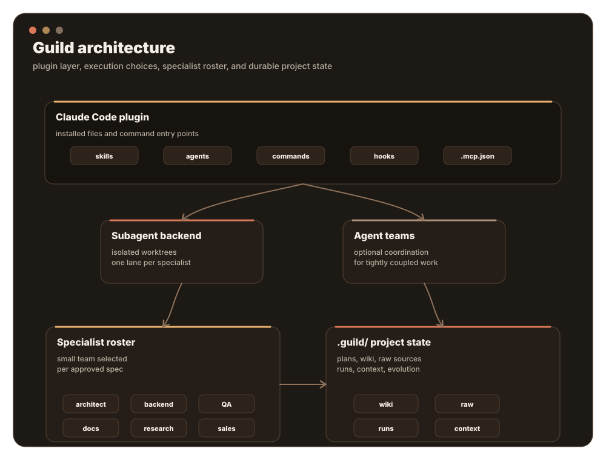
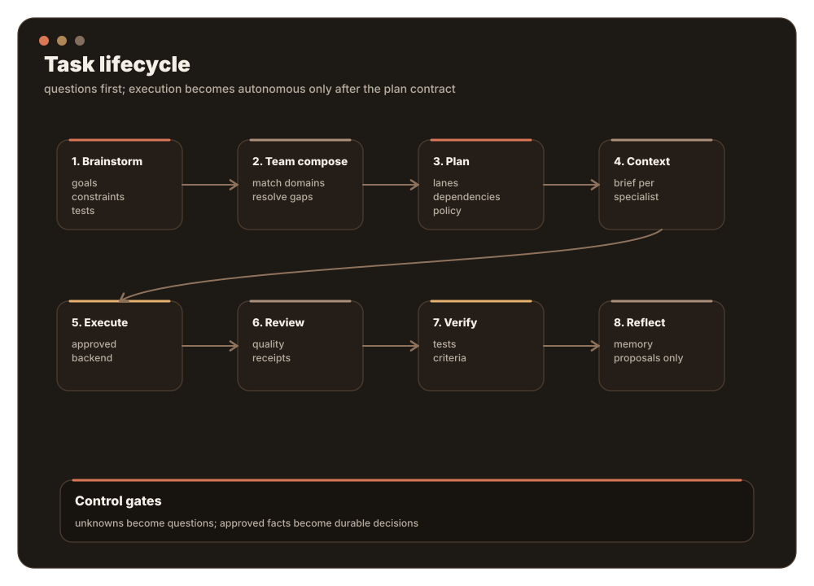
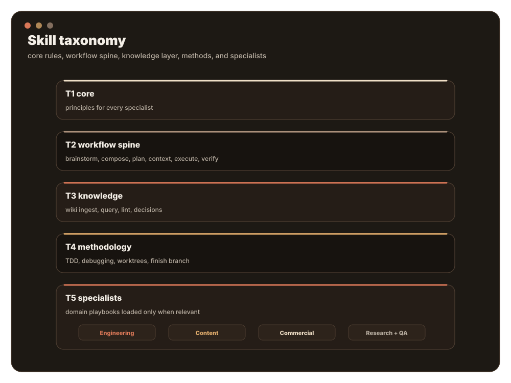
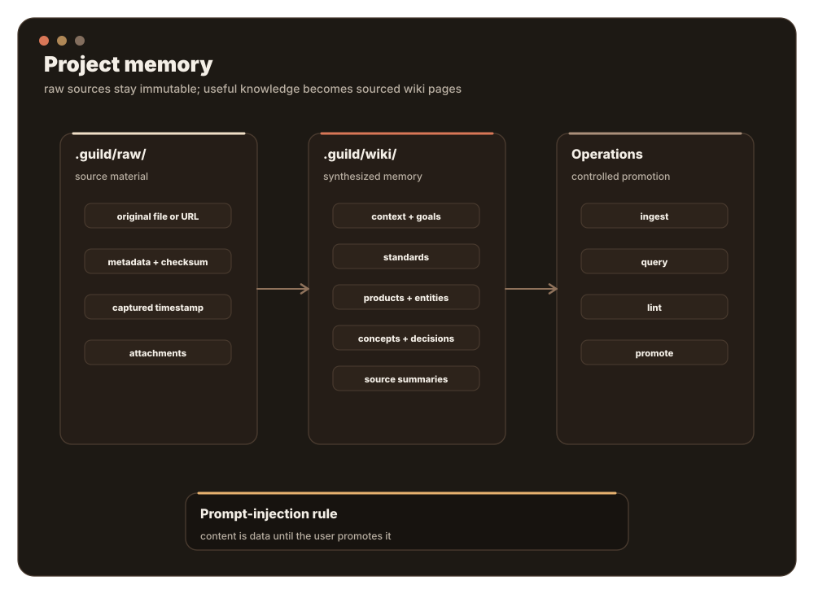
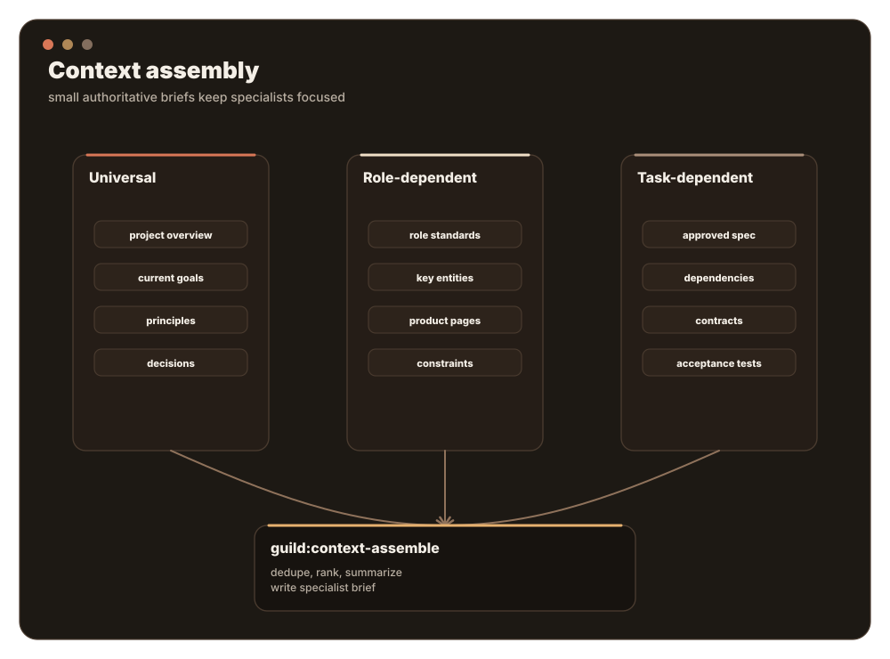
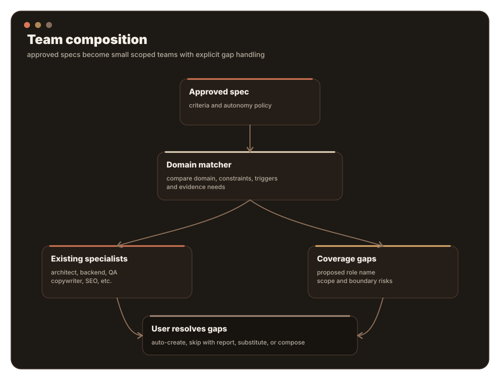
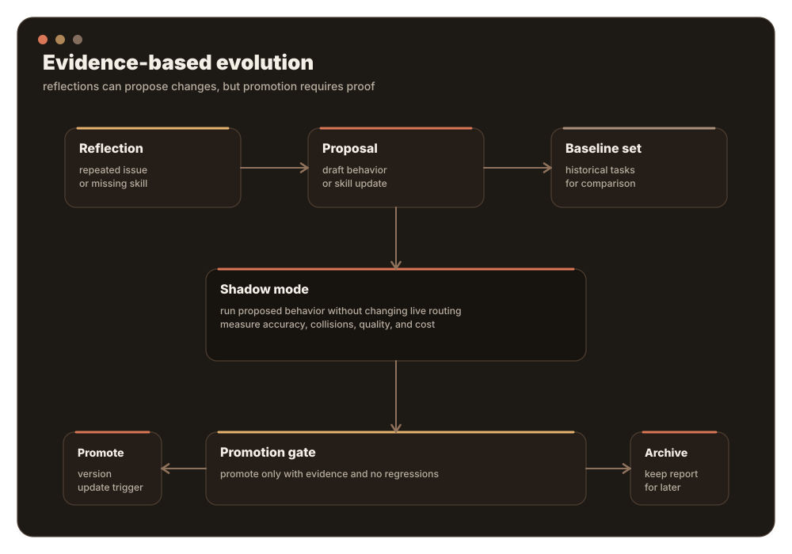
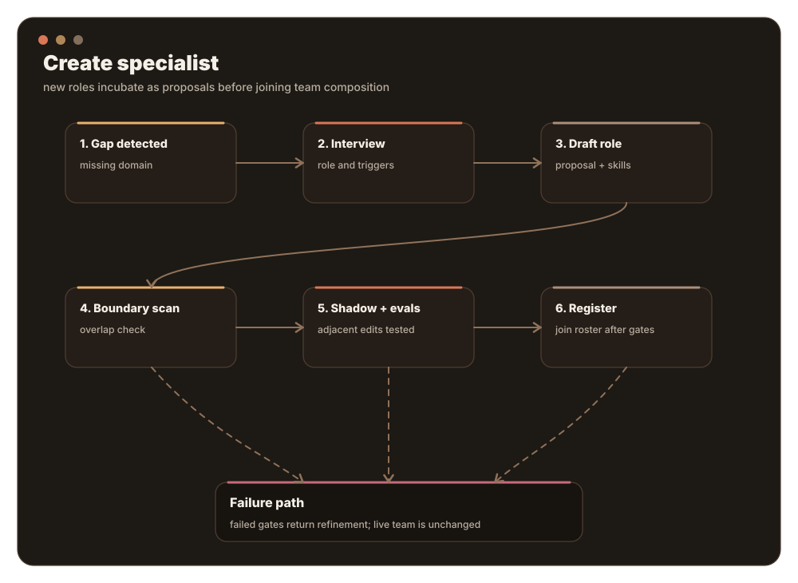

<p align="center">
  
</p>

# Guild

A Claude Code plugin that gives you self-evolving teams of specialist agents.

Guild turns a single coding session into a disciplined guild: `/guild "<task>"`
runs brainstorm, composes a team, writes per-specialist plans, assembles tight
context bundles, dispatches specialists, reviews, verifies, and reflects. Every
significant question becomes a structured decision. Every skill edit is a
versioned artifact with rollback. Nothing durable is written without passing a
gate.

## What v2 ships

- **14 specialists** across three groups — engineering (architect, researcher,
  backend, frontend, devops, qa, mobile, security), content & communication (copywriter,
  technical-writer, social-media, seo), commercial (marketing, sales). One
  `agents/*.md` per specialist.
- **77 skills** across five tiers — 1 core (`guild-principles`), 18 meta
  (the workflow spine + decisions + reflect + evolve + create-specialist +
  rollback + audit + diagnose + v1.4 loop/review helpers), 3 knowledge (wiki ingest / query / lint), **5 fallback**
  (TDD, systematic-debug, worktrees, request-review, finish-branch — forked
  from `superpowers:*` v5.0.7 under MIT, attribution preserved), and 50 authored
  specialist skills.
- **The v2 command surface** — `/guild [brief]` plus the phase verbs
  `/guild init|ideate|plan|build|qa|ops`, helpers `/guild status|resume`,
  nouns `/guild wiki|initiative`, and maintenance
  `/guild evolve|rollback|stats|audit|fix`. The `:` namespace is gone — every
  command is `/guild <subcommand>` (v1→v2: MIGRATION.md).
- **10 hook events wired** — `SessionStart`, `UserPromptSubmit`, `PreToolUse`,
  `PostToolUse`, `PreCompact`, `SubagentStop`, `Stop`, `TaskCreated`,
  `TaskCompleted`, `TeammateIdle`.
- **Tooling scripts** — evolution, rollback, telemetry summary, audit-log
  summary, Codex review-trail validation, and the opt-in tmux agent-team
  launcher live under `scripts/`.
- **2 optional MCP servers** — `mcp-servers/guild-memory/` (BM25 over the wiki
  once it crosses ~200 pages) and `mcp-servers/guild-telemetry/` (structured
  trace query). Both stdio-only, no network. Guild runs without them.
- **Three execution backends** (D5 `agent_mode` ladder) — tmux visible panes
  (in-session or detached); `InProcessTeamBackend` (implemented: orchestrator
  consumes a declarative `dispatchPlan`, each specialist runs as an independent
  Agent-tool call, no tmux required); remote cross-host SSH dispatch; `SUBAGENT`
  last resort for CI / fresh installs. See the Guild docs site → `https://lookatitude.github.io/guild-website/docs/architecture`.
- **Cost-aware model tiering** — cheap / mid / powerful, auto-scored per lane
  from deterministic signals, with advisor escalation for uncertainty.
  Zero-config stable. See the Guild docs site → `https://lookatitude.github.io/guild-website/docs/configuration` (`models.*`).
- **SQLite read-through wiki cache** — lazy-build, opt-in (`index: "auto"`,
  default). Direct-parse below threshold; disable with `index: "off"`.
  See the Guild docs site → `https://lookatitude.github.io/guild-website/docs/configuration` (`defaults.index.*`).
- **O-3 short-output advisor** — fires when a lane's output token count falls
  below calibrated p10 floors (`models.shortOutputThreshold`). Calibrate with
  `npx tsx benchmark/src/calibrate-o3-cli.ts`.
  See the Guild docs site → `https://lookatitude.github.io/guild-website/docs/configuration`.
- **Security + observability** — `security.bypass_permissions_policy`
  (capability-scope enforcement), 3-stage secrets redaction
  (`secrets_policy.*`), and structured trace cost rollup via the
  `guild-telemetry` MCP (`trace_cost_rollup`).
  See the Guild docs site → `https://lookatitude.github.io/guild-website/docs/configuration`.

## Getting Started

### Install

```bash
claude plugin marketplace add lookatitude/guild
claude plugin marketplace update guild
claude plugin install guild@guild
```

Restart Claude Code after installation so commands, skills, agents, hooks, and
MCP servers are loaded into the next session.

Local development:

```bash
git clone https://github.com/lookatitude/guild.git
cd guild
claude plugin marketplace add .
claude plugin marketplace update guild
claude plugin install guild@guild --scope project
```

Restart Claude Code before running `/guild` from the project. Claude Code loads
plugin commands, agents, skills, hooks, and optional MCP entries at session
startup; a newly installed or edited plugin is not fully visible until the next
session.

### First run

Run `/guild` with a brief, or run it with no arguments and let the brainstorm
skill prompt for the task:

```text
/guild "Build a Stripe subscription flow, add tests, update the docs, draft a launch email."
/guild
```

The first visible sign that the plugin loaded is the SessionStart bootstrap card:
it lists the Guild version, slash commands, optional MCP servers, and doc entry
points. The card is informational only. The lifecycle starts when you invoke
`/guild`.

The first `/guild` run writes durable state under `.guild/`: spec, team, plan,
context bundles, run handoffs, review, verification, telemetry, and reflections.
You confirm after brainstorm, team-compose, and plan; the later phases run from
the approved plan with minimal interruption.

To verify hooks and audit logs are firing after restart:

1. Start a fresh Claude Code session in a project where Guild is installed.
2. Confirm the bootstrap card appears.
3. Run a small `/guild "..."` task, or use any workflow that dispatches tools.
4. Check for `.guild/runs/<run-id>/events.ndjson`.
5. For v1.4 audit logging, check `.guild/runs/<run-id>/logs/v1.4-events.jsonl`
   for `hook_event` and, after tool use, `tool_call` rows.

Older Claude Code hosts may skip newer hook events such as `PreToolUse` and
`PreCompact`; the handlers are designed to fall through without breaking the
session. If the bootstrap card appears but no `.guild/runs/` files are written,
run `/guild audit` and inspect `hooks/hooks.json` in the installed plugin.
If a Guild run failed or telemetry looks inconsistent, run `/guild fix`
with the run id or a short symptom; it reads recent `.guild/runs` evidence,
writes a diagnosis/fix plan, and asks before applying any edits.

### Environment variables

| Variable | Default | Meaning |
|---|---|---|
| `CLAUDE_CODE_EXPERIMENTAL_AGENT_TEAMS` | unset | Set to `1` to allow Guild's experimental tmux agent-team backend. Subagents via `Agent` remain the default. |
| `GUILD_LOOP_CAP` | `16` when loops are active | Per-lane cap for opt-in adversarial loops. Must be a positive integer in `[1, 256]`; CLI `--loop-cap` overrides it. |
| `GUILD_ENABLE_DEVTEAM_REFLECT` | unset/off | Developer-team reflection gate for `hooks/maybe-reflect.ts`. Set to `1` only when working on Guild's own dev-team reflection workflow. |
| `GUILD_BENCHMARK_LIVE` | unset/off | Benchmark runner safety gate. Set to `1` only after a dry run when you intentionally want the benchmark factory to spawn the real `claude` CLI. |

The agent-team backend is experimental. Enable it only when teammates need to
coordinate directly:

```bash
export CLAUDE_CODE_EXPERIMENTAL_AGENT_TEAMS=1
```

Benchmark live runs are also opt-in:

```bash
cd benchmark
npm run benchmark -- run --case demo-url-shortener-build --dry-run
GUILD_BENCHMARK_LIVE=1 npm run benchmark -- run --case demo-url-shortener-build
```

Current benchmark import boundary: the importer scores `run.json`,
`events.ndjson`, and captured `artifacts/.guild/`. When v1.3 `events.ndjson` is
absent, it can import v1.4 hook audit logs from
`logs/v1.4-events.jsonl` or captured
`artifacts/.guild/runs/<run-id>/logs/v1.4-events.jsonl` and map the supported
phase, gate, specialist, tool-error, and escalation events into benchmark
metrics.

### Optional MCP servers

`guild-memory` and `guild-telemetry` ship as stdio MCP servers under
`mcp-servers/` but are **optional** — Guild works end-to-end without them.
Both ship pre-bundled (`dist/index.js`), so they cold-start under plain
`node` with no `npm install` step on first use.

Use `guild-memory` when the wiki crosses ~200 pages (ripgrep gets slow);
use `guild-telemetry` for structured trace queries over `.guild/runs/`.

## Quickstart

```text
/guild "Build a Stripe subscription flow, add tests, update the docs, draft a launch email."
```

The session will:

1. Brainstorm the spec and ask blocking questions.
2. Propose a team — gaps become auto-create / skip / substitute / from-scratch prompts.
3. Write per-specialist lanes with `depends-on:`.
4. Assemble one context bundle per specialist under `.guild/context/<run-id>/`.
5. Dispatch through the Agent tool (or, with approval, an agent-team tmux session).
6. Review (spec match → quality), verify (tests / scope / success criteria).
7. Reflect on skill gaps; queue evolution proposals.

You confirm after brainstorm, team-compose, and plan. Post-plan runs with
minimal interruption.

If you register a new specialist with `guild:create-specialist`, restart or
reload the plugin before expecting `/guild plan` (team is composed as a plan sub-step) or future `/guild` runs to
route to it. Claude Code snapshots plugin agent and skill manifests at session
startup.

Codex adversarial review is a Guild development discipline, not a default
consumer `/guild` loop. Review trails live under
`.guild/runs/<run-id>/codex-review/*.md` and can be checked with
`npx tsx scripts/verify-codex-review-trail.ts <codex-review-dir>`. The validator
currently requires each file's frontmatter to include `final_status: satisfied` or
`final_status: skipped-codex-unavailable`.

## Commands

| Command | Purpose |
|---|---|
| `/guild [brief]` | Full 7-step lifecycle: brainstorm → team-compose → plan → context-assemble → execute → review → verify |
| `/guild plan` | Planning phase — team is composed as a plan sub-step; `--team-size=N` lifts the 6-specialist cap; inspect via `/guild status`, edit via the `[edit]` response at the plan/team gate |
| `/guild evolve [<id>] [--auto] [--to-template=vN]` | Run a skill through the evolve pipeline (paired evals → flip report → shadow mode → promotion gate) |
| `/guild wiki <ingest <path>\|query "..."\|lint>` | Wiki operations over `.guild/raw/` and `.guild/wiki/` |
| `/guild rollback <skill> [n]` | Walk a skill back `n` versions from `.guild/skill-versions/` |
| `/guild stats` | Usage, success rates, flip counts, top-used skills, top-requested specialists |
| `/guild audit` | Security audit of installed scripts, hooks, permissions |
| `/guild fix [run-id \| "symptom"] [--review=cross]` | Diagnose Guild runtime failures from telemetry and propose a gated self-fix plan |

## Documentation

The canonical docs live at the **Guild docs site** (decision D-WEB-2 — website is the docs home).
Base URL: `https://lookatitude.github.io/guild-website` — see `docs/DOCS-SITE.md` for the placeholder note; operator replaces once the website repo move + Pages domain are finalised.

- `https://lookatitude.github.io/guild-website/docs/getting-started` — install, first run, and basic configuration.
- `https://lookatitude.github.io/guild-website/docs/architecture` — shipped plugin architecture, directory layout, 7-step lifecycle, hook inventory, backend options.
- `https://lookatitude.github.io/guild-website/docs/specialist-roster` — the 14 specialists, their triggers, DO NOT TRIGGER boundaries, and owned skills.
- `https://lookatitude.github.io/guild-website/docs/context-assembly` — three-layer context contract, role mapping, ambient-context caveat.
- `https://lookatitude.github.io/guild-website/docs/wiki-pattern` — categorized project memory, raw vs synthesized, decision capture, scale transition.
- `https://lookatitude.github.io/guild-website/docs/self-evolution` — the two triggers, the 10-step pipeline, promotion gate, versioning + rollback.
- `https://lookatitude.github.io/guild-website/docs/configuration` — complete `settings.json` reference: `agent_mode`, model tiering, SQLite index, security / secrets policy, O-3 calibration, cross-host dispatch.
- [guild-plan.md](guild-plan.md) — the single source of truth that all docs derive from.

## Architecture at a glance



Four layers: the orchestrator session, the installed plugin (skills, agents,
commands, hooks, scripts, MCPs), 14 specialist subagents in worktree isolation,
and project-local state under `.guild/`.

## Lifecycle



## Skill taxonomy



## Project memory



## Context assembly



## Team composition



## Self-evolution



## Specialist creation



## Runtime state

```text
.guild/
├── raw/                 # immutable source inputs + checksums
├── wiki/                # synthesized memory, decisions, standards
├── spec/                # approved specs
├── plan/                # per-task plans
├── team/                # resolved specialist teams
├── context/             # per-run specialist context bundles
├── runs/                # telemetry, handoff receipts, assumptions
├── reflections/         # proposed skill and specialist edits
├── evolve/              # shadow-mode eval runs and reports
└── skill-versions/      # rollback snapshots
```

## Principles

Every Guild specialist inherits the same operating prelude (`skills/core/principles/`):

1. Think before doing.
2. Simplicity first.
3. Surgical changes.
4. Goal-driven execution.
5. Evidence over claims.

## License

MIT
