# Benchmark Factory — P2 UI Architecture

> **Scope.** This document fixes the React app's component tree, state shape,
> and data-fetching pattern so the frontend lane (T3) can scaffold
> `benchmark/ui/` against a written contract. It does **not** supersede
> `01-architecture.md` or `adr-001-runner-ui-boundary.md` — both are accepted
> and load-bearing. It adds a layer beneath them: how the React app is
> internally structured to consume the 6 routes ADR-001 §Decision §1 locked.

## 1. Where this document sits

| Document | Decides |
| --- | --- |
| `01-architecture.md` | Multi-component design across all 4 phases (P1–P4); the §3 artifact table is the data contract this UI surfaces. |
| `adr-001-runner-ui-boundary.md` | Server JSON shape (Option A) + the **6 routes** the UI consumes; the deferred public website later snapshots the same JSON. |
| `benchmark/src/types.ts` | TypeScript interfaces (`Score`, `Comparison`, `RunJson`, `EventLine`, `MetricsJson`, `Case`, etc.) that flow server → UI components. |
| **this document** | The React app's component tree, state shape, and data-fetching pattern. Frontend implements; technical-writer's `05-ui.md` re-states surface-by-surface narrative. |
| Future ADR-002 | **Not produced** — see §4 inline justification (no state-management library is added). |

## 2. Component tree

The UI is a single-page React app with 5 routes corresponding 1:1 to the 5
surfaces in spec §Success P2. Each route renders a **page-level component**
that orchestrates fetches and composes **leaf components**. Leaf components
are presentation-only — they receive typed props (drawn from
`benchmark/src/types.ts` interfaces) and render; they do not fetch.

```mermaid
flowchart TD
    APP["App<br/>(Router + global ErrorBoundary)"]
    SHELL["AppShell<br/>(nav + Outlet + LoadingFallback)"]

    APP --> SHELL

    subgraph routes ["routes (react-router v6)"]
        RUNS_PAGE["/<br/>RunsListPage"]
        DETAIL_PAGE["/runs/:run_id<br/>RunDetailPage"]
        COMPARE_PAGE["/compare<br/>ComparePage<br/>(baseline+candidate in URL search params)"]
        TRIGGER_PAGE["/cases<br/>TriggerPanelPage"]
        DEMO_PAGE["/demo/:case_slug<br/>DemoPage"]
    end

    SHELL --> RUNS_PAGE
    SHELL --> DETAIL_PAGE
    SHELL --> COMPARE_PAGE
    SHELL --> TRIGGER_PAGE
    SHELL --> DEMO_PAGE

    subgraph runs_leaves [Runs table leaves]
        RUNS_TABLE["RunsTable"]
        STATUS_PILL["StatusPill"]
        REL_TIME["RelativeTime"]
        SCORE_CELL["ScoreCell"]
    end

    subgraph detail_leaves [Run detail leaves]
        STAGE_GRAPH["StageGraph<br/>(events.ndjson timeline)"]
        ARTIFACT_LIST["ArtifactList"]
        RAW_ARTIFACT["RawArtifactViewer<br/>(text/markdown pane)"]
        METRIC_BREAKDOWN["MetricBreakdown<br/>(6-component bar)"]
        SCORE_CARD["ScoreCard"]
        MISSING_BADGE["MissingArtifactBadge<br/>(reason='missing_artifact'/'timeout')"]
    end

    subgraph compare_leaves [Compare view leaves]
        TS_PICKER["TrialSetPicker<br/>(baseline + candidate dropdowns)"]
        DELTA_TABLE["ComponentDeltaTable"]
        DELTA_CHART["ComponentDeltaChart<br/>(recharts bar)"]
        REGRESSION_LIST["RegressionList"]
        FIX_LIST["FixList"]
        EXCLUDED_LIST["ExcludedRunsList<br/>(determinism filter — R2)"]
    end

    subgraph trigger_leaves [Trigger panel leaves]
        CASE_LIST["CaseList"]
        CASE_DETAIL["CaseDetailPanel"]
        RUN_BUTTON["RunButton<br/>(disabled — tooltip 'P3 — live runs not wired')"]
    end

    subgraph demo_leaves [Demo view leaves]
        DEMO_SUMMARY["DemoSummary"]
        DEMO_CHART["DemoChart<br/>(recharts)"]
        DEMO_SCORE["ScoreCard (reused)"]
    end

    subgraph shared [Shared chrome]
        ERROR_BOUNDARY["ErrorBoundary"]
        EMPTY_STATE["EmptyState"]
        LOAD_SKEL["LoadingSkeleton"]
        FETCH_HOOK["useFetch<T>()<br/>+ useFetchText() for artifacts/events.ndjson"]
    end

    RUNS_PAGE --> RUNS_TABLE
    RUNS_TABLE --> STATUS_PILL
    RUNS_TABLE --> REL_TIME
    RUNS_TABLE --> SCORE_CELL

    DETAIL_PAGE --> STAGE_GRAPH
    DETAIL_PAGE --> ARTIFACT_LIST
    DETAIL_PAGE --> METRIC_BREAKDOWN
    DETAIL_PAGE --> SCORE_CARD
    ARTIFACT_LIST --> RAW_ARTIFACT
    SCORE_CARD --> MISSING_BADGE

    COMPARE_PAGE --> TS_PICKER
    COMPARE_PAGE --> DELTA_TABLE
    COMPARE_PAGE --> DELTA_CHART
    COMPARE_PAGE --> REGRESSION_LIST
    COMPARE_PAGE --> FIX_LIST
    COMPARE_PAGE --> EXCLUDED_LIST

    TRIGGER_PAGE --> CASE_LIST
    TRIGGER_PAGE --> CASE_DETAIL
    TRIGGER_PAGE --> RUN_BUTTON

    DEMO_PAGE --> DEMO_SUMMARY
    DEMO_PAGE --> DEMO_CHART
    DEMO_PAGE --> DEMO_SCORE

    RUNS_PAGE -.uses.-> FETCH_HOOK
    DETAIL_PAGE -.uses.-> FETCH_HOOK
    COMPARE_PAGE -.uses.-> FETCH_HOOK
    TRIGGER_PAGE -.uses.-> FETCH_HOOK
    DEMO_PAGE -.uses.-> FETCH_HOOK

    APP --> ERROR_BOUNDARY
    SHELL --> LOAD_SKEL
    SHELL --> EMPTY_STATE
```



### 2.1 Per-route fetch contract

Each page-level component declares exactly which routes from
`adr-001-runner-ui-boundary.md §Decision §1` it consumes and which interfaces
from `benchmark/src/types.ts` shape its props. Leaves are stateless — no
fetches, no global state — they take typed props.

| Route | Page component | Routes consumed (ADR-001 §Decision §1) | Types consumed (`benchmark/src/types.ts`) |
| --- | --- | --- | --- |
| `/` | `RunsListPage` | `GET /api/runs` | `Score[]` rows shaped as `{ run_id, case_slug, plugin_ref, status, guild_score, started_at }` (server projects from `Score` + `RunJson`) |
| `/runs/:run_id` | `RunDetailPage` | `GET /api/runs/:run_id`, `GET /api/runs/:run_id/artifacts/*` | `RunJson`, `MetricsJson`, `Score`, `EventLine[]` (joined response shape per ADR-001 §Decision §1, second route) |
| `/compare` | `ComparePage` | `GET /api/comparisons/:baseline/:candidate` (params from URL search) | `Comparison`, `TrialSetSummary`, `ComponentDelta`, `ExcludedRun` |
| `/cases` | `TriggerPanelPage` | `GET /api/cases` (no `POST /api/runs` — server returns 501 per `04-metrics.md`) | `Case[]` |
| `/demo/:case_slug` | `DemoPage` | `GET /api/runs?case=<slug>` (query subset of the runs route) + `GET /api/runs/:run_id` for the curated headline run | `Score`, `RunJson`, `MetricsJson` |

### 2.2 Component-tree style choice

Mermaid `flowchart TD` mirrors the style in `01-architecture.md §1` so the
two diagrams cite each other naturally — this UI subgraph extends the dotted-
line `ui` box from §1. Frontend may regenerate the same tree as a
`tsx` file structure when scaffolding; the tree above is the contract, the
file layout is implementation detail.

## 3. State shape

State is split into three tiers. Each tier names its mechanism, why that
mechanism, and where the data physically lives at runtime.

### 3.1 Server-state (responses from `/api/*`)

**Mechanism: a hand-rolled `useFetch<T>(url)` hook backed by `useState +
useEffect + AbortController`.** Lives in `benchmark/ui/src/lib/useFetch.ts`
(file path is a recommendation; frontend's call). Returns the canonical
`{ data, error, status }` shape:

```ts
type FetchStatus = "idle" | "loading" | "success" | "error";

interface UseFetchResult<T> {
  data: T | undefined;
  error: Error | undefined;
  status: FetchStatus;
  refetch: () => void;
}

declare function useFetch<T>(url: string | null): UseFetchResult<T>;
```

A sibling `useFetchText(url)` returns `string` for the two text-bodied
endpoints — `events.ndjson` (which the server may stream as
`application/x-ndjson` or as a parsed array per backend's call) and the
artifact pass-through `GET /api/runs/:run_id/artifacts/*`.

**No shared cache** — each page navigation refetches. This matches ADR-001
§Decision §2 (server is a thin read layer, no cache) and the rejected-trade
note in ADR-001 (no SSE/WebSocket push). Refetch on navigation costs one
HTTP round-trip against `127.0.0.1` for an internal operator tool — a
non-cost.

`null` `url` is the loading-without-fetching escape hatch — used when a
required URL parameter (e.g. `:run_id`) is not yet known. The hook returns
`{ data: undefined, error: undefined, status: "idle" }` until the URL
becomes a string.

### 3.2 Local UI state (per-component ephemeral)

**Mechanism: `useState`.** No abstraction needed.

Concrete instances expected:

- `RunsTable` — sort column + sort direction (`useState<{ key, dir }>`).
- `ArtifactList` — selected artifact path (drives `RawArtifactViewer`).
- `RunDetailPage` — selected stage in the timeline (drives `StageGraph`
  highlighting).
- `TriggerPanelPage` — selected case (drives `CaseDetailPanel`).
- `RawArtifactViewer` — wrap-vs-no-wrap toggle.

Local UI state never escapes the component that owns it. If two leaves need
the same piece, the parent page lifts it.

### 3.3 Cross-route state

**Mechanism: URL search params (`useSearchParams` from react-router v6) — no
React Context, no Zustand, no Redux.**

The single piece of cross-route state v1 has is the **compare view's
baseline / candidate selection**. Holding it in the URL
(`/compare?baseline=<set-id>&candidate=<set-id>`) gets us three things free:

1. Deep linking: an operator can paste a comparison URL into a note.
2. Refresh stability: page reload doesn't lose the selection.
3. Same JSON contract for the deferred public website (ADR-001 §Decision §3)
   — a static export of `/compare?baseline=A&candidate=B` is just a static
   HTML file at a deterministic URL.

**No other cross-route state exists in v1.** The trigger panel's selected
case is per-page (operator picks → selection clears on navigate). The runs
table's sort preference does not persist across navigation by design — the
default sort (most-recent first, per spec §Success P2) is cheap to re-apply.

If P3 introduces a "currently-running run" toast that must persist across
routes, that's an ADR-002 trigger then. Not now.

### 3.4 What the state shape is NOT

To make rejected options explicit (so future-me doesn't re-litigate):

- **Not Redux / Redux Toolkit.** No mutations, no complex reducers, no time-
  travel debugging needed for 5 read-only surfaces.
- **Not Zustand / Jotai / MobX.** Same reasoning — no shared mutable store.
- **Not TanStack Query / SWR.** See §4 inline justification.
- **Not React Context as a global store.** Context is fine for shared
  *configuration* (e.g., theme) but is not used here as a data store —
  data lives in `useFetch` per page.

## 4. Data-fetching pattern — no library, inline justification

**Decision: hand-rolled `useFetch<T>(url)` hook. No data-fetching library
added.**

This is an intentional application of the simplicity-first principle (per
the P2 architect bundle "Useful test: would `useState + Context + a typed
custom hook` cover all 5 surfaces? If yes, no library."). It does cover all
5 — see §3.1 — so the test resolves to "no library". The concrete cost-of-
add for TanStack Query (the strongest candidate) is ~13 KB gzipped to the
bundle, a query-key convention to maintain, the React Query DevTools
dependency for any debugging, and a learning surface the new frontend
specialist (proposed, A2 dispatch — `agents/proposed/frontend.md`) would
absorb on top of the React + Vite + types.ts onboarding already required.
None of that cost is earned: the UI has zero mutations in P2 (`POST
/api/runs` returns 501 per `04-metrics.md` API endpoints), no live updates
(ADR-001 explicitly rejected SSE/WebSocket for P1/P2), no offline support,
no background refetching, and no cross-tab sync. A 30-line typed hook is
the right size; if P3 grows mutations and live updates the team can promote
to TanStack Query then via ADR-002 (the supersede path is documented
below).

### 4.1 Conditions that would trigger ADR-002

These are the concrete signals frontend or P3 architect should watch for.
If any fire, write ADR-002 *Supersedes ADR-001's "no library"* and pick
TanStack Query (the strongest second-place candidate).

- **Mutations land.** P3 wires `POST /api/runs` from 501 to live; the
  trigger panel becomes interactive; optimistic updates or polling for
  run-status become useful.
- **Live updates land.** P3+ adds SSE/WebSocket push for in-flight run
  events; client-side cache invalidation becomes a real concern.
- **Cross-page caching becomes load-bearing.** Operator navigates between
  runs table → run detail → back; refetching becomes visible latency on a
  slow disk.
- **Multi-tab behaviour matters.** Two operators (or one operator with two
  tabs) need consistent views of the same run.

None of these apply in P2.

## 5. Cross-references

This document is tied into the broader architecture by the references
below. Each reference is a contract this document does not redecide.

- **`adr-001-runner-ui-boundary.md` §Decision §1** — the 6 routes the UI
  consumes (`GET /api/runs`, `GET /api/runs/:run_id`,
  `GET /api/runs/:run_id/artifacts/*`,
  `GET /api/comparisons/:baseline/:candidate`, `GET /api/cases`,
  `POST /api/runs` → 501 in P2). §2.1's per-route fetch contract maps
  directly onto this list.
- **`adr-001-runner-ui-boundary.md` §Decision §3** — same JSON shape powers
  the deferred public website. §3.3's URL-search-param choice for compare
  selection means a static export of `/compare?baseline=A&candidate=B` is
  a deterministic static URL — no React-only state to lose in export.
- **`01-architecture.md` §1** — component diagram. The dotted-line `ui` box
  in §1 is the box this document expands. The runner / server / ui
  separation in §1 is preserved.
- **`01-architecture.md` §3** — data-flow walkthrough table. Every
  artifact (`run.json`, `events.ndjson`, `metrics.json`, `score.json`,
  `comparison.json`, `artifacts/.guild/...`) named there as a UI consumer
  is rendered by exactly one leaf in §2 above.
- **`benchmark/src/types.ts`** — type contracts. §2.1 cites consumed
  interfaces by name (`Score`, `RunJson`, `MetricsJson`, `EventLine`,
  `Comparison`, `TrialSetSummary`, `ComponentDelta`, `ExcludedRun`,
  `Case`).
- **`benchmark/plans/05-ui.md`** — technical-writer (T5) flesh-out of the
  surface-by-surface narrative; consumes this document's §2 component tree
  and §3 state-shape sections without restating them.

## 6. Non-binding recommendations (frontend's call)

Architect's lane forbids CSS / visual decisions and there is no visual /
UX design specialist on the Guild roster (followup carried from P1 — user
accepted deferral). The notes below are *non-binding* — frontend picks the
final answer in T3 and documents it in `benchmark/ui/README.md`.

- **Routing.** `react-router-dom` v6 is the de-facto standard for the
  flat 5-route shape in §2. Not an architectural decision; called out so
  no one has to re-litigate it.
- **CSS.** CSS Modules + a small set of design tokens (CSS custom
  properties for color / spacing / type scale) is the lowest-cost option
  and stays scoped without a build-time dependency. Tailwind is fine if
  frontend prefers; vanilla CSS files are fine too. Frontend picks.
- **Charting.** `recharts` is already named as the default in
  `05-ui.md` and the spec; frontend confirms or swaps in T3 and posts the
  pick to `benchmark/README.md` "Charts" subsection (technical-writer
  integrates).
- **Component-test framework.** `vitest` + `@testing-library/react` +
  `happy-dom` (matches qa's stack for P2 — see `benchmark-factory-p2.md`
  T4-qa lane).

## 7. Files added by this document

These are the files this lane (T1-architect for P2) creates. Listed here so
technical-writer can update `benchmark/plans/00-index.md` per their lane.

- `benchmark/plans/p2-ui-architecture.md` (this file)
- *No `adr-002-ui-state-shape.md`* — see §4. If conditions in §4.1 fire in
  a future phase, ADR-002 is added then.
