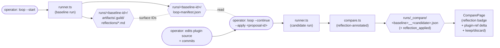

# Benchmark Factory — P4 Learning-Loop Architecture

> **Scope.** This document closes the autoresearch loop named in
> `01-architecture.md §2` (the `Reflection` node) and pinned by spec
> §Success P4. It locks **how** the operator drives a baseline →
> reflection → candidate cycle, **what** metadata the comparison carries
> when a reflection has been applied, and **what** rule decides whether
> a reflection is *kept* or *discarded*. It does not modify any locked
> P1/P2/P3 plan file. It pins three new schemas (`LoopManifest`,
> `ReflectionApplied`, optional `auth_identity_hash` annotation) plus
> one orchestrator pattern (the two-stage `loop` CLI). Backend (T2)
> implements; security (T6) threat-models the surfaces this design
> names; frontend (T3) renders the annotation; technical-writer (T5)
> turns this into the operator-facing runbook.

## 1. Where this document sits

| Document                                                   | Decides                                                                                                                                                                                                                  |
| ---------------------------------------------------------- | ------------------------------------------------------------------------------------------------------------------------------------------------------------------------------------------------------------------------ |
| `01-architecture.md`                                       | Multi-component design across all 4 phases. §2 names the `Reflection` node and explicitly defers the loop's wiring to P4. §3 data-flow table is the contract this loop's outputs sit on top of (not replace).             |
| `adr-001-runner-ui-boundary.md`                            | Server JSON shape (Option A). The loop does **not** add server routes in v1 (Option A — two-stage CLI in ADR-005); the existing `GET /api/comparisons/...` endpoint serves the reflection-annotated comparison unchanged. |
| `p2-ui-architecture.md`                                    | React app's component tree. P4 reuses ComparePage; frontend's T3 lane adds the reflection badge + plugin-ref delta + keep/discard badge as small additions to that page (no new pages, no new state library).             |
| `adr-003-host-repo-vs-fresh-fixture.md`                    | Cwd model. The loop reuses runner.ts unchanged → both baseline and candidate runs are fresh-fixture clones. Two runs of the same case under different `plugin_ref` are comparable by construction.                       |
| `adr-004-runner-process-group-signaling.md`                | Process-group signaling — survives untouched; the loop is a *caller* of runner.ts, not a re-implementation.                                                                                                              |
| `p3-runner-architecture.md`                                | Single-run subprocess + capture protocol. The loop calls `runBenchmark` twice (baseline, then candidate after operator-applied reflection). Nothing in §2–§4 of that doc changes.                                         |
| `benchmark/plans/security-review.md` (P3 — locked)         | P3 mitigations M1–M16. P4 adds new mitigations (file-write surface, manifest tampering, `auth_identity_hash` privacy boundary) in `security-review-p4.md` (T6 lane); this design **names** those surfaces for security to threat-model. |
| **this document**                                          | (a) loop orchestrator pattern (ADR-005 captures the decision); (b) `ReflectionApplied` schema added optionally to `Comparison`; (c) `LoopManifest` schema for the two-stage CLI handoff; (d) keep/discard rule + per-case override knob; (e) `auth_identity_hash` annotation surface (privacy + JSON shape pinned by security in T6). |
| `adr-005-learning-loop-orchestrator.md` (this lane writes) | Pins the orchestrator pattern as a stand-alone ADR with full Option scoring (Option A — two-stage CLI vs B — interactive vs C — server-side endpoint).                                                                   |
| Future `security-review-p4.md` (T6)                        | Threat-models the surfaces named in §3.4 (`auth_identity_hash`), §4 (manifest), and §6 (reflection-apply file-write).                                                                                                    |

This document is the contract the P4 backend (T2), security (T6), and
frontend (T3) lanes implement against. As with `p3-runner-architecture.md`,
nothing here is implementation code; the *interface* is locked, the *policy*
on writable paths and the *threat model* on tampering are forward-referenced
to security.

## 2. The loop, end-to-end

The autoresearch keep/discard pattern (`karpathy/autoresearch program.md`,
applied to Guild) reduces to a five-step cycle the operator drives manually:



The cycle reuses every existing component:

- **Baseline run** is `runner.ts` invoked exactly as P3 invokes it (fresh-fixture clone per ADR-003; process-group signaling per ADR-004; `events.ndjson` + captured `.guild/` tree per `p3-runner-architecture.md §3`).
- **Reflections** live where `guild:reflect` already writes them: `runs/<baseline-id>/artifacts/.guild/reflections/<proposal-id>.md`. The loop does not invent a new surface; it *reads* what the existing skill wrote.
- **Manifest** is the new artifact this design adds — a single JSON file pinned at `runs/<baseline-id>/loop-manifest.json` (sibling of `run.json`). Schema pinned in §4.
- **Apply step is operator-owned, not loop-owned** (Option A in ADR-005). The loop never edits plugin source.
- **Candidate run** is `runner.ts` invoked again, post-apply. The candidate's `run.json` carries the new `plugin_ref` (host repo HEAD changed). The runner needs no awareness of the loop.
- **Comparator** runs the same code path as P1+P3, plus a small enhancement (§3) that emits `reflection_applied` metadata when the loop wired the two runs.
- **UI** is unchanged except for the additions T3-frontend implements on ComparePage.

What the loop adds, the runner does not see. What the runner emits, the loop reads. **The seam is the `runs/<baseline-id>/loop-manifest.json` file** (§4) and the optional `reflection_applied` annotation on the post-loop `comparison.json` (§3).

## 3. Orchestrator shape

### 3.1 Decision (full scoring in ADR-005)

**Option A — Two-stage CLI** (`loop --start` then `loop --continue`).
Recommended and pinned in `adr-005-learning-loop-orchestrator.md`. The
operator runs:

```text
$ npm run benchmark -- loop --start --case demo-context-drift-evolve
⇒ baseline run executes (calls runner.ts)
⇒ runner emits runs/<baseline-id>/{run.json,events.ndjson,score.json,artifacts/.guild/}
⇒ loop reads runs/<baseline-id>/artifacts/.guild/reflections/*.md
⇒ loop emits runs/<baseline-id>/loop-manifest.json (state: "awaiting-apply")
⇒ loop prints proposal-id list + manifest path; exits 0

$ git checkout -b reflect-experiment-001
$ <operator hand-edits the plugin source per the chosen proposal>
$ git commit -am "apply reflection: <description>"

$ npm run benchmark -- loop --continue \
    --baseline-run-id <baseline-id> \
    --apply <proposal-id>
⇒ loop reads runs/<baseline-id>/loop-manifest.json
⇒ loop validates: state == "awaiting-apply", proposal_id ∈ available_proposals,
   plugin_ref (current HEAD) ≠ manifest.plugin_ref_before
⇒ candidate run executes (calls runner.ts; writes runs/<candidate-id>/...)
⇒ compare.ts diffs the two trial sets, annotates with reflection_applied (§3.3)
⇒ loop updates manifest.state = "completed"; exits 0
```

Two other actions are pinned for ergonomic completeness:

- `loop --status --baseline-run-id <id>` reads the manifest and prints `state`, `available_proposals[]`, `started_at` in human-readable form. No mutation. Useful when the operator returns to a baseline they started yesterday.
- `loop --start ... --dry-run` and `loop --continue ... --dry-run` print the resolved plan (baseline argv, manifest path, expected proposal-discovery directory; on `--continue`: candidate argv, manifest validation outcome, comparator paths) **without spawning anything**. This is the cost-discipline default per `.guild/plan/benchmark-factory-p4.md §Cost discipline`.

### 3.2 Why two-stage CLI (the headline trade)

Three options were scored against six drivers in ADR-005. The summary
table is reproduced for ease of cross-reference; full Option scoring
+ alternatives + audit-trail rejections live in the ADR.

| Driver                                                                            | Weight | A — two-stage CLI | B — interactive pause | C — server-side endpoint |
| --------------------------------------------------------------------------------- | -----: | ----------------: | --------------------: | -----------------------: |
| **D1** Spec literalism — "documented runbook explains how to run this loop manually" | 5      | **5**             | **4**                 | **2**                    |
| **D2** Operator-time fit — apply step takes hours; can't block a shell            | 5      | **5**             | **1**                 | **5**                    |
| **D3** Testability — every step is reachable via `--dry-run` + mocked spawn       | 4      | **5**             | **2**                 | **3**                    |
| **D4** Implementation cost — no new server routes, no new UI flows                | 4      | **5**             | **5**                 | **2**                    |
| **D5** Manifest as resumable forensic artifact                                    | 3      | **5**             | **2**                 | **4**                    |
| **D6** Doesn't entangle with frontend lane (T3 stays narrow)                      | 3      | **5**             | **5**                 | **2**                    |
| **Weighted total**                                                                | —      | **122**           | **76**                | **78**                   |

A wins decisively (full math + per-cell justifications in
`adr-005-learning-loop-orchestrator.md §Option scoring`). The decisive
drivers are **D1 (spec literalism)**, **D2 (operator-time fit — apply
step takes hours; B blocks a shell for that whole time)**, and **D3
(testability — `--dry-run` + mocked spawn make every code path
deterministic without burning tokens)**.

Concrete commitments locked here (also restated in ADR-005 §Decision):

1. **Two distinct CLI invocations.** No interactive prompt. No long-lived REPL. The seam between baseline and candidate is a file on disk (`loop-manifest.json`) + the operator's git history; both are durable across reboots, terminal closures, and machine moves.
2. **No new HTTP routes in v1.** `POST /api/loops` is explicitly out of scope. The existing `GET /api/comparisons/:baseline/:candidate` endpoint serves the reflection-annotated comparison unchanged (the new `reflection_applied` field is just one more field on the JSON the endpoint already returns).
3. **The loop never writes plugin source.** The apply step is operator-driven, version-controlled, and reviewable by humans before the candidate runs. This is non-negotiable; security threat-models it (T6) but the architecture pins the *boundary*.
4. **Both subcommands honour `--dry-run`** as the default verification path, matching the P3 cost discipline. CI never burns tokens.

### 3.3 Comparator integration — when does `reflection_applied` get emitted?

The comparator (`compare.ts`) is unchanged in shape. Today it reads
both trial sets' `run.json` + `score.json`, computes per-component
deltas, and emits `comparison.json`. P4 adds **one** new behaviour: if
both trial sets have a single canonical `plugin_ref` and a manifest
exists at `runs/<baseline-id>/loop-manifest.json` with `state ==
"completed"` and a populated `applied_proposal` block (§4 manifest
schema), the comparator emits the `reflection_applied` block on
`comparison.json` (§3 schema below).

When the loop is *not* the comparator's caller (e.g., the operator
runs `compare.ts` manually over two unrelated runs), the manifest is
absent and the field is omitted — backward-compatible with every
P1/P2/P3 fixture. `schema_version` stays `1`.

Edge case the comparator must handle: **mismatched proposals across the
two sets.** If the manifest was applied but a third party re-ran the
candidate against a different proposal, the manifest's
`applied_proposal.proposal_id` won't match the candidate's
`run.json.applied_proposal_id` (a new optional field — see §3.4). In
that case the comparator does not emit `reflection_applied` and adds an
`ExcludedRun` entry on the candidate side with
`reason: "proposal mismatch — manifest applied=A, run applied=B"`.
Backend confirms exact wording in T2.

### 3.4 Reflection-applied metadata schema

```ts
// New optional field on Comparison. Existing fields unchanged.
// schema_version stays 1 (backward-compatible — old fixtures parse cleanly).
export interface ReflectionApplied {
  proposal_id: string;        // file name without .md, matches reflection in baseline artifacts
  source_path: string;        // relative path of the file the proposal modified (operator-supplied via --apply)
  applied_at: string;         // ISO-8601 — when the operator ran `loop --continue`
  plugin_ref_before: string;  // host repo HEAD captured by `loop --start` (manifest.plugin_ref_before)
  plugin_ref_after: string;   // host repo HEAD captured at `loop --continue` (post-apply)
  kept: boolean;              // result of the keep/discard rule (§5) — backend computes server-side
  delta_summary: {            // pre-computed for ComparePage; redundant with comparison.guild_score_delta but
                              // keeps the keep/discard signal self-contained for snapshots / future website export
    guild_score_delta: number;     // signed; positive == improvement
    worst_component_delta: number; // signed; most-negative per-component delta among COMPONENT_KEYS
    worst_component: string;       // which key produced worst_component_delta (e.g. "loop_response")
  };
}

export interface Comparison {
  // ... existing P1+P3 fields (schema_version, baseline, candidate, status,
  //     excluded_runs, per_component_delta, guild_score_delta, generated_at) ...
  reflection_applied?: ReflectionApplied;   // optional; absent on non-loop comparisons
}
```

**Field naming is locked here.** The backend may add internal helpers
but the field name `reflection_applied` and its sub-fields
(`proposal_id`, `source_path`, `applied_at`, `plugin_ref_before`,
`plugin_ref_after`, `kept`, `delta_summary.{guild_score_delta,
worst_component_delta, worst_component}`) are the contract the
frontend (T3) and the eventual website export consume. Renames require
a new ADR.

**Why `kept` is on the metadata, not on a sibling field.** `kept` is
*derived* from the comparison + the `learning_loop:` configuration; it
is meaningful only when a reflection was applied. Putting it on a
sibling field would invite consumers to read it on non-loop
comparisons (where it has no defined meaning). Co-locating it with
`reflection_applied` makes the dependency type-level explicit:
`comparison.reflection_applied?.kept` is `undefined` exactly when
`reflection_applied` is absent.

**Why `delta_summary` duplicates information.** ComparePage needs to
render the badge with the score delta + the worst-regressing component
without re-walking `per_component_delta`. The website export (deferred
per spec §Non-goals) wants a self-contained block. Pre-computing it
costs four numbers per comparison and saves consumers from redoing the
keep/discard arithmetic. The full `per_component_delta` map remains
the source of truth.

**`auth_identity_hash` — privacy boundary, not a benchmark field.**
P4 adds an *optional* `auth_identity_hash?: string` field to `RunJson`
(not to `ReflectionApplied`). Its purpose is forensic correlation
across runs that share an authenticated identity (e.g., "all runs
from this operator's `claude` auth"), without leaking the credential.
The contract this design pins:

- The field is **operator-supplied**, sourced from a `GUILD_BENCHMARK_AUTH_HINT` environment variable the runner reads (per `.guild/plan/benchmark-factory-p4.md` T2-backend).
- The runner does **not** inspect `claude` CLI's auth state. It does not call `claude auth status` or read `~/.claude/`. It only forwards what the operator put in the env var.
- The value MUST be a one-way hash of an opaque identity token (see security review T6 §iii for the threat model + redaction policy). The runner does not re-hash; it stores verbatim what the operator supplied.
- Absence is normal. P1/P2/P3 fixtures parse cleanly because the field is optional.
- This field never flows into `ReflectionApplied`. Reflection comparisons are scoped to `plugin_ref` + `model_ref`, not to operator identity.

Backend (T2) implements; security (T6) pins the input-validation rule
(rejecting strings that look like raw credentials — e.g., starting
with `sk-`, containing `=` after `Bearer`, etc.) and the
redaction-on-leakage policy. Architect locks the *interface* (one
optional string on `RunJson`); security locks the *policy*.

## 4. Manifest schema

### 4.1 What `loop-manifest.json` is

The manifest is the durable handoff between `loop --start` and `loop
--continue`. It lives at:

```
runs/<baseline-run-id>/loop-manifest.json
```

— sibling of `run.json`, inside the baseline run's directory. This
co-location matters: the manifest's lifecycle is the baseline run's
lifecycle; deleting the baseline removes the manifest in a single
filesystem operation.

The manifest's purpose is two-fold: (a) it is the on-disk seam the
two-stage CLI bridges across, and (b) it is the forensic record of
which proposals were available at baseline-emit time (so a much later
audit can answer "given this baseline, what proposals could have
been applied?").

### 4.2 Schema

```ts
export interface LoopManifestProposal {
  proposal_id: string;   // file name without .md (e.g., "2026-04-26-context-fanout")
  source_path: string;   // declared target file the proposal modifies (relative to host repo)
                         // — extracted from the proposal body's frontmatter; backend confirms key in T2
  summary: string;       // first non-empty line of the proposal body, trimmed to ≤ 160 chars
}

export interface LoopManifestApplied {
  proposal_id: string;       // mirrors the --apply argument
  source_path: string;       // mirrors the chosen proposal's source_path
  applied_at: string;        // ISO-8601 — when `loop --continue` ran
  plugin_ref_after: string;  // host repo HEAD captured at `loop --continue` (post-apply commit)
  candidate_run_id: string;  // run-id of the candidate the loop produced
}

export interface LoopManifest {
  schema_version: 1;
  baseline_run_id: string;
  case_slug: string;
  plugin_ref_before: string;       // host repo HEAD captured at `loop --start`
  available_proposals: LoopManifestProposal[];
  started_at: string;              // ISO-8601 — when `loop --start` ran
  state: "awaiting-apply" | "completed" | "aborted";
  applied_proposal?: LoopManifestApplied;   // populated by `loop --continue` (state=="completed")
                                            // OR populated by an explicit `loop --abort` (state=="aborted",
                                            // applied_proposal omitted; abort_reason recorded instead)
  abort_reason?: string;           // populated only on `state=="aborted"` (out of P4 scope to expose; reserved)
}
```

Versioning is explicit — a `schema_version: 1` literal in the type
matches the project-wide convention from `benchmark/src/types.ts
SCHEMA_VERSION`. Future changes bump the version and run through the
same plan-gated flow used for the runner's `RunJson`.

### 4.3 Lifecycle

| Transition                                  | Trigger                                | Resulting state    | Side effects                                                                                            |
| ------------------------------------------- | -------------------------------------- | ------------------ | ------------------------------------------------------------------------------------------------------- |
| (none) → `awaiting-apply`                   | `loop --start` succeeds                | `awaiting-apply`   | Manifest file created with `available_proposals[]` populated from `runs/<id>/artifacts/.guild/reflections/*.md`. |
| `awaiting-apply` → `completed`              | `loop --continue` succeeds             | `completed`        | `applied_proposal` populated; candidate run completed; `compare.ts` writes the `reflection_applied`-annotated comparison. |
| `awaiting-apply` → `aborted`                | (reserved — out of P4) `loop --abort`  | `aborted`          | `abort_reason` populated; no candidate run produced. Reserved for v1.x.                                  |
| `completed` → (no further transitions)      | terminal state                         | —                  | Manifest is read-only. Re-running `loop --continue` against a `completed` manifest exits with a clear error message. |

**State validation rules `loop --continue` enforces** (security T6
threat-models the on-disk-tamper surface; this section pins the
runtime checks):

1. `state` MUST equal `"awaiting-apply"`. Any other value is a hard reject (do not silently overwrite a `completed` manifest).
2. `--apply <proposal-id>` MUST match an entry in `available_proposals[]`. A mismatch is a hard reject — refuses the candidate run rather than executing against an unknown proposal.
3. The host repo's current `HEAD` (read via `git rev-parse HEAD` from `process.cwd()`, captured before spawning the candidate runner) MUST differ from `manifest.plugin_ref_before`. Identical refs mean the operator forgot to commit — hard reject with a message naming the expected delta.
4. The candidate run's `case_slug` (from the case-loader, not the manifest) MUST equal `manifest.case_slug`. A mismatch means the operator passed the wrong baseline-run-id; hard reject.
5. The manifest's `schema_version` MUST equal `1`. A future-versioned manifest read by an older binary is a hard reject (forwards-incompatibility error message naming the expected version).

These checks run **before** the candidate run starts. Failing fast
saves an hour of wall-clock and ensures a corrupt or stale manifest
cannot silently produce a misleading comparison.

**Out of scope for v1 manifest validation** (forward-referenced to
security T6): cryptographic signing of the manifest (the manifest is
plain JSON; an attacker with write access to `runs/` can tamper with
it). Security may recommend a hash-of-baseline-artifacts checksum
approach in T6; if so, ADR-006 captures the change and backend
implements. Architect locks the *runtime checks* listed above; security
threat-models the *tampering* surface and decides whether stronger
mitigations are needed for v1 or deferred.

### 4.4 Discovery rule for `available_proposals[]`

The loop populates `available_proposals[]` by enumerating
`runs/<baseline-run-id>/artifacts/.guild/reflections/*.md` (the path
`guild:reflect` writes to per its skill convention; `01-architecture.md
§3` artifact table — the reflections live inside the captured
`.guild/` tree). Rules:

1. **Only `.md` files.** Other extensions are skipped (with a `tool_error` event in the loop's own log, not the manifest itself).
2. **`proposal_id` is the file basename without `.md`.** E.g., `2026-04-26-context-fanout.md` → `proposal_id: "2026-04-26-context-fanout"`.
3. **`source_path` and `summary` come from the proposal body.** Backend confirms in T2 the exact frontmatter key for `source_path` (likely `target:` or `path:` — depends on what `guild:reflect` emits). `summary` is the first non-empty body line, trimmed to ≤ 160 chars.
4. **Empty `available_proposals[]` is allowed.** A baseline that produced no reflections is still a valid baseline — the manifest emits with `available_proposals: []` and `state: "awaiting-apply"`. The operator gets a clear message ("no proposals to apply") and can either abort (out of v1; just `rm` the manifest) or wait for a richer baseline.
5. **Path-resolution.** Reflection paths resolve via the same `path.resolve` + verify-under-root guard as `p3-runner-architecture.md §3.4` — the loop refuses any reflection whose path escapes `runs/<baseline-run-id>/artifacts/.guild/reflections/`.

Backend (T2) implements the enumeration; security (T6) pins the
allowlist of readable paths (this design's default: enumerate only
within the reflections directory; do not follow symlinks; refuse
absolute paths).

## 5. Keep/discard rule

### 5.1 The rule

```text
A reflection is KEPT when:
  comparison.guild_score_delta.delta >= keep_threshold
  AND for all k in COMPONENT_KEYS:
    comparison.per_component_delta[k].delta >= regression_threshold

Otherwise it is DISCARDED.

Defaults:
  keep_threshold        = 2.0         (weighted points, signed; positive == improvement)
  regression_threshold  = -1.0        (weighted points, per-component;
                                       any single component falling more than 1.0 disqualifies)
```

`COMPONENT_KEYS` is the canonical list from `benchmark/src/types.ts`
(`outcome, delegation, gates, evidence, loop_response, efficiency`).
The rule operates on the **mean** per-component delta across the trial
set, which is what `compare.ts` already emits in
`per_component_delta[k].delta`.

`kept: boolean` is computed server-side by `compare.ts` and emitted on
the `reflection_applied` block of `comparison.json` (§3.4). Frontend
(T3) renders the badge from this boolean; it does not re-derive.

### 5.2 Worked examples

Each row applies the default thresholds (`keep ≥ 2.0`,
`regression ≥ -1.0`). The "outcome" column is the rule's verdict. The
rule is intentionally simple — these examples exist so backend, qa, and
the operator have unambiguous reference points.

| Scenario                                                        | `guild_score_delta.delta` | Worst per-component delta | `kept` | Reason                                                               |
| --------------------------------------------------------------- | ------------------------- | ------------------------- | -----: | -------------------------------------------------------------------- |
| Improvement, no regression                                      | `+3.5`                    | `+0.4` (best gain)        | `true` | Meets keep_threshold; no component crosses regression_threshold.     |
| Improvement, mild regression on one component                   | `+2.2`                    | `-0.6` (delegation)       | `true` | Meets keep_threshold; -0.6 > -1.0 so no component disqualifies.       |
| Improvement, hard regression on one component                   | `+4.0`                    | `-1.4` (efficiency)       | `false`| Component regression of -1.4 is below -1.0 → discard despite gain.   |
| No improvement, no regression                                   | `+0.5`                    | `-0.3`                    | `false`| Below keep_threshold (2.0).                                          |
| Net regression                                                  | `-1.8`                    | `-2.1`                    | `false`| Both criteria fail.                                                  |
| Boundary — exactly 2.0 improvement, exactly -1.0 worst component | `+2.0`                    | `-1.0`                    | `true` | `>=` is inclusive on both sides — boundary cases are kept (test pin). |

The boundary case is locked deliberately (`>=`, not `>`). Operators
can tune by editing the case YAML; the boundary semantics do not
change with thresholds — backend tests pin equality at the configured
value (qa T4-pins).

### 5.3 Per-case override knob

The rule is a **default**, not a hard-code. Each case YAML may declare
an optional `learning_loop:` block:

```yaml
# benchmark/cases/<slug>.yaml — optional block
learning_loop:
  keep_threshold: 2.0          # default; weighted points; positive == improvement
  regression_threshold: -1.0   # default; per-component, signed; any single component below this disqualifies
```

Both fields are optional inside the block; absent fields fall back to
defaults. The block itself is optional; absent block means defaults
apply. This keeps existing case YAMLs valid (no migration required)
and gives operators a per-case knob without touching code.

Type extension (backend implements in T2):

```ts
// benchmark/src/types.ts (extended; backward-compatible)
export interface CaseLearningLoop {
  keep_threshold?: number;        // weighted points; default 2.0
  regression_threshold?: number;  // weighted points (signed); default -1.0
}

export interface Case {
  // ... existing fields ...
  learning_loop?: CaseLearningLoop;
}

export const DEFAULT_LEARNING_LOOP: Required<CaseLearningLoop> = {
  keep_threshold: 2.0,
  regression_threshold: -1.0,
};
```

Validation at case-load time (backend in T2): `keep_threshold` must be
finite and `> 0`; `regression_threshold` must be finite and `< 0`. A
zero or wrong-signed value is a case-load error, not a runtime
fall-through. The constraint preserves the rule's semantic shape (an
improvement bar + a regression floor).

### 5.4 Why this rule, in this shape

The rule traces directly to spec §Success P4 ("the comparison view
shows whether the score moved … the autoresearch keep/discard signal")
and to the autoresearch source pattern (`karpathy/autoresearch
program.md` — a single, comparable primary score is the keep/discard
signal). It is intentionally:

- **Two-criterion, not single-criterion.** `guild_score` alone is not enough — a reflection that adds 3 points to `outcome` while subtracting 2 from `loop_response` looks like a 1-point gain in aggregate but is *bad* for the autoresearch loop (we are tuning Guild's loop quality, not just outcome theatre). The per-component regression floor catches this.
- **Component-symmetric.** The regression floor applies to *every* `COMPONENT_KEYS` entry equally — there is no "important component" carve-out. Per-case sensitivity is expressed via per-case `scoring_weights` (existing P1 mechanism), not via per-component thresholds.
- **Configurable per case, not per run.** A case's nature dictates how aggressive the keep bar should be; the operator should not tune thresholds per run (that would be cherry-picking).
- **Computed server-side, surfaced verbatim in the UI.** Frontend never computes the rule. This keeps the boolean coherent with the JSON shape the website export will eventually snapshot.

Adversarial framing (the *threshold-gaming* surface) is forward-
referenced to security in T6 §iv: a malicious proposal could be
crafted to clear the threshold by exactly the keep_threshold while
regressing on a metric Guild does not currently measure.
**Architect's mitigation guidance for security:** surface the full
per-component delta in the UI annotation (frontend T3 already plans
this — the per-component delta table is unchanged from P2/P3) so the
operator sees the whole picture, not just the boolean. A green "kept"
badge alongside a per-component delta table that shows a -0.9 wobble
on `evidence` is information the operator can act on. Security pins
the policy.

## 6. Surfaces routed to security (T6 — input to threat-modelling)

This design names three new attack surfaces that did not exist in P3.
Security threat-models them in `security-review-p4.md`; this section
pins the architectural interface so security has a concrete target.

### 6.1 Reflection-apply file-write surface

> **Superseded in part by v1.3 (2026-04-27) — `loop --rollback` action lands.**
> The "Rollback semantics" forward-reference in this section's threat-model
> bullet (operator reverts the commit by hand; security may require a
> `loop --rollback <candidate-id>` helper later) is **closed** by v1.3:
> `loopRollback()` lands in `benchmark/src/loop.ts` with CLI dispatch in
> `cli.ts`, refusing on non-`completed` manifest states, supporting
> `--dry-run` (default) and `--confirm` (live, shells out to `git revert`
> behind the M13 path-allowlist for IDs). The new manifest state
> `"rolled-back"` is durable. Architect's earlier "if so, ADR captures the
> addition" hedge is closed by the v1.3 plan + backend's T2 implementation;
> see `benchmark/FOLLOWUPS.md §F2` (closure), `.guild/spec/v1.3.0-deferred-cleanup.md
> §Success-criteria §1`, and `.guild/plan/v1.3.0-deferred-cleanup.md
> §T2-backend` for the contract. The §6.1 prose below is preserved verbatim
> for audit-trail continuity; the rollback-semantics bullet's "Currently:
> the operator reverts the commit and re-runs the loop" line is the v1.x
> fallback for operators who choose not to use `loop --rollback`.

When the operator runs the apply step (between `--start` and
`--continue`), they hand-edit plugin source per the chosen proposal.
The loop is **not** the writer — but the proposal body *is* operator-
followed instructions, and the proposal body comes from a `claude`
subprocess output that may have been influenced by the case prompt.

What this design pins:

- **The loop never writes plugin source.** No `loop --apply-auto` flag in v1; security T6 may *recommend* a future automated apply mode but the architecture pins the v1 boundary at "operator owns the apply".
- **The proposal body is captured verbatim** in `runs/<baseline-id>/artifacts/.guild/reflections/`. The loop does not parse, sanitise, or redact it — that would mask what the operator is choosing to apply.
- **`source_path` in the manifest is advisory.** The loop reads it from the proposal frontmatter for display purposes only; it does not enforce that the operator actually edited that file. Enforcing path constraints would require diffing the operator's commit against the manifest, which is out of P4 scope.

What security threat-models in T6 §i:

- A malicious proposal whose body instructs the operator to perform a security-relevant edit (e.g., "delete the auth check in `agents/security.md`").
- Race conditions — the operator runs `loop --continue` while another `loop --start` is in flight on a different baseline. (Architect's note: this is a low-probability risk because each baseline is a fresh fixture; security may require a lockfile under `runs/` if the threat is judged real.)
- Rollback semantics — the operator chose poorly and the candidate ran for an hour before they realised. Currently: the operator reverts the commit and re-runs the loop. Security may require a `loop --rollback <candidate-id>` helper; if so, ADR-006 captures the addition.

### 6.2 Manifest tampering surface

The manifest is plain JSON. An attacker with write access to
`runs/<baseline-id>/loop-manifest.json` can:

- Add a fake entry to `available_proposals[]` and pass it via `--apply`.
- Flip `state` from `completed` back to `awaiting-apply` to coerce a re-run.
- Edit `plugin_ref_before` so the "ref must have changed" check trivially passes.

What this design pins:

- §4.3's runtime validation checks (5 hard rejects). These catch the obvious cases but cannot detect a sophisticated attacker who edits the manifest *and* the host git history *and* the reflection files coherently.
- The manifest lives *under* `runs/`, which is also the area the runner writes to. There is no privileged-vs-unprivileged separation — single-operator scope (spec §Audience).

What security threat-models in T6 §ii:

- Whether a hash-of-baseline-artifacts checksum stored in the manifest (and verified at `--continue`) is required for v1 or deferrable.
- Whether the manifest should be made read-only after `loop --start` (filesystem `chmod 0444`) — useful but defeated by `chmod 0644` from any operator-equivalent process.
- Replay — operator runs `loop --continue` against an old manifest from a different machine that has been moved into `runs/`. Architect's runtime checks catch the obvious version mismatch but not a coherent same-version replay.

### 6.3 `auth_identity_hash` privacy boundary

Already pinned in §3.4. Recap for the security cross-walk:

- Field is optional, operator-supplied via `GUILD_BENCHMARK_AUTH_HINT` env var.
- Runner stores verbatim; does not inspect; does not re-hash.
- Must be a one-way hash of an opaque identity token — *not* the credential itself.

What security threat-models in T6 §iii:

- Input validation rule for the env var (reject obviously-credential-shaped values: starts with `sk-`, contains `Bearer `, length matches a known credential format, etc.).
- Redaction policy if the value accidentally appears in a log file (`_subprocess.stderr.log`, runner's own logs). Recommendation pinned by security; backend implements.
- Whether forensic correlation across runs by hash should ever be exposed in the UI (architect's default: no — it is forensic-only, not benchmark-relevant).

## 7. Cross-references

- **`benchmark/plans/01-architecture.md` §2** — `Reflection` node definition. This document closes the loop the §2 row anticipates.
- **`benchmark/plans/01-architecture.md` §3** — data-flow table. The new `loop-manifest.json` artifact lives at `runs/<baseline-id>/loop-manifest.json` (sibling of `run.json`); the existing `comparison.json` row gains an optional `reflection_applied` field. No existing row's producer or consumer changes.
- **`benchmark/plans/01-architecture.md` §6** — open question "reflection-applied metadata that P4 needs (which reflection was applied between baseline and candidate?) is not yet designed. Flag for the P4 plan." → closed by this document's §3.4 + §4.
- **`benchmark/plans/adr-001-runner-ui-boundary.md` §Decision** — server JSON shape unchanged. The reflection-annotated `comparison.json` flows through the existing `GET /api/comparisons/:baseline/:candidate` endpoint with one new optional field. No new routes.
- **`benchmark/plans/adr-003-host-repo-vs-fresh-fixture.md` §Decision** — both baseline and candidate runs are fresh-fixture clones. The loop does not change the cwd model; comparability is preserved by construction.
- **`benchmark/plans/adr-004-runner-process-group-signaling.md` §Decision** — process-group signaling protects both runs the loop invokes; no change.
- **`benchmark/plans/p3-runner-architecture.md` §3** — artifact-capture protocol. The loop reads from `runs/<baseline-id>/artifacts/.guild/reflections/` (a path the runner already populates per §3.3); it does not modify §3 in any way.
- **`benchmark/plans/security-review.md`** (P3 — locked) — threat model for the runner. P4's new surfaces (file-write, manifest tampering, `auth_identity_hash`) are forward-referenced to `security-review-p4.md` (T6 lane).
- **`benchmark/src/types.ts`** — new types (`ReflectionApplied`, `LoopManifest`, `LoopManifestProposal`, `LoopManifestApplied`, `CaseLearningLoop`, `DEFAULT_LEARNING_LOOP`); extended types (`Comparison.reflection_applied?`, `Case.learning_loop?`, `RunJson.auth_identity_hash?`). Backend (T2) implements; existing P1/P2/P3 fixtures remain valid (`SCHEMA_VERSION` stays `1`).
- **`benchmark/src/runner.ts`** — referenced, not modified. The loop is a caller. The only runner change in P4 is `auth_identity_hash` population from the env var (T2 lane); architecturally it is one extra read + one extra write of an optional string.
- **`benchmark/src/compare.ts`** — referenced; the `reflection_applied` annotation is a small extension at the end of the existing `comparison.json` emit (T2 lane). Backward-compatible.
- **Forward reference: `benchmark/plans/security-review-p4.md` (T6)** — threat-models the surfaces named in §6 (and in §3.4 for `auth_identity_hash`).
- **Forward reference: `benchmark/plans/06-learning-loop.md` (T5)** — flesh-out from P1 stub. T5 cites this document's §3 (orchestrator), §4 (manifest), §5 (keep/discard) verbatim.
- **`karpathy/autoresearch program.md`** — source pattern. Keep/discard around fixed cases is the architectural primitive this loop applies to Guild itself.
- **`guild-plan.md §10.3`** — decision-routing rule. The orchestrator pattern is captured as `adr-005-learning-loop-orchestrator.md`; this document is the multi-component design that operationalises it.

## 8. Files added

These are the files this lane (T1-architect for P4) creates. Listed
here so technical-writer (T5) can update `benchmark/plans/00-index.md`
per their lane.

- `benchmark/plans/p4-learning-loop-architecture.md` (this file)
- `benchmark/plans/adr-005-learning-loop-orchestrator.md`

No implementation code is added by this lane — `loop.ts`, the
`comparison.json` schema bump, the `RunJson.auth_identity_hash`
extension, and all `case.yaml learning_loop:` plumbing are backend's
T2 deliverables, against the contract this document fixes.

## 9. Open questions and follow-ups (routed to other lanes)

- **Exact frontmatter key for `source_path` in reflection bodies.** §4.4 names it `target:` or `path:` and defers to backend to confirm in T2. → **backend (T2)**, **technical-writer (T5)** to document in `06-learning-loop.md`.
- **`abort` action — `loop --abort --baseline-run-id <id>`.** §4.3 reserves `state: "aborted"` but does not implement the action in v1. The operator can `rm` the manifest to abandon a baseline. If demand for a structured abort emerges, ADR-006 captures it. → **followup**.
- **Manifest cryptographic signing / hash-of-artifacts.** §4.3 + §6.2 forward-reference this to security T6. If security recommends signing for v1, ADR-006 captures the change and backend implements. → **security (T6)**, possibly **architect (followup)** for ADR-006.
- **`loop --rollback <candidate-id>` helper.** §6.1 forward-references rollback semantics. v1 default: operator reverts the commit by hand. → **followup** if security or operator feedback warrants.
- **`auth_identity_hash` UI surfacing.** §6.3 architect default: never expose in the UI (forensic-only). If product wants a "show me runs by this auth hash" view, that triggers a new lane in v1.x. → **followup**.
- **Threshold-gaming surface (§5.4).** The architect's mitigation guidance is "surface the full per-component delta in the UI." Security pins the policy in T6 §iv. → **security (T6)**.
- **Per-case override schema validation rules.** §5.3 names `keep_threshold > 0` and `regression_threshold < 0` as case-load constraints. Backend confirms enforcement in T2; qa pins the validation tests. → **backend (T2)**, **qa (T4)**.
