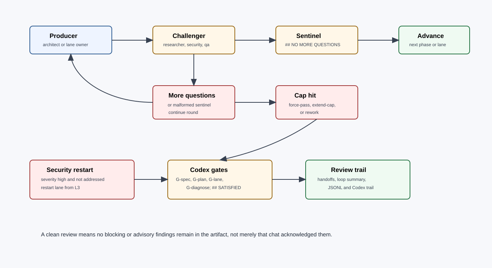

# Adversarial Review

Guild v2 uses challengers at every load-bearing decision point. The challenger can be an internal specialist loop, a cross-model adversarial reviewer, or a final review specialist. The objective is not debate for its own sake; it is to force missing requirements, edge cases, and weak evidence into artifacts before execution continues.



## Challenger Roles

| Gate | Producer | Challenger | Focus |
|---|---|---|---|
| Init review | Researcher/technical-writer | Cross-model adversary | Missing knowledge, unsupported facts, stale assumptions. |
| Ideation review | Architect/researcher | Cross-model adversary | Weak idea, missing alternatives, hidden assumptions. |
| Planning review | Architect/technical-writer | Cross-model adversary plus QA/security as needed | PRD defects, edge cases, vague done criteria. |
| L3 implementation | Lane owner | Tester | Properties, edge cases, minimal failing examples. |
| L4 implementation | Lane owner | QA | Regression strategy, evidence quality, completeness. |
| Security review | Lane owner | Security | High-severity unaddressed findings. |
| Architecture review | Lane owner | Architect/tech lead | Boundary drift, coupling, scalability, maintainability. |
| Quality review | QA | Cross-model adversary/domain owner | E2E coverage, release risk, goal alignment. |
| Operations review | DevOps/domain owner | Security/cross-model adversary | Blast radius, rollback, monitoring, incident risk. |
| G-init | Init artifact/wiki diff | Cross-model adversary | Missing context, unsupported facts, stale knowledge. |
| G-ideation | Idea spec | Cross-model adversary | Weak assumptions, missing alternatives, unclear success. |
| G-planning | PRD/task plan | Cross-model adversary | Missing tasks, vague validation, bad done criteria. |
| G-development | Development receipts | Cross-model adversary | Missing evidence, unresolved review, task drift. |
| G-quality | Quality report | Cross-model adversary | E2E gaps, release risk, weak coverage. |
| G-operations | Ops record/runbook | Cross-model adversary | Blast radius, rollback, observability gaps. |
| G-spec | Spec artifact | Codex | Missing criteria, ambiguity, security, autonomy, untestable claims. |
| G-plan | Plan artifact | Codex | Lane contract defects and unhandled dependencies. |
| G-lane | Handoff receipt | Codex | Missing evidence, incomplete scope, unresolved risks. |
| G-diagnose | Diagnosis report | Codex | Weak self-fix plan, unsafe edit proposal, missing evidence. |
| Final review | Receipts | QA/domain peer | Spec conformance and quality. |

The `G-spec`, `G-plan`, and `G-lane` gates are compatibility names for the older `/guild` flow. In v2 phase terminology they map to `G-ideation`, `G-planning`, and `G-development` respectively.

## Internal Loop Contract

Every internal loop has:

- fixed cap;
- round start and round end events;
- producer output;
- challenger response;
- exact termination sentinel `## NO MORE QUESTIONS`;
- post-sentinel scan for unresolved questions, blockers, or TODO markers;
- cap escalation choices: `force-pass`, `extend-cap`, `rework`;
- summary artifact in `.guild/runs/<run-id>/loops/`;
- assumptions appended when force-passed.

Malformed termination never silently passes. Two consecutive malformed terminations escalate.

## Cross-Model Review Selection

Prefer an adversarial reviewer from the other model family:

| Primary runtime | Preferred adversary | Fallback |
|---|---|---|
| Claude Code | Codex reviewer when available | Clean-context Claude reviewer with only artifact + review rubric. |
| Codex | Claude reviewer when available | Clean-context Codex reviewer with only artifact + review rubric. |
| Unknown or single-runtime environment | Separate clean-context agent using the same model | Same model, isolated prompt, no producer transcript except required artifact. |

Clean-context means the reviewer receives:

- the artifact under review;
- the phase objective;
- the relevant done criteria;
- the review rubric;
- source links or artifact paths;
- prior review findings only when checking a revision.

It should not receive the producer's hidden reasoning or broad chat transcript.

## Codex Review Contract

Codex review is a separate adversarial gate through `guild:codex-review`.

Phase-level gates use the same sentinel and trail format, with gate names:

```text
G-init
G-ideation
G-planning
G-development
G-quality
G-operations
G-diagnose
```

Pass signal:

```markdown
## SATISFIED
```

The sentinel must be a standalone trimmed line and must not coexist with unresolved findings.

Round cap:

- default: 5;
- configurable by `--codex-cap=N` or `.guild/config.yml`;
- maximum: 10.

Unavailable Codex:

- emit a warning;
- continue the run;
- do not hard-block normal plugin users.

Guild self-build and cross-model operation:

- treat Codex review as always on for lifecycle gates;
- if Codex is unavailable, record the skip and continue rather than blocking on tooling outage.
- when running from Codex, prefer a Claude adversary by the same contract.

## Adversarial Agent Prompt Shape

An adversarial agent should ask:

- What success criterion is missing or unmeasurable?
- What dependency is implicit but not recorded?
- What user approval or autonomy boundary is unclear?
- What security, privacy, or destructive-action risk is hidden?
- What edge case would cause a lane to produce a plausible but wrong artifact?
- What evidence would prove completion?
- What would make this plan fail under parallel execution?
- What assumption should be promoted into `.guild/wiki/decisions`?
- What relevant memory should an advisory agent retrieve before this phase proceeds?

If no issue remains, the challenger emits only the required sentinel.

## Advisory Posture

When in doubt, the adversarial agent should prefer:

- narrowing scope over broadening it;
- explicit assumptions over silent inference;
- user confirmation for destructive or external effects;
- measurable criteria over qualitative statements;
- restarting a lane over accepting a high-severity unaddressed security finding;
- documenting a residual risk over hiding uncertainty.

## Review Artifacts

| Artifact | Path |
|---|---|
| Internal loop round handoffs | `.guild/runs/<run-id>/handoffs/<loop>/` |
| Loop summary | `.guild/runs/<run-id>/loops/<loop>-summary.md` |
| Codex trail | `.guild/runs/<run-id>/codex-review/<gate>.md` |
| Loop JSONL | `.guild/runs/<run-id>/logs/v1.4-events.jsonl` |
| Legacy telemetry | `.guild/runs/<run-id>/events.ndjson` |
| Final review | `.guild/runs/<run-id>/review.md` |
| Verification report | `.guild/runs/<run-id>/verify.md` |

## Clean Review Definition

A design or architecture artifact has a clean review only when:

1. the reviewer maps every explicit requirement to an artifact or calls it missing;
2. all findings are resolved in the artifact, not just acknowledged in chat;
3. no blocking or advisory comments remain;
4. the reviewer states the clean sentinel or equivalent sign-off;
5. the review trail is saved or summarized with evidence.
