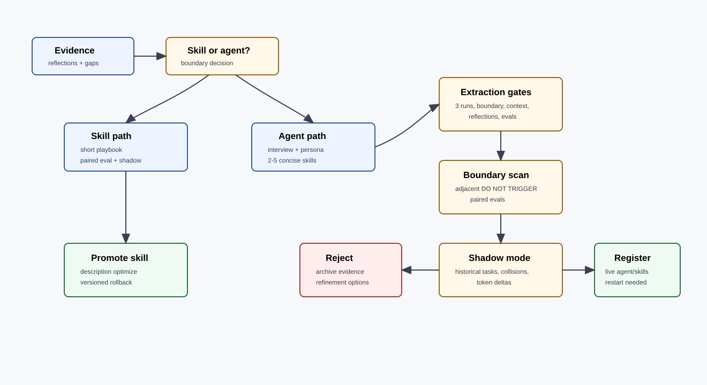

# Agent and Skill Factory

Guild v2 creates new skills and agents only when repeated evidence shows a stable boundary. The factory is conservative because every new trigger increases routing complexity.

## Skill Design Rule

Skills should be short, concise, and Claude Code-first:

- one responsibility per skill;
- clear trigger and do-not-trigger language;
- one compact workflow;
- explicit input and output artifacts;
- no broad persona prose that belongs in `agents/*.md`;
- no hidden dependency on a specific session transcript;
- Codex parity where practical through markdown artifacts and filesystem state.

## When to Create a Skill

Create or evolve a skill when:

- the same procedure repeats across tasks;
- the procedure has verifiable inputs and outputs;
- the role already exists and only needs a sharper capability;
- the change can be tested with positive and negative eval cases;
- the procedure does not need a new persona boundary.

Do not create a skill when the need is one-off, vague, or better handled by a plan assumption.

## Skill Evolution Loop

1. Snapshot the current skill to `.guild/skill-versions/<skill>/v<n>/`.
2. Load or bootstrap eval cases.
3. Run paired agents:
   - A is current skill or no-skill baseline.
   - B is the proposed edit.
4. Grade assertions and compute flip report.
5. Run shadow mode on historical tasks.
6. Promote only when regression rules pass or the user explicitly accepts the tradeoff.
7. Optimize description for trigger accuracy and token budget.
8. Keep rollback snapshots non-destructive.

## When to Create an Agent

Create a new specialist only when all extraction signals pass:

| Signal | Required evidence |
|---|---|
| Recurring cluster | Same skill cluster appears across at least 3 unrelated tasks. |
| Distinct trigger boundary | Existing agents cannot own it without ambiguous routing. |
| Context isolation payoff | The role carries enough domain context to benefit from isolation. |
| Reflections or gaps | At least 3 reflections or team-compose gaps point to the same role. |
| Eval coverage | At least 3 positive and 3 negative cases exist. |

## Agent Creation Workflow

1. Interview for role name, responsibility, typical prompts, example outputs, and dependencies.
2. Draft `agents/proposed/<role>.md`.
3. Draft 2-5 proposed specialist skills under `skills/specialists/proposed-<role>-*/`.
4. Scan existing agents for description overlap.
5. Propose adjacent `DO NOT TRIGGER` clauses.
6. Gate every adjacent-boundary edit through paired evals.
7. Gate the new specialist through paired evals and shadow mode.
8. Register live paths only after gates pass.
9. Tell the user a Claude Code restart is required before the new specialist is routable by agent definition.

## Persona Structure

Each agent persona should include:

- role mission in one paragraph;
- trigger and do-not-trigger boundaries;
- expected artifacts;
- dependencies read from upstream specialists;
- downstream handoff expectations;
- allowed tools and MCP requirements by default;
- review posture and evidence standard;
- failure or escalation rules.

Personas should not duplicate long skill instructions. Agents select and sequence skills; skills encode the repeatable method.

## Boundary Scan

Boundary scan compares the proposed description to current agent descriptions. A flagged adjacent specialist does not automatically change. It receives a proposed `DO NOT TRIGGER for: <new-domain>` clause, then the clause goes through the same evolve gate as any other trigger change.

High-risk adjacent pairs:

- `frontend` vs `mobile` for React Native or responsive UI.
- `copywriter` vs `marketing` for campaign copy.
- `technical-writer` vs `copywriter` for tutorials and product docs.
- `seo` vs `marketing` for landing-page strategy.
- `researcher` vs `architect` for technical evaluation.
- `security` vs `backend` for auth and integration design.

## Codex Parity

For Codex parity:

- keep skills as markdown playbooks with explicit artifacts;
- keep agent definitions transformable to TOML-style metadata;
- record required tools and MCP servers in team YAML and context bundles;
- avoid runtime-only assumptions about Claude Code frontmatter when agent-team mode is used;
- let Codex review consume the same spec, plan, and receipt files.
