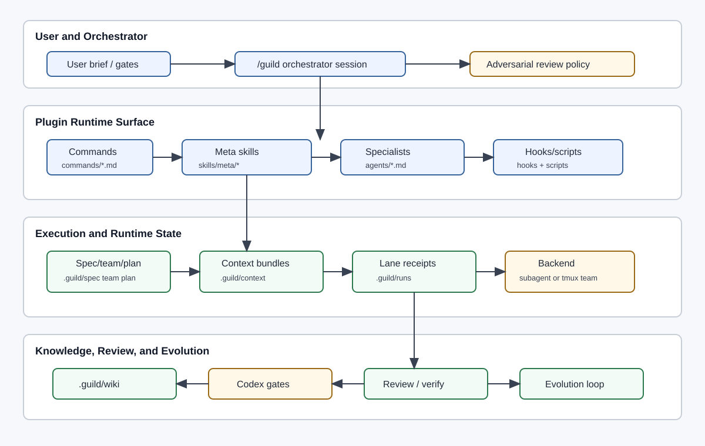

# v2 Architecture

Guild v2 is a Claude Code-first orchestration plugin that turns one user goal into a sequence of scoped specialist teams. The orchestrator remains the only global coordinator. Specialists receive compact context bundles, work through either subagents or a tmux-backed agent-team backend, write receipts, and feed review, verification, reflection, and evolution.

## Components

| Component | Responsibility | Durable artifacts |
|---|---|---|
| Orchestrator | Owns the lifecycle, user gates, team selection, dependency graph, review routing, and final verification. | `.guild/spec`, `.guild/team`, `.guild/plan`, `.guild/runs` |
| Meta skills | Implement the workflow spine: brainstorm, team-compose, plan, context-assemble, execute-plan, review, verify, reflect, decisions, Codex review, diagnose, loops, specialist creation. Current count is 18. | `skills/meta/*/SKILL.md` |
| Specialist agents | Execute bounded lane work with role-specific skills and handoff contracts. Current roster is 14 specialists, including `frontend`. | `agents/*.md`, `skills/specialists/*` |
| Context assembler | Builds the authoritative per-lane brief from universal, role-dependent, and task-dependent layers. | `.guild/context/<run-id>/*.md` |
| Execution backend | Runs lanes as subagents by default or as a tmux agent team when approved and available. | `.guild/runs/<run-id>/agent-team/session.json` |
| Knowledge layer | Stores project memory by lifetime and captures medium/high-significance decisions. | `.guild/wiki`, `.guild/raw` |
| Telemetry and hooks | Capture run events, loop events, skill coverage, receipts, and reflection triggers. | `.guild/runs/<run-id>/events.ndjson`, `logs/v1.4-events.jsonl` |
| Evolution loop | Promotes skill and agent improvements through evals, shadow mode, boundary checks, and rollback snapshots. | `.guild/evolve`, `.guild/skill-versions` |

## State Boundaries

Installed plugin state is static and versioned:

- `.claude-plugin/plugin.json` and `.claude-plugin/marketplace.json`
- `commands/*.md`
- `skills/**/SKILL.md`
- `agents/*.md`
- `hooks/hooks.json`
- `scripts/**`

Project-local runtime state is mutable and belongs under the consuming repository's `.guild/` directory:

- `spec/`, `team/`, `plan/`, `context/`
- `runs/`, `reflections/`, `evolve/`, `skill-versions/`
- `wiki/` and `raw/`

The Guild repo also has its own `.guild/` for self-build knowledge. That state is repo-scoped, not plugin-shipped state.

## v2 Invariants

- The spec, team file, and plan are the authoritative artifacts. Later phases do not infer hidden scope from chat.
- Three user gates are mandatory before autonomous execution: spec approval, team approval, and plan approval. After plan approval, phases execute under the approved autonomy contract.
- Every specialist lane has one context bundle before dispatch and one handoff receipt after dispatch.
- Every handoff includes scope, artifacts, assumptions, evidence, open risks, and follow-up tasks.
- Team size defaults to 3-4 specialists and is capped at 6 unless the user explicitly overrides.
- `architect` is implied for multi-component work, `security` is implied for auth/secrets/external integrations, and `qa` is implied when backend is present.
- For general plugin users, agent-team execution needs explicit approval, `CLAUDE_CODE_EXPERIMENTAL_AGENT_TEAMS=1`, `tmux`, and a non-tmux parent shell. For Guild self-build on this machine, prior policy grants durable approval, so the preflight conditions become the deciding gate.
- Codex review is optional for plugin users, but Guild self-build treats it as always on when running the lifecycle.
- New specialists are incubated, boundary-scanned, eval-gated, shadowed, and only then registered.

## High-Level Flow

1. User goal enters `/guild`.
2. Config and run-id are resolved.
3. The goal becomes a spec through brainstorm and optional L1 clarification.
4. A phase-specific team is proposed from the 14-specialist roster, with gaps resolved by the user.
5. A plan turns the team into lanes, dependencies, backend choice, loop applicability, and autonomy policy.
6. Context bundles are built per lane.
7. Lanes execute through subagents or agent-team panes.
8. Adversarial loops and Codex gates challenge the spec, plan, and lane receipts.
9. Review and verify consume receipts, not full conversations.
10. Reflection proposes wiki, skill, and agent improvements.
11. `/guild:diagnose` can inspect recent telemetry, produce a diagnosis/fix plan, optionally run G-diagnose Codex review, and require explicit approval before edits.

## Design Tradeoffs

| Decision | Rationale | Risk | Guardrail |
|---|---|---|---|
| Orchestrator remains central | Keeps user gates, dependencies, and artifact ownership coherent. | Coordination bottleneck. | Parallelize only independent lanes. |
| Context bundles over full repo dumps | Keeps specialists focused and rerunnable. | Missing context. | Hard receipt evidence plus adversarial review. |
| Prefer tmux agent teams when safely available | Enables peer challenge and shared coordination for complex phases. | Experimental backend and nested-session failures. | Preflight tmux, `$TMUX`, env var, and user approval. |
| Skills stay short and role-focused | Reduces trigger ambiguity and prompt bloat. | Too many small skills. | Extraction only after repeated evidence and eval cases. |
| Adjacent-boundary edits for new agents | Prevents old agents from stealing new triggers. | Boundary overcorrection. | Paired evals on every boundary edit. |

## Codex Parity

The primary target is Claude Code. Codex parity is a design constraint, not an equal implementation target. v2 keeps parity possible by:

- putting behavior in markdown skills and agent definitions where possible;
- keeping artifacts filesystem-based instead of runtime-private;
- expressing teams, lanes, tools, and MCP requirements as serializable YAML/markdown;
- treating Codex review as an adversarial gate that can skip gracefully when unavailable;
- avoiding architecture choices that require Claude-only hidden state.
