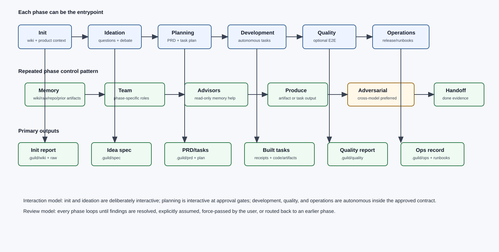

# v2 Lifecycle

The v2 lifecycle is a deterministic artifact pipeline with optional adversarial loops. Each phase has an owner team, input artifact, output artifact, user gate, and challenger gate.

## Phase 0 - Config and Run Setup

Owner team: orchestrator plus tooling support.

Inputs:

- CLI flags: `--loops`, `--loop-cap`, `--auto-approve`, `--codex-review`, `--codex-cap`
- `.guild/config.yml`

Process:

1. Resolve config through `scripts/read-guild-config.ts`.
2. Generate a run id through `scripts/new-run-id.ts`.
3. Write `.guild/runs/current-run-id`.
4. Initialize run-scoped logs and counters: legacy `.guild/runs/<run-id>/events.ndjson` plus v1.4 `.guild/runs/<run-id>/logs/v1.4-events.jsonl`.

Failure handling:

- If no run id can be written, stop. Hooks would otherwise mix multiple runs.
- Telemetry is scoped per `/guild` invocation, not per Claude session.

## Phase 1 - Brainstorm and Spec

Owner team: `architect` plus `researcher` when L1 is enabled.

Inputs:

- User brief
- Existing `.guild/wiki/context`, relevant decisions, and non-goals

Outputs:

- `.guild/spec/<slug>.md`
- Optional `.guild/runs/<run-id>/loops/loop-clarify-summary.md`

What happens:

1. The brainstorm skill captures goal, user-visible outcome, success criteria, non-goals, constraints, autonomy policy, risks, and assumptions.
2. If `--loops=spec` or `--loops=all`, L1 runs before the spec is written.
3. L1 is architect as producer and researcher as challenger.
4. Researcher terminates only with a clean `## NO MORE QUESTIONS` sentinel.
5. Cap-hit or malformed termination escalates to `force-pass`, `extend-cap`, or `rework`.
6. If `--codex-review` is active, G-spec reviews the spec before team composition.

## Phase 2 - Team Compose

Owner team: orchestrator plus `architect`; `researcher` joins for unknown-domain tasks.

Inputs:

- `.guild/spec/<slug>.md`
- `agents/*.md`
- specialist skill inventory

Outputs:

- `.guild/team/<slug>.yaml`

What happens:

1. Match spec domains against the 14 current specialists.
2. Classify each domain as covered or gap.
3. Present gaps with four user choices: auto-create, skip, substitute, or compose from scratch.
4. Add implied specialists from hard rules.
5. Select backend: `agent-team` if approved and available, otherwise `subagent`.
6. Write one phase-scoped team artifact with entries for each main phase and execution lane, including phase-required skills and MCP requirements.

The team file is the contract for planning and execution. Later phases read their phase entry from this artifact; they do not silently reselect the team unless the user explicitly edits the team file.

## Phase 3 - Plan

Owner team: `architect` as planner, `security` as challenger when L2 is enabled.

Inputs:

- `.guild/spec/<slug>.md`
- `.guild/team/<slug>.yaml`

Outputs:

- `.guild/plan/<slug>.md`

What happens:

1. Convert each specialist into a lane with task id, scope, inputs, outputs, dependencies, loop applicability, and evidence requirements.
2. Encode autonomy policy: allowed unattended actions, required confirmations, and forbidden actions.
3. If `--loops=plan` or `--loops=all`, L2 runs after plan draft and before approval.
4. L2 is architect as plan writer and security as plan-defect challenger.
5. Security may only raise plan defects: security gaps, autonomy gaps, scope overlap, contract drift, and untestable success criteria.
6. If `--codex-review` is active, G-plan reviews the plan before user approval.
7. User approval flips the plan to `approved: true`.

User gates before autonomous execution:

- Gate 1: approve or revise the spec.
- Gate 2: approve or revise the team.
- Gate 3: approve or revise the plan and autonomy contract.

## Phase 4 - Context Assembly

Owner team: orchestrator with `guild:context-assemble`.

Inputs:

- Approved `.guild/plan/<slug>.md`
- `.guild/team/<slug>.yaml`
- role-relevant `.guild/wiki` pages

Outputs:

- `.guild/context/<run-id>/<specialist>-<task-id>.md`

What happens:

1. Build universal context: principles, project overview, goals.
2. Build role context: standards and entities relevant to the specialist.
3. Build task context: lane scope, named artifacts, upstream contracts, relevant decisions, tools, and MCP requirements.
4. Target roughly 3k tokens and cap at 6k.
5. Summarize lower-weighted references if over cap.

No specialist may dispatch without a bundle.

## Phase 5 - Execute Plan

Owner team: lane specialists plus orchestrator.

Inputs:

- Approved plan
- team YAML
- context bundles

Outputs:

- `.guild/runs/<run-id>/handoffs/<specialist>-<task-id>.md`
- `.guild/runs/<run-id>/assumptions.md`
- optional `.guild/runs/<run-id>/agent-team/session.json`

What happens:

1. Schedule lanes by dependency graph, not file order.
2. Dispatch independent lanes in parallel.
3. Run `architect` first when it is a dependency.
4. Hold `qa` until backend/devops receipts exist.
5. Run content and commercial lanes in parallel when they only depend on the spec.
6. If backend is `subagent`, dispatch isolated Agent-tool calls.
7. If backend is `agent-team`, launch one tmux session with one pane per specialist through the launcher.
8. Each lane writes a receipt with scope, changed files, artifacts, decisions, assumptions, evidence, risks, and follow-ups.

### Implementation Loops

If `--loops=implementation` or `--loops=all`, the lane's `loops_applicable` value selects nested loops:

| Value | L3 dev-tester | L4 owner-QA | Security review |
|---|---:|---:|---:|
| `none` | No | No | No |
| `l3-only` | Yes | No | No |
| `l4-only` | No | Yes | No |
| `both` | Yes | Yes | No |
| `full` | Yes | Yes | Yes |

L3:

- Producer: lane owner.
- Challenger: property-based testing capability.
- Goal: catch logical and edge-case defects before broader QA.

L4:

- Producer: lane owner.
- Challenger: QA.
- Goal: confirm test strategy, regression coverage, and evidence quality.

Security review:

- Producer: lane owner.
- Challenger: security.
- Goal: detect high-severity unaddressed security issues.
- Restart: any finding with `severity: high` and `addressed_by_owner: false` restarts that lane from L3.
- Restart cap: 3 per lane per task.

All implementation loops use the clean `## NO MORE QUESTIONS` sentinel and the same cap escalation options.

## Phase 6 - Review

Owner team: `qa` plus relevant specialist reviewer; `security` joins when security-sensitive work exists.

Inputs:

- Handoff receipts
- Spec
- Plan
- Assumptions

Outputs:

- `.guild/runs/<run-id>/review.md`

What happens:

1. Stage 1 checks conformance to spec and plan.
2. Stage 2 checks quality: evidence, scope discipline, missing tests, risk handling, and artifact completeness.
3. Review consumes receipts instead of expanding every specialist conversation.
4. Findings route either to lane rework or verify-done with explicit residual risk.

## Phase 7 - Verify Done

Owner team: orchestrator plus `qa`.

Inputs:

- Review report
- Receipts
- Success criteria from spec
- Test outputs and evidence

Outputs:

- `.guild/runs/<run-id>/verify.md`

What happens:

1. Map every success criterion to evidence.
2. Confirm changed files trace to planned lanes.
3. Confirm assumptions are accepted or explicitly noted.
4. Confirm tests, screenshots, metrics, citations, or review notes are present.
5. Mark pass/fail. Failures return to the relevant earlier phase.

## Phase 8 - Reflect and Evolve Queue

Owner team: orchestrator plus optional `researcher`, `architect`, or role owners.

Inputs:

- Verified run summary
- Review and verify reports
- Telemetry and loop logs

Outputs:

- `.guild/reflections/<slug>.md`
- candidate wiki updates
- candidate skill or specialist improvements

What happens:

1. Reflection proposes improvements, not live changes.
2. Medium/high-significance decisions can be promoted through `guild:decisions` or `guild:wiki-ingest`.
3. Repeated skill-improvement proposals queue `guild:evolve-skill`.
4. Repeated missing-specialist evidence queues `guild:create-specialist`.

## Diagnose Path

`/guild:diagnose` is a sidecar command rather than a normal lifecycle phase. It inspects recent run telemetry and traces, writes `.guild/diagnose/<timestamp>-<slug>.md`, optionally runs `guild:codex-review` at G-diagnose, and requires explicit user approval before applying fixes. Use it when the system itself misbehaves or a run needs self-fix analysis.

## Resumption

When `/guild` resumes a run, it checks artifacts in order and starts at the first missing or incomplete phase:

1. missing spec -> brainstorm;
2. missing team -> team compose;
3. missing or unapproved plan -> plan;
4. missing context directory -> context assemble;
5. missing handoffs or assumptions -> execute;
6. missing review -> review;
7. missing verify -> verify;
8. verify present -> summarize completion.

Forced restart of a completed or partially completed phase requires explicit user confirmation because it can invalidate downstream artifacts.

## Gate Matrix

| Gate | Trigger | Challenger | Pass signal | Failure route |
|---|---|---|---|---|
| L1 | Before spec write | Researcher | `## NO MORE QUESTIONS` | Assumptions, cap extension, or brainstorm rework |
| G-spec | After spec | Codex adversary | `## SATISFIED` | Spec rework or force-pass |
| L2 | After plan draft | Security | `## NO MORE QUESTIONS` | Plan rework or force-pass |
| G-plan | Before plan approval | Codex adversary | `## SATISFIED` | Plan rework or force-pass |
| L3 | Per implementation lane | Tester | `## NO MORE QUESTIONS` | Lane rework or force-pass |
| L4 | Per implementation lane | QA | `## NO MORE QUESTIONS` | Lane rework or force-pass |
| Security review | Per sensitive lane | Security | No high unaddressed findings | Lane restart or user escalation |
| G-lane | After lane receipt | Codex adversary | `## SATISFIED` | Lane rework or force-pass |
| G-diagnose | After diagnosis report | Codex adversary | `## SATISFIED` | Diagnosis rework or force-pass |
| Review | After execution | QA/reviewer | No blocking findings | Rework |
| Verify | After review | Orchestrator/QA | Criteria-evidence map complete | Rework |
