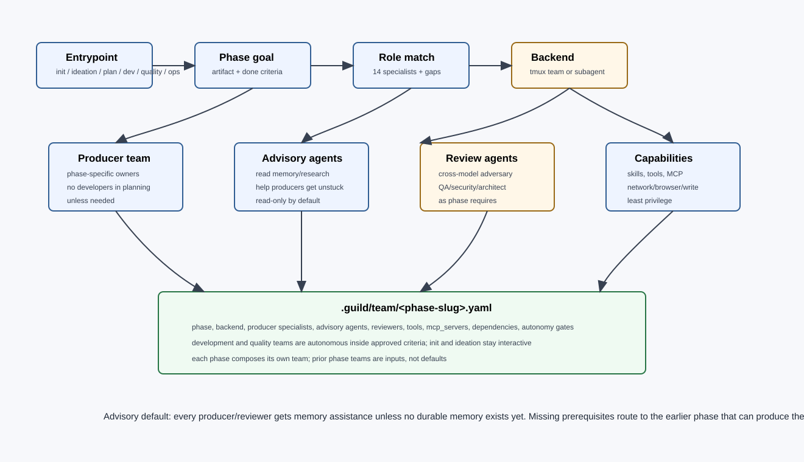
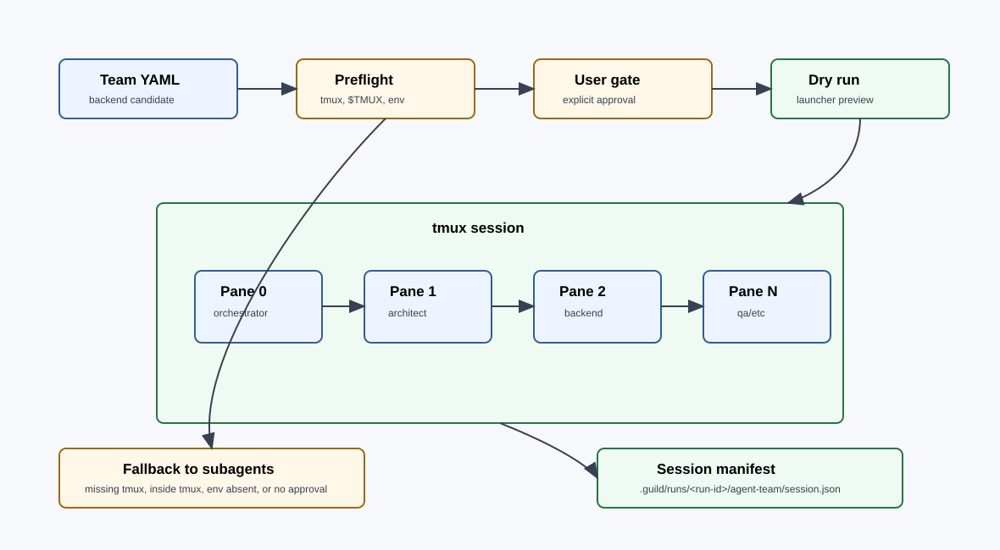

# Team Composition

Guild v2 composes a phase-scoped team plan during team composition. The artifact is one `.guild/team/<slug>.yaml` with entries for every main phase that needs specialists, not silent reselection later in the run. Each phase team is as small as possible, includes hard-rule specialists, and records exact scope, tools, skills, MCP access, backend, and dependencies.



## Current Specialist Roster

The repo currently ships 14 specialists:

- `architect`
- `researcher`
- `backend`
- `frontend`
- `devops`
- `qa`
- `mobile`
- `security`
- `copywriter`
- `technical-writer`
- `social-media`
- `seo`
- `marketing`
- `sales`

`guild-plan.md` still describes the original 13-specialist architecture in places; v2 treats `agents/frontend.md` as graduated and present.

## Team Record

Every phase entry should carry:

```yaml
phases:
  plan:
    backend: agent-team
    backend_reason: "self-build default: tmux available, not inside tmux, env set"
    specialists:
      - name: architect
        scope: "Define component boundaries and lane dependencies."
        skills:
          - guild:principles
          - architect-systems-design
          - architect-tradeoff-matrix
        tools:
          - Read
          - Grep
          - Glob
          - Write
        mcp_servers: []
        depends-on: []
        loop_role: producer
```

The actual skill names should match the installed skill directories. The key rule is that team composition must say which capabilities each phase and lane needs instead of relying on ambient routing.

## Phase Team Defaults

| Phase | Default team | Why |
|---|---|---|
| Brainstorm/spec | `architect`, optional `researcher` | Architect structures scope; researcher challenges unknowns and evidence. |
| Team compose | Orchestrator, `architect`, optional `researcher` | Map domains, gaps, dependencies, and backend. |
| Plan | `architect`, `security` when L2 or sensitive work | Architect writes lane plan; security challenges plan defects and autonomy gaps. |
| Context assemble | Orchestrator only | Mechanical bundle assembly with deterministic inputs. |
| Execute | Specialists selected by spec | Each lane gets only the role needed for its deliverable. |
| Implementation loops | lane owner, tester/QA/security as selected | Challengers depend on `loops_applicable`. |
| Review | `qa`, relevant peer, `security` for sensitive work | Review requires evidence and domain challenge. |
| Verify | Orchestrator, `qa` | Final success-criteria mapping and scope audit. |
| Reflect/evolve | Orchestrator, role owner, `architect`, `qa` | Improvements need ownership, design sense, and eval coverage. |

## Backend Selection

For Guild self-build on this operator's machine, default each phase's `backend:` to `agent-team` when these conditions hold:

1. `which tmux` succeeds.
2. `$TMUX` is unset.
3. `CLAUDE_CODE_EXPERIMENTAL_AGENT_TEAMS=1` is set.
4. Repo-local self-build policy grants durable approval.

For general plugin users, `agent-team` remains opt-in and should be proposed when the phase needs peer coordination, challenge, shared dependency handling, or competing hypotheses.

Use `subagent` when preflight conditions are missing, when a general plugin user does not approve agent-team, or when the user explicitly chooses subagents. When `team.yaml` already declares `backend: agent-team`, execution must not silently fall back if the env var is missing; it should surface the changed semantics to the user.



## Team Size Rules

- Recommended: 3-4 specialists.
- Maximum: 6 specialists unless the user explicitly passes an allow-larger override.
- The orchestrator does not count toward the cap.
- If a goal appears to need more than 6 specialists, split it into phases or lanes with separate team files.

## Implied Specialist Rules

| Condition | Specialist | Reason |
|---|---|---|
| Multi-component build | `architect` | Component boundaries and dependencies need ownership. |
| Auth, secrets, payments, webhooks, external APIs | `security` | Threats and trust boundaries must be explicit. |
| Backend present | `qa` | Server-side work needs integration and regression evidence. |
| User-facing UI | `frontend` and often `qa` | Accessibility, responsive behavior, and interaction state need coverage. |
| Public docs | `technical-writer` | Durable docs need task-focused structure and maintenance boundaries. |
| Search/discoverability | `seo` | SEO owns metadata, crawlability, and keyword strategy. |

## Gap Resolution

When no existing specialist fits:

1. Propose a role name and one-line responsibility.
2. Present four options:
   - `A auto-create` through the specialist factory.
   - `B skip` and flag missing coverage.
   - `C substitute` to an existing specialist with scope override.
   - `D compose from scratch`.
3. If auto-create is selected, the proposed specialist must pass extraction signals, boundary evals, paired evals, and shadow mode before it can join a live team.

## Tools and MCP in Team Compose

Tools and MCP servers are selected per phase and lane:

- Start with least privilege.
- Grant write tools only to lanes that must edit files.
- Grant network or browser access only when the spec requires external verification or UI testing.
- Grant MCP servers only when the lane needs structured access that plain filesystem tools cannot provide.
- Record MCP requirements in team and context artifacts because agent-team teammate frontmatter may not load the same way as subagent definitions.

## Advisory Defaults

- When in doubt between two specialists, choose the narrower owner and add a reviewer rather than giving both broad write scope.
- When tool access is uncertain, give read-only access first and escalate through the orchestrator.
- When a phase has many unknowns, use a researcher in brainstorm instead of expanding the execution team.
- When a missing role appears only once, substitute or skip; do not mint a specialist from a single task.
