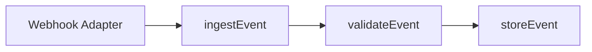

# Ingestion

Ingestion is the front door of the pipeline. Every incoming event is validated
before it is persisted, so no malformed event ever reaches storage.

## Source Adapters

Events arrive through source adapters. Each adapter normalizes a transport's
payload into a `RawEvent` and forwards it to `ingestEvent`.

### Webhook Adapter

The webhook adapter accepts HTTP POST callbacks and converts each request body
into a `RawEvent`. It is the only adapter shipped in this fixture.

## Architecture

The diagram below shows the three-stage flow from adapter to store.

For the rules applied at the second stage, see [[validation]].
